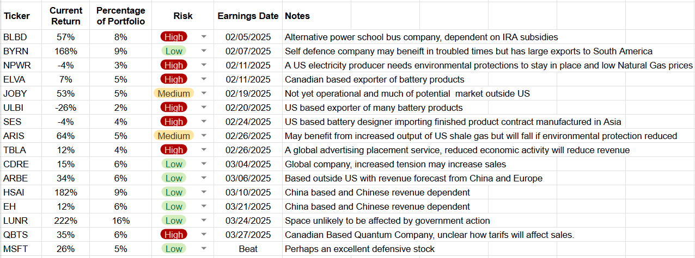
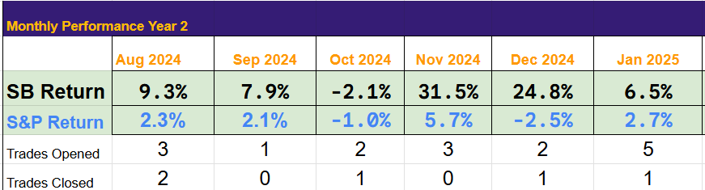
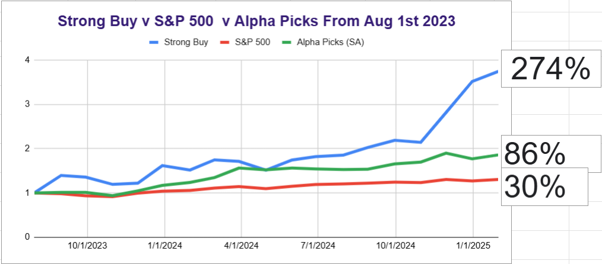
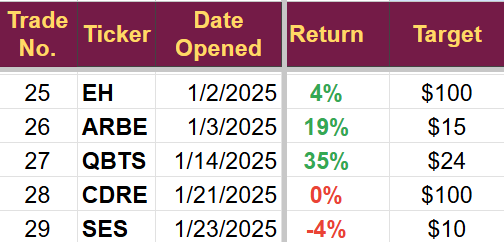
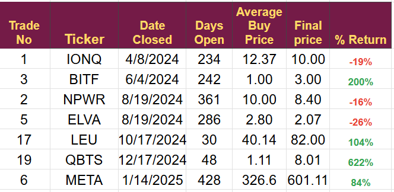

# Added Uncertainty For the Portfolio

*US administration action requires thought*

Earnings Season

The earnings season will kick off next week, and the US government's actions have me on high alert for problems. The portfolio is being hit from two sides; the newly announced tariffs will likely significantly increase the tax burden of North American households and businesses. This will add more complications to the already strained supply chains of larger companies and make the products of many small companies uncompetitive in their near-neighbor export markets.

The prospect of a full-blown trade war is real and will harm all companies. We may have to take a more defensive position, booking profits where appropriate, holding cash, or looking for defensive plays.

Although I am not planning any immediate action, I will be watching the market very closely, especially the earnings calls of those companies I have deemed to be at high risk of harm from the changing regulations.

BlueBird is the company that may need action first. They report early in February, and the stock has been performing poorly of late. I will listen to the earnings call and then make a decision, but this position is one we may have to close.

The Table below lists the earnings dates for the companies in the portfolio. Fortunately, several companies do not derive much revenue from North America. Although their share prices will move with the market, their business fundamentals should not change.

I completed the January wrap-up video and key Tables at the bottom of this post. The video contains information about the outlook for February. We have several high-potential trades, but I will be treading very carefully, even more so than usual.

I now expect February to begin with a pullback of up to 5%, hopefully much of this will be recovered as the month draws on.

[Subscribe now](https://stephentobin.substack.com/subscribe?)

Performance by month of the portfolio

Performance since inception

Performance of trades opened in January

Closed Trades

---

*Source: [Strategic Wave Trading](https://stephentobin.substack.com/p/added-uncertainty-for-the-portfolio)*
