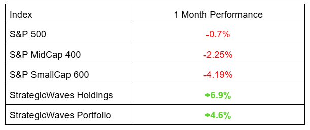
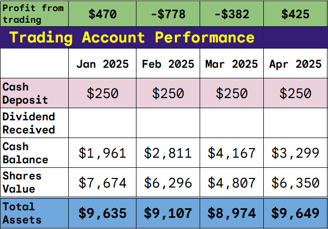
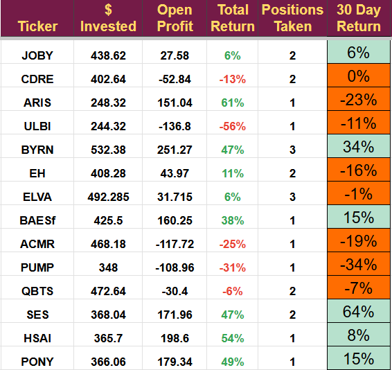

# April Portfolio Review

*Note on Pledge problems*

**Pledge Conversion**

The newsletter went paid this morning. A few people have contacted me to say their payment did not go through, but they do want to subscribe. As a result, I will leave the newsletter price at the pledge amount until Monday and send the articles to everyone in the meantime. Thanks again to those who did pledge; it will make an enormous difference to the quality of my research.

[Subscribe now](https://stephentobin.substack.com/subscribe?)

**Monthly Portfolio Update - April 2025**

April was a good month for the portfolio, significantly outperforming the key indices. Individually, our holdings were mixed. Geopolitical concerns and tariffs are impacting us in unforeseen ways, leading to some winners and losers.

The $250 a month demonstration account is still cash-heavy; it is now 19 months old, and year two will end in July. Currently, Year 2 is showing a 108% return.

At the end of April, the account balance on the demonstration account was:

It was a wild ride for many of our stocks, returns ranged from -34% to +64% in the 30 days. We bought QBTS, SES, HSAI, and PONY in the month.

## Noticeable Developments

**ARIS and PUMP** are our two oil and gas companies are struggling due to the low oil price. I had assumed an oil price of $70 per barrel when I calculated the target price, and we are currently below $60.

ARIS will report earnings on May 7th, no other news has been released.

PUMP reported on April 29th and beat on both top and bottom-line EPS, coming in at $0.09 (a $0.03 beat), and revenue was $395 million (a $15 million beat).

PUMP continues to deploy its all-electric fracking fleet with 50% now under long-term contracts, and a fifth FORCE fleet will be deployed later this year. FORCE is the all-electric fracking fleet, and the dual-fuel DGB fleet has two additional fleets under long-term contract.

PROPWR, the new electricity generation division which was key to our investment, appears to be going well. PUMP has ordered an additional 80 megawatts of natural gas generators, bringing the total to 220. So far, letters of intent (LOIs) have been signed for 75 Megawatts with two customers. The generators will not be operational before mid-2026, so this is very encouraging.

Fleet utilization will drop from 14 to 13 in Q2 due to the decline in oil prices.

The rationale behind the PUMP investment looks solid, so I will hold.

**BYRN:** rose 34% on the launch of the [new compact launcher](https://ir.byrna.com/news-events/press-releases/detail/220/byrna-technologies-announces-the-debut-of-the-byrna-cl-the) and another excellent earnings report showing a 57% increase YoY in revenue.

The store-in-a-store concept with Sportsman's has kicked off with its first opening (a key part of the investment), and the final three company-owned retail stores opened, showing good revenue generation. Production capacity increased to 24K launchers, and ammo production was re-shored to the US. Three new celebrity endorsers were added, including Lara Trump.

**ACMR:** Our Chinese silicon chip-related company is having a tough time. Q1 preliminary earnings showed revenue growth of 12% but total shipments were down 36%. Guidance for FY 2025 was confirmed, but it has a wide range with growth anywhere from 9% to 21%.

Full earnings are due May 8th and I will re-evaluate then.

**SES:** has performed well since our investment last month. Q1 earnings came in at $5.8 million with a gross margin (GM) of 79%. The AI software, now called the Molecular Universe Platform, has a dozen customers in early testing and was launched on April 29th. Guidance for significant 2026 revenue growth was given, and 2025 guidance of $20 million (midpoint) confirmed.

**HSAI:** continues to announce major wins for its LiDAR including volume production awards from Cadillac, Pony, Zeekr and DiDi. The Yole group's market analysis showed that Hesai remained the market leader with 33% of the worldwide LiDAR market in 2024 (down 5% from 2023), while Huawei's share grew from 6% to 19%. Yole also pointed out the total market grew 60% year on year to $859 million and expects the market to continue growing. Final note: Hesai had 61% of the robotaxi LiDAR market, unchanged from 2023, and that sector has the biggest growth forecast.

**PONY:** shares jumped when it announced its volume manufacturing deal, as you may remember we were waiting for a sign that the share price fall had ended before buying.

**QBTS:** D-Wave was hit by a short seller report. Kerisdale released a fairly good report that combines known truths with speculation to make a convincing case that the stock is overpriced.

**On the truth side**: QBTS share price is up massively in recent months but that rise is not backed up by any fundamentals. Revenue has changed very little and earnings remain negative.

**On the part truth side**: Kerisdale tried to imply the recent spin-glass paper was a fraud. They used two arguments- Firstly, they found some scientists who believe they can produce the same results with classical methods; the D-Wave CEO has already replied to this with the words “Go on then, do it.” Nobody has yet taken him up on that challenge. Secondly, they pointed out that the work, despite acknowledging it is a significant step forward, is not sufficient to model the lattice needed for new magnetic materials. D-Wave concentrates on the “significant step forward” but accepts it is not the final result yet.

**On the misleading side**: Kerisdale commented on Pattison food group and how before D-Wave they were using a spreadsheet for scheduling saying any computer package would show an improvement. They neglected to mention that Pattison had gone on record saying they had been searching for a software company to deal with the complexity of their problem for more than a decade and only D-Wave had been able to provide a solution. Using the spreadsheet was taking up the time of their most senior people for most of the working week and now the D-Wave annealer does it in half an hour.

**On the avoid the truth side**: Kerrisdale ignored NTT Docomo, which has reduced network traffic in Japan by using the annealer, Ford in Turkey, which has optimized a paint shop in a way they were previously unable to, and how Boeing has moved to D-Wave because no other software can optimize their million-part manufacturing process.

Despite all this, I actively manage my portfolio. If the price begins to drop significantly, I will exit and take the opportunity to buy a bigger position at a lower price.

**Notes**

I am still hoping to deploy our cash balance in this quarter, expecting a market recovery later in the year. I expect at least one more robotaxi investment and one new materials investment in the next week.

I am currently reviewing the Space and Nuclear sectors and would like to increase my exposure in those areas if I can find a suitable candidate.

---

*Source: [Strategic Wave Trading](https://stephentobin.substack.com/p/april-portfolio-review)*
