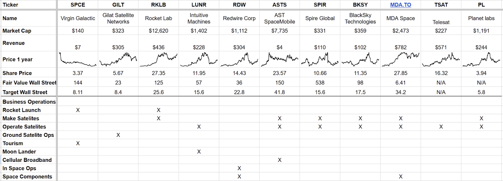

# Company Take: AST SpaceMobile

*Not the Space Investment I hoped for*

For new subscribers, this is not a trade alert. It is a review of a company I hoped to invest in, and I may invest in the future, but I have decided now is not the right time.

AST SpaceMobile (ASTS) is part of my satellite sector; the companies I am tracking with a view to investing are in the image. I also track MNTS and SIDU, but they are currently below my minimum market cap, and several larger, more established operators, including AMZN, Eutelsat, Telesat, Viasat, Echostar, SES S.A., Iridium, and Globalstar, view them as competitors.

Since we closed LUNR, I have not had exposure to this industry and would like to gain some. It has enormous potential, and I am examining these companies in detail to identify a suitable target.

I hope to find a compelling investment case. For me, that means two things: A technological advantage likely to lead to significant growth and perhaps industry disruption, and secondly, a business model that will drive free cash flow growth, giving a fair value with a 100% upside.

Seven of the companies on the list are involved in satellite development. This area has seen significant disruption with the proliferation of low-earth orbit satellites, which satisfy the growing need for high-speed, stable internet connectivity. **StarLink** is the prime example of this; their LEO constellation has seen enormous uptake in a relatively short period and is already generating significant revenue. Currently, there is limited competition to StarLink; however, **Amazon** is already launching its Project Kuiper LEO constellation, Telesat is developing a solution, and **Eutelsat** has its OneWeb constellation already deployed for B2B use.

StarLink may have developed an industry ripe for disruption as their solution, along with those already mentioned, requires a power-hungry dish to connect with the satellite.

AST Spacemobile has developed and tested a solution that delivers high-speed internet directly to existing cellular phones with 5G connectivity. The potential for this technology is immense and warrants a thorough examination.

## Full Strategic review ASTS

**(paid only below this line)**

**Product Overview:**

AST SpaceMobile aims to provide cellular broadband connectivity directly to standard mobile devices via satellite. This service eliminates the need for special equipment or subscriptions beyond a user's existing mobile provider plan. The core technology utilizes large phased array antennas on low Earth orbit (LEO) satellites.

**Key Advantages:**

-   **Direct-to-Device Connectivity:** Works with existing smartphones, avoiding the need for specialized hardware.
    
-   **Expanded Coverage:** Extends mobile network operator (MNO) coverage to areas with limited terrestrial infrastructure.
    
-   **High-Speed Broadband:** Aims to deliver voice, text, data, and video services at cellular broadband speeds (up to 120 Mbps peak data rates with future technology).
    
-   **Spectrum Efficiency:** Utilizes existing low and mid-band spectrum, maximizing reuse and capacity.
    

**Technical Progress:**

-   **Satellite Development:**
    
    -   **BW3 Test Satellite:** Successfully launched and tested, demonstrating two-way 5G calls and high download speeds.
        
    -   **Block 1 BB Satellites:** Five satellites launched, with successful initial operations and tests, including the first SpaceMobile video call.
        
    -   **Block 2 BB Satellites:** Next-generation satellites with significantly larger communication arrays for increased bandwidth and capacity; initial production is underway.
        
-   **ASIC Chip Development:** AST has designed and is in initial production of a custom ASIC chip for improved performance and efficiency in Block 2 satellites.
    
-   **Launch Plans:** Agreements are in place for a 2025-2026 campaign to launch approximately 60 Block 2 BB satellites, and 90 will be needed in total.
    

**Commercial Progress:**

-   **MNO Partnerships:**
    
    -   **Definitive Agreements:** Established commercial agreements with AT&T and Vodafone for SpaceMobile service provision.
        
    -   **Preliminary Agreements:** Around 50 preliminary agreements with other MNOs.
        
    -   **Revenue Sharing Model:** The Business model with MNOs is based on revenue sharing.
        
-   **Key Infrastructure Providers:** Partnerships with companies like American Tower, Rakuten, and Google to support network infrastructure and services.
    
-   **Financing and Prepayments:** Received prepayments from AT&T and Verizon for future service revenue, indicating commercial interest and commitment.
    
-   **Coverage Plan:** Phased satellite launch strategy focusing on high-opportunity geographical areas. Initial non-continuous service planned for select markets in 2025, followed by continuous coverage expansion.
    

**Business Case**

While the technology appears promising with its proprietary and patent-protected advantages, the business model raises concerns. AST will sell its service to mobile network operators (MNOs) who will then offer it to their customers. Although contracts with major players could lead to rapid adoption, revenue will be shared between AST and the MNOs.

There is a clear rationale for MNOs: they can expand network coverage to underserved areas without the expense of building new infrastructure and potentially offer the service as an add-on or within existing packages.

AST's initial targets are Europe and the US. Personal experience traveling extensively throughout Europe over the past three years suggests that reasonable 5G coverage is already widespread, with the UK being a notable exception. Morocco also demonstrated consistent 5G availability.

Revenue concerns are amplified by the relatively low amounts MNOs seem willing to invest. Rakuten's exclusivity agreement for Japan cost $0.5 million. Equipment purchases include $20 million each from AT&T and Verizon, with a contingent order for an additional $45 million. Vodafone's 10-year European contract, including 5 years of mutual exclusivity, guarantees a minimum revenue of $25 million, and Vodafone is a long-term investor alongside AT&T and Google.

**Finances**

A mismatch exists between the money available, the money coming in, and the money needed

-   **Block 2BB Cost:** The 90-satellite plan will cost around $1.9 billion to launch
    
-   **Cash On Hand:** $0.9 billion, money due in seems very small relative to what they need, and substantial dilution can be expected.
    

So AST is short $1 billion for the launch and will need around $50 million a quarter in operating costs.

Management guided to $50 million of revenue in Q4 when commercial services begin and they achieve US government funding milestones.

**The TAM**

AST guide to an enormous total addressable market (TAM) in the annual report they have this paragraph

_As of December 31, 2024, GSMA reports that 5.8 billion mobile subscribers experience inconsistent coverage, 3.4 billion people lack cellular broadband, and 350 million have no mobile connectivity._

The world's population is approximately 8 billion, with around 13% under the age of ten, leaving approximately 6.9 billion people of phone-owning age.

5.8 million mobile subscribers is 85% of the total phone age population. I doubt that many people have a smartphone, let alone have poor coverage, or at least poor enough to pay extra to improve it.

In my opinion, it reveals an error in market potential, and I believe the market has bought into this misconception.

AST is currently valued at over $8 billion; its shares have increased from $2 to $23 in the last 12 months. That tenfold increase screams hype cycle.

AST are selling their service to mobile network operators in affluent countries like Europe, US and Japan but these countries have good network coverage in most of their geography implying relatively few people will pay for the AST service:- this is backed by the small amounts of money the MNO’s will pay for exclusivity.

Outside of these countries, network reception is likely to be much worse; however, in much of the developing world, people will not have the income or ability to afford high prices for mobile internet.

AST will always suffer from the need to share revenue with its Mobile Network Operator partners, and the total revenue will be limited to what mobile users will pay for coverage in areas outside of the current tower infrastructure.

StarLink, Amazon, and Eutelsat are targeting heavy internet users and have a direct relationship with customers. StarLink charges around $125 a month for their internet connection, and they get all the money. For heavy users and those off the grid, this is a great deal.

A typical mobile phone contract is around $100 a month. How much extra will people pay to add on the mobile internet service? For the majority, the answer will be close to zero, as most people live in areas that are well covered. For some, it will be quite a lot, but that amount has to be shared between the operator and ASTS. Unfortunately, many of those who would need the service probably cannot afford to pay that much for it. For those living in areas with no coverage, the choice may be between Starlink and a mobile. We need some evidence of what people choose to estimate the future revenue of AST.

At $2, AST was a bargain; at $23, I am not interested but will continue to watch the company. The price may fall, or when we get initial commercial results later this year, the potential may be much higher than I can see at the moment.

The search for a Space investment continues. I had expected to be buying AST, but in emerging technology investing, what you don’t buy is more important than what you do. It is much easier to lose money than to make it.

Next up is Intuitive Machines and Virgin Galactic

---

*Source: [Strategic Wave Trading](https://stephentobin.substack.com/p/company-take-ast-spacemobile)*
