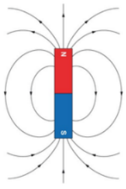
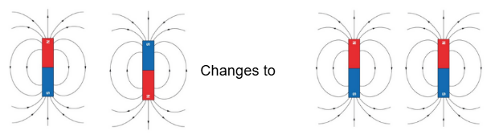

# D-Wave's Quantum Leap: Understanding Their Latest Research Breakthrough

*The latest Scientific paper from D-wave is another game changer.*

D-Wave saw a surge in price last week driven by two key events. It delivered a very positive earnings call with increased bookings and a very positive outlook. The earnings call was probably the biggest driver of the share price as it is easy to understand. However, the more important piece of news was the release of a scientific paper showing that the computational power of D-Waves Advantage 2 Quantum Annealing computer is far beyond that of any other existing machine, Quantum or classical.

The move in D-Wave led to a big jump in our demonstration portfolio, pushing us into profit for the month despite the S&P continuing to fall.

[Subscribe now](https://stephentobin.substack.com/subscribe?)

In this post, I am going to try to write the scientific post in a way everyone can understand and explain why it is important. As many of you know, I had a long career in mathematics education, researching and teaching at the college level before becoming a full-time investor. Hopefully, I can put that experience to good use here.

The latest paper, [Beyond-classical computation in quantum simulation,](https://www.science.org/doi/10.1126/science.ado6285) is the third D-Wave paper published on Spin Glass simulation, each showing improved performance of the D-Wave machine as it moves beyond what can be achieved elsewhere.

To date, D-Wave’s main competitors (GOOG, IBM) have demonstrated beyond classical computation using various sampling techniques to generate random numbers. These have no practical applications or valuable results.

The D-Wave spin glass work is quite different, their work has practical applications. It delivers meaningful insights into the behaviour of quantum particles, it enables scientists to solve problems and make predictions that were previously out of reach.

I will start with the paper's main findings, if you don't have a maths PHd, you might even struggle to read it, let alone understand it, and then try to explain what it means.

The Findings

The paper states the researchers have simulated the continuous time dynamics of transverse field Ising models to simulate quantum phase transitions in Ising-like systems in critical dynamics spin glasses with measured exponents matching the universality class representing compelling evidence of Schrodinger evolution.

The Explanation

The paper is all about predicting the behaviour of spin glasses when they interact with each other, and what happens to a system of spin glasses when you apply some external energy. Spin Glasses are essential for understanding many material science problems and have been studied theoretically for some time. However, the complex nature of their interactions means that classical computers have only been able to predict their behaviour when the system is very small. So small, the work is of little use. (I know what follows is not complete or technically accurate in every detail, its purpose is to explain to non-maths nerds what has been done, I apologize in advance to all the maths. If you want the details, follow the link to the paper)

What Are Spin Glasses?

Think of Spin Glasses as tiny magnets. They have a magnetic field similar to the magnets we studied at school.

The thing about Spin Glasses is that they can change the direction of their magnetic field. The image above could be described as Spin Down, but a Spin Glass could change to spin up when it is subject to an external force. When left on their own, they tend to exist in a mixture of spin up and spin down but will change to only one under external influences. The spin glass will change to the spin direction requiring the lowest energy.

The Ising model is a fundamental model in mechanical mathematics that helps understand what happens when you put spin glasses close to each other. A collection of spin glasses is referred to as a lattice. A simple lattice would be two Spin glasses arranged in a line. When they are in a line, they tend to take on the same spin as each other, so they don't fight each other.

As the lattice gets more complicated, the number of interactions grows exponentially and is quickly beyond the reach of classical computers. However, we know from theoretical work that the spin glasses will try to move to the system that uses the lowest amount of energy as a whole.

This property leads to ferromagnetism, the property of materials to become permanently magnetized. As external parameters change, like an increase in temperature, the spin directions can get disrupted, as they search for a lower energy state, and the lattice can enter a phase transition. Some of these transitions settle into a new configuration, while others keep changing in a never-ending loop, with one spin change affecting others and resulting in more changes. Up to this point it has been impossible to model these phase transitions accurately or understand what is happening.

The behavior at these transition points is critical for understanding a variety of applications that exhibit the same behavior. The key ones are the behavior of particles in gases, the interactions of neurons in neural networks, computational complexity, and the behavior of ferromagnetic materials.

The researchers began by looking at small problems (e.g., a few spin glasses in a simple lattice). Simulations of these simple problems can be run on existing supercomputers. The researchers checked the output of the D-Wave machine against that from the Frontier and Summit supercomputers at the Oak Ridge National Laboratory. The output was as expected.

They then moved through more complex lattices. At each stage, they used available mathematics to check that their results were of the right magnitude. Several mathematical techniques have been developed to model what should happen. Schrodinger's equation is one of these and is based on the system's total energy (called the Hamiltonian).

The researchers moved beyond what can be classically verified, showing agreement with existing quantum mechanics up to the largest size possible using the theory of critical phenomena. Beyond that point, they were able to show that the system was delivering correct predictions using microscopic, macroscopic, and scaling statistics.

It does not sound that exciting, but it means for the first time in our history, the performance of a large lattice of spin glasses can be modelled on a computer to answer the key scientific question, What if ?

The result is that D-Wave has shown it can address scientific questions that otherwise would remain unanswered, specifically in this case about ferromagnetism, but with immediate applications in other areas of dissipative dynamics.

---

*Source: [Strategic Wave Trading](https://stephentobin.substack.com/p/d-waves-quantum-leap-understanding)*
