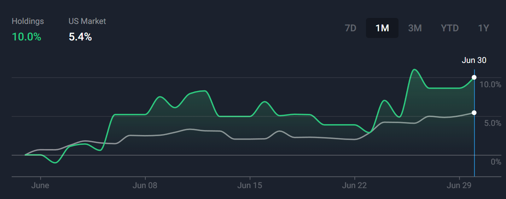
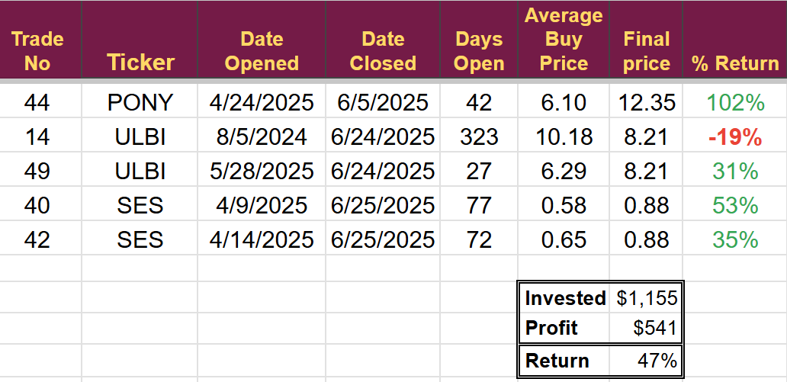
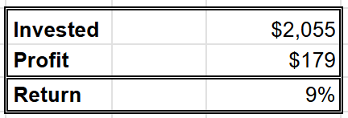
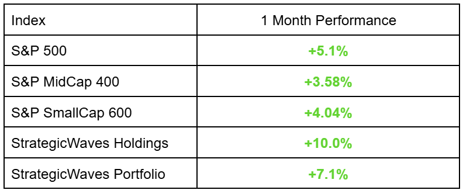
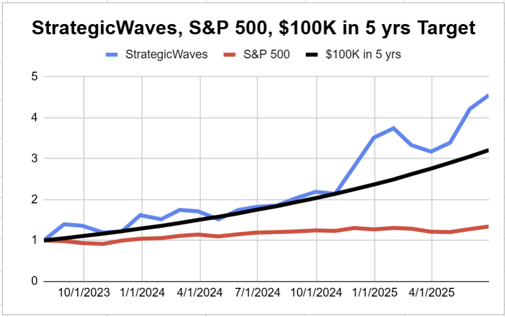
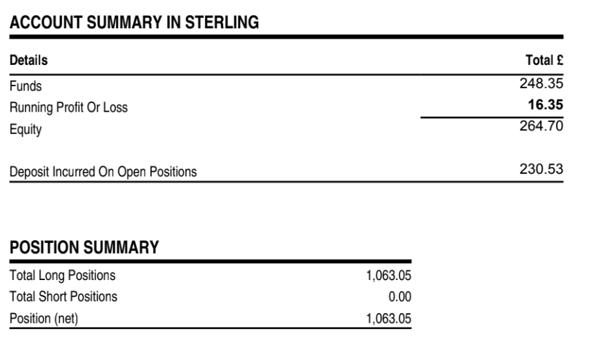

# End of Q2 results

*New Project announced*

**Exceptional Q2 2025 Performance**

The Portfolio achieved an outstanding 33% return in Q2 2025, demonstrating remarkable growth.

**Navigating Volatility, Substantial Profit**

Despite experiencing considerable volatility throughout the month, the performance graph illustrates a profitable outcome.

[Subscribe now](https://stephentobin.substack.com/subscribe?)

**Significant Shift in Reporting Structure**

Monthly reports will be significantly condensed, with all detailed updates and information regarding positions and trades now consolidated into the weekly reviews.

## **Trade Activity**

**We closed five trades** during the month, returning a **profit of 47%** and boosting the cash balance for future trades.

We opened a record 7 trades in June, 5 of which are in profit. The total return of these new trades is shown below. These trades have only been open for an average of 19 days.

## Benchmark Comparison

The indices had a consistent performance in June. Internationally, the best-performing was the S&P Asia 50, which increased 7.5% driven by its Information Technology Sector, which jumped 10.3%

## **Project Targets**

This five-year StrategicWaves project aims to reach $100,000 by August 1st, 2028, through a monthly investment of $250. Entering its third year, the project is significantly ahead of schedule.

## **New Leveraged Project**

Publishing the results of my trading every week has made me stick to the rules and plans, something we all struggle with and as a result the performance of the StrategicWaves demonstration account has been better than expected. The idea of trading to $100K in five years seemed fanciful when I came up with it but almost two years in it is beginning to look very realistic.

I've opened a new leveraged account with IG Markets, where I typically receive 4:1 leverage, though not all stocks are available. My intention is to apply the same strategy as used in the demonstration account, aiming to amplify performance.

On June 1st, I invested £250 and purchased the same stocks as in the demo account. I haven't yet finalized the precise investment allocation per position, which has impacted initial performance. Margin trading adds complexity, but I will refine this as more data becomes available.

The first month's statement is below.

I invested £250, but as you can see, I received charges of £1.65, reducing funds to £248.35. The open profit of £16.35 represents a return of 6.5%. No trades have yet been closed, but I did deposit the next £250 this morning.

It is the leverage that makes this so attractive. I have invested £250 but bought £1,063 of shares. I am hoping it will amplify results, and as it is tax-free in the UK, it could be very profitable.

I will only take trades as they are announced on Substack and will not be adding any existing positions.

I will continue reporting the account's performance and adding position sizes to trade alerts when I have them figured out.

## Final Notes

All trade alerts and detailed company discussions are sent exclusively to paying subscribers. Monthly reports and weekly performance updates are sent to everyone who has subscribed, but please note:

I am not a qualified or authorized financial advisor, and I do not provide investment advice. I trade in small-cap emerging stocks, which are inherently high-risk investments. Although I have achieved positive results in the past, past performance is not indicative of future returns.

---

*Source: [Strategic Wave Trading](https://stephentobin.substack.com/p/end-of-q2-results)*
