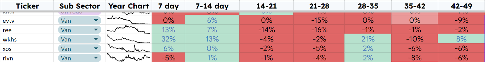
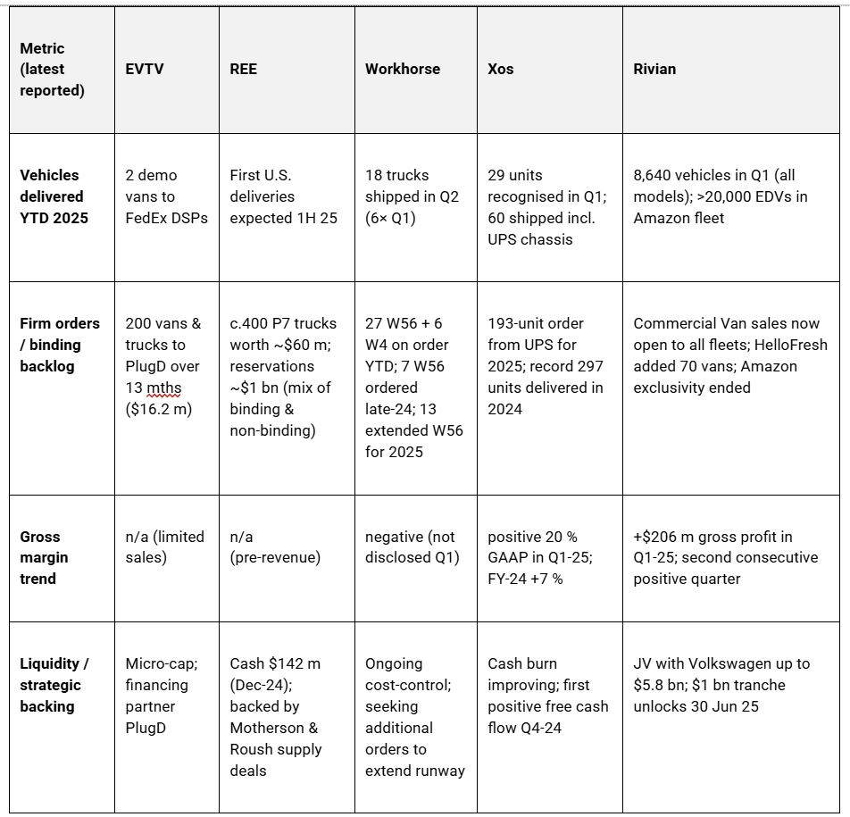
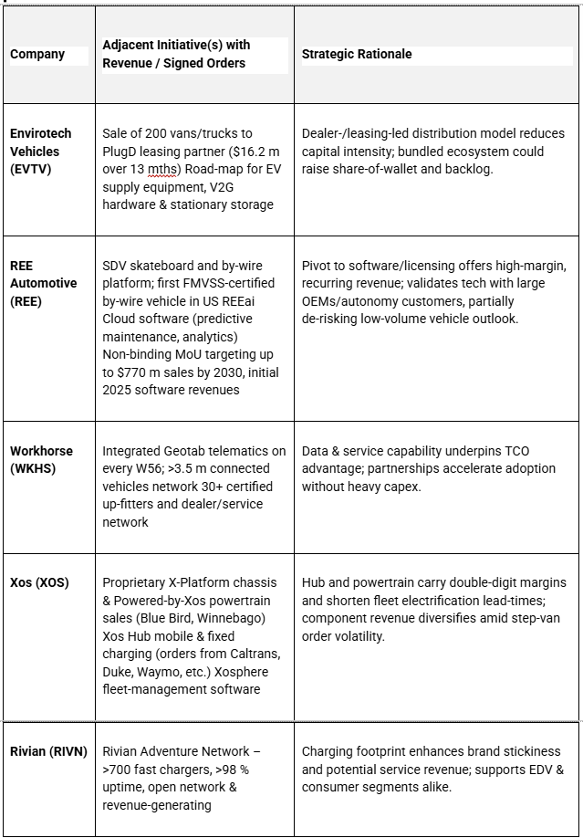
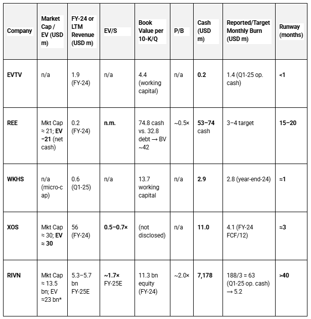

# EV Vans: Sector Deep Dive

*Choosing targets for further review*

This article aims to identify promising companies for in-depth individual analysis within the emerging EV van sector. The process I use involves comparing each company in the sector and filtering out those that appear the most promising.

The Sector tracking sheet for these companies has indicated a change in sentiment; two consecutive weeks of price rises following a long period of falling prices often indicates a change in prospects.

Notes: Green Power (GP) could be included in this list; however, I have it categorized in the Bus and Van sector and have recently reviewed it, choosing to buy BLBD instead, following a similar review to this one. (BLBD is up 16% since I invested in June)

I have three other sectors currently under review that have shown similar price increases and will undergo the same process to identify potential investments.

[Subscribe now](https://stephentobin.substack.com/subscribe?)

## **Stage 1: Commercial Progress Van Sales**

The five companies exhibit very different stages of commercialization. **Rivian dominates on scale** and a growing external customer base**; Xos is the first** of the sub-$500 m market-cap name **to achieve positive gross margin**; Workhorse is gradually converting demonstrations into small repeat orders; **REE has amassed a sizeable order book** but is pre-revenue; EVTV remains in pilot stage.

### **Snapshot of Commercial Activity**

## **Company-by-Company Review**

### **Envirotech Vehicles (EVTV)**

-   **New fleet relationships:** Delivered two _mid-roof_ demo vans to FedEx Delivery Service Partners in Connecticut, with projected $1,800/month TCO savings per vehicle
    
-   **Scale commitment:** 200-unit, $16.2 m sale & purchase agreement with PlugD commercial leasing, deliveries over 13 months.
    
-   **Assessment:** Early-stage, but real customer pilots, along with a modest backlog, indicate proof of concept. Funding capacity and execution are key risks.
    

### **REE Automotive (REE)**

-   **Certified product:** P7-C is the first FMVSS-certified, _full by-wire_ commercial truck; U.S. deliveries targeted 1H25.
    
-   **Demand indications:** Order book of approximately 400 vehicles from 24 customers (~$60m) and nearly $1bn of wider reservations.
    
-   **Strategic wins:** Mission Mobile Medical intends to build a rural healthcare fleet on REE’s P7 chassis, with the first delivery expected in mid-2025.
    
-   **Assessment:** Technology differentiation and an asset-light, partner-driven supply chain are attractive. However, zero revenue is expected in 2024, and timing risk remains until deliveries commence.
    

### **Workhorse Group (WKHS)**

-   **Order flow:** 27 W56 vans plus six W4 chassis on order YTD 25; seven W56s ordered in late-24 following the FedEx Forward summit.
    
-   **Deliveries ramping:** Began shipping 208-inch W56 variant in April to a national uniform supplier through Revolv, part of a 13-unit 2025 deployment.
    
-   **Operations:** A 2,400-mile demo and integration of Geotab telematics reinforce product credibility.
    
-   **Assessment:** Progressing, but volumes remain in the tens of units; break-even scale looks distant without a step-change in orders.
    

### **Xos, Inc. (XOS)**

-   **Diversified customer set:** 60 units shipped in Q1, including stripped chassis for the _193-unit_ UPS order; deliveries also to Vestis and FedEx ISPs.
    
-   **Financial traction:** First quarter GAAP gross margin of **20 %** ; FY-24 non-GAAP gross margin **18 %**; positive operating cash flow in Q4-24.
    
-   **Cost discipline:** Operating expenses down 20 % YoY in Q1.
    
-   **Assessment:** Demonstrated path to gross-margin profitability with moderate but improving scale. Execution of the UPS contract is an immediate catalyst.
    

### **Rivian Automotive (RIVN)**

-   **Scale leader:** Produced 49,476 vehicles and delivered 51,579 in 2024; Q1-25 gross profit **$206 m**.
    
-   **Commercial van momentum:** Amazon fleet exceeded 20,000 EDVs delivering >1 bn packages in 2024; sales now open to any fleet, attracting HelloFresh (70 vans).
    
-   **Strategic capital:** Up to $5.8 bn JV with Volkswagen; $1 bn cash tranche due mid-25 contingent on gross-profit milestones.
    
-   **Assessment:** The only player already producing at an automotive scale with a positive gross profit. Exposure to consumer models adds diversification but also cyclical risk.
    

## **Comparative Strengths & Risks**

**Strength indicators**

1.  Scale & manufacturing learning curve – Rivian ✔, Xos (niche scale) ✔.
    
2.  Positive unit economics – Rivian ✔, Xos ✔; others not yet.
    
3.  Blue-chip fleet adoption – Rivian (Amazon, HelloFresh) ✔; Xos (UPS) ✔; Workhorse (FedEx ISPs, uniform supplier) △; EVTV (FedEx DSP demos) △; REE (Mission Mobile Medical, broad reservations) △.
    
4.  Order backlog visibility – REE high but unproven; Rivian medium (van plus R1 backlog); Xos medium (UPS); Workhorse low; EVTV low.
    

## **Key Watch-Points for 2025–26**

-   **Rivian:** Volume ramp of non-Amazon fleet sales; gross-margin trajectory post-R2 launch.
    
-   **Xos:** Delivery schedule and margin on UPS contract; follow-on orders.
    
-   **REE:** Certification-to-delivery execution and conversion of $1 bn reservations into firm orders.
    
-   **Workhorse:** Quarterly shipment cadence and success within the FedEx ISP ecosystem.
    
-   **EVTV:** Scale-up beyond demos; financing capacity for working capital.
    

## **Stage 2: Other Catalysts**

Focusing solely on **battery-electric van sales** would significantly understate both the commercial momentum and the strategic risks of all five companies.

The commercial trajectories of the five are increasingly defined by revenue streams and competitive advantages that extend well beyond **battery-electric van (BEV) unit sales**.

These new activities are (i) generating, or are expected to generate, material revenue, (ii) attracting strategic capital, and (iii) often enjoying higher margin or recurring-revenue profiles than vehicle sales alone.

### Important Adjacent Initiatives

Broker Quote “Rivian will license its existing electrical (E/E) architecture and vehicle software to an equally controlled/owned JV with VW. More specifically, Rivian gets ~$5.8B of capital. In the short term, the JV will - in return - enable VW to utilize the Rivian electrical architecture and software platform to build EVs.”

**Reported or Forecast Financials**

1.  **Revenue Contribution & Backlog**
    
    -   REE’s $770 m MoU, though non-binding, dwarfs its projected $15 m 2025 revenue from vehicles alone.
        
    -   REE targets software/subscription model to reach positive EBITDA in 2026, benefiting from lower capex vs. vehicle production .
        
    -   Xos’ Hub, powertrain and chassis strips drove the shift to double-digit gross margins in 2024 despite lower vehicle deliveries.
        
    -   EVTV’s PlugD fleet order represents >8× its 2024 sales ($1.9 m) and flows through a leasing intermediary, not direct van purchases.
        

2.  **Capital Efficiency & Risk Mitigation**
    
    -   Licensing and software fees (REE) require minimal incremental capex, preserving cash amid production pauses.
        
    -   Charging partnerships (Xos Hub; Rivian network) sidestep the need for customers’ fixed-site infrastructure, accelerating adoption.
        

## **Stage 3: Valuation Metrics**

**Negative earnings** : All five companies are loss-making, rendering P/E meaningless for near-term comparison.

-   **Revenue as an early proxy for traction**: EV/S normalizes valuation against scale, highlighting who is closest to converting orders into revenue.
    
-   **Balance-sheet risk**: P/B highlights whether the market is valuing tangible assets (cash, inventory, IP) at a premium or a discount—critical for distressed names.
    
-   **Survival horizon**: Calculating months of runway (cash ÷ monthly operating cash burn) signals who can fund production or pivot strategies without urgent capital raises.
    

### **Key Takeaways**

1.  **Valuation dispersion** is extreme—RIVN trades at ~1.7× forward sales while XOS is <1× and REE carries a negative EV, implying the market is discounting its hardware pivot and valuing only net cash.
    
2.  **Balance-sheet cushions vary sharply** . REE and RIVN hold sizeable cash relative to burn, extending runway beyond a year, whereas EVTV and WKHS face imminent financing risk with <1 month of liquidity.
    
3.  **Commercial traction vs. price** : XOS delivers the highest medium-duty volumes in the peer set with positive gross margin quarters yet still trades below 1× EV/S, underscoring potential mis-pricing—or skepticism about sustainability.
    
4.  **P/B highlights distress** : Negative or sub-1× ratios (REE, likely EVTV/WKHS) confirm that equity markets assign low value to tangible assets, consistent with going-concern warnings.
    

Broker Quote Roth Capital: REE AUTOMOTIVE May 16, 2025 “Valuation: REE Automotive (REE) \* We are lowering our target to $1.00 (from $14.00), where in the near term, we expect downside support to come from the $53m net cash position. Our target assumes net cash of $53m exiting F4Q24 (Mar) drops to under $25m by year-end, assuming management implements an even more aggressive restructuring.”

## **Investment View**

1.  **Rivian – Quality & Scale Leader (But Too Big For me):** Positive gross profit, sizable funding from VW, and the end of Amazon exclusivity position Rivian to monetise its _Commercial Van_ platform more broadly. Valuation remains growth premium, but risk is partly offset by demonstrated manufacturing competence and balance sheet strength.
    
2.  **Xos – Smaller-Cap Operational Turnaround (Further Review):** Achieving positive gross margins ahead of peers underlines disciplined cost management. Execution of the 193-unit UPS order and continued margin performance could catalyse a rerating, but liquidity must be monitored.
    
3.  **REE – High-Risk, High-Reward (Further Review):** A differentiated _by-wire_ architecture and a $60 m orderbook offer upside, yet absence of revenue until mid-25 and reliance on partner production warrant caution.
    
4.  **Workhorse – (Keep Watching):** Incremental orders indicate product acceptance, but the conversion rate from demos to fleet deals remains modest—cash preservation efforts and scaling challenges temper enthusiasm.
    
5.  **Envirotech Vehicles – (Keep Watching):** Early pilots and a 200-unit PlugD deal are encouraging but insufficient to gauge sustainable demand or operational capability. Best viewed as a long-dated option on successful pilot conversion.
    

### **Conclusion**

The sector is developing traction and has broadened its offerings. I will take XOS and REE forward to the next stage of analysis.

I will send detailed reports to subscribers over the next two weeks, and with any luck, be able to invest in one of these two small-cap emerging tech companies.

Individual stock deep dives and trade alerts are reserved for paying subscribers only. Please consider subscribing if you would like to receive them.

[Subscribe now](https://stephentobin.substack.com/subscribe?)

---

*Source: [Strategic Wave Trading](https://stephentobin.substack.com/p/ev-vans-sector-deep-dive)*
