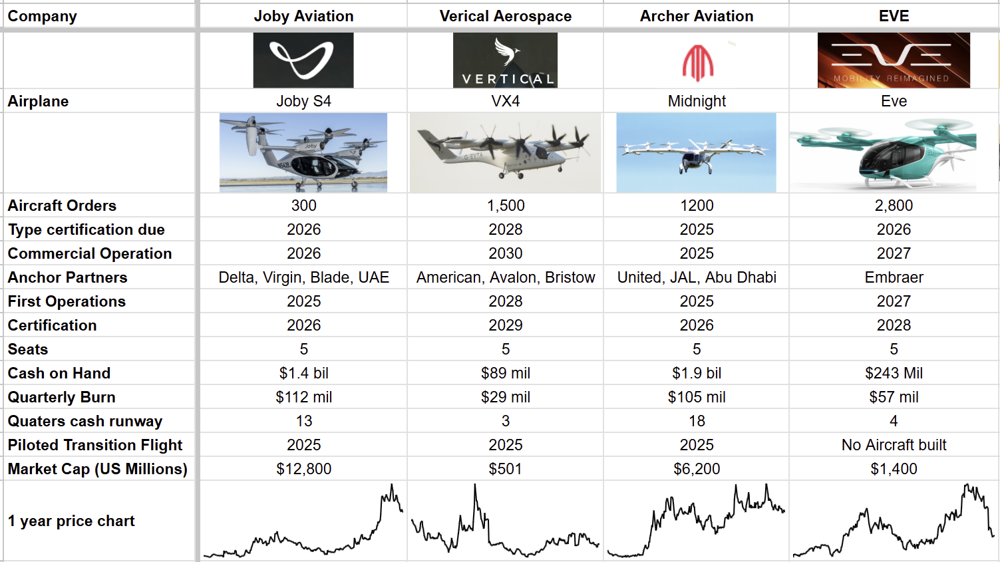
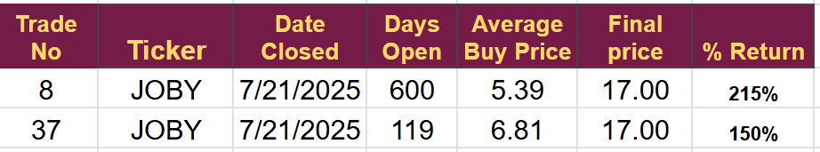

# eVTOL Inflection Point Approaching: Time to choose a winner

*Commerical Operations on the Horizon, Who to Invest in?*

2026 will be an inflection point for the eVTOL industry as it moves from the R&D phase to early revenue generation.

Full urban networks will likely follow in 2029/30 following the opening of smaller US and UAE flight corridors.

Now is the perfect time to reassess the sector, choose likely winners, and get invested in the stocks that offer the highest return. Fortunately, there are only four significant players left in the field, making a full sector analysis easier to complete.

## eVTOL dashboard

[Subscribe now](https://stephentobin.substack.com/subscribe?)

Joby Aviation (JOBY) and Archer Aviation (ACHR) are emerging as frontrunners due to their strong regulatory progress, manufacturing capabilities, and robust funding. Eve Air Mobility (EVEX) and Vertical Aerospace (EVTL) follow on longer timelines, utilizing strategic partnerships and capital-light models to manage costs.

**Certification and Technical Progress:**

-   **Joby** leads the certification race with its FAA Stage 4 completion at 70%, aiming for TIA (Type Inspection Authorization) flights in 2025. They are the only company currently conducting "for-credit" testing. Their first conforming aircraft are in final assembly, and they achieved piloted full-transition flights in April 2025.
    
-   **Archer** is closely behind, with 15% of its FAA Phase 4 compliance documents accepted. They initiated piloted Midnight flights recently and target a UAE launch in late 2025 to generate early revenue. Their Covington, GA, factory is assembling conforming aircraft.
    
-   **Eve** is two years behind, targeting a joint ANAC/FAA certificate in 2027, with conforming prototypes due by the end of 2026. They showcased a revised design at the Paris Air Show in June 2025 and are tooling up their assembly site in Brazil.
    
-   **Vertical** aims for CAA/EASA certification by 2028. They achieved their first piloted wing-borne flight in May 2025, ahead of schedule, and will begin certification aircraft production in 2025.
    

All except Eve have achieved significant piloted flight milestones, de-risking their aerodynamic models and human-factor assumptions crucial for Stage 4/TIA approval. Joby and Archer are already building conforming aircraft on semi-serial lines, giving them a head start in production scaling and early regulatory feedback.

**Commercial Models and Orderbooks:**

-   **Joby** operates a dual operator-OEM model, running U.S. networks (supported by Blade terminals) and pursuing wholesale sales/JVs overseas (ANA, Abdul Latif Jameel). Their backlog exceeds 300 provisional aircraft, and their Marina and Ohio plants can scale to 500 units per year.
    
-   **Archer** focuses on "Launch-Edition" kits for early-adopter cities (Abu Dhabi, Jakarta), selling small fleets with comprehensive support. They have approximately 1,200 total commitments from partners like United and JAL, with Stellantis providing manufacturing support.
    
-   **Eve** leverages Embraer's backing to offer a three-pronged revenue stack: aircraft sales, TechCare aftermarket services, and Vector ATM software. They have approximately 2,800 Letters of Intent (LOIs) and over 600 firm orders, with low-capex modular production in Brazil.
    
-   **Vertical** is a capital-light OEM, shifting pilot and MRO duties to partners like Bristow through "Ready-to-Fly" agreements. They have indicative demand for around 1,500 units, but firm orders are currently limited to 50 aircraft plus 50 options.
    

Middle Eastern routes (Joby in Dubai, Archer in Abu Dhabi) are strategic for early revenue generation and showcasing reliability in diverse climates, preceding full U.S. certification. Eve and Vertical will prioritize full regulatory approval before scaling, relying on their diversified backlogs.

**Financial Health and Funding:**

-   **Joby** and **Archer** have substantial cash reserves (over 12 quarters and 17 quarters of burn, respectively), significantly reducing their near-term financing risk. Joby's cash increased to ~$1.4 billion post-Toyota investment, and Archer's to ~$1.85 billion after a June capital raise.
    
-   **Eve** and **Vertical** operate with lower quarterly cash burn but have thinner cash cushions (less than six quarters). Eve has $0.24 billion in cash (plus $0.13 billion credit), and Vertical has ~$0.15 billion after a July raise. Both may need to raise additional capital if delays persist beyond 2026.
    

Despite some upward revisions in cash-use guidance from Joby and Archer, all four companies appear adequately funded to reach their next major certification milestones.

### Key Management Guidance This Quarter

-   **Joby:** Stage-4 completion for its side advanced to 70 % in Q2-25 from 60 % in Q1-25; management emphasised “direct line of sight” to Stage 5 following the start of conforming flight tests next year.
    
-   **Archer:** CEO highlighted resolution of FAA AM1.2105(g) “total propulsion loss” policy, unlocking document approvals; 15 % acceptance vs. 13 % the prior quarter.
    
-   **Eve:** Despite programme changes such as the Beta Technologies propulsion option, executives reiterated unchanged 2027 EIS and confirmed that ANAC means-of-compliance publication remains on track for year-end 2025.
    
-   **Vertical:** Management stressed that the piloted wing-borne milestone occurred five weeks ahead of schedule, bolstering credibility ahead of an expected capital raise in Q4-25.
    

**Industry Outlook and Risks:**

The advanced air mobility (AAM) sector is projected to begin commercial deployments in 2026-2027. Key catalysts include U.S. federal support (executive orders to "fast-track" approvals), global regulatory alignment (five-country alliance for reciprocal validation), and high-profile events (LA Olympics, FIFA 2026), creating incentives for early route certification.

However, significant risks remain:

-   **Regulatory pace:** Policy changes or misalignments could extend certification timelines.
    
-   **Battery durability and cost:** Shortfalls in cycle life could limit range or increase operating costs until more advanced battery cells become available.
    
-   **Infrastructure readiness:** Vertiport permitting and grid upgrades are external factors beyond OEM control.
    
-   **Capital markets access:** Eve and Vertical might require substantial additional funding if their burn rates continue into 2027.
    

The consensus view points to 2026 as the inflection point for early revenue, primarily in the U.S. and UAE. Full-scale urban networks are unlikely before 2028-2030 without breakthroughs in battery technology or vertiport development. Ultimately, industry success hinges more on regulatory execution, infrastructure development, and sustained funding discipline than on core technology.

## Conclusion

The sector is primed for extraordinary growth with a clear inflection point next year and scaled operation before the end of the decade.

All four of these companies may see significant price gains over the next couple of years, but I will try to choose the one with the highest probability of significant share price appreciation.

In the past, I have invested repeatedly in JOBY, and it remains the frontrunner. Here are the trades taken as part of my newsletter service that started in August 2023. I have never invested in the other three companies featured in this piece.

I have decided to perform another deep dive on JOBY and on one of its competitors. I hope to be able to buy next week and will send the deep dive and final decision to paying subscribers.

---

*Source: [Strategic Wave Trading](https://stephentobin.substack.com/p/evtol-inflection-point-approaching)*
