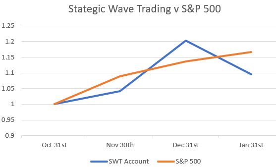
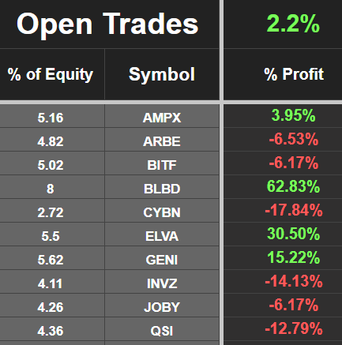
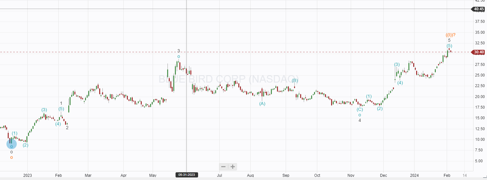
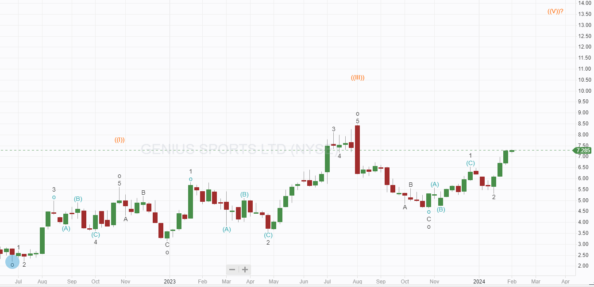
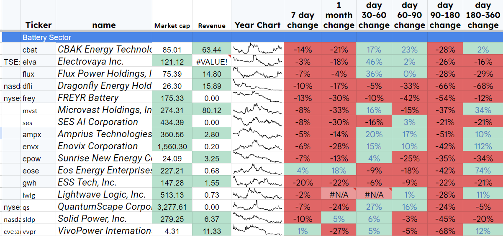
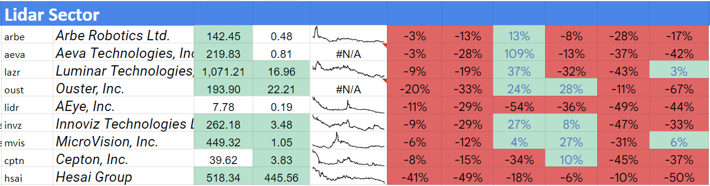
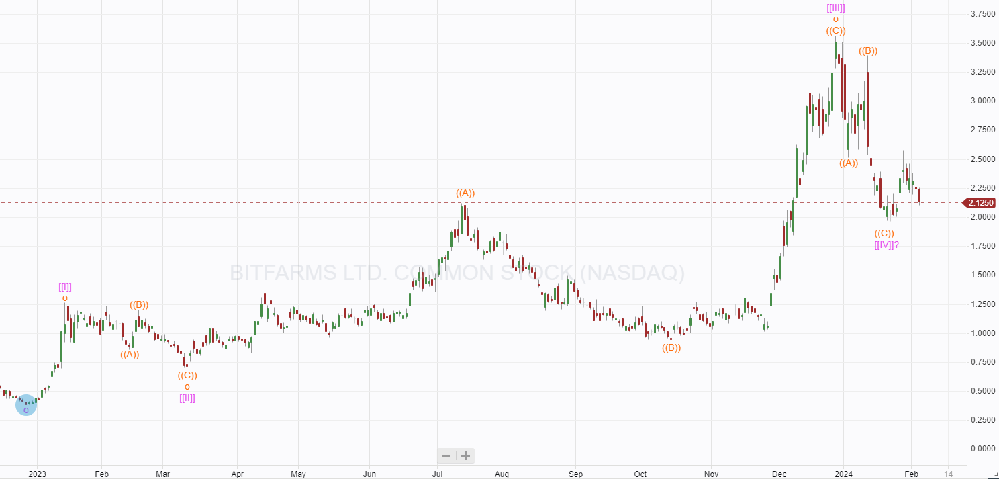
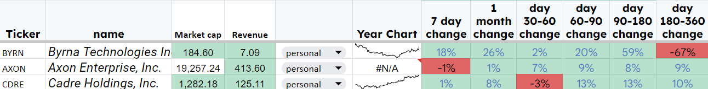
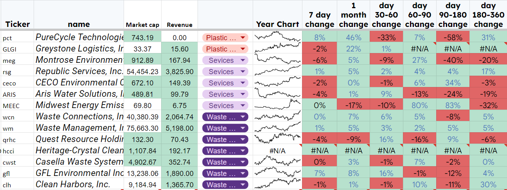

# January Results

*A move to cash and Pivot to new Sectors.*

In January, I expressed my concern about the current sentiment in the market using the S&P 500 to suggest that we may see a downturn. Since then, the S&P has moved to new highs powered by the big seven megacaps; Facebook managed to climb 20% in one day after earnings, which is pretty astonishing for a company of that size.

In January, I had quite a large drawdown that pushed my performance below that of the S&P 500; the graph shows the increased volatility of my trading relative to the S&P.

Although this looks alarming, it is expected when trading these small-cap, high-risk stocks. The additional volatility generally yields a much higher annual return than the S&P.

During January, I closed several trades for a small loss and now have quite a lot of cash on the balance sheet. In Fact, 50% of the account is now in cash. Figures at the close of January were as follows.

The only position giving me concern at the moment is INVZ. The recent press release about cutting costs sounded quite pessimistic regarding orders; if they do not deliver on promises about new contracts, the price will fall. I will watch it closely.

I have decided to take profits on BlueBird; it looks like a top might be in, and the chart projects a drop to around $20. The EV market, on which this trade was based, looks less compelling at present.

GENI looks well set and should develop into medium-term profitable positions. The chart currently suggests a target of $13.50, and recent news has been very positive. CNBC highlighted the stock as an undercovered gem, and the recent release of the ‘edge’ package should increase margins and tie in more sportsbook customers.

AMPX and ELVA are battery companies, an area performing poorly. ELVA has some solid orders and should have its first profitable year in 2024; I will continue to hold long for now. AMPX is in an earlier stage of development, and orders will be important. I had thought this sector had turned the corner a couple of months ago when many of the stocks showed consecutive months of gains; however, they have turned lower in the last 30 days. I never try to buck the trend and will close if the sector continues to fall.

INVZ and ARBE are entering a crucial time period; we must see confirmed large-scale orders in the coming few months to hold onto these trades. The LiDar sector looks very negative.

The fundamentals of Arbe and INVZ have kept my interest; we will know one way or the other soon. The fall in Hesai is very interesting; it currently seems significantly undervalued. The fall was caused by the US government listing them as a Chinese Military company, I am not sure that will affect their business at all as they are selling to Chinese EV companies. I will be giving them a thorough review this month, and an opportunity to buy them cheaply may be here.

CYBN is a longer-term micro play, It will probably stay around for at least a year as the company hopefully develops some traction.

JOBY is currently underwater, and the eVTOL sector is generally down; the fundamentals here are solid. JOBY should be the first air taxi company to get FAA approval. If and when they do I expect to see the stock jump higher and I will hold for the time being.

BITF No change to the Bitfarms plan, it is Crypto we accept the super volatile nature, it has been a big earner for us in the last year.

If the price falls below the purple \[\[IV\]\]? I will close for a loss.

QSI was added to the portfolio recently; the new wave higher discussed when I bought QSI did not last, and the price continues to fall. The fundamentals still interest me; this stock could fly if they can deliver the planned launch this quarter.

# Outlook For February

I track companies by sector, and the results of each sector look very patchy. I always look to pivot out of underperforming sectors and into high-performing ones. Moving to cash in January was effectively pivoting out of sectors, and closing Bluebird will mean we have no EV stocks at present, and I will be out of that sector. I am interested in MULN and will send a newsletter review of the company this month.

The S&P is moving higher, but we did not benefit as we were in some underperforming sectors; I will look to change that in February.

# Top performing sectors

Two sectors stand out now, and I will try to find suitable trades in the coming days to exploit these areas.

1.  Non Lethal Defence
    
    [
    
    
    
    
    
    ](https://substackcdn.com/image/fetch/$s_!Xjtz!,f_auto,q_auto:good,fl_progressive:steep/https%3A%2F%2Fsubstack-post-media.s3.amazonaws.com%2Fpublic%2Fimages%2Fc2a32591-97b3-43f8-ac6c-02af0aee0fe0_1292x165.png)
    

This sector is part of Defence and Aerospace but is outperforming significantly. I will examine these three companies in depth to choose a winner.

2.  Recycling
    
    [
    
    
    
    
    
    ](https://substackcdn.com/image/fetch/$s_!kiv8!,f_auto,q_auto:good,fl_progressive:steep/https%3A%2F%2Fsubstack-post-media.s3.amazonaws.com%2Fpublic%2Fimages%2F785bb022-a501-40b3-a043-f87ed025ef5c_1296x487.png)
    
    The three sectors shown are looking very promising. I will do a competitive analysis to highlight the ones I like the look of most.

---

*Source: [Strategic Wave Trading](https://stephentobin.substack.com/p/january-results)*
