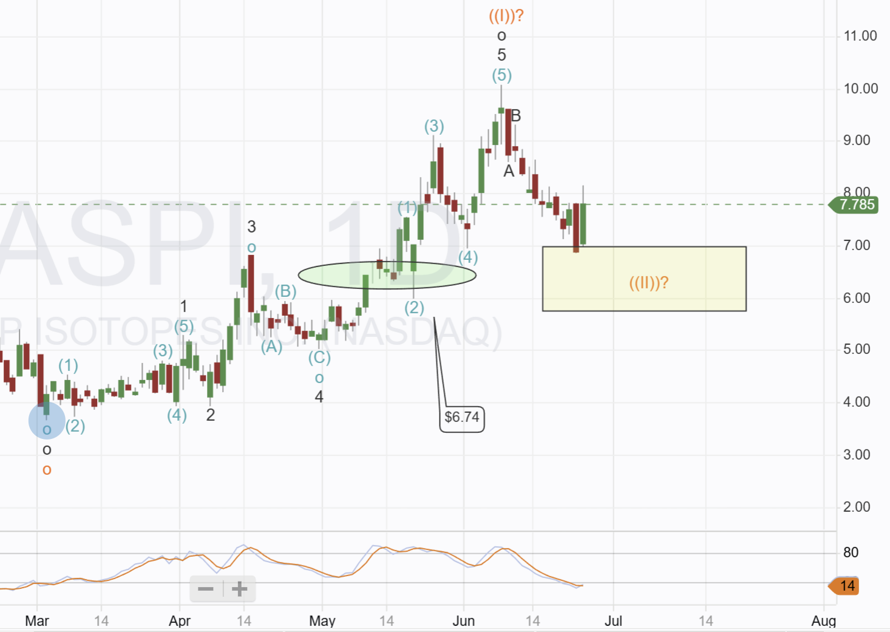
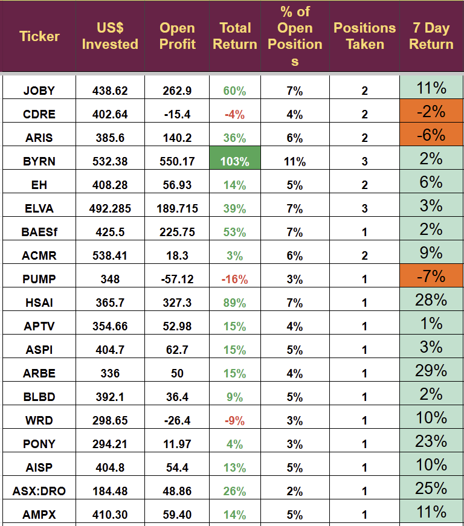

# Nuclear Stock: Time to Add?

*Our Nuclear Stock hit the buy area*

Our Nuclear holding has dropped 30% over the last few weeks. We are still in profit and have been looking for the opportunity to add extra shares in this company. This post will discuss my thoughts and explain my decision.

The portfolio continues to perform well, and the cash balance remains high, so we have the funds to act, and cash does not earn when it sits idle.

[Subscribe now](https://stephentobin.substack.com/subscribe?)

The portfolio is up 39% in Q2 2025 and 185% in the last 12 months. If you are not currently subscribed and wish to receive the weekly review, please subscribe for free by clicking the link above.

The remainder of the post is for paid subscribers only who fund the research I do.

## ASP Isotopes: Opportunity to add?

On the technical chart, it appears to be an excellent place to add; the stock is oversold, has fallen from $10 to $7, and seems to have bounced at the previously identified buying area. Purely technical traders would probably buy at this point.

The fundamental picture is less clear. We have had quite a bit of news to digest, some of which is overwhelmingly positive, but some was unexpected.

On May 20th, ASPI announced its intention to acquire the South African company Regeneron, which focuses on the production of liquefied helium and liquefied natural gas, known as LHe and LNG, respectively.

(June 18th) Regeneron, as part of the He4u consortium, was appointed the preferred bidder for phase 2 of a Helium and LNG extraction site in Virginia.

Regeneron is in distress, and ASPI has agreed to provide a bridging loan to the company of up to $30 million. The first tranche ($10 million) has already been paid, allowing the acquisition to proceed. The acquisition has a closing date of September 30th.

The press release announcing the deal put forward the following positives

_**\- Combining these two highly complementary businesses aims to create a global leader in the production of critical and strategically important materials, including electronic gases such as helium, various fluorinated products and isotopically enriched gases.**_

_**\- Combination is expected to create a vertically and horizontally integrated supply chain with significant geographic and customer overlap. Substantial synergies expected from 2026.**_

_**\- Transaction is expected to be highly accretive to 2026 anticipated EPS. Goal of the combined group is to generate >$300 million in EBITDA in 2030.**_

_**\- Highly unique Helium asset is expected to benefit from $750 million of committed debt funding from the U.S. government's development finance institution and other lenders to expand plant production capacity in South Africa.**_

In conjunction with this acquisition, ASPI announced on June 2nd a $50 million offer to sell 7.5 million shares at $6.65 to underwriters. The offering was due to close on June 3rd, but no documents have been registered, suggesting it has closed. I do not believe it has and think the shares will be issued if the Regeneron deal moves forward.

ASPI had $48 million in cash at the end of Q1 and raised $5 million in May from selling shares. Net loss was $8.4 million in Q1, and I forecast $10 million for Q2. That implies the remaining cash is $30 million, equal to the loan granted to Regeneron.

Although it seems like a good place to buy, there is an added risks: the Regeneron deal may not go through, the capital raise may not occur, the business combination may prove more difficult than expected, and they may not secure the debt funding from the US government.

The final risk is the expected 2025 spin-out of the HALEU enrichment company; this could be a massive cash generator for the company, and current shares are likely to see a significant increase if it proceeds. ASPI is hiring new personnel for the future spin-out and preparing the division for separation, which will incur additional costs. We will only see a return on these costs if the spin-out occurs.

I have decided to hold for the time being. I currently hold a reasonable-sized position, accounting for 3.7% of the account and 4.9% of the invested cash. I am probably being too conservative; it will probably all work out fine, but I am not going to risk any money on it.

Full Holdings below.

---

*Source: [Strategic Wave Trading](https://stephentobin.substack.com/p/nuclear-stock-time-to-add)*
