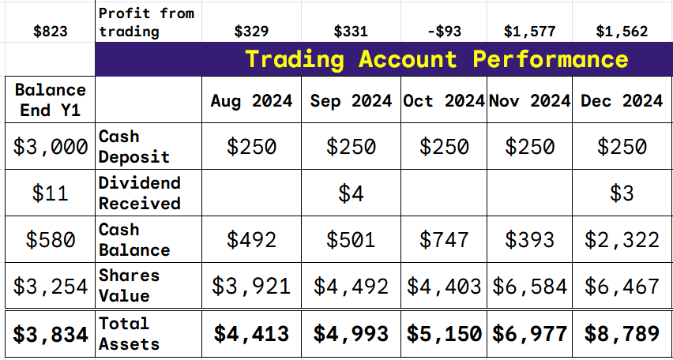
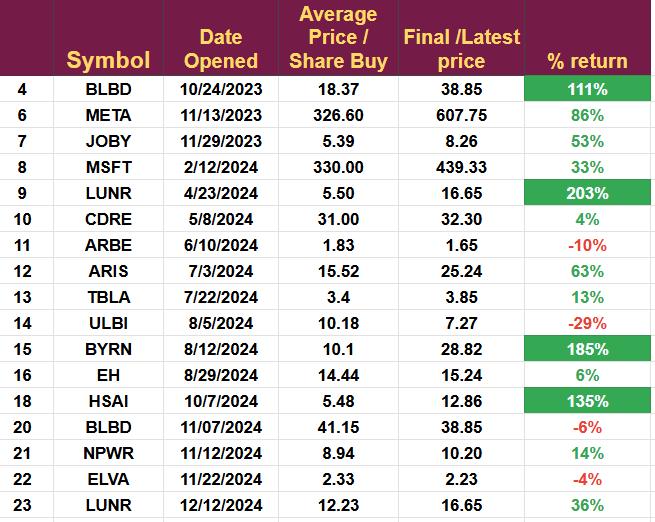
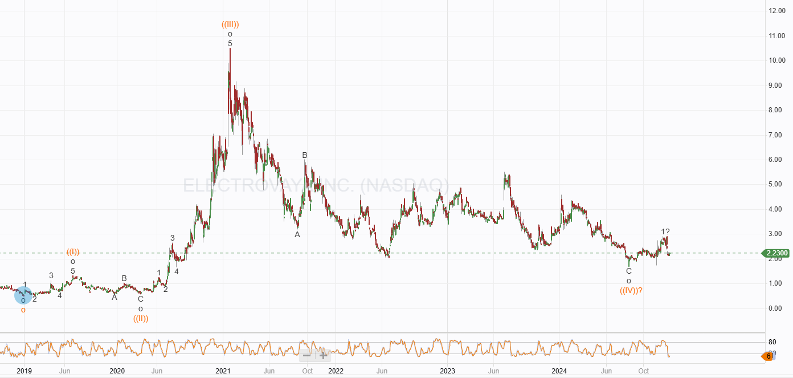
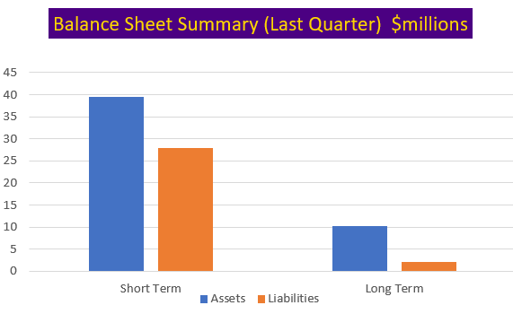
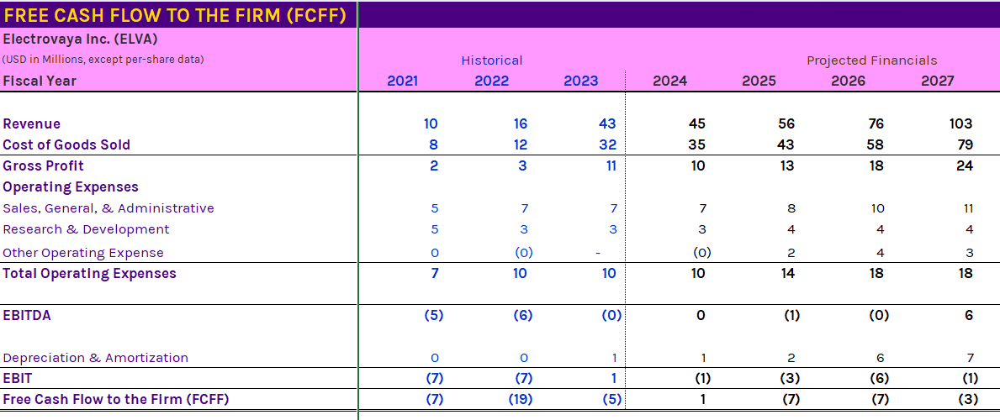

# Portfolio Adjustment: Buying Elva

*First of several company reviews complete*

# Excess Cash: A Nice Problem

The demonstration portfolio is now cash-heavy due to the profits from the D-Wave trade. As a result, I will increase the standard position size from $250 to $350 but continue adding $250 to the account each month.

The larger position size should reduce the cash balance to a more manageable level during 2025. The image below shows the growth in the cash balance and the profit from trading.

The increase in position size is an opportunity to look at open positions and decide if I want to increase them to the new full size. The current open positions are shown below.

I will be looking to add to MSFT, ARIS, BYRN, and HSAI on any pullback, but currently, they do not present an opportunity to add. I have already added to LUNR and BLBD, so I must wait for the next pullback following a new high.

I am reviewing the rest of the trades and deciding whether now is a good time to buy. I will not add to NPWR or JOBY, as they are too far away from revenue generation to warrant risking additional funds.

# Electrovaya (ELVA)

Technically, this is an excellent time to buy the stock is oversold and a new wave (V) higher may be in its early stages. The technical target for this wave is above $19

We opened ELVA on Nov 22nd, so the trade is quite new; there have been some developments since I published a Strong-Buy article on SekingAlpha.

ELVA had an earnings call on Dec 12th. Below is a summary of the key points

1.  _Electrovaya achieved record revenue and positive adjusted EBITDA for six consecutive quarters, generated positive cash flow from operations for the first time, and they improved gross margins to over 30%._
    
2.  _Revenue for fiscal 2024 was $44.6 million, a slight increase from the previous year, with Q4 revenue at $11.6 million. Strong customer demand and expanding opportunities in existing and new markets are expected to drive revenue to exceed $60 million in fiscal 2025. Electrovaya is on track to achieve breakeven at $50 million in revenue and generated $1 million in cash flow from operating activities, a significant improvement of $6.3 million compared to the prior fiscal year._
    
3.  _Total debt was $18.4 million on September 30, 2024. The company is refinancing its working capital facility._
    
4.  _The Export-Import Bank of the United States approved a $51 million direct loan for Electrovaya's Jamestown, New York gigafactory, enabling expansion of lithium-ion cell manufacturing. The loan and state and county incentives provide nearly $60 million._
    
5.  _Commercial cell manufacturing operations are expected to begin in the Jamestown facility in the first half of 2026, and battery system manufacturing will start in 2025._
    
6.  _Electrovaya is experiencing increasing demand for its material handling battery products, particularly in retrofit situations. It received an order from a Fortune 500 retailer to equip two distribution centers, and there are potential plans for additional conversions._
    
7.  _Renewed demand from its largest customer, a Fortune 100 e-commerce company, will return revenue from that customer to historical levels in fiscal 2025. Revenue from this customer dropped from $10 million to near zero in 2024._
    
8.  _A high residual value leasing offering, introduced in partnership with Toyota Material Handling, has generated significant customer interest and anticipated orders._
    
9.  _Electrovaya has several OEM-driven development projects scheduled for production in 2025, including a high-profile electrified industrial forklift and customized battery systems for new autonomous vehicles._
    
10.  _Electrovaya has successfully entered multiple verticals with mission-critical requirements, including construction equipment, defense, and electrified locomotives. A supply agreement with a global construction equipment manufacturer is expected to lead to initial shipments in February 2025._
     
11.  _Received follow-on orders from a global aerospace and defense company, discussions are ongoing for additional applications in trucks and mining vehicles._
     
12.  _The company anticipates meaningful revenue contributions from these verticals in 2025, especially in 2026 and beyond, which aligns with the ramp-up of Jamestown operations._
     
13.  _Electrovaya continues developing new products based on its Infinity and solid-state battery technology. A product for airport ground equipment is expected to launch soon, with growing interest in that vertical. A stationary energy storage product is scheduled for launch in 2025 to meet existing customer demands._
     

Unexpected news was a capital raise completed in mid-December; they sold nearly 6 million shares (full over-allotment option), raising $12 million.

Electrovaya gave the following reasons for the raise.

1.  _Satisfy conditions associated with the loan approved by the Export-Import Bank of the United States announced by the Company on November 14, 2024,_
    
2.  _Repayment of amounts under the Company’s existing working capital facility in advance of proposed bank refinancing_
    
3.  _Satisfaction of certain outstanding amounts in connection with the purchase of the Company’s Jamestown, New York manufacturing facility._
    

## Conclusion

ELVA's strategic position remains unchanged. The company is now EBITDA-positive and should become cash-positive next year. Significant revenue increases should drive a sustained improvement in the share price in 2025.

The capital raise was unexpected, but it has improved the balance sheet substantially. The graph below is last quarter adjusted for the new capital.

Negative shareholder value seems like a thing of the past, and the future looks very positive.

The new revenue guidance is above my forecasts for 2025, with significant growth indicated for 2026. My previous forecast is shown below, leading to a target price of $10. I will review the model in detail at the start of Q2. You can see that revenue for 2024, 2025, and margins have all exceeded my model, suggesting more upside ahead.

All of this suggests now is an excellent time to buy Electrovaya, and I will increase the size of my position. I am always wary of trading between Christmas and New Year because of the reduced liquidity, but assuming the stock is not hit by a wide bid spread or sudden price movement, I will issue a mid-market order on IBKR.

---

*Source: [Strategic Wave Trading](https://stephentobin.substack.com/p/portfolio-adjustment-buying-elva)*
