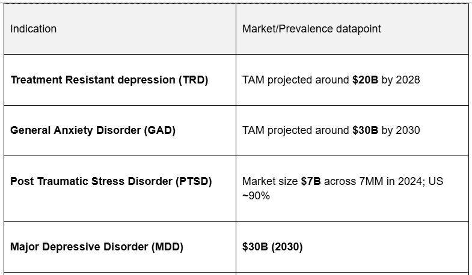
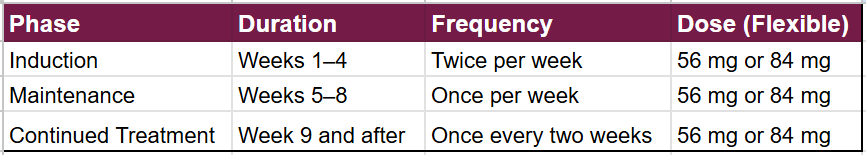
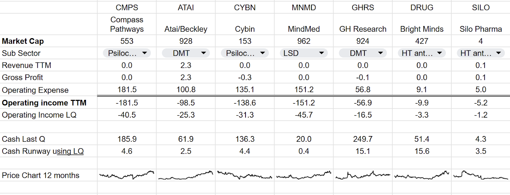
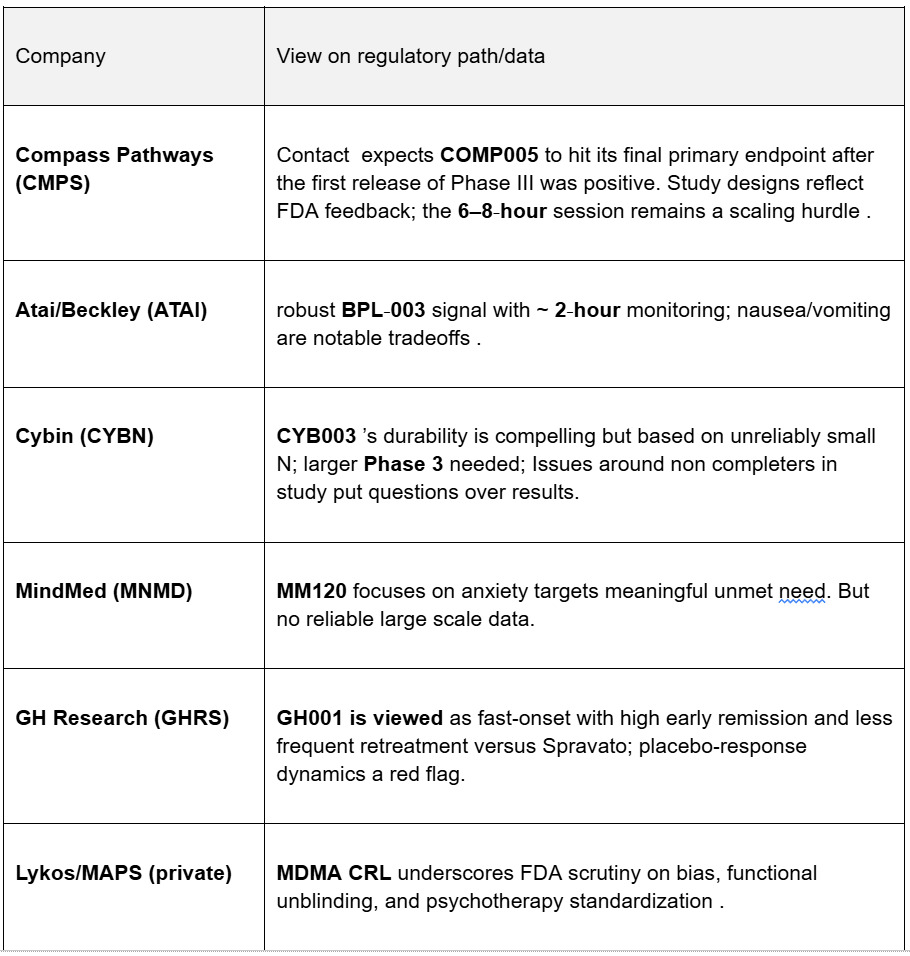

# Psychedelic Drug Therapy Competitive Landscape:

*Market Leaders Emerge as FDA Raises Regulatory Bar*

I have been covering the psychedelic therapeutics market for several years. It is an emerging technology long touted as a game changer in the treatment of severe mental health problems. Multiple studies have pointed to the effectiveness and safety profile of various drug candidates and their ability to help with a wide range of conditions, from depression to addiction and anxiety.

In 2025, several events occurred that suggest 2026 will be a pivotal year in the space, making it an ideal time to analyze competitors and identify potential winners.

I am not investing yet, but have identified the companies that warrant a deep dive.

[Subscribe now](https://stephentobin.substack.com/subscribe?)

## **Key Takeaways**

-   **Compass (CMPS) and Cybin (CYBN) lead the race,** with Phase 3 programs showing positive efficacy data. Meanwhile, **ATAI’s BPL-003 has secured Breakthrough Therapy Designation** after strong Phase 2b results in the treatment of treatment-resistant depression.
    
-   **Session duration creates competitive differentiation**, with BPL-003 and GH001 offering **~2-hour clinic visits** versus **6-8 hour sessions** for psilocybin/LSD programs, potentially improving clinic throughput and commercial scalability.
    
-   **FDA’s post-MDMA rejection has raised the regulatory bar**, now requiring blinded durability studies, prespecified retreatment algorithms, and stricter controls on prior psychedelic use to address functional unblinding concerns.
    
-   **Durability data emerges as key differentiator**, with Cybin reporting **71% remission at 12 months** and GH Research showing **73% remission at 6 months** with infrequent retreatment, potentially offering advantages over current ketamine therapies.
    
-   **GHRS faces significant regulatory overhang,** with its **US IND clinical hold** persisting despite strong efficacy data, while **MindMed targets the large GAD market** with three Phase 3 trials launching through 2026 .
    
-   **Strategic interest is heating up** , with **AbbVie’s $1.2B acquisition** of psychedelic assets setting valuation benchmarks, while **Spravato’s $1.8B quarterly run rate** validates the commercial viability of clinic-based neuropsychiatry models.
    

## Proven Commercial Case

In January this year, the FDA approved Johnson & Johnson’s ketamine based Spravato for “alone use” in adults with treatment-resistant depression. Spravato was first approved in 2019 for use in conjunction with other antidepressants.

Ketamine contains two molecules S-ketamin and R-ketamine, J&J isolated S-Ketamin after researchers began to see that Ketamine, approved as a general anesthetic in 1970, was delivering a rapid and positive effect on depression symptoms. S-Ketamin became the drug Spravato.

ATAI tried to bring R-Ketamine to market but it failed to show any improvement in early testing.

Spravato is reportedly generating over $1.5 billion in quarterly revenue and is forecast to reach $5 billion by 2028. It makes the drug a true blockbuster, proving the commercial case on multiple fronts. Doctors are increasingly confident about prescribing the drug, regulatory bodies have seen little negative impact and no addiction as a result of the drug, which has now been in the field for over 5 years. Insurance companies are covering the high costs involved, and a network of clinics has been established to deliver the drug under the supervision of trained physicians.

The success of Spravato has drawn the attention of other major pharmaceutical companies, with AbbVie paying $1.2 billion for Gilgamesh Pharmaceuticals’ lead investigational psychedelic drug, Bretisilocin.

## The Unblinding Problem

The key for these companies is getting the FDA to approve their drug candidate and there is a problem.

The gold standard for proving the effectiveness of a drug before seeking FDA approval is a large-scale double-blinded test. These tests, commonly referred to as phase III, test the active drug against a placebo.

Double blinding means neither the patient nor the prescribing doctor knows which patients have received the placebo and which the active drug. Let’s suppose it’s a headache pill, then some people get an inactive look-alike and some the real drug, but nobody knows which. After they take the pill, you ask them if they still have the headache. The researchers then look at the difference between the results of the placebo and active ingredient cohorts. If a statistically significant number of people in the active cohort report an improvement in their headache symptoms compared to the placebo group, then the drug is considered effective.

With Psychedelic drugs, this is impossible; those in the active group go on hours-long psychedelic trips, and those in the placebo group have taken an inactive substance, and nothing happens. Immediately, both the doctor and the patient know if they have taken the placebo or the real drug.

When it comes to questioning people after dosing, a standard diagnostic questionnaire is conducted by the doctor. When assessing depression, the MADRS system is used. The MADRS questionnaire comprises 10 items, and individuals score on a range of 0-6.

The functional unblinding means that people within the placebo group knew they didn’t receive the drug, which might worsen their MADRS score; those in the active group knew they had received it and may have felt better simply because they knew they were in the active group.

The unblinding issue led to the rejection of the MAPS/Lycos MDMA approval application. It also accounts for some of the enormous MADS improvement scores quoted. I have seen scores as high as 20, but remember the 20 is the difference between the two cohorts, and with functional unblinding, it is not statistically acceptable.

### Low Dose Placebo

To counter these issues, the FDA issued guidelines on how to conduct these tests, one of which is to administer patients in the Placebo cohort a significantly smaller dose of the drug. In this instance, everybody thinks they have had the real drug. The resulting improvement in the MADRS score is smaller, but if it is statistically and clinically significant, it demonstrates the effectiveness of the drug.

COMP-360  
This month, Compass Pathways became the first company to release topline data from its Phase 3 trial, with a MADRS improvement of 3.6. The stock tanked as a result, but this is a market misunderstanding of the mathematics. 3.6 is a medically and statistically significant result; indeed, it was the result Compass was hoping to achieve and is in line with Spravato, which showed a least squares mean improvement of 3.4 on the MADRS in its Phase III.

The total improvement was from an average MADRS score of 37 (severe depression) to an average score of 17 (mild depression) for the active drug and from 37 to 21 (moderate depression) with on the placebo arm.

For individual users, this is a life-changing result. Severe depression is a highly debilitating condition, moderate depression requires clinical intervention, and will impact daily life. In contrast, mild depression is generally manageable by the patient.

The phase III Compass data had a game-changing impact on timelines and the FDA’s actions. The FDA allowed Compass to move to a rolling submission, meaning it can submit data for approval as it becomes available rather than collecting it all together and submitting it in one lump at the end. It caused Compass to bring forward their timeline for commercial launch and they are now targeting Q4 2026 rather than Q4 2027.

## Market Size

The various companies are targeting different conditions and the approximate size of the market they are chasing is shown below.

There are multiple other conditions with no current pharmacological treatment, including Addictions, Autism Spectrum Disorders, and Anorexia, all of which are being targeted by these psychedelic drugs, and likely some drugs will be approved for multiple conditions.

I know that Compass is involved in small-scale testing in every one of these areas, despite pursuing TRD in its Phase III. TRD is the hardest to treat cohort; they are people who have already tried at least two other treatments.

## Drug Pipelines

Here is a summary of the lead offerings from the companies I am following:

(Notes NDA-new Drug Application, the documents you need to submit to the FDA to be approved. BTD-Breakthrough Therapy Designation a process for accelerating the approval process drugs showing potential in life threatening conditions.)

-   Compass Pathways (CMPS): COMP360 synthetic psilocybin (oral); Phase 3 COMP005 met 6‑week primary, UK accelerated access supported. FDA approved rolling submission. (Target TRD)
    

-   Atai/Beckley (ATAI): BPL‑003 intranasal 5‑MeO‑DMT; Phase 2b showed MADRS improvements (Target TRD)
    

-   Cybin (CYBN): CYB003 deuterated psilocin (oral); Phase 3 under Breakthrough Therapy Designation (APPROACH/EMBRACE) with topline in 2026. Phase 2 showed high remission and very high MADRS. (Target TRD)
    

-   MindMed (MNMD): MM120 LSD ODT; three Phase 3 trials—VOYAGE (GAD, 1H26), PANORAMA (GAD, 2H26), EMERGE (MDD, 2H26); MM120 holds BTD in GAD; designs include 40‑week open‑label extensions to assess durability and retreatment. (Target for GAD/MDD)
    
-   GH Research (GHRS): GH001 inhaled 5‑MeO‑DMT; U.S. IND clinical hold persists pending rat‑specific respiratory histology justification (Target TRD)
    

-   Bright Minds (DRUG): BMB‑101 non‑hallucinogenic, G‑protein‑biased 5‑HT2C agonist; Phase 2 BREAKTHROUGH (Target absence epilepsy)
    

-   Silo Pharma (SILO): SPC‑15 intranasal 5‑HT4 agonist; FDA‑requested 7‑day large‑animal safety/tox positive. (Target PTSD)
    
-   Incannex (IXHL): PSX‑001 psilocybin; IND and UK CTA cleared; Phase 2 recruiting across U.S./U.K. (Target GAD)
    

-   MAPS/Lykos (private): Midomafetamine (MDMA‑AT)received FDA CRL, resubmission path under discussion. (Target PTSD)
    

## Time In Clinic

This is likely to be a crucial differentiator.

Spravato set the benchmarks requiring three hours per clinic visit; however, patients must attend the visit multiple times.

I have interviewed a physician at one prescribing clinic who told me these figures are from J&J, but they rarely follow this exactly as they constantly discuss treatment with patients. He also said the effects on patients’ mental health from taking the drug were “life-affirming”.

The two drugs leading the way appear to be Compass Pathways COMP360 and Cybins CYB003. Both are based on Psilocybin and require an 8-hour visit; this will be difficult to fit into the established clinic structure for Spravato, but both drugs require far fewer visits, guiding to 1-4 visits a year.

In its phase 2B testing, Compass recorded a median time to a depressive event as being 92 days on the single-dose 25mg active ingredient cohort. We have not yet received the Phase III follow-up data to verify this.

Cybin, in Phase 2, recorded a 71% remission rate at 12 months following a two-dose regimen. Phase III data is due from Cybin in 2026.

ATAI, with its BPL-03, has an advantage in this area with 3-hour clinic visits and 6 visits per year (although not yet in phase III)

### Follow the Money

This is the hold your hats moment. Jefferies' research believes Compass Pathways will charge $17,000 per treatment, **the same as Spravato**. I have no information about how much the others will charge. Spravato has proven that this price point is achievable, and with Compass Pathways dramatically reduced number of sessions, it could cut the first-year cost of treatment from Spravato’s $595,000 to $68,000.

Compass Pathways has the same MADRS improvement as Spravato did in its phase three, and both have excellent safety profiles. If Compass can make it to market next year, it will have a huge first mover advantage and an enormous price advantage if it can meet the 4 treatments a year, even if in the end it turns out to be monthly treatments, that is still only $170,000 less than half the cost of Spravato.

The major drawback for patients is the 8-hour clinic visit rather than the 2-hour visit. It remains to be seen how clinics will deal with this and how patients will respond.

## Balance Sheets

**Notes:** Management guidance is different from the above figures, with all companies stating a cash runway to 2027. MNMD has an additional $120m facility, CYBN has $500m in convertibles.

## Strategic Comparison

Compass Pathways will have a significant first-mover advantage and is the only company with statistically significant data to support its claims.

## Conclusions

This is a big market and has a proven commercial operating plan thanks to the success of the now blockbuster drug Spravato.

I am not ready to invest yet, but it is clear which companies need a deep dive and what the upcoming pivot points will be.

My base case is that CMPS gains a first-mover advantage in early 2026 and moves to commercial operations by the end of 2026. CYBN should confirm its durability in 2026, and with its $500m debenture runway, could move quickly to scale. ATAI must move quickly with its Phase 3, but its 2-hour treatment window, with many patients leaving the clinic within an hour, could develop into a significant and sustainable competitive advantage; however, it does have the issues of sickness and vomiting to deal with.

Both Compass and Cybin are utilizing a psilocybin-based compound that requires an 8-hour stay in a clinic, which may not be feasible given the current infrastructure.

GH Research has excellent early results but is now under a clinical hold due to safety concerns.

---

*Source: [Strategic Wave Trading](https://stephentobin.substack.com/p/psychedelic-drug-therapy-competitive)*
