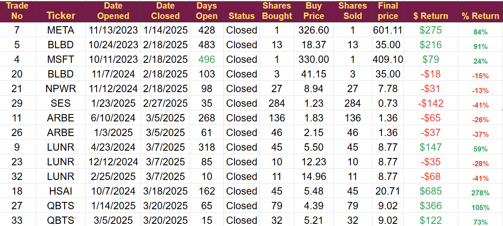
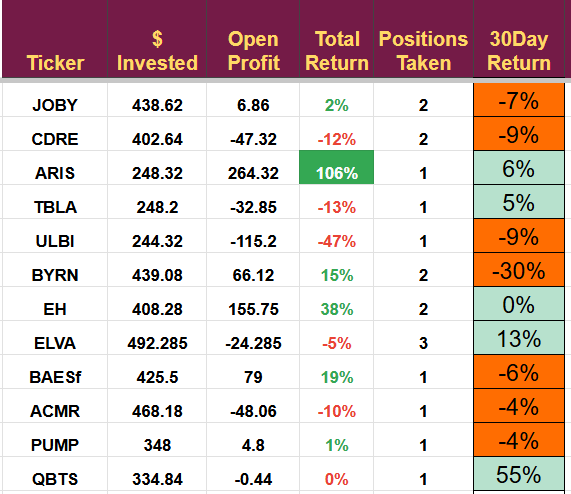
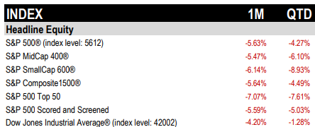
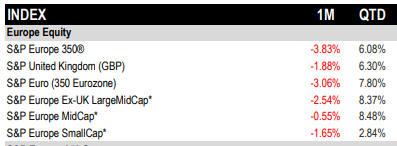
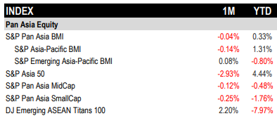

# Q1 2025 Results and Plans for Q2

*We now have a large cash balance*

Q1 2025 was marked by significant market volatility, particularly in US equities, due to tariff concerns. The portfolio shifted to a cash-heavy position to mitigate risks, resulting in a 46% return on closed trades. However, overall portfolio value declined by 7%, primarily due to paper losses in new energy and US holdings, notably Intuitive Machines. Despite challenges, strategic exits and successful trades like HSAI and QBTS yielded positive results. Looking ahead to Q2, the focus will be on capitalizing on the current market conditions, particularly in the RoboTaxi sector, and deploying the substantial cash reserve.

To avoid the problems in the US, I exited a large number of positions as I moved the portfolio into a cash-heavy position. Closed trades generated a profit of 46% and added significant cash to our holdings.

The total value of the portfolio was down 7%, driven by paper losses in new energy companies and our US holdings. Intuitive machines, our largest holding, accounted for the largest portion of the paper losses. It dropped 73% when the moon landing failed.

Closed Trades

The quarter was our busiest ever. I had to move quickly to limit some losses as the markets moved swiftly, and many of the stocks we held were in the firing line. The total number of closed trades in the quarter, shown below, was greater than the number closed in the previous two years.

The closed positions generated a net profit of $1,494 on a total investment of $3,252, a return of 46%, which is acceptable but below the target figure.

NPWR was a well-timed exit. We sold at $7.78 as part of the pivot away from new energy stocks, and today, the price is under $3. It was a similar story with SES and ARBE, as we booked smallish losses before the shares fell significantly.

QBTS was a big winner in the second quarter. I have already repurchased the stock and intend to add the position soon. So far, QBTS has delivered returns of 622%,105%, and 73%. I think the company has a great future and is significantly undervalued.

I was on an analyst’s call with the CEO of D-Wave yesterday, and the company's new customers, new markets, and new technology are very encouraging. They are the only quantum company with a working computer and are gaining significant traction in multiple vertical markets. I think D-Wave will be a millionaire maker for some and a multiple ten-bagger for us.

Please remember position sizing. Even though I think QBTS has a great future, it is a pre-profit emerging technology stock and is very high risk. I would like to be able to hold QBTS for the longer term, but there is so much hype in the quantum sector that it may be better to take profits early, as we have been doing.

The goal of the portfolio is to generate wealth but not to risk everything on a single play. The plan has worked for many years and I will stick with it.

Open Positions

We currently have 12 open positions, and 50% of the account is in cash. Hopefully, we will be able to utilize this large cash position in Q2.

Over the next quarter, I expect to make significant purchases to gain exposure to the RoboTaxi market. The proposed growth rates for this industry are the largest I have ever seen, and much of that growth is forecast for China and Japan. Europe has just granted its first RoboTaxi license to WeRide, one of the five companies I am considering buying.

Fortunately, these companies have been hit hard by this quarter's sell-off and are now trading at substantial discounts to where they were three months ago.

I will also be looking to trade “the second dimension”, companies supplying the technology to make this work. Arbe and Hesai are the companies we have been trading as part of the Robotaxi market, both remain on the watch list. Arbe has been unable to confirm the OEM contracts we had hoped for, but it has the HiRain deal for supplying a robotaxi firm. We exited Hesai for a 278% profit last quarter when the price was nearly $21. Today, it has dropped below $15, so I am very interested in buying again.

# The global indices’ performance for the Quarter

US

US stocks have been hit badly. We remain exposed to US small caps, and that index dropped 9%. All US indices returned negative performances for the quarter. The drop reflects the ongoing tariff threats and the negative view of growth for the US economy.

Businesses and markets do not like uncertainty, and we hear of a change to the administration's plans almost every day.

It does mean that some stocks are trading at a discount, and I will be actively looking to pick up bargains. I shared my eyes-on list in a recent note and will continue to monitor it for opportunities.

Europe

Europe was the standout performer in the quarter. I only managed to buy a single European stock, BAE, but it returned a positive 19% in the quarter, helping out the overall performance. I will continue to add European stocks in the coming months. German mega caps were a key driver of performance this quarter, but they are not an area I intend to trade.

I will continue to look for investments in Europe; however, stocks now look somewhat highly priced. Smallcaps may be the better option in the next quarter, and I am actively reviewing four companies.

Asian Markets

Asia returned a mixed performance, with only the large caps making any ground. Despite the drop, I still see Asia as a potential growth engine for the portfolio.

I will continue to increase my exposure to the Chinese market, especially in electric transportation.

---

*Source: [Strategic Wave Trading](https://stephentobin.substack.com/p/q1-2025-results-and-plans-for-q2)*
