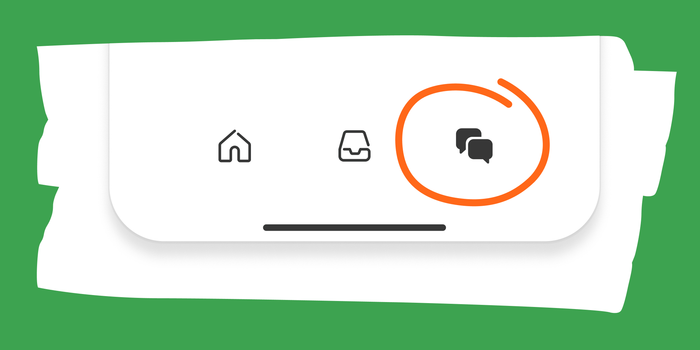

# Subscriber Chat Launch

*Weekly Review due later today*

This is a generic email from Substack, but it contains the important points, so I have not altered it.

Today I’m announcing a brand new addition to my Substack publication: Strategic Wave Trading subscriber chat.

This is a conversation space exclusively for subscribers—kind of like a group chat or live hangout. I’ll post questions and updates that come my way, and you can jump into the discussion.

[Join chat](https://open.substack.com/pub/stephentobin/chat)

* * *

## How to get started

1.  **Get the Substack app by clicking [this link](https://substack.com/app/app-store-redirect) or the button below.** New chat threads won’t be sent sent via email, so turn on push notifications so you don’t miss conversation as it happens. You can also access chat [on the web](https://open.substack.com/pub/stephentobin/chat).
    

[Get app](https://substack.com/app/app-store-redirect)

2.  **Open the app and tap the Chat icon.** It looks like two bubbles in the bottom bar, and you’ll see a row for my chat inside.
    

3.  **That’s it!** Jump into my thread to say hi, and if you have any issues, check out [Substack’s FAQ](https://support.substack.com/hc/en-us/sections/360007461791-Frequently-Asked-Questions).

---

*Source: [Strategic Wave Trading](https://stephentobin.substack.com/p/subscriber-chat-launch)*
