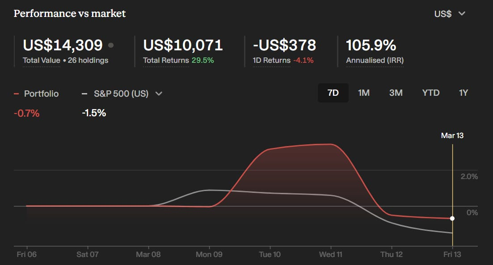
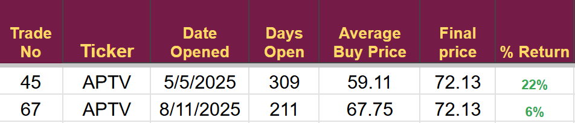
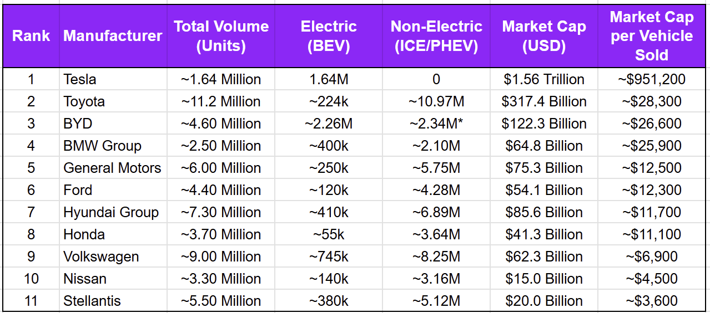
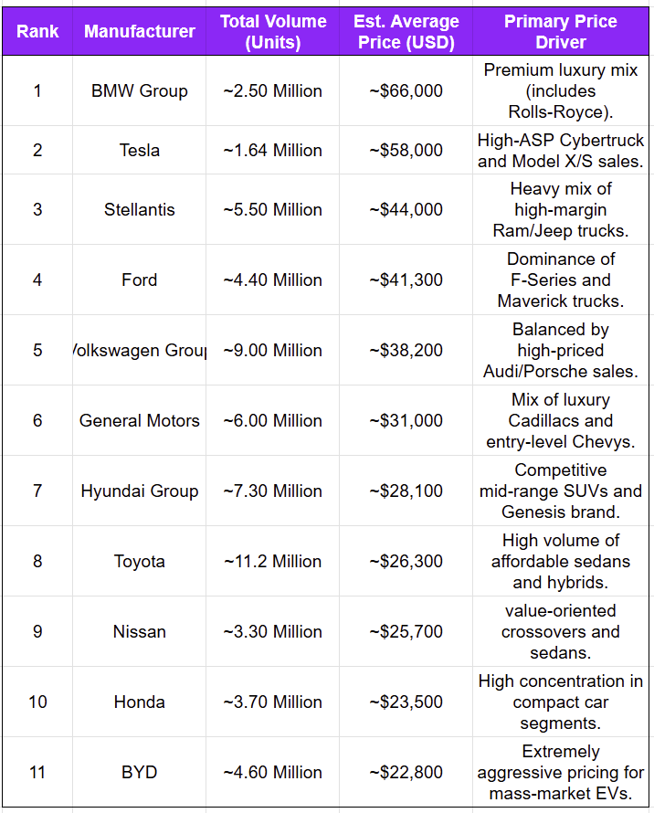
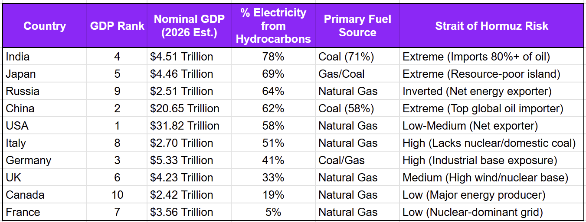
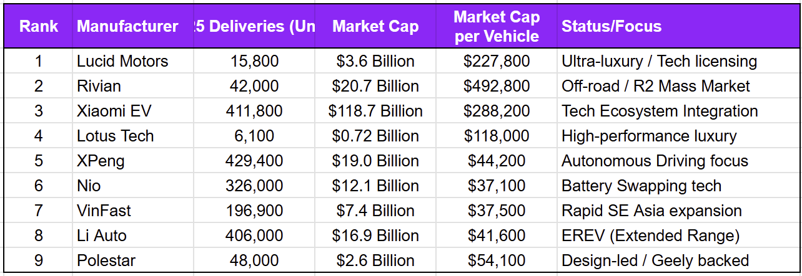
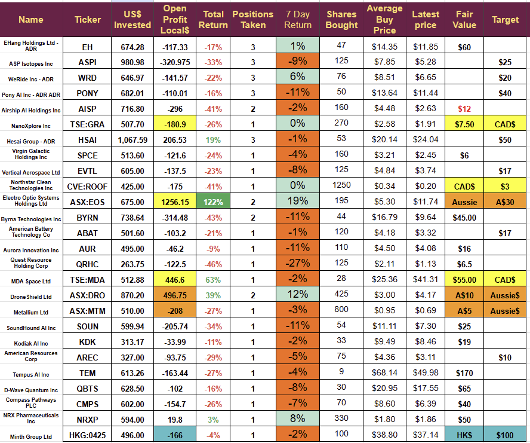

# SW Weekly: Hong Kong and EV Opportunities

*Hong Kong Stocks are in a bear market, are the big Chinese EV makers on sale as a result*

I read a nice piece from  on SubStack, in a 4-part article, he looked at the considerable bear market that appears to have engulfed the Hong Kong stock exchange. I am not a paid subscriber, so I could only read the first part of the four. The thrust of the article was that stocks have increased earnings even as a bear market has engulfed the exchange. This week, I have a look at automakers to see if there is a bargain to be had.

## The Portfolio

Another volatile week that ended with little impact, the portfolio outperformed the S&P, but that is of little value when we lost $196.

[

- ](https://substackcdn.com/image/fetch/$s_!mhBo!,f_auto,q_auto:good,fl_progressive:steep/https%3A%2F%2Fsubstack-post-media.s3.amazonaws.com%2Fpublic%2Fimages%2F79989853-bb1f-4452-996c-56957a57ae3e_1103x595.png)
Current trading conditions are difficult; I am moving very conservatively, and trades at the moment are more of a rotation within a sector, moving my dollars from one company to another in the same area. I am trying to ensure that my money is invested in companies that offer the greatest chance of a sharp correction higher if conditions improve, but also names that have a slightly lower risk profile.

This week, I sold Aptiv PLC. Many brokers are raising price targets to $100 per share, but the growth profile seems to have softened a little. The increase in targets reflects hopes for a re-rating and higher multiples following a spin-off, rather than growth in the underlying business.

Small profits, but I have invested the money in a direct competitor with much higher growth potential.

I also increased my holding in a Chinese company listed as an ADR in the US following the earnings report.  Both of these new investments are slightly underwater.

## The Hong Kong Bear market

One of the key takeaways from the article by the famed short seller was that earnings have been rising for these companies as the share price has been falling or at least not growing as one would expect.

I am fairly big into EVs and autonomous driving, so the company that caught my eye was BYD. They are probably the lowest-cost car manufacturer in the world, and stopped producing full ICE cars in 2022, now offering only full EVs and PHEVs.

If BYD shares are selling at a considerable discount to what might be expected, they would be of interest to me, despite their market cap being well above the level generally required for my SW Trading portfolio, on which this newsletter is based.

I produced a table of the top 11 car manufacturers. I chose 11 because I wanted to make sure Tesla was in the table, and, as the 11th-largest company by sales, it made sense to look at the top 11 for the different measures I came up with.

The first table looks at the market cap per vehicle sold.

* all BYD sales are PHEV.

The market assigns a market cap of nearly a million dollars per car sold to Tesla, which is ridiculous and shows that Tesla is not viewed as an Auto company. Its value is dictated by future sales of robots, energy storage, AI, and perhaps Robotaxis. It also highlights they will need almost perfect execution for these other businesses, a point emphasised by their market cap of more than $1.5 trillion, almost double the combined value of the other ten companies on the list. I don’t own Tesla, and at these valuations, I cannot see a path to me buying anytime soon.

On the table above, Stellantis looks the best value, and BYD is quite highly valued., Next I tried to home in on what the companies are selling by estimating the average price of each vehicle they sell.

Stellantis is third on this list, meaning it sells quite high-priced cars, but at the bottom of the previous list, meaning the market does not value each sale that much.

BYD was at the bottom of the list at less than $23k per car. If EVs begin to resume an upward sales curve, then BYD stands to sell more than anyone, and with the market awarding them a fairly high market cap per car sold, they could re-rate quite a bit higher. Perhaps they will be one of the big winners of the current oil price spike, and if the oil problem leads to shortages, they may benefit from their decision to move into EV manufacturing at exactly the same time European and US manufacturers cut back on EV production. BYD ended production of ICE-only cars in 2022.

The possibility that EV manufacturers could benefit from an extended conflict in the Middle East if electricity prices can remain low when Gasoline, Diesel, and Petrol go up in price.

If electricity generation is dependent on oil and natural gas from the Middle East then the incentive to move to EVs will not exist, but if a country is not importing oil and gas from that area or using it for the production of electricity, they may well see a jump in the demand for EVs

The European countries dominate the bottom of the list with France best placed, USA is a big exporter so its oil companies and oil executives stand to make large profits however I feel it almost impossible that they will sell oil to US companies and citizens at a discount to the world benchmark prices so the economy as a whole and the American people are likely to pay more at the pumps despite having a domestic supply. The opposite is probably true in Russia, and if not for the war in Ukraine, the Russian economy might have done very well.

Notable that, despite being the world’s largest importer of hydrocarbons, China produces most of its electricity from coal, which it has domestic supplies of. India is in a similar position.

The conclusion is that Europe, Canada, and perhaps China/India should be able to keep its electricity prices relatively low, allowing for a potential speed up in the adoption of EVs, whereas the rest of the world probably can not.

As a final point, I had a look at the smaller EV companies to see if any stood out as a prospect

Interestingly, the chart shows that the Asian car makers XPeng, Nio, VinFast, and Li are now valued on a per-car market cap basis, similar to the major car makers in the first list.

My conclusion is that this sector is not for me. Previously, I had invested heavily in Li Auto and XPeng and made good money, but they are no longer really emerging technology companies. A similar story has played out with electric scooters; they were a great profit sector for me, but the technology is now mature, and they should be valued using more traditional metrics than my Strategic Waves technique.

## Next week

There is no end in sight to the geopolitical problems that make investing and trading very difficult, I will continue to tread carefully and intend to make another rotation trade as I  move from one holding to another that offers greater potential within the same sector. Next week, I will sell one of my space stocks and buy another that appears to have more immediate growth catalysts.

**Disclaimer:** I am not a financial advisor and do not provide investment advice. **This newsletter details my personal high-risk trading in small-cap emerging stocks**. Past performance doesn’t guarantee future returns. Make independent investment decisions based on your own research and risk tolerance; you are solely responsible for outcomes.

## 

(Paid below this line)

## The Portfolio

(*Highlights denote different currencies: blue HK$, brown AUSSIE$*,* and Yellow CAD$. All other figures in US $*.)

The actual portfolio has hardly changed despite a bump higher in the middle of the week; it is riding at the mercy of geopolitics at the moment. As long as losses remain small, I will continue to hold companies and conduct small-rotation trades to ensure money is in companies with the highest potential for a substantial re-rating as soon as things calm down. If we start to see a full-blown crisis, I will move some companies to cash, especially those with large holdings.

## Earnings Reports & Financial Performance

### EHang Holdings (EH)

EHang reported its fourth-quarter and full-year 2025 financial results on **March 12, 2026**, marking a “pivotal year” for the company. The report highlighted a transition from an aircraft manufacturer to an integrated AAM solution provider.

**Key Progress:** The company achieved its **first-ever quarterly GAAP profitability** in Q4 2025, ending a seven-year streak of quarterly losses. Quarterly revenue reached **RMB 243.80 million**, a 48.40% year-over-year increase, driven by record deliveries of 100 eVTOL units. For the full year, EHang delivered 221 units and achieved record revenues of **RMB 509.50 million**.

- 
**Guidance:** For fiscal year 2026, EHang expects total revenues of approximately **RMB 600 million**, representing an 18% year-over-year increase. Management aims for full-year GAAP profitability in 2026, contingent on regulatory approvals.

- 
**Sentiment & Broker Guidance:** Post-earnings sentiment was generally positive as shares rose 5.30% in premarket activity following the revenue and EPS beat. However, some caution remains regarding regulatory hurdles and the fact that 2026 revenue guidance of RMB 600 million sits below some analyst expectations of RMB 887.70 million.

- 
In business development, EHang signed a strategic partnership with **Türk Telekom** and **Argela** on March 9 to deploy air mobility solutions in Türkiye, integrating 5G networks with aircraft systems. On March 12, the company also announced the official launch of EH216-S commercial sightseeing operations in Guangzhou and Hefei, China.

### Pony AI (PONY)

Pony AI announced that it achieved unit economics (UE) breakeven for its **Gen-7 Robotaxi** services in Shenzhen. This follows a similar milestone reached in Guangzhou last year, which the company views as proof of a scalable commercialization model. The company also reported record paid orders in Shenzhen during the recent Chinese New Year holiday period.

### WeRide (WRD)

WeRide expanded its strategic cooperation with **Geely Farizon** on March 9, 2026, with plans to deliver 2,000 upgraded, mass-produced Robotaxi GXRs by 2026. On March 13, the company held an Extraordinary General Meeting where shareholders approved a general mandate for share repurchases and adopted the 2026 Share Plan.

## Electro Optic (EOS)

Released details of two contracts for a total of nearly $50 million, causing a price jump, and continued to suggest they are getting closer to signing additional HELW contracts. A single HELW sells for more than $100 million and any orders could see a substantial jump in the share price.

## NorthStar Clean Technologies (ROOF)

An operational update was released indicating that technical problems had arisen at the first site, preventing it from operating at nameplate capacity. Hopefully, they will be resolved soon. 

## Quantum Resource Holdings (QRHC)

A lackluster operating report with volumes soft across all verticals. They continue to grow the customer base and extend operations through the land-and-expand strategy. Cost savings helped the situation a little, but they will need to see an economic pickup to deliver what I expect.

## MDA Space (MDA)

MDA launched on the US stock market with a 7% dilution; the stock has held up well and could benefit from this increased exposure.

---

*Source: [Strategic Wave Trading](https://stephentobin.substack.com/p/sw-weekly-hong-kong-and-ev-opportunities)*
