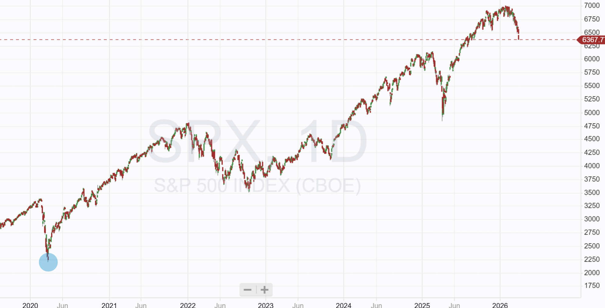
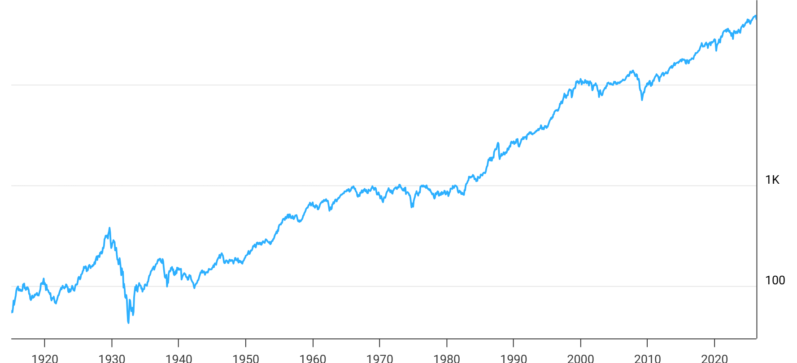
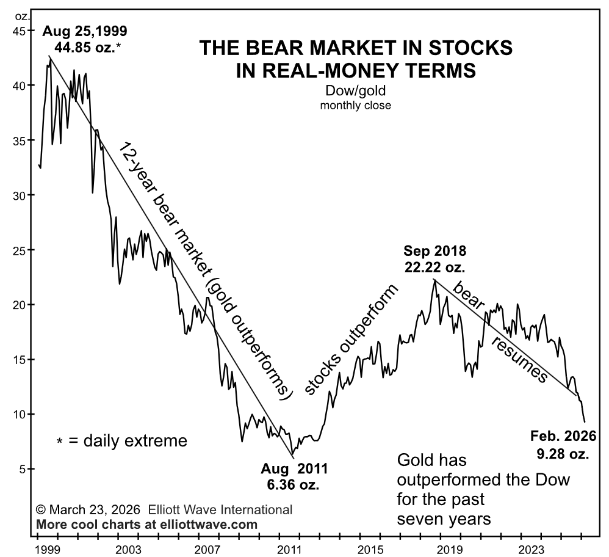

# SWT Sentiment: Issue 1 April 2026

*A monthy review of market sentiment and those driving opinion*

This is the first issue of a monthly report covering market sentiment to help guide investment decisions. It is more of an introduction to my thought process; future issues will be more technical and precise, but we have to start somewhere.

Sentiment is important because it reflects how market participants feel, and, to some extent, price moves will reflect that sentiment. I follow a wide range of market commentators and subscribe to several well-established long-term newsletters from market thinkers.

Contrarian trading - I do consider myself a contrarian trader. I often look to buy pullbacks and sell tops, making the base assumption that when sentiment reaches an extreme, markets will generally move in the opposite direction.

Perma Bull- I am also a Permanent Bull, believing the next leg higher is always close at hand.

I don’t use technical analysis to measure sentiment; it is one extra layer of assumptions I don’t think is warranted.

[Subscribe now](https://stephentobin.substack.com/subscribe?)

## Current Position

There is no doubt that the indices have moved lower. The S&P 500 hit an all-time high in January and has since fallen 9%; it does not meet the arbitrary 10% figure chosen to represent a pullback, but that is immaterial; the index is falling.

Strong parallels can be seen with previous Q1 falls. In 2022, Q1 started a 9-month bear market with the index dropping 27%, Q1 2020 saw a two-month drop of 35%, and Q1 2025 saw another 2-month drop of 21%.

A key question regarding the current down move: Is this a two-month pullback or a nine-month reset?

The average of the three Q1 drops discussed is 28%, suggesting a bearish target of 5,000 for the current move.

The Strategic Waves portfolio traded through the 2025 pullback and the smaller July to October 2023 pullback of 11% without any lasting or significant impact.

I might be described as a “Perma-Bull”, believing the market by design is always on the path to the next all-time high and never on the path to an all-time low. Looking at the DJIA chart over the last 100 years bears out the concept of a never-ending bull market.

The all-time low of the DJIA was 28.48, measured in August 1896, three months after inception, and it has been on an upward slope ever since. Not even the great depression of the early 1930s led to a new low.

You can see WWII in the 1940s had minimal impact, the oil crisis of the 1970s caused a long flatline, and the sharp drop in the 2008 credit crunch looks like a minor blip on this trend.

## Sentiment Plan

I use sentiment to inform my trading strategy. When the market turns lower, I want to conserve capital and spend it near the upcoming lows. I tend to exit more positions and buy less to achieve this as we head down. I want to avoid any huge collapses (stocks can drop 80 or 90% in these periods) and then buy heavily when I think bearish sentiment has been exhausted and the markets are going to return to their inbuilt natural upward trend.

I arrive at my view of market sentiment by looking at the different players and then assessing the thesis they present to come up with my own opinion.

## Analysing the Players

### The Perma Bears

I am a long-term subscriber to Robert Prechter’s Elliot Wave Theorist. It is their view that the markets have reached a substantial turning point and that a bear market has started that will drag the DJIA from its current level of 45,000 to below 1,000 with a more immediate target of 26,000.

They circumvent the uptrend's permanence by valuing the DJIA in ounces of gold or silver rather than in dollars. They think of gold as real money and the chart of produced paints a very different picture.

It seems a case of finding some facts to fit an opinion rather than basing an opinion on facts.

As for the fall in the DJIQ to less than 1,000, they have been predicting this for the 20 years I have been subscribing, and with each failed drop, they change their view to encompass a new final push higher. (why do I still subscribe? Because the socio-economic research they provide is outstanding and recognising myself as a perma bull, I always need the other side of the story. I have made excellent money following their advice on precious metals, which, interestingly, they now say has reached a top and gold is due for a drop to under $3,000, but of course, there could be one more leg higher first. A throw over top they call it)

A second well-established newsletter (with 50 years of history- I first read it in the 1980s) from Bert Dohmen, “The Wellington Letter,” has taken up a very bearish stance this year. In mid-March, they warned that the markets were at risk of a crash, noting that the major indices were showing “bear market patterns”. They note that the NYFANG, an equal-weighted index of the 10 largest tech stocks, has dropped 22%, making it the first index to reach the 20% bear-market threshold.

The Wellington is not a perma-bear, more of a “bear-leaning” publication, and it has been correct on many turning points in the past, often turning bullish at the right times.

Bert suggests there is a possibility of a short-term bounce off a resistance line next week, but cautions that a long-term top may be in, and suggests 6,100 as a very short-term target, with a very deep correction in tech stocks for the remainder of the year.

Unlike Prechter, Bert believes Gold and Silver are the only safe havens and thinks that after a short pullback (to cover people’s exit from leveraged bets and upcoming margin calls) they will renew their upward march.

## Bear Politics

The geopolitical situation and its ramifications are closely linked to the bear case.

The bears are notably anti-Trump; they do not believe he is competent and regard most of his tweets and statements as largely false. They do tend to think that Israel ordered the war of choice and that Trump is unlikely to “disobey” and stop the war. They see a worst-case scenario where the US invades Iran, embroiling itself in a multi-year ground war that it can not possibly win with an adversary that will not give up, generating a major oil crisis.

## Oil Crisis

All bears have a positive outlook for oil, generally predicting $200 a barrel, and draw a direct negative correlation with stocks.

They also point to the private credit markets, believing they could trigger a full-blown credit crisis, prompting the Fed to restart the printing presses and flood the market with trillions of new dollars. The collapse in Blue Owl's share price (down from $26 to $9) is cited, along with multiple firms reducing withdrawals. Blue Owls' all-time low was in 2022 when it hit $8 during the last peak of negativity.

## The Bulls

I do not follow as many perma bulls as I do perma bears. At the moment, the bears are feeling very smug, having told people to exit shares, buy gold, or hold cash. They are basking in three weeks of success. The perma bulls accept this short-term move but bask in 100 years of consistent profits.

Bulls note the pullback is only 9% from the pre-war high and highlight the multiple falls of this size that never made a lasting impression. After all, who can remember the great crash of May 2019 or the April 2018 bear market?

Bulls take comfort from knowing that US stocks tend to be insured against geopolitical events, the WSJ notes that the average drop over the last 30 major geopolitical problems was 4%, and that includes the wars in Vietnam and Afghanistan.

Bulls skate over the fact that three of the four great bear markets in the past, the oil crisis of 1973-4, the dotcom crash, and the 2007-9 financial crisis have strong parallels with today.

The Strait of Hormuz is causing an oil crisis, the AI sector may be the next dotcom collapse and the private credit market could be the start of the next financial crisis.

Bulls believe the conditions are not the same; they say oil prices will be resolved by US voters, who will not tolerate gas prices as high as they are in the longer term, and they get their say later this year in the midterms. It could mean President Trump invades to secure the Strait or withdraws with a deal, either way, he has shown he cares about the oil price, which has a bigger impact on voters than wars do. The bulls believe that US-Iran negotiations are underway and that a deal is possible.

Bulls generally believe the world economy is in good shape, with earnings expectations rising 4% since the start of the war, the biggest gains in oil and the losers among oil consumers, especially air and cruise lines, and chemical companies.

Notably, the technology sector is seeing an increase in expected earnings. Bulls believe both the US and global economies are strong and can likely withstand a short-term hit while still posting a positive year.

Basic figures would suggest unemployment is low, inflation is apparently not out of control, and world GDP growth forecasts remain around 3%, with the US forecast to grow 2.3% and China 4.3%. Europe and Japan have lower forecasts of 1%, but they are still positive.

The AI boom is contentious; bears see it as a ticking time bomb of debt and hype, whereas bulls see it as a support to the markets, expecting spending on data centers to keep pouring in.

The core belief of the Bulls is that the war will be over quickly, that private credit is not a systemic risk, and that the AI trade, unlike the dotcom debacle, is based on real companies and real profits.

## The Contrarians

I like the few contrarians in the market, and I think they embody the buy-low, sell-high investing philosophy.

RBC noted on March 20th that investor sentiment had fallen to -21.6%, a level that has previously led to significant 12-month gains in the S&P.

## Review

I have problems with the bear case

The private credit market, although much larger than the subprime mortgages that led to the financial crisis, does not have the same potential for contagion. In the 2008 subprime crisis the debt was held predominantly by banks and they held it with between 10x and 30x leverage. The products were opaque based on complex packages of different debts, often split into strips. These debts were liquid and frequently traded, allowing them to permeate the sector.

In the Private credit market, the debt is owned by private funds, leaving limited systemic risk, and leverage is typically x1.5. The debts are illiquid, locked up for 5 years or more and there is a direct lender-borrower relationship rather than the opaque debt packages the banks held in 2008. It is true that many problems may be hidden as lenders add interest to the loan rather than paying it off, which could lead to issues down the road. Banks have lent these private firms $1 trillion, which isn't on the balance sheet, but it will still hurt if they don’t get the money back. If the private credit market is toxic, then issuers will fail, investors will be wiped out, and banks will take a hit, but I do not see any risk of system-wide contagion, with large banks failing.

As for the AI investment trade, it is likely that some of the big winners of late will not hold those gains as technology moves on and reality changes. Nuclear stocks will not have capacity in time for the data center expansions, their big gains will probably unwind. Memory chip makers have been on an extraordinary run, but they may be hit as companies develop better data compression techniques, which require less memory (a recent Google paper in this area appears to be leading to a big drop in Sandisk and Seagate). I cannot see the hyperscalers like Google, Microsoft, Oracle, Amazon, Meta and Apple scaling back their investments or having trouble paying off the debt.

I also have problems with the bull thesis.

The Oil crisis might not be short-lived, the war could drag on, and it could become another 1973-style oil crisis. President Trump could declare victory, say he has done a deal with someone in Iran that gives both countries what they want.

But it’s hard to see how that’s going to happen. How could the Iranians trust what the White House says when, in previous negotiations, they have started bombing and targeting Iranian leaders?

At the moment, the probability of the US being dragged into a years-long ground battle is rising, Israel may keep fighting regardless of what the US does, and Iran may keep the Strait inaccessible for an extended period to hurt the West. Substantial damage has been done to oil infrastructure that may take as long as 5 years to repair. Avoiding an oil crisis may already be impossible.

## Conclusion

Sentiment is skewed to the downside, and for once, the bears have the balance of evidence in their favour.

For the next month, I will trim some more positions and keep investing to a minimum until we see a change in conditions. I am not going to move all the portfolio to cash or take out hedges or shorts at this time

I will update next month with Issue 2 of the SW Sentiment

---

*Source: [Strategic Wave Trading](https://stephentobin.substack.com/p/swt-sentiment-issue-1-april-2026)*
