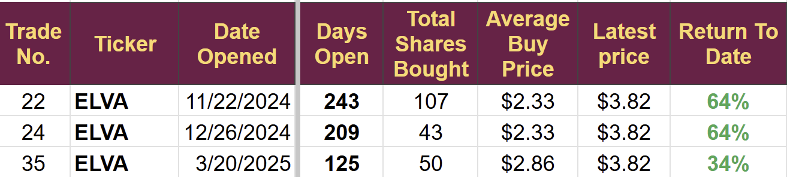
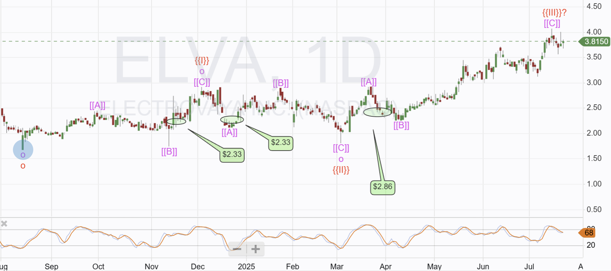
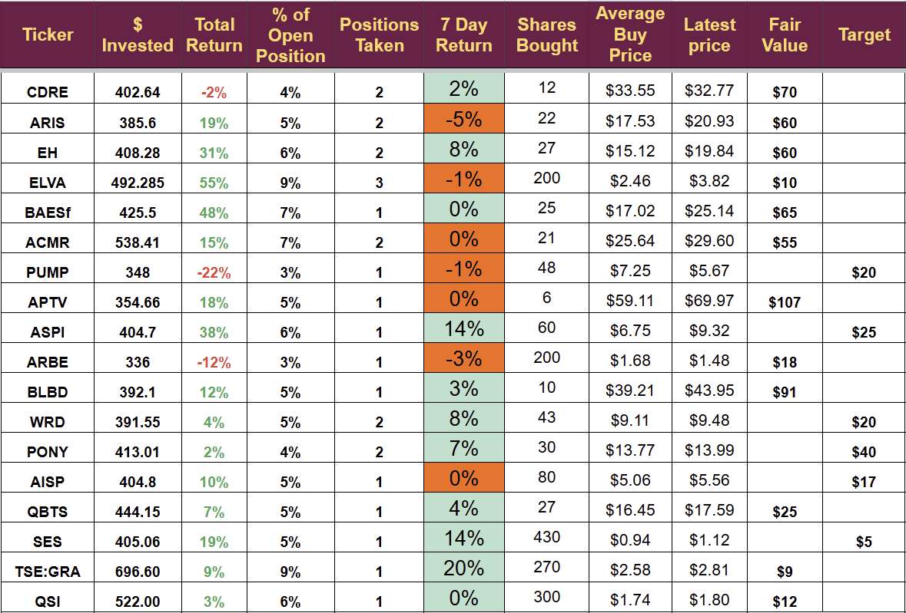

# Trade Alert (#60): Adding to the Battery Holdings

*Small add on*

Having booked large profits this month, I am taking the opportunity to increase the size of specific holdings. I increased two yesterday and will add to one more today.

This newsletter is a diary of my trading activity and record of my results. I attempt to explain my reasoning when I make a trade but it is not a “signal service”. I do not guarantee a set number of trade alerts and cannot make any guarnatee about future results.

Disclaimer: I'm not a financial advisor and don't offer investment advice. This newsletter covers my high-risk trading in small-cap emerging stocks; **past performance doesn't guarantee future returns**. Make independent investment decisions based on your own research and risk tolerance; you are solely responsible for outcomes.

(paid below)

## Trade Alert: Adding to Electrovaya (ELVA)

**I will add to my holdings of Electrovaya today, increasing the position size by $100**.

I have already bought the stock three times.

The US trading account has $5,293 in cash and $8,528 in stocks, for a total equity of $13,821. So far, I have invested $492 in ELVA and the total position is now my largest at $764. Hence the modest increase in position size.

Notes: We have had a few new subscribers of late, and they have requested some changes to how I report. The title for this post includes (#60), which refers to the trade number that appears in my reporting. I will review old trade alerts and add the trade numbers to help people search more easily. Unfortunately, I cannot use the ticker or company name in the title, as it is viewable to both free and paid subscribers.

Electrovaya is listed on multiple exchanges. I am buying it on the US Nasdaq with ticker ELVA. It is also listed in Canada, ticker (TSX: ELVA), and in Germany, ticker (DB:4EV0). If I ever buy a stock outside the US, I will include the exchange code in the ticker.

## Quick recap

ELVA manufactures lithium batteries, which have a significant competitive advantage, allowing them to charge a premium price in heavy-duty use cases. Electrovaya owns the IP for a ceramic separator, which extends the life cycle of their batteries to 14,000 cycles. In comparison, AMPX and SES batteries last up to 1,000 cycles. Tesla has a maximum of 1,500. It means an ELVA battery will last ten times longer than the competition.

The advantage is only relevant in heavy-duty applications. For instance, it would allow a car to run for 5 million miles, but no car will ever go that far, so car makers will not pay the premium ELVA charge.

ELVA has become the premium battery supplier in materials handling (fork lift trucks). They have several large customers converting distribution centers to ELVA batteries as they upgrade. The largest (a Fortune 100 e-commerce company) has placed $20 million of orders so far in 2025 and is expected to increase the base of buying over the next few years.

ELVA is attempting to expand into other vertical markets and is experiencing some success. Two Japanese OEMs that make earth-moving equipment have signed SOP deals and are selling electric earth movers using ELVA batteries.

ELVA has performed particularly well with Japanese companies. Toyota is its largest OEM customer for material handling. It was Toyota that initially published the white paper in 2022, highlighting the advantages of ELVA batteries, which motivated me to write my first article on the company.

In the last month, Electrovaya has announced **success in two new verticals**.

July 8th: An agreement with Janus to supply batteries to this Australian company for use in **class 8 trucks**. Janus has a battery swapping system for its heavy-duty trucks, which carry some of the largest loads over the longest distances in the world. It is the heavy-duty nature and long mileage that make this market suitable for ELVA batteries, along with its premium price.

Janus is a small company (market cap: US$10 million), so the **potential here is somewhat limited** and insufficient to justify an add-on trade.

**July 22nd: Yesterday we had much bigger news**. Electrovaya has signed contracts with three OEMs to supply batteries for robotic vehicle platforms. You will know how keen I am to get exposure to robots.

The three customers are described as Major OEMs. I have interviewed Jason, the PR guy at Electrovaya, multiple times, and if he says they are major, then we can take it as a guarantee. His mantra is “under promise, overperform,” and the CEO Raj is of a similar mindset.

Raj took over from his father and has focused the company on its life cycle competitive advantage. Under Das Gupta seniors leadership, the company had a more scattergun approach, trying to make everything that worked on batteries. Now, they manufacture lithium batteries using their patented separator and search for industries where it makes a real difference, allowing them to charge a significant premium.

The batteries for the three OEMs are expected to start shipping this quarter. One of them is in Japan, and the other two are in the US. A volume ramp-up is expected in 2026.

It is a perfect fit for Electrovaya, as the robots will operate 24/7, and the rapid wireless charging Electrovaya Infinity battery will last for 12 years. The equivalent AMPX or SES would last less than a year, and a Tesla battery would last 1 year and 4 months. That is the difference the life cycle provides, and it significantly reduces the total cost of ownership when devices are in constant use.

US customers will be supplied from the newly commissioned manufacturing site in Jamestown, New York, which began manufacturing batteries in May and announced this month that the 54Ah cell that will be mass-produced in Jamestown starting in 2026 received its UL2580 certification, along with 47 other models across 24V, 36V, and 48V systems.

The three existing ELVA trades are

The technical position is not ideal. **A pullback is quite likely** as the stock is near its 52-week high; however, the run-up has been muted compared to the other battery stocks, which have moved almost exponentially in recent weeks. I have decided to buy now and accept the drawdown risk as it may be the last chance to get in before earnings are expected mid-August. Please consider the possibility of a pullback when determining your position size if you decide to invest.

### List of Holdings

There has been quite a lot of trading this week with an investment in Quantum Si (QSI) and add-ons to Pony AI (PONY) and WeRide (WRD).

Note: TSE: GRA figures are in Canadian dollars. All other stocks are traded in the US and figures are in US$.

ARIS, PUMP, BAESf, APTV are all under review with exit possible.

I do not expect any further trading this week.

## Key Point

I will increase my position size in ELVA on the US trading account (with Interactive Brokers) targetting an additional investment of $100.

I will attempt to buy ELVA on the UK leveraged account (with IG Martkets) using £35 of margin.

I will report prices and number of shares bought in the comments section.

---

*Source: [Strategic Wave Trading](https://stephentobin.substack.com/p/trade-alert-60-adding-to-the-battery)*
