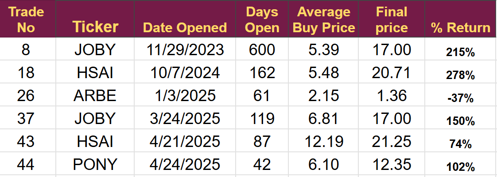
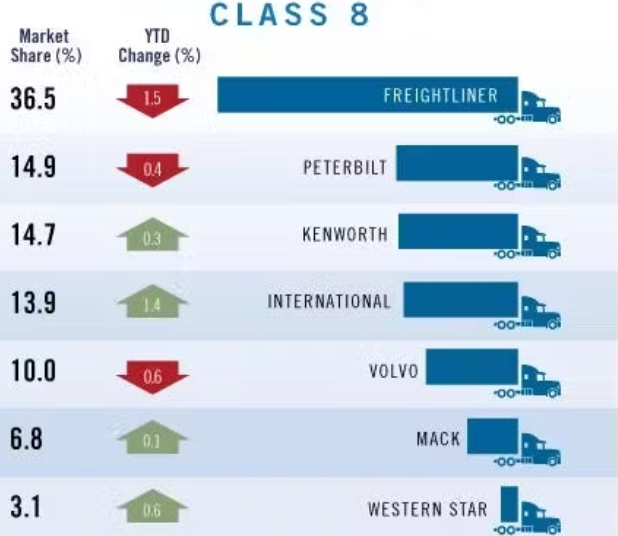
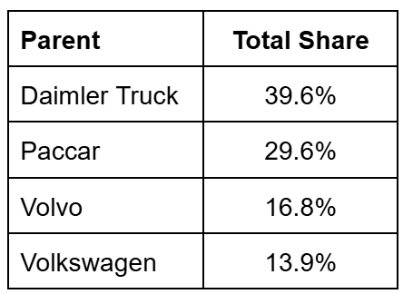
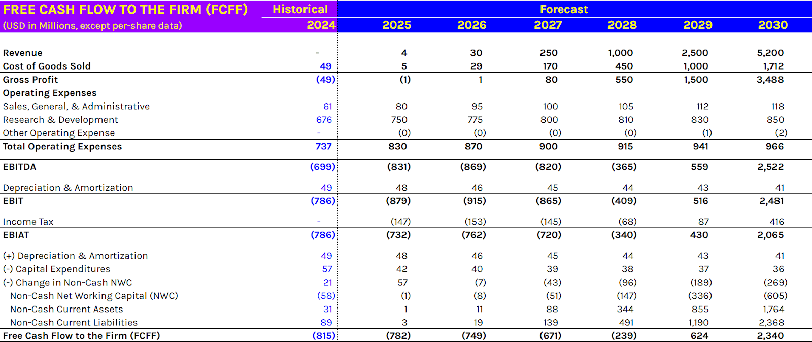

# Trade Alert (#66): Autonomous Vehicles

*Becoming a super bull on this tech*

Introduction

I am incredibly optimistic about the future of autonomous vehicles and plan to invest heavily in this sector. I believe this technology offers a long-term, transformative solution for transportation, promising cheaper, safer, and cleaner options across all modes: automobiles, vans, buses, trucks, aircraft, and trains.

My investment strategy will focus on companies in each of these areas. I will prioritize those with demonstrated technological superiority, a viable path to market, and a clear route to profitability supported by validated commercial traction.

Today, I am adding a new company to the portfolio that possesses a distinct technological advantage and proven operational capability.

We already own two RoboTaxi companies based in China, a LiDAR company based in China, and a Radar company based in Israel.

Today, we are adding a US company both in terms of base and operations. A world leader in autonomous vehicles just beginning commercial operations with a potential upside of several hundred percent.

So far, we have been very successful in this sector, with the following trades closed.

[Subscribe now](https://stephentobin.substack.com/subscribe?)

Disclaimer: I'm not a financial advisor and don't offer investment advice. This newsletter covers **my high-risk trading in small-cap emerging stocks**; past performance doesn't guarantee future returns. Make independent investment decisions based on your own research and risk tolerance; you are solely responsible for outcomes.

# Trade #65: Aurora Innovation (AUR)

**Key takeaway:** I will place a mid-price order on Interactive Brokers targeting a position size of $500 before the market opens today.

I have calculated a fair value price for the shares of $16 and forecast break even in 2029, the company will likely need to raise $1.5 billion in additional equity before reaching breakeven representing dilution of approximately 15%.

I will also add the stock to the UK leverage account using £35 of margin.

Both position sizes follow the current standard size, the stock account has equity of $14,409, including cash of $4,929.

## Overview

Aurora reported Q2 earnings on July 31st, so we do not have to worry about any near-term surprises. The report showed ongoing improvements, marked the start of commercial operations, and laid out the plan to fully scale operations over the next three years.

I previously covered Aurora on Seeking Alpha; the article was titled “It's a challenge to see the money.” Now, I can see it as clear as day.

Aurora Innovation is a self-driving Truck company based in the US, targeting operations entirely within the US. At $11 billion, its market capitalization is above the maximum I would normally accept, but it represents a compelling investment due to its market-leading technology, clear demand for its services, and very limited competition.

The business model is clear and easily understood, the technology is proven and demand for its services outstrips supply. The regulatory framework is very accommodating, and the technical problems are far less than those faced by autonomous cars.

Aurora has developed strong relationships with truck OEMs representing the majority of truck sales in the US.

It has high-profile initial customers and is the first to operate commercial self-driving trucks on US highways and the first to operate fully autonomously anywhere in the world.

## The Market

In the short term, the autonomous truck market is likely to grow faster and generate greater profits than autonomous cars. There is an established network of truck fleet operators, service providers, and owners that can easily adapt to autonomous trucks that are providing pull-through demand.

**Note,** we are not talking about electric trucks; these are gas/diesel-powered trucks operating on the relatively standardized long highways of the US with their established re-fueling networks, service centers, and depots. The infrastructure is already in place, and in many cases, the length of highways is longer than the time a human can drive.

## Pull through Demand

The US has a significant and growing driver shortage, it suffers from human driver hours limitations, has high fuel costs, and debilitating insurance premiums caused by the frequency of major collisions.

In the US, the RoboTaxi market will likely be limited to 20 billion miles a year. That is the current size of the ride-sharing market (or the current taxi market). If the cost per mile drops significantly, below $1 per mile, it could drive larger adoption of the technology, moving into personal vehicle ownership, a 4 trillion-mile-per-year market. It will take a long time for that to happen and require substantial changes to people’s behaviour.

In the Trucking industry things are different, the market is much bigger ten times as big as the ride share market at 200 billion miles and the necessary ecosystem is already in place for travel along US highways.

Today a human driven class 8 truck has an average cost of $2.30 a mile and Auroras customers today are paying $1.84 a mile. Additional savings include worker training, turnover, holiday, and sick time. I forecast that Aurora will charge $1 a mile when they are no longer operating the truck, probably from 2027, and that is an enormous saving for truck operators.

Insurance savings are likely to be even more dramatic. The Aurora Driver never gets fatigued, never loses concentration, and has a 360-degree view of the vehicle. It is also recording that view for future claims and settlements.

## The Business Model

It’s essential to understand the changes coming in the business model.

During 2025 and 2026, we are talking about double-figure numbers of trucks. Aurora will own and operate all of its trucks, charging customers on a per-mile basis to transport goods between its existing hubs. In terms of technology, it means Fabrinet-manufactured equipment will be fitted to trucks owned by Aurora.

With the arrival of the Continental-manufactured Driver in 2027, we are talking about tens of thousands of trucks, and they will be owned by their operators, who will pay Aurora a per-mile fee for use of the Driver. (Known as Hardware as a Service)

The key product is Aurora Driver, a full-stack self-driving package that includes sensors and software that can replace the human driver in a truck.

Aurora will sell the hardware as a service model in partnership with Continental, giving them a clear pathway to deploy the Aurora Driver at scale. This agreement is already in place, and Continental is in the process of scaling production for a commercial launch in 2027.

Until that date, Fabrinet is building smaller volumes of the Aurora Driver for use in trucks operated by Aurora. Three are on the road, twenty are due for delivery this year, and more are forecast for 2026. Fabrinet has delivered the B samples for version 2 of the kit, and it has been fitted into a vehicle; and on-road testing will begin this year. Version 2 is the first step towards meaningfully lower BOM costs and due to arrive early 2026.

Continental will be building version 3 and is planning production in the tens of thousands of units. Continental has begun delivering A samples for testing, and the prototype is expected before the end of 2025.

To drive this scaled take up Aurora/Continental will likely need to get the cost per truck below $50K but we have seen the Chinese RoboTaxi companies reduce their full stack by 70% as they move to scaled production so the target seems quite accessible.

The partnership with Continental was announced in 2023 and aimed at developing and manufacturing the complete hardware and software kit. At the recent Continental earnings report, management guided that this hardware as a service collaboration with Aurora would be worth billions of dollars a year, and as a global integrator, would be the route for Aurora to expand its market.

Customers will not buy the kit upfront but pay on a cost per mile basis. Aurora and Continental will share this fee on a rolling scale, dependent on miles driven. Customers will buy their truck from their usual truck OEM.

### The life cycle is essential.

Continental manufactures the hardware and ships to an OEM

The OEM installs the hardware into the truck

OEM ships the complete truck to the fleet operator

The operator pays Aurora to utilize the Aurora Driver.

In effect, we have two sets of customers, the OEM and the Operator. It means Aurora has to compete on two levels, firstly to sell to the OEM and secondly to sell the truck to the operator.

## Competitors

OEM Manufacturers

The US market for Class 8 trucks is concentrated. The figures below are from 2023 taken from FleetOwner magazine.

These seven brands represent 99% of the market.

The market-leading Freightliner is a subsidiary of Daimler Trucks and its Cascadia model is the most popular one in the US.

Peterbilt is a subsidiary of Paccar, as is Kenworth, giving Paccar a combined market share of 29.6%.

International is a subsidiary of Volkswagen.

Volvo entered the US market when it acquired the White Motor Company in 1981. Mack is also part of Volvo Trucks since its parent was acquired by Volvo in 2001.

Western Star is part of the Daimler Truck, having previously been part of the White Motor Company, but it was not acquired by Volvo in 1981.

If we look at the parent organisation, the market becomes

Aurora has OEM agreements with **Paccar and Volvo**, it has captured 46.8% of the market.

**Volvo** has delivered its first trucks to Aurora and is expected to provide 20 more trucks in 2025.

**Paccar** has completed the build of its first prototype autonomous truck and it is currently in testing and has announced they are pulling forward their autonomous truck delivery schedule.

**Daimler,** the market leader, has some problems on its route to autonomy. I think it is a distinct possibility they will move to AUR in the not-too-distant future, which would be an enormous catalyst for the stock.

Daimler was pursuing a dual approach with both Waymo and Torc robotics.

Waymo has publicly stated it was ending its work on autonomous trucks to concentrate on its robotaxi operations.

Torc is an independent subsidiary of Daimler and hopes to have autonomous trucks on the road in 2027, two years behind Aurora.

Aurora has spent $156 million each quarter to develop its product, and I believe it will need a further $1.5 billion to complete the project.

If we assume Daimler would have to spend a similar amount of money to develop the Torc solution, then it would not fit with their capital allocation plans announced in the last quarter’s earnings call.

They had $8.6 billion of total liquidity but said they want to keep a minimum of $6 billion of that available to cope with tariff and supply chain issues globally. Daimler announced a $2 billion share buyback scheme whilst maintaining “stringent management of capex and R&D”

There does not seem to be room, and there was no mention of spending nearly $2 billion on Torc. I think the dual approach is likely the best option, and now that Waymo has withdrawn, only Aurora is left. It would save Daimler $2 billion and ensure they have dual supply as they develop Torc at a slower pace.

I do not expect Daimler to stick with Torc, or at least do not think they will remain single source, the same is likely true of the other OEMs. I find it unlikely that Aurora’s two OEMS will remain Aurora exclusive and will want a second supplier. There are longer-term suppliers like Waymo, Tesla, and the rest, but a couple of specific American autonomous truck companies are worth mentioning.

**Kodiak Robotics** (soon to launch via a SPAC deal)

In 2024, Kodiak is developing its autonomous truck for private road use and is currently delivering fracking sand autonomously in the Permian Basin; they drive at 20 mph over private sand roads. It is a good use case, but not a real competition to Aurora. Kodiak also has military contracts and has received a lot of funding from BMW.

**Waabi**

UBER freight has aligned with the privately held Waabi for its future autonomous trucking operations. Volvo has also entered into a partnership with Waabi, but targeted for operations out towards the early 2030s.

In Q2, the CEO stated it is Aurora's goal “to drive every truck that's out there”. At the moment, they have a clear first-mover advantage, and that goal may be achievable. I have built my forecasts on them, capturing 2.5% of the freight market, so you can multiply my price target by whatever percentage you think they might capture.

## The Crawl Walk Run

AUR management has been following a strategy they call Crawl, Walk, Run. They are moving in baby steps towards full commercial operations.

Every Quarter, they release progress on their various safety cases and the slow build-up of operations. It is very reminiscent of Joby and their cautious approach.

### Q2 2025 Progress

Since beginning road testing, Aurora has completed more than 3 million miles with zero incidents. Q2 represented a considerable step forward as they started commercial operations carrying freight between hubs at Dallas and Houston for paying customers.

In the recent call, management shared the following key points.

Aurora Driver logged 20,000 driverless miles in clear weather.

Nighttime driverless operations began.

The fleet is now three trucks operating continuously between Dallas and Houston ([you can watch the live feed](https://www.youtube.com/@AuroraDriver/streams), it's both boring and exciting at the same time).

The start of commercial operations is the final proof of concept; it will make the sale much easier and enable further regulatory approval and rapid expansion.

Expansion Plans

The route will be extended to include Fort Worth, El Paso, and Phoenix by the end of 2025, and the safety case for travelling in poor weather will be complete. The nighttime safety driver case was completed ahead of schedule, and the bad weather safety case is due to be completed this year.

By the end of this year we will see more than 20 trucks carrying freight between Dallas, Houston, Fort Worth, El Paso and Phoenix, it is the beginning of the ramp up making now the perfect time to invest.

The terminal in Phoenix is open and has two pilot customers, Wener and Hirschback, meaning Hirschback is using the complete network (Hirschback operates more than 3,000 trucks and 5,000 trailers). Single driver time from Fort Worth to Phoenix is halved by using Aurora.

The list of paying customers is impressive: Hirshbach, Uber Freight, Werner, FedEx, and Schneider are the marquee names, but there are many others.

Management has reported significant inbound enquiries and expects to be unable to meet demand in the coming five years.

Aurora plans to extend across the entire US highway network beginning in 2027, but it will be a measured growth as they certify their trucks on each highway.

## Regulation

American highways are fairly uniform, high-quality roads without the problems associated with operating in cities. Federal legislation is being developed to standardize the safety requirements; however, most states already have legislation in place to operate on highways.

## Finances

Aurora has a solid balance sheet with $1.3 billion in cash, $2 billion in equity, and zero debt. Rock solid but sadly not enough.

Below is the second version of my mathematical model using all of the data I currently have available, and it suggests Aurora is short of about $1.5 billion. I expect them to raise this amount by selling shares, so we should expect continuing dilution. However, the size of the company, market cap of £11 billion, means the dilution is only around 15%.

Revenue ramps up dramatically in 2027 when Continental's scaled production arrives, and they move to the hardware-as-a-service business model. The model assumes they capture 2.5% of the US highway heavy goods traffic by 2034.

Using a 10% discounting factor, this gives a fair value for the shares of $16.40 against today's price of $6.20

### Conclusion

It meets all of my criteria: an emerging technology capable of disrupting a large existing industry. Commercialization is just beginning, and a clear path to scale has been presented. Aurora enjoys a first-mover advantage, a clear technical advantage, and a solid balance sheet.

Of course, it is high risk all of my investments are. A single crash could put all of this back years and cause a collapse in share price. Regulations could move against the company, and larger competitors like Tesla and Waymo could decide to enter the market.

---

*Source: [Strategic Wave Trading](https://stephentobin.substack.com/p/trade-alert-65-autonomous-vehicles)*
