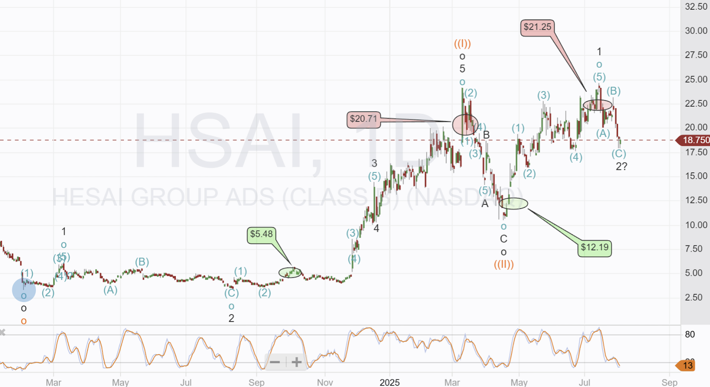

# Trade Alert (#65): LiDAR review Complete

*Three more trades identified for August*

# **Key Takeaways**

-   **Chinese dominance in volume shipments** - Hesai and RoboSense lead globally by unit volume, with Chinese companies achieving economies of scale through early adoption in domestic markets where "several million cars were sold with LiDAR" in recent years.
    
-   **Strategic industry pivot toward ADAS** - The sector has fundamentally realigned away from fully autonomous vehicles (L4-5) toward enhancing drivers with improved ADAS and conditional automation (L0-3), creating more commercially viable opportunities.
    
-   **Regulatory mandates driving adoption** - NHTSA's Federal Motor Safety Standard No. 127 mandates advanced emergency braking systems on all new cars and light trucks by 2029, creating significant market demand.
    
-   **Fragmented competitive landscape with geographic divide** - The market exhibits fragmented competition with intense bifurcation between Chinese companies (achieving earlier scale) and Western firms (pursuing advanced technology development).
    
-   **Technology differentiation through architecture** - Companies compete on distinct approaches, including Luminar's 1550nm wavelength technology and emerging FMCW systems that provide superior velocity detection capabilities.
    
-   **Manufacturing evolution toward outsourcing** - Industry players are transitioning from vertically integrated models to outsourced manufacturing partnerships to achieve cost-effectiv,e high-volume production at automotive scale.
    
-   **High barriers to entry from qualification processes** - Automotive OEMs undertake extensive testing and qualification procedures over several years before selecting LiDAR products, requiring significant time and resource investments from suppliers.
    

## **Industry Overview**

The **Light Detection and Ranging (LiDAR)** industry is a specialized sector within the broader automotive technology and sensor markets. LiDAR technology uses laser light to measure distances and create precise three-dimensional maps of surrounding environments, serving as a critical enabling technology for **advanced driver assistance systems (ADAS)** and **autonomous vehicles**

### **Industry Scope and Market Segments**

The LiDAR industry is primarily segmented into two distinct categories based on the Society of Automotive Engineers (SAE) automation levels: **ADAS applications (L0/L1/L2/L2+)** focused on enhancing rather than replacing drivers, and **autonomous driving (L3/L4/L5)** targeting full vehicle automation. The largest near-term business opportunities exist in ADAS functionality enhancement and conditional highway autonomy applications, where LiDAR technology provides increased situational awareness across diverse driving environments.

### **Primary Applications and End Markets**

The industry serves three major market segments. The **passenger vehicle market** represents the largest opportunity, with approximately **100 million new passenger and commercial vehicles** manufactured annually through the end of this decade. The **commercial trucking market** , while smaller in unit volume, typically requires **2+ LiDAR sensors per truck versus 1 per passenger vehicle** , creating substantial revenue potential per unit. Additionally, the **robo-taxi market** continues to attract significant investment from technology companies and automotive manufacturers, though widespread deployment timelines remain extended due to technical complexity.

### **Economic Significance and Market Characteristics**

The industry operates within the broader context of global automotive production, which is highly cyclical and dependent on economic conditions, consumer spending, interest rates, and regulatory requirements. **Automotive production volumes fluctuate significantly year-over-year**, directly impacting demand for LiDAR technology. The market exhibits distinct geographic characteristics, with **Chinese LiDAR companies achieving earlier economies of scale** due to faster adoption rates among Chinese automakers compared to Western markets.

## **Key Players**

The LiDAR industry features a distinctive competitive landscape characterized by geographic concentration and rapid market evolution. The sector is dominated by a mix of established Chinese companies that have achieved significant scale, alongside Western firms pursuing advanced technology development and market penetration strategies.

(Paid Only below this line)

## Trade Alert: Buying Hesai (HSAI)

Following a full review of the market, Hesai appears to be maintaining its dominant position; the other Chinese LiDAR manufacturers seem to be focused on non-automotive verticals, and Chinese vehicle OEMs are extending the number of models being delivered with ADAS powered by LiDAR.

I have decided to take Innoviz through to the next stage and complete a deep dive.

**I will place a MidPrice** order to buy Hesai, targeting a $500 position (3.5% of equity) before the markets open today.

### **Market Leaders and Dominant Companies**

**Chinese market leaders** have established commanding positions in global LiDAR shipments. **Hesai** and **RoboSense** represent the two largest players by unit volume, with Hesai holding the number one position globally. These companies have capitalized on early adoption of LiDAR technology in the Chinese automotive market, where **several million cars were sold with LiDAR** in recent years, enabling them to achieve economies of scale that Western competitors have yet to match. RoboSense and Hesai have captured approximately **80% of Velodyne's former market share** in the mechanical scanning LiDAR segment.

A third significant Chinese player, **Seyond** , completes the triumvirate of leading Chinese LiDAR suppliers . Seyond is positioning for further growth with plans to go public via a De-SPAC transaction on the Hong Kong Exchange in 2025, with an agreed valuation of **HKD11.7 billion (USD1.5 billion)**.

Among Western companies, **Luminar Technologies** has established itself as a prominent player in the forward-looking, long-range LiDAR segment, utilizing **1550nm laser architecture** and achieving the milestone of being the first LiDAR to be standardized on a global production vehicle with the Volvo EX90. The company achieved **start of production (SOP) in April 2024** and began delivering production sensors.

**Product consolidation** strategies are emerging, with Luminar transitioning from multiple hardware products to a unified **Luminar Halo platform** designed for mass market adoption, discontinuing development of the Iris+ product to streamline operations and reduce costs. This reflects industry-wide pressure to achieve standardization and cost efficiency as the market matures.

Luminar unexpectedly changed CEO after the founder left without notice, following an ethics and behaviour investigation. The new CEO is Paul Ricci (67 years old), who led Nuance Communications for nearly two decades (2000-2018), transforming it from a $50 million imaging software publisher into a $2 billion conversational speech and AI solutions provider. Ricci fueled growth through over $5 billion in acquisitions, pioneering speech recognition for Apple's Siri and Samsung's S-Voice.

However, his tenure faced criticism for capital allocation, consistently negative ROIC and EPS, and lagging stock performance. Executive compensation raised concerns, and some reviews suggested a "tough character" impacting employee morale. After retiring from Nuance in March 2018, Paul Ricci took on advisory and board roles with multiple firms.

**Innoviz Technologies** has carved out a unique market position as the **sole LiDAR supplier for Mobileye's L4 Drive platform** , creating a significant competitive moat. The company achieved its 2024 goals of securing **2-3 additional programs with new OEMs** and **$80 million in non-recurring engineering (NRE) bookings**.

**Ouster** , following its merger with Velodyne in 2023, now possesses the **deepest global IP position in 3D LiDAR** technology and serves **over 1,000 customers**. The combined entity represents a significant consolidation in the Western LiDAR market.

### **Geographic Distribution and Market Dynamics**

The industry exhibits a clear **geographic bifurcation** between Chinese and Western markets. Chinese companies have gained substantial market advantages through **early adoption in domestic automotive markets** and resulting economies of scale.

However, regulatory developments may significantly impact this landscape, as proposed U.S. regulations could potentially **ban Chinese LiDAR hardware and software** from the North American market.

Western companies face different market dynamics, with **slower adoption rates** but potentially higher technology requirements for advanced autonomous driving applications. The European market has seen established players like **Valeo** with its **SCALA third-generation long-range LiDAR** achieving **120-degree field of view** capabilities.

### **Emerging Technologies and Disruptors**

The **FMCW (Frequency Modulated Continuous Wave) LiDAR** segment remains nascent, with no clear market leader emerging due to limited commercial deployments.

**Robotics applications** represent an emerging growth area, with RoboSense securing partnerships with the top two robotics lawn mower manufacturers in China, including what management describes as the **"industry's largest lidar deal to date"**

### **Regulatory Transformation and Safety Mandates**

Regulatory developments are creating both opportunities and challenges for the industry. **NHTSA's Final Rule adopting Federal Motor Safety Standard No. 127** mandates advanced higher-speed, no-contact automatic emergency braking (AEB) and Pedestrian AEB systems on all new cars and light trucks by 2029. This represents a significant market driver, as current safety standards will likely require additional hardware and software to meet performance requirements.

**European NCAP requirements** continue to drive adoption through voluntary safety rating systems that require minimum levels of crash mitigation functionality for five-star ratings. The regulatory landscape is further complicated by **geopolitical tensions and export controls** , particularly regarding advanced semiconductors, autonomous vehicles, and AI technologies, which may result in additional restrictions targeting LiDAR specifically.

### **Market Demand and Consumer Behavior Shifts**

Consumer acceptance patterns vary significantly across regions, with **China leading in LiDAR adoption** for high-end vehicles, where the technology serves both functional and status symbol purposes. Chinese automakers have successfully integrated LiDAR into L2 and L3 ADAS systems, demonstrating market viability for moderately high-end to high-end vehicles.

However, **consumer acceptance and pricing desirability remain uncertain** in other markets, with automakers potentially discontinuing or decreasing usage in favor of cheaper vehicles without these technologies if government regulations and safety ratings do not adequately support ADAS technology.

The **commercial trucking segment** presents substantial opportunities, as these applications require more sensor hardware (2+ LiDARs per commercial truck versus 1 per passenger vehicle) and offer compelling business cases, including lower operating costs and increased vehicle utilization.

## Hesai Forecast

I have not altered my mathematical model yet, and so the fair value target remains at $30 (12% discounting factor); however, the technical target has moved much higher. Earnings are due around mid-month, and I will update the model at that point.

Hesai has been very profitable for us, with two trades showing high returns.

Following the recent pullback, the technical target has increased to $50. The two previous trades can be seen on this chart. (green for entry, red for exit). The chart is oversold, and all indications are that a bottom could be near; the risk is the ongoing slowdown in auto deliveries in China, with multiple companies reporting lower deliveries this month.

## Target Companies in August

I have discounted Luminar, but will move Innoviz forward to a deep review.

I expect to complete research on one space company and one more autonomous vehicle company over the next two weeks. At the moment, both seem likely to become investments, but I will be waiting for earnings before making final decisions. Both companies are pre-commercialization, and I have concerns about timelines and funding needs. However, they do have outstanding emerging technology likely to cause significant disruption if they can get to market.

---

*Source: [Strategic Wave Trading](https://stephentobin.substack.com/p/trade-alert-65-lidar-review-complete)*
