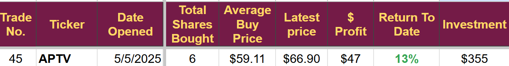
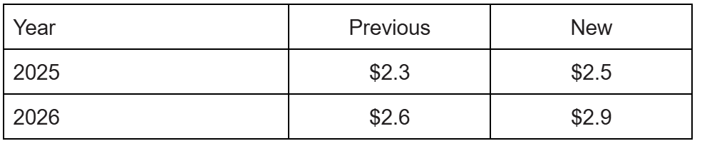
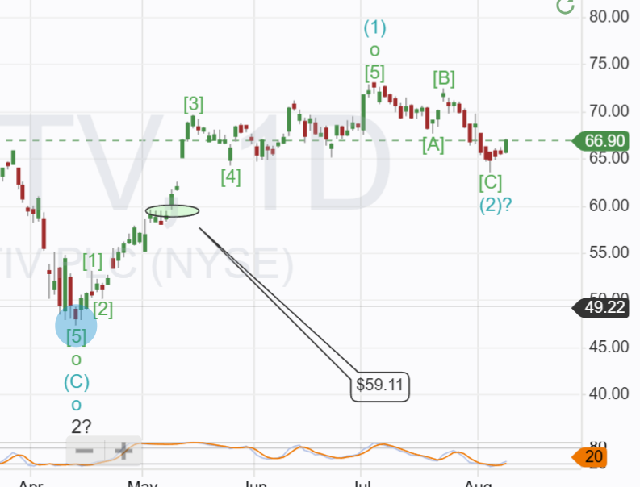

# Trade Alert (#67): Adding to Auto Tech

*First review complete*

Following this [weekend's review](https://open.substack.com/pub/stephentobin/p/weekly-update-profits-booked-trades?r=nh85d&utm_campaign=post&utm_medium=web&showWelcomeOnShare=false), where I highlighted three stocks that have pulled back after their respective earnings calls, I have completed the research on the first one and decided to add.

I think the market overreacted to the earnings call, concentrating on the negatives and ignoring the positives. The longer-term outlook for this company remains solid, and I will be buying at the market open today.

It is a key part of the plan to add to trades using profits generated, recycling the cash, and allowing compounding to take effect.

**Disclaimer:** I'm not a financial advisor and don't offer investment advice. This newsletter covers **my high-risk trading** in small-cap emerging stocks; past performance doesn't guarantee future returns. Make independent investment decisions based on your own research and risk tolerance; you are solely responsible for outcomes.

(Paid below this line)

## Trade Alert (#67): Adding to Aptiv PLC (APTV)

**Takeaway:** I will issue a mid-price order for 4 additional shares in Aptiv, targeting a total investment in APTIV of around $623, slightly less than 5% of my equity.

Following Q2 earnings, I am increasing my future earnings estimates and price target.

**Confirming my Strong-Buy recommendation.**

I believe APTV will benefit from the move towards software-defined vehicles and increasing levels of autonomy, as it has a broad product range in these areas with accepted leadership positions in advanced safety products and engineered components.

At present, I have one trade in APTV

Today's buy will take my holding to 10 shares.

**APTV reported solid 2Q** results last Thursday, beating consensus estimates while also reinstating full year guidance at a level close to my original forecast.

Record operating income and a reduced share count led to the raising of EPS guidance, in Q2 EPS was a record $2.12, up over 30%.

Revenue came in at a record $5.2 billion, $200 million above my forecast.

OEM customer production levels were higher than expected, showing lower Tariff impacts than had been expected.

Key new bookings were announced, including an award from Volkswagen that lifted total bookings over $5.4 billion.

APTV continues to outpace the growth in global OEM production in North America and Europe, but was below in China, reflecting the move in China towards local suppliers rather than foreign JVs.

Unit prices appear to be falling for all OEM suppliers as competition to supply the growing number of new models intensifies. This competition bodes well for APTV as they have proven their ability to increase margins and revenue under these conditions with excellent cost control and inventory management.

## Adjusting Forcasts

Q2 2025 EBITDA of $821 million was significantly higher than my forecast of $750 million.

Share price fell after management guided to lower Q3 EBITDA; however, this was based on industry production assumptions that are materially lower than the S&P Global Mobility figures I used to generate my forecast.

Combining their revenue and EBITDA forecasts implies management is expecting further margin improvement and better cost execution, Q2 (EBIT was 12.1% against the street consensus of 11.4% and my projections of 11.9%)

Revenue in Q2 was in line with the S&P forecasts and above industry; the higher-than-expected margin accounted for the beat in EBITDA.

It is often said that management needs to control what they can, and APTV is doing an excellent job. They cannot control global auto manufacturing demand, but they can control their own operating costs needed to meet the orders they receive, and in this respect, they did an excellent job.

The improved margin and reduced operating costs have caused a significant change to my Mathematical model. Short-term EBITDA forecasts have increased.

2025 revenue forecast remains unchanged at $21 billion (slightly above the street and management guidance of $20.5 billion), but I have increased 2026 by 2%

EBITDA forecast in US$ billions

As a result, my fair value target has increased from $107 to $128, and my end-of-year target has increased from $80 to $99.

I have increased the short-term target because of the accelerated share repurchase announcement in Q2 earnings. They retired 48.5 million shares for $3 billion, having bought them for an average of $61.84.

## Technical

Buying at this point is in line with the technical part of my trading plan. I prefer a confirmed uptrend in place (higher highs and lower lows) followed by a three-wave pullback that takes stochastics oversold.

On the chart below, you can see the confirmed uptrend to the blue (1) on the chart, followed by a three-wave pullback to blue (2)? marked as \[A\]-\[B\]-\[C\], stochastics went oversold at blue(2) and appear to be recovering.

The trade meets all my criteria, and I will place a MidMarket order on Interactive Brokers before the markets open.

I will not be adding to my margin position; the account has not generated enough profit to allow for any increase in position size.

---

*Source: [Strategic Wave Trading](https://stephentobin.substack.com/p/trade-alert-67-adding-to-auto-tech)*
