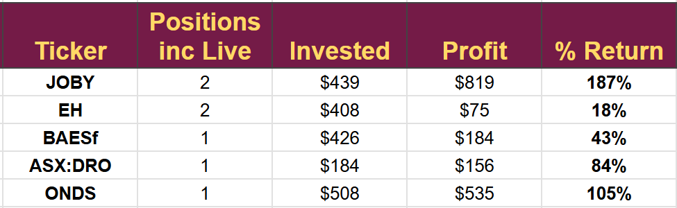
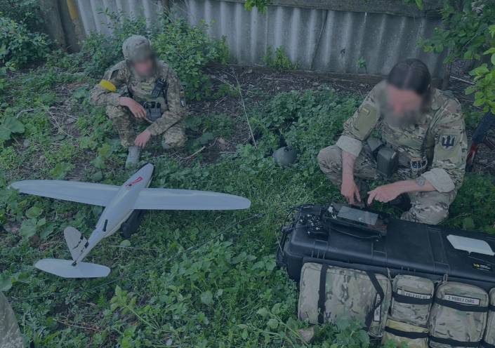
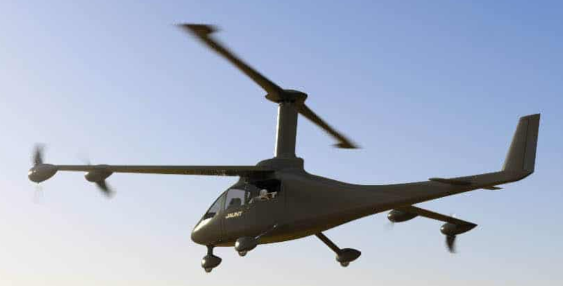
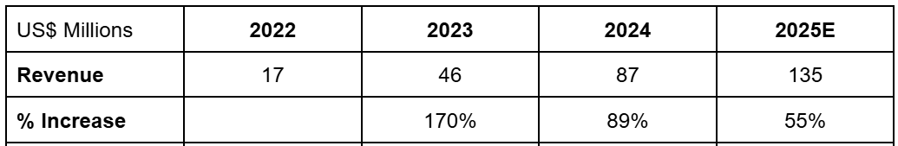
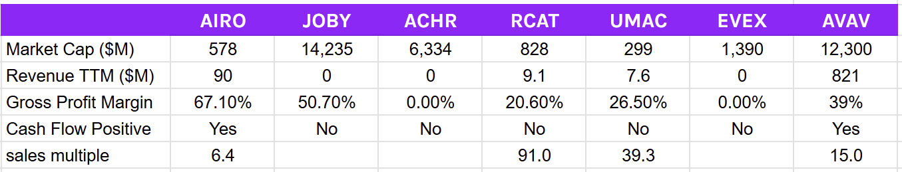

# Trade Alert #68: Buying Drone Technology

*High Risk - High Potential Return: My Kind of Company*

The drone and eVTOL sector I track has been very profitable, with a 100% hit rate and excellent returns. All trades taken in the sector in my $250-$100K account are shown below.

Today's trade is in the same area, and although I hope for the same results, it cannot be guaranteed. The new target is a Small Caps emerging company with limited trading experience; it will likely need to raise further funds in the future, but is generating free cash flow at the moment, has a significant backlog of orders, and is a recognised leader supplying NATO countries.

The company has developed a strategic competitive advantage that differentiates it from its immediate peer group and relationships with the US military that may give it a sustainable competitive advantage.

I will be buying at market open today.

**Disclaimer:** I'm not a financial advisor and don't offer investment advice. This newsletter covers **my high-risk trading in small-cap emerging stocks**; past performance doesn't guarantee future returns. Make independent investment decisions based on your own research and risk tolerance; you are solely responsible for outcomes.

(paid below this line)

### Trade Alert #68: Buying AIRO Group Holdings (AIRO)

**Please note:** all my investments are risky, but I consider this one to be of significantly higher risk than usual. The company has just been through its IPO, has almost zero track record, and has been built by combining several related companies that have never worked together before. On top of that, it is operating in a highly regulated and competitive environment. Please be warned and tread lightly.

**Key Takeaway:** I will issue a MidPrice order before markets open to buy AIRO, targeting a position size of $500. Current Portfolio $10,700 in assets $4,166 in cash. I have a one-year target price of $46, suggesting a 100% upside to the stock and a longer-term price target that is much higher.

I do not expect to be able to buy the stock on the margin account.

## Introduction

In many ways, AIRO was built for my portfolio. It was put together in H1 2022 with the acquisition of six companies that were merged into four operating divisions. The divisions are listed below, with the companies combined in that division and their acquisition date

**Drones:** AIRO Drone (Feb 2022) and Sky-Watch (March 2022)

**Avionics:** Aspen Avionics (April 2022)

**Training:** Agile Defense (Feb 2022) and Coastal Defence (April 2022)

**eVTOL:** Jaunt (March 2022).

The company intended to IPO in late 2022 and then launch through a SPAC merger in 2023. Management decided the time was not right for either and finally came to the market in June this year and completed its first earnings call last week.

The strategy behind merging drones, eVTOL, avionics, and defense aircraft training is an apparent attempt to build a vertically integrated UAM company.

On top of that, AIRO is profitable, well-funded, and with revenue growing more than 100% each year. The acquired companies bring with them proven expertise and accepted leadership in military drone technology, top secret US defense classification, a Canadian eVTOL pathway to authorisation, and an established leader in avionic cabin displays. The avionics are so good that JOBY signed an agreement to use AIRO rather than their own or the competing Honeywell offering.

### Strategic Masterclass

Competitive strategy is a key part of my investing plan. I try to identify companies that have a sustainable competitive advantage they can leverage to become a disruptive force in an industry.

The AIRO team is attempting to deliver a strategic masterclass, one for future MBA textbooks, designing a company from the ground up, capable of addressing some of the fastest-growing markets with huge potential and bringing disruptive emerging technology with it.

## Division 1: Drones

AIRO drone is based in Denmark and builds the battle-proven RQ-35 Heidrun drone. This can be carried and operated by one person.

The photo is of Ukrainian military personnel using the Heidrun, a fixed-wing rear propeller device with a long range and a mix of payloads that provide battlefield intelligence.

The device can operate in areas where GPS is compromised, a significant problem for the competition. The Heidrun is being used extensively in Ukraine, with each unit averaging more than 500 missions, an astonishing survival rate of greater than 99% in such a hostile environment.

The drones sell for $110K per unit, and the nearest competitor, the AVAV Puma, sells for $215k. The vertically integrated nature of AIRO allows it to produce the drone with a 55% margin.

The Heidrun is NATO certified and currently used by at least six nations (Germany, Netherlands, Denmark, Spain, and Norway); it could be more, but AIRO does not release such information. Likely, they will target all 32 NATO nations, showing the potential upside (see later for US-specific info).

In the company's first earnings call, they said they had $200 million of NATO bookings. With NATO countries in the throes of a significant growth in spending, much of it targeted at drones, and the US planning a massive drone spending initiative, this will likely be the tip of a huge iceberg.

AIRO said it is shipping into countries in the Indo-Pacific and expects to expand in that region to combat the rising threat from Chinese territorial ambitions.

### Expanding the Heidrun footprint

Heidrun was designed and is manufactured in Denmark. The company has acquired a facility in Phoenix, Arizona, to build the RQ-35 in the US. It aims to achieve full US certification in 2025, marking it as a made-in-America product. Necessary for the US DoD, the DoD has taken “sample” deliveries.

The anti-jamming and anti-spoofing capability of the RQ-35 makes it a must-have product; no RQ-35 has been lost in Ukraine due to compromised GPS or spoofing, despite the most hostile environment for drones the world has seen, whereas AVAV has lost 60% of its deployed drones. The other competitors in this sector (described as Group 1 UAS by the DoD) have suffered similar 60% casualties.

The Heidrun accounted for 86% of 2024 revenue.

The Heidrun drone is the flagship product with sales of $75 million in 2024 (up 167%), bookings of $200 million, and the US plus non-NATO companies yet to come online.

It is not the only product and is a spoke in the AIRO wheel; every spoke supports the company's goal, and they each rely on other spokes.

## Division 2: Avionics

Aspen Avionics is based in Albuquerque and has been operating for 20 years with a significant IP portfolio backed by patents. The facility has substantial capabilities for the design, manufacture, and certification of avionics, plus flight testing and repair. The FAA certification history of Aspen will be utilized in the group’s drone and eVTOL divisions. Aspen sells through a network of more than 600 resellers, with around 400 of them based in the US.

Aspen's USP is the upgradability of its systems, something other manufacturers have failed to deliver, giving its product a much longer operational life.

All of the key products from Aspen will be integrated into the Drone, eVTOL, and training divisions through both retrofit and new build work.

Aspen has delivered over 14k systems, and last week was selected by JOBY to provide the mission-critical NexNav receiver for integration into the JOBY flight control system.

Aspen Avionics makes flight display systems and in-flight sensors for a range of use cases, but targets the smaller aviation and business jet market.

The main competitor to Aspen is Garmin, the market leader that specializes in the same products as Aspen. Garmin has captured a significant part of the target market, including Cessna, Embraer, and Archer.

Several smaller private companies also compete in this space, notably Dynon and Avidyne.

Aspen has a 30% price advantage over Garmin and has an open system able to connect with old and new systems from any manufacturer, and comes with full upgradability. None of its immediate competitors offer these functions, but Aspen lacks an autopilot system, which is provided by all of its competitors.

Companies like Thales and Honeywell control the large jet market, and a clear risk would be them moving into smaller jets.

## Division 3: eVTOL

ALIO is not yet flying a full-scale eVTOL, which is the most significant risk to this division.

The subsidiary Jaunt, based in Canada, is developing a cargo drone using patented technology. It looks like a helicopter with wings.

Before the acquisition, the company was targeting a passenger-carrying eVTOL, but the new management pivoted to a cargo drone in 2024, taking a $38 million hit to goodwill.

The passenger-carrying vehicle had nearly 500 orders, but half of them were with the now JOBY-acquired Blade, so it was probably a wise decision to make the pivot.

Development costs for the cargo drone are projected to be $100 million through 2028. AIRO expects to provide $30 million, with the remainder coming from Canadian government grants and NRE payments from initial customers. They have guided to a 75% crossover between the cargo drone and the future passenger-carrying one, with a target date of 2031 for passengers.

Last month, AIRO unveiled its medium lift cargo drone capable of carrying 500 pounds for 200 miles.

In cargo drones, AIRO will compete with Beta technologies ALIA-250c and Pipistrel’s Nuuva V300. Beta is leading the way, its conventional takeoff ALIA is already flying but not yet certified, but expected to certify in 2026, 1 year ahead of AIRO.

The large helicopter-style rotor provides vertical lift that has a patented slow rotation, reducing drag in horizontal flight. Forward-facing rotors move the plane horizontally with a similar efficiency to a fixed-wing aircraft before the helicopter rotor takes over to land vertically.

The project relies on technology from the Heidrun drone program and Aspen Avionics.

Another strategic masterclass has given them a clear route to certification.

The design of the aircraft and the fact that it is a cargo drone mean it can be certified under existing Canadian rule 29, rather than needing new company-specific rules the way JOBY and Archer do.

The certification path is already clear, and the time to certification will be much less than that of the other eVTOL companies. 2027 looks a likely date, probably very similar to JOBY and ahead of Archer.

AIRO have established military inks and are fully NATO accredited, if they produce this cargo carrying drone using the same technology that makes the Heidrun so immune to spoofing they should be able to sell it in volume. Delivering equipment on the battlefield by drone would be a clear advantage for any military outfit and could quickly be adapted for retrieving injured soldiers.

## Division 4: Training

The training division combined two existing suppliers to the US military with established top security clearance, long-term contracts, and a growing operational footprint.

The division has rebranded under the Coastal Defence name and provides close air support, air defense and attack training using both fixed wing, rotor and drones. They have a fleet of 6 Nato aircraft and are in the process of expanding to 10, they will be using the Heidrun drone and their own eVTOL as well as Aspen avionics. Crucially, they have clearance to test military drones at their site and have access to top secret US information and planning.

Coastal defense is one of seven companies chosen in September 2024 for the $5.7 billion USAF CAF CAS II program. AIRO is hoping for 50% of the $1.6 billion close air support part of this program.

In the earnings call, management said the training facilities were running with high utilization rates and substantial backlog, leveraging their top secret classification and recently completing a 90-day special forces training operation.

Guidance was given with “high visibility due to existing contracts” for increased momentum in 2026 from the new planes.

With the potential for $800 million of USAF business in the coming years, this division could be a driver of significant revenue growth.

## Finances

Having recently IPO’d, AIRO is in good financial shape. Shareholder equity stands at $679 million with a much-reduced debt load of $11 million. It has $40 million of cash on hand and, in the last quarter, generated positive EPS of $0.30 from a total net income of $5.9 million.

The proceeds of the IPO were used to reduce debt and invest in the new US drone facility as well as expand the fleet at the training division.

We have only just had the IPO, the company was pulled together in 2022 so we have limited information and have to use a healthy degree of skepticism but this company has revenue, contracts, a clear strategy and money in the bank.

I do not have enough confidence in my mathematical model yet to publish it yet, but I will do so when we have FY 2025 results early in 2026. (fair value with zero income from the eVTOL, no growth at Avionics, the $200 million of Heidrun bookings, and half of the target income for training comes in at $46)

Revenue is growing quickly. Drone revenue is the driver, and that division is growing over 100%. Group revenue is shown below with my 2025 forecast.

In my Model, I assumed 35% growth in 2026 - 2029. Likely, the 35% growth rate is a significant underestimate, as the drones division grew 176% in 2024, has a $200 million backlog, and is hoping to begin “made in America” sales in 2026. The eVTOL drone may come online in 2027/8 and the training division could capture as much as $800 million in orders from the USAF.

Comparing against a peer group, AIRO looks significantly undervalued; all of these companies, apart from AVAV, will likely need to generate additional funds over the next couple of years as they scale manufacturing and move through the certification process.

The eVTOL division of AIRO may need funds to scale its production, but it already has substantial manufacturing facilities and positive income, so it will need to raise far less than others.

I have compared AIRO with a peer group of companies spanning drones and eVTOLs rather than with its established avionics and training competition. The focus is to grow these two businesses using the others as leverage.

The table suggests AIRO is significantly undervalued relative to a selection of peers. AVAV is the closest competitor, as an established business in the drone defense sector. Using the sales multiple of 15 would suggest a value of $8.7 billion for AIRO and a 1,000% upside.

## Management

The management of the subsidiaries is unchanged, but the AIRO group has an interesting team.

The CEO is Joe Burns, who spent 22 years with United Airlines, ending his time there as Managing Director of Flight Standards and Technology. (Checked with United). He has been with AIRO for 6 years, so he was involved with building this company from the ground up.

The other key figure is Chirinjeev Kathuria (the money man), an Indian American serial entrepreneur and investor.

Chirinjeev is a former investment banker with Morgan Stanley and has founded at least three companies that have delivered substantial early investor returns. He has two other companies in the incubation stage and has one failure to his name.

I am generally not a fan of serial entrepreneurs, but this pairing makes some sense: one person from within the industry and one person to raise the money, with a not-perfect but good track record.

Individual insiders own 19% of the company Joe Burns has 7% and Chirinjeev Kathuria 4%. They both have skin in the game and both take a salary of $215K, very low for a company of this size that has just IPO’d, which I like very much.

## Conclusion

AIRO Group Holdings presents a high-risk, high-reward investment opportunity. Despite its recent IPO and a fragmented corporate structure, the company's vertically integrated strategy across drones, eVTOL, avionics, and training positions it to capitalize on rapidly growing markets. Strong revenue growth, profitability, and significant military bookings, particularly for its battle-proven Heidrun drone, underscore its potential for substantial upside, especially given its perceived undervaluation compared to peers. While the eVTOL division carries inherent risks, the overall strategic alignment and experienced management team suggest a compelling long-term investment case.

---

*Source: [Strategic Wave Trading](https://stephentobin.substack.com/p/trade-alert-68-buying-drone-technology)*
