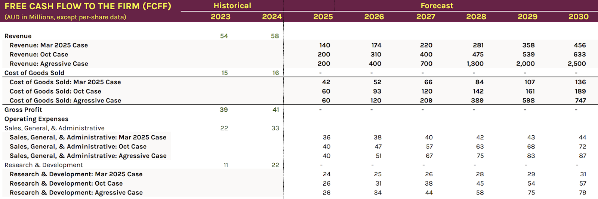
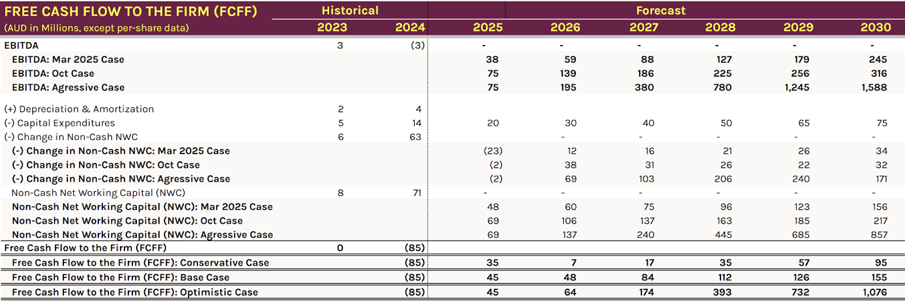

# Trade Alert #79: A Multibagger Hiding in Plain Sight

*Research is everything*

Information is the key to fundamental research. The more information you have and the better its quality, the more likely an investment is to pay off.

I started this newsletter to help me pay for an institutional-level investment terminal, and that has made a big difference to my work. I am more aware of a target company’s competitors and can assess how its technology stacks up.

Still, “Scuttlebutt research” talking directly with people involved can change everything. I try to have a conversation with anyone who will speak to me — sometimes an industry consultant, sometimes a former employee, a university professor, or even a journalist at a trade magazine.

Thanks to my work on Seeking Alpha, I often get to speak to management themselves and hear the facts from the people who really know what is going on, and it can be transformational.

That is what has happened here, and I will be taking a full position when markets open.

_**Please remember the high risks associated with trading these small caps**_. We have seen enormous volatility in recent weeks, and when the market gets nervous, these small caps are the first to drop. If you do decide to take this trade, tread with caution, don't bet more than you can afford to lose, and don’t assume it will work out.

**Disclaimer:** I’m not a financial advisor and don’t offer investment advice. **This newsletter covers my high-risk trading in small-cap emerging stocks**; past performance doesn’t guarantee future returns. Make independent investment decisions based on your own research and risk tolerance; you are solely responsible for outcomes.

(Paid Below)

## Trade Alert #79: Buying DroneShield again

**Takeaway:** I am going to open a full-size position in DroneShield; our last investment in the company went well, and we booked an 84% return. I will be buying on the Australian market with Ticker ASX: DRO. Last time, many people bought the US Over The Counter ticker DRSHF

I have decided to take a full-size position of US$600, which means I may have to trim some of our other drone holdings, as I will be over the sector limit I allow for the account.

## Meeting With Oleg

I met the CEO of DroneShield on Friday. I will put the Gemini-created notes from the meeting below. I will be writing a full report for Seeking Alpha, which must be exclusive, so I cannot provide the full deep dive here. You can read [the previous buy alert for the full background on the company](https://stephentobin.substack.com/p/trade-alert-first-drone-investment?utm_source=publication-search).

## Key Investment Points

When I presented my forecast for future revenue, Oleg started laughing. 2024 revenue was $58 million. I had raised my 2026 forecast to $310 million, rising to $500 million in 2029. I thought that was pretty aggressive, but I suspect Oleg thinks I am missing a zero!

He mentioned a single order they are expecting next quarter of $800 million for delivery 2026/7.

I had a total Addressable market of US$10 billion, Oleg thinks it is US$60 billion.

I thought Raytheon, which has booked large counter-drone orders from multiple NATO countries, was the biggest threat to Droneshield, since it would be hard to compete with a defense prime the size of Raytheon. It turns out Raytheon is a customer, and Raytheon’s counter-drone system has DroneShield inside.

Oleg was extraordinarily dismissive of the competition. I have spoken to many CEO’s and have seen this level of confidence only once before in Raj the CEO of Electrovaya.

I have produced three versions of my Mathematical model to calculate fair values.

I think even the aggressive case is below Droneshields' internal targets; they will exit 2026 with the capacity to do $2.5 billion, and I believe Oleg is expecting to hit that almost immediately.

Much of the equipment is being contract-manufactured, and Droneshield will assemble rather than manufacture, making the build-up affordable. Suppliers are already in place and manufacturing in Europe (Q1) and the US (Q2) will arrive at the same time as a significantly expanded capability in Australia.

They do not have the cash to fund Net Working Capital if they continue holding high stock levels to fulfill orders immediately. The required funds depend on the timing of deliveries and payments for these large orders. Even if they do not have the cash, they will be able to secure it at excellent rates because they will have firm orders from NATO governments.

Another critical point from Oleg is that NATO currently has no incumbent anti-drone technology and had not registered the threat until the Houthis and Russians started using them. It means DroneShield is actually the market leader with established operations in 50 countries, not a small company trying to break into the market as I had viewed them.

## Profit Forecasts

It leads to the following fair values. Current value is AUD$4.51

March 2025 Case $7.41

October 2025 Case $10.94

Aggressive Case $55.77

Quite possibly, we have a short-horizon ten-bagger here. If they land the $800 million order, the price of shares could shoot higher, and if it is backed up by the other orders Oleg discussed, then the $55 is a realistic proposition.

## The Interview

I will turn the interview into a podcast to include in the Seeking Alpha article, but here are the Gemini-produced meeting notes.

Oct 24, 2025

## **Stephen Tobin and Olerg Vornik**

Invited Stephen Tobin Oleg Vornik

Attachments Stephen Tobin and Olerg Vornik Notes by Gemini

Meeting records Transcript Recording

### **Summary**

Stephen Tobin, a writer for Seek Alpha, initiated a discussion with Oleg Vornik about DroneShield’s counter-UAS technology and market position. Oleg Vornik highlighted DroneShield’s long-standing engagement with its 35,000 shareholders and classified their technologies into detection and defeat, emphasizing smart jamming as a core defeat technology. The conversation also covered DroneShield’s product packaging, the importance of software (device-level, system-wide, and enterprise), and the “drone wall” concept for border defense and sensitive sites.

They discussed the market potential for counter-drone systems, differentiating between state actors and low-level incidents, and estimating a $60 billion US total addressable market with significant civilian potential, for which DroneShield offers a subscription-based solution. Oleg Vornik clarified DroneShield’s competitive landscape, stating that defense primes are often customers rather than competitors, and asserted DroneShield’s majority market share and global deployment across 50 countries. Oleg Vornik also provided more aggressive revenue forecasts than Stephen Tobin’s, explaining that DroneShield is quadrupling revenue, upgrading manufacturing capacity, and expanding globally to meet surging demand.

### **Details**

-   **Introduction to Stephen Tobin’s Work** Stephen Tobin introduced themself as a writer for Seek Alpha, a major investing platform focusing on retail investors. Still, their articles on Seek Alpha, have broad readership (00:00:00). Stephen Tobin appreciated CEOs like Oleg Vornik for engaging with retail investors (00:01:10).
    
-   **DroneShield’s Engagement with Shareholders** Oleg Vornik stated that DroneShield has approximately 35,000 shareholders and a long-standing tradition of engaging with small shareholders since the company’s inception as a microcap with 300 retail holders. Oleg Vornik emphasized that every investor is important to DroneShield, and Stephen Tobin concurred, noting that retail investors are especially crucial for smaller companies (00:01:10).
    
-   **Counter-UAS Technology Classification** Stephen Tobin proposed a three-part classification for counter-UAS technologies: detect and defeat, capture (e.g., net-firing drones), and hard kill (e.g., bullets, missiles, lasers). Oleg Vornik offered an alternative, broader view, categorizing technologies into detection (primarily radio frequency, radar, and then camera and acoustics) and defeat (core smart jamming, cyber manipulation, drone-on-drone warfare, capture, and kinetics) (00:02:11). Oleg Vornik highlighted smart jamming as the core defeat technology due to its cost-effectiveness, ability to counter large swarms, and lack of collateral impact (00:03:20).
    
-   **DroneShield’s Product Packaging and Software Importance** Stephen Tobin identified DroneShield’s products as drone guns, body-worn devices, and the more fixed DroneSentry installations, and questioned the paramount importance of software (00:03:20). Oleg Vornik agreed that software is the driving engine but stressed the importance of hardware, separating technologies from their packaging into handheld solutions (RF Patrol for detection, DroneGun for defeat) and fixed/on-the-move solutions (DroneSentry system). Oleg Vornik explained that for DroneSentry, they act as both sensor and software maker, as well as an integrator of third-party technologies under their command and control software umbrella (00:04:19).
    
-   **Software Layers and “Drone Wall” Concept** Stephen Tobin inquired about the growth potential of linking various technologies under one umbrella, referencing a recent press release about a large installation in Eastern Europe and suggesting its scalability to NATO-wide implementation (00:04:19). Oleg Vornik described DroneShield’s software in three layers: device-level software, system-wide command and control software, and enterprise software linking multiple sites, and explained the “drone wall” concept as having both border defense systems and specific counter-drone installations for sensitive sites like airports and government buildings (00:05:21). Oleg Vornik highlighted that DroneShield’s systems use universal APIs for seamless information exchange with overarching systems, including ground-based air defense (00:06:24).
    
-   **Addressing Drone Threats: State Actors vs. Low-Level Incidents** Stephen Tobin suggested that low-level drone incidents by individuals, rather than state actors, might represent a larger market for counter-drone systems in public spaces like stadiums and shopping malls (00:07:28). Oleg Vornik acknowledged the difficulty in identifying drone operators but noted that incidents like those in Copenhagen, where multiple orchestrated attacks occurred, might indicate state actor coordination. Regardless of the perpetrator, Oleg Vornik stressed that counter-drone systems for detection and takedown are necessary to prevent harm from any drone attack (00:08:33).
    
-   **Civilian Market Potential and Business Model** Stephen Tobin pointed out the enormous market potential for counter-drone systems in civilian settings, such as stadiums and concert venues, citing a past incident in Manchester (00:09:39). Oleg Vornik estimated the total addressable market for counter-drone solutions at $60 billion US, with half being civilian, and expected the civilian market to accelerate rapidly once adoption spreads due to information sharing among non-competing entities like airports. Oleg Vornik also mentioned that military-grade quality is suitable for the civilian market, and to address civilian budget constraints, DroneShield released a subscription-based, lower-budget solution called Sentry S for applications like prisons, which face issues with drone-delivered contraband (00:10:38).
    
-   **Competitive Landscape in Counter-UAS Market** Stephen Tobin outlined their view of the competitive landscape, categorizing competitors into Tier Ones (e.g., Raytheon), large-scale startups (e.g., Anduril), and pure-plays (including DroneShield and others like Dedrone from Axon). Oleg Vornik disagreed with this categorization, stating that defense primes like Raytheon are generally customers rather than competitors, as their focus on expensive systems and slower innovation cycles do not align with the cost-symmetric and rapidly evolving nature of counter-drone technology (00:12:52). Oleg Vornik clarified that DroneShield’s primary competition comes from “inferior solutions” in specific market segments, rather than from defense primes or companies like Anduril, which mainly focus on enterprise command and control (00:15:03).
    
-   **DroneShield’s Market Positioning and Global Reach** Oleg Vornik asserted that DroneShield holds a majority market share in its core product categories like RF Patrol, DroneGun, and DroneSentry-X, despite having one or two competitors in each price segment (00:16:34). They highlighted DroneShield’s unique advantages, including being the most globally deployed company, active in about 50 countries, and having a strong export-oriented approach due to being based in Australia. Oleg Vornik noted shifts in revenue drivers, with Europe currently being the most significant and Asia Pacific emerging due to increasing concerns over Chinese drones (00:17:47).
    
-   **Revenue Growth Forecasts and Scaling Operations** Stephen Tobin presented their upgraded revenue forecasts for DroneShield, projecting substantial growth through the end of the decade, and asked Oleg Vornik if they agreed with these figures and how such growth would be managed (00:18:38). Oleg Vornik stated that their internal forecasts were even more aggressive, noting that DroneShield is quadrupling revenue and upgrading manufacturing capacity from $500 million to $2.4 billion by the end of next year, including plans for manufacturing in Europe by Q1 2026 and in the US by mid-2026 (00:19:43). Oleg Vornik explained that this aggressive expansion is driven by significant increases in customer demand and the low saturation of counter-drone solutions, particularly in Western militaries learning lessons from conflicts like Ukraine (00:20:47).
    
-   **Market Demand and Future Outlook** Oleg Vornik emphasized that military planners are procuring counter-drone solutions as a deterrent and force multiplier, regardless of ongoing conflicts, as current arsenals are largely unequipped to deal with modern drone threats (00:21:51). They cited specific examples of large orders in the pipeline, including a potential $800 million order from an existing customer and $300 million in discussions with an Asia Pacific customer, indicating a trajectory far exceeding Stephen Tobin’s initial revenue estimates (00:23:48). Oleg Vornik stated that DroneShield is preparing for significant growth across sales, engineering, and operations, including establishing dedicated sales offices in Europe and growing their US presence (00:24:54).
    
-   **Talent Acquisition and Manufacturing Strategy** Oleg Vornik detailed DroneShield’s significant growth in engineering talent, with staff increasing from 250 to 400 globally within 10 months, primarily in engineering. They highlighted Australia as a favorable location for attracting and retaining high-quality engineering talent due to a strong local talent pool and a lack of direct competition from large tech companies like SpaceX (00:25:55). Oleg Vornik explained that DroneShield’s operational scaling involves a low-capex model, leveraging a supply chain of Australian, US, and European suppliers for custom components and utilizing contract manufacturers for final assembly and testing, which allows for rapid expansion without heavy machinery investments (00:28:16).

---

*Source: [Strategic Wave Trading](https://stephentobin.substack.com/p/trade-alert-79-a-multibagger-hiding)*
