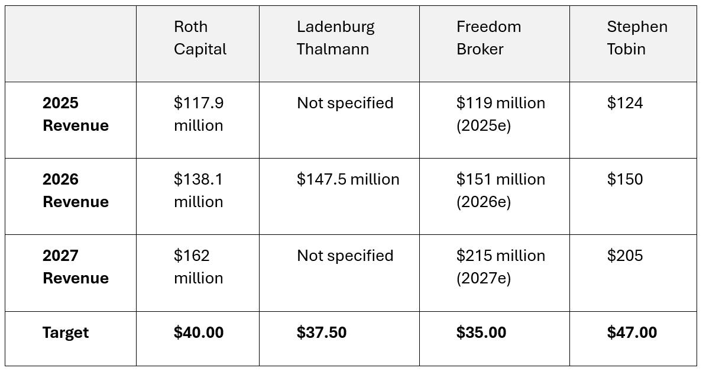

# Trade Alert 80 and 81: A spending spree to start November

*Two old profitable friends back in the portfolio*

You might recall that a couple of weeks ago, I discussed modifying my workflow to alert me to past trades that are worth revisiting. It followed a thorough analysis of what has happened to companies after I closed them and a review of the strategy.

The review showed that my active management strategy, taking trades then closing them to use the capital for other investments, was more profitable than a buy-and-hold strategy, but it did identify that I had missed some big wins.

I was able to design a new workflow that would alert me when past trades were in an area that it might be profitable to reinvest. The alert gets me to check the company but only the fundamentals can get me to invest.

Today I will be buying two companies that set of the new alerts, one I would have bought anyway, as it was on the “eyes on “ watchlist, which I review every day, and the second I would likely have missed, as I have not followed the company closely since I sold my position at the beginning of the year.

Both seem like excellent opportunities to double our money in the next 12 months.

**Disclaimer:** I’m not a financial advisor and don’t offer investment advice. This newsletter covers **my high-risk trading in small-cap emerging stocks**; past performance doesn’t guarantee future returns. Make independent investment decisions based on your own research and risk tolerance; you are solely responsible for outcomes.

## Trade Alert #80: Buying SES.AI (SES)

**Key Takeaway:** I will buy SES again at market open, targeting a position size of $500 and have not changed my target price of $7.50 from Trade #58 which followed my [interview with the CEO](https://stephentobin.substack.com/p/in-conversation-with-dr-qichao-hu).

It is not long since I closed the SES trade, booking a 198% return. I didn’t call the top, it carried on above $3.50, but as most subscribers know, I do tend to exit when a price shows a near vertical move higher.

Previous trades in SES can be seen on the chart, with green indicating entry and red indicating exit.

Since the last trade, there have been some changes to the company’s fundamentals, but the overall direction of progress remains focused on the Molecular Universe product and the development of new electrolytes. The significant risk to the trade is the expected announcement of transitioning to C-sample testing with the two automotive OEMs, which has been anticipated for the final quarter of 2025. If this announcement is not made, we will likely see a downward move. If we hear the C-sample will not take place, I will exit the trade and reevaluate.

Earnings are due on November 5th so the trade does come with added risk. However, we should also hear about updates to the strategic moves made recently, and they will hopefully be positive. I will be looking to get updates on:

1.  **Expansion into Energy Storage Systems (ESS)** The completed **UZ Energy** acquisition immediately positions SES in the multi-hundred-GWh ESS arena, adding hardware capability, global customers, and a springboard for U.S. market penetration. This diversifies end-markets beyond battery R&D services.
    
2.  **Acceleration of Molecular Universe Commercialization** Sequential upgrades from **MU-0.5** to **MU-1** indicate rapid iteration of SES’s AI-driven material discovery engine. Over **30 enterprise-level trial users** were already engaged by August, including Japanese battery OEMs, signalling early industry validation.
    
3.  **Vertical Integration via Hisun JV** The planned 90 %-owned joint venture aims to commercialize MU-discovered electrolyte formulations, offering a prospective high-margin, recurring revenue stream without heavy capital outlays.
    
4.  **Liquidity & Cash Burn** With **$229 m** of cash and zero debt at end-2Q25, SES maintained substantial financial flexibility. Operating cash outflows fell by more than half year-on-year, supporting optionality for further M&A or share repurchases as indicated by management.
    

## Trade Alert #81: Buying Byrna Technologies (BYRN)

**Key Takeaway:** I will add BYRN today with a midprice order targeting a position size of $500. (Account currently has $6,112 in cash and holdings of £13,029 for a total of $19,181).

We did moderately well our past trades in BYRN but it was by no means a big winner. The price is currently at $19.78, our exit point was not perfect as it did go to $30 before we exited and has been above $30 since.

This piece will provide a quick review of the two previous articles and then discuss the changes at Byrna that have made me decide now is a good time to buy back in.

**Review of Article 1: A Marketing Masterclass**

-   **Company Overview**: Byrna Technologies manufactures and sells non-lethal CO2-powered guns (called “launchers”), primarily to US citizens for personal safety. Their products include handguns and rifles, with handguns making up the majority of sales.
    
-   **Crisis & Recovery**: In March 2023, Byrna was banned from all major social media platforms, causing a collapse in sales. The CEO, Bryan Ganz, responded with a new marketing strategy focused on conservative influencers, leading to a 76% jump in Q2 2024 and record revenue.
    
-   **Product Features**: Byrna’s guns are powered by CO2 cartridges, fire non-lethal pepper and tear gas rounds, and are legal to carry concealed in all 50 US states without permits or background checks.
    
-   **Competitive Position**: Byrna stands out for its product engineering and reputation, with 24,000 reviews and a 4.6/5 score. Main competitors are smaller and lack Byrna’s brand strength.
    
-   **Marketing Success**: The influencer strategy, led by figures like Sean Hannity, drove a rapid sales rebound. Q2 2024 revenue reached $20.3 million (up from $11.5 million in Q2 2023), with gross profit margins rising from 53% to 62%.
    
-   **Retail Expansion**: Byrna is piloting retail stores, with the first in Las Vegas achieving an 80% conversion rate. Plans are in place to expand to 100 stores, potentially via franchising.
    
-   **Growth Outlook**: Revenue has grown from $200K/year to $200K/day in five years. The CEO projects that 10% market penetration among US gun owners could yield $10 billion in revenue over the next decade.
    
-   **New Product Launch**: A new, smaller pocket-sized model is set to launch, expected to drive further sales.
    

**Byrna 2: Evolving Business Model**

-   **Business Model Evolution:** Byrna’s CEO, Bryan Ganz, has introduced a “Store In A Store” strategy, partnering with Sportsmans Warehouse to convert archery ranges into Byrna gun ranges. This model is expected to drive significant sales growth, offering a low-cost, high-footfall route to market, and could surpass the success of Byrna’s influencer marketing campaign by 2027.
    
-   **Marketing Success:** Byrna’s influencer strategy, involving prominent political commentators, led to a 101% revenue increase from 2023 to 2024, with sales reaching $86 million. The company continues to add new influencers, including Lara Trump, and maintains strict performance criteria for its marketing partners.
    
-   **Retail Expansion:** Byrna has opened several brick-and-mortar stores, achieving high conversion rates and strong margins. However, the “Store In A Store” approach is seen as more scalable and cost-effective, with the potential to expand into other major sporting goods chains and thousands of independent stores across the US.
    
-   **International & Product Expansion:** Byrna is growing internationally, especially in Latin America, and plans to launch new products, including a compact handgun and less-lethal ammunition. These are not yet factored into the financial forecasts but represent additional growth opportunities.
    

**Todays thesis**

Byrna and its CEO Bryan Ganz make use of two emerging technologies, the first is the non lethal gun they manufacture and sell along with its ammo. The guns feature a patent-protected firing mechanism, allowing them to be stored ready to fire, eliminating the need for CO2 loading.

The second is the real key. Bryan is a master of marketing. I interviewed him before I wrote my first article, and I was very impressed.

The last two articles followed changes to his marketing plan, firstly the introduction of the influencer strategy and then the store-in-store concept. The store in a store concept has expanded to a second chain Bass Pro, this is a big deal Sportsmans and Bass pro are large operations with thousands of stores.

We now have a third marketing plan that appears to be driving a significant increase in traffic to Byrna’s online outlets, including Amazon, just in time for the holiday season, which is traditionally Byrna’s strongest and most important period for its annual sales revenue targets.

On July 23, Byrna began to talk about their new AI-developed marketing content. Due to their previous success, they had been allowed back onto cable TV and several social media platforms, but it was taking them weeks to put together adverts and the results of those ads were mixed to say the least. I had noticed Byrna ads popping up on my X feed, and I really did not like them; they were clearly targeted at gun-owning, republican voting young men, and I am none of those things.

Byrna needed to break out of that small demographic and needed ads that would engage a much broader market.

In October, Byrna released a [press release regarding a Harvard/Stanford](https://ir.byrna.com/news-events/press-releases/detail/230/harvard-stanford-study-features-byrna-as-the-exclusive) study looking at the effect of exposing non-gun-owning US citizens to the features and benefits of a Byrna non-lethal. The research covered 6,000 people across America in the 18-64 age group. The study followed best practices to ensure a representative cohort was used. The report had a couple of key findings: only 21% of firearm owners had heard of Byrna, and 43% of all respondents said they would prefer a non-lethal self-defence weapon.

Bryan Ganz was straight on it (if you had met him you would not need that sentence), bringing together the new AI marketing tool and the need to target different demographics. In my first article, I mentioned how he had hired the guy behind the best-selling small handgun in the US to lead the development of Byrnas’ first small handgun, and true to form, Bryan has now hired the former Nike Global Marketing Lead to run his new marketing campaigns. I think Bryan is a genius, and he is a winner, and as I often say, “liars lie and winners win.”

This is a still from the latest ad campaign

The campaign is called “How it Works,” not “Just do it,” but clearly targeting the same demographic. The clip is designed to get people (women) to learn more about the Byrna products (from the Harvard study) and it uses great imagery, humour and immediate news items. [Watch in on this link](https://ml.globenewswire.com/1.0/snippet/4347/eng). It is so much better than the bear-chested, beer-swilling red knecks on my X feed.

By developing a proprietary ad generation workflow that leverages AI from multiple suppliers, they have been able to develop and modify ads on demand rapidly. They can monitor the effect of different ads and ensure they resonate with what people are reading about at the moment, or even with the program they are watching on TV. The ads run in different flavours, featuring older woman and people of colour. One features a disabled person at home.

The new campaign with the Nike touch is solving a problem Byrna struggled with: how to break out into the non-gun-owning world.

The new AI ad campaign has increased traffic to Amazon by 75% and to Byrna.com by 50%. At the same time, it has dramatically reduced the cost of acquiring this traffic; the price per customer has dropped by more than half.

Business Progress  
  
Byrna demonstrated **strong recent performance** with a robust Q3 2025.

**Recent Quarterly Performance (Q3 2025)**

-   **Q3 revenue reached $28.2 million** , representing **35% year-over-year growth**, exceeding consensus expectations.
    
-   **Wholesale channel drove growth** with dedicated dealer sales surging **147% YoY** ($4.7 million increase), contributing **64% of total revenue growth**. That’s the store in store
    
-   **E-commerce sales totaled $16.3 million** (+2% YoY), primarily driven by strength on Amazon, while **retail segment accounted for ~27% of sales**.
    
-   **Adjusted EBITDA for Q3 totaled $3.7 million** , with **strong flow-through at 24%** for full-year 2025, reflecting effective cost management.
    

Management’s commentary regarding demand was encouraging, as Byrna has seen substantial site traffic increases (+70% YoY) at byrna.com in Aug/Sep, which appears to be sustaining into Oct. This sets the table for a potentially strong 4FQ, where the critical Holiday period will straddle Byrna’s Q4 2025 and Q1 2026.

**Growth Drivers**

-   **Retail expansion accelerated** with products now available in **over 1,000 storefronts** , including Sportsman’s Warehouse and Bass Pro Shops. Adding Bass Pro was another big win and will drive Byrna nationwide
    
-   **AI-powered ad campaigns** (”We Don’t Sell Bananas” TV ad) generated **+70% YoY traffic growth** on [byrna.com](http://byrna.com/) during August-September, sustaining into October
    
-   **Product mix shift** toward the higher-margin Compact Launcher (CL), which comprised **~30% of launcher sales** (50% Standard Duty/20% Law Enforcement).
    

**Near-Term Expectations (Q4 2025)**

-   **I am projecting 25% YoY Q4 growth** , with holiday season momentum straddling Q4/FY1Q due to sustained traffic growth. That is above consensus.
    
-   **0.1 percentage point increase in online conversion** translates to **~$1.7 million in quarterly revenue** at current traffic levels (56k daily sessions).
    
-   **Management guidance** anticipates Q4 could “set another record” driven by improved online conversion (0.9% rate) and retail expansion.
    

**Fiscal 2025-2027 Projections**

**Notes**

I have reduced my forecasts for 2026 and 2027 by 25% but have not altered the projection for 2025. These forecasts continually evolve as new information becomes available. When I first made these forecasts, Byrna was generating less than $8 million per quarter, so the forecasts for 2025 represented an enormous growth spurt. The further into the future you try to forecast, the less reliable the figures become, especially when dealing with these emerging companies, as you have little evidence to work with.

My price target is derived from a discounted cash flow analysis in my mathematical model, whereas brokers use a multiple of EBITDA. I don’t always include Broker targets, but in this case, it is interesting how the price targets are starting to come together and how there is broad consensus about the revenue forecasts.

---

*Source: [Strategic Wave Trading](https://stephentobin.substack.com/p/trade-alert-80-and-81-a-spending)*
