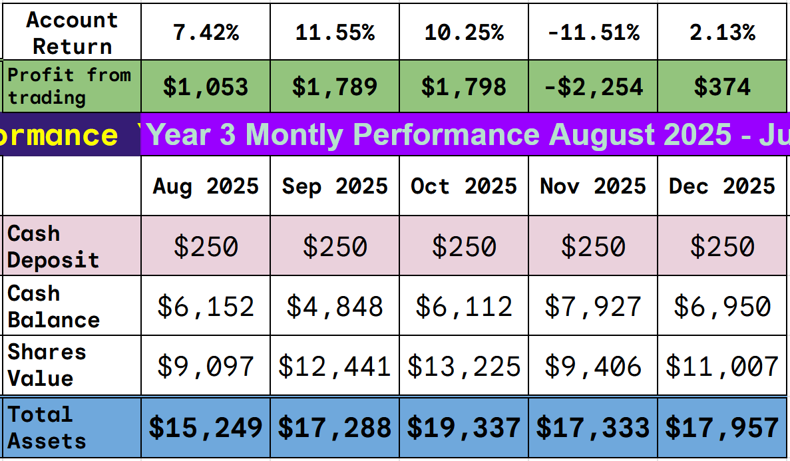
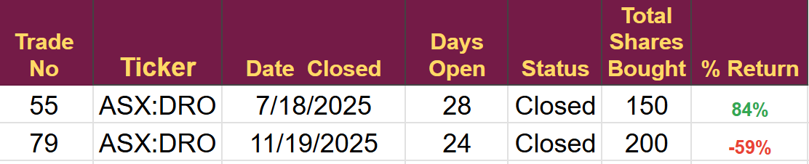
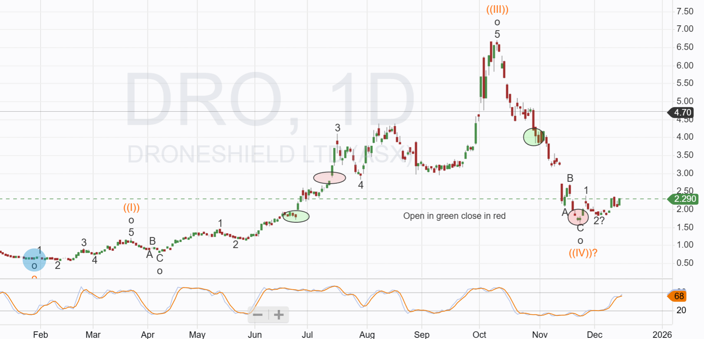
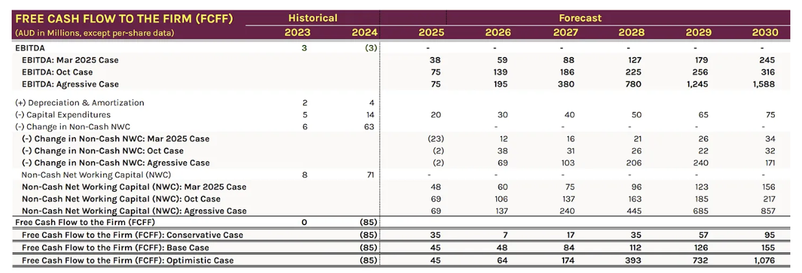

# Trade Alert 91: Chasing fools Gold?

*Buying a former disaster*

Trade #79 was a complete disaster, my biggest loss to date.

Was I a fool for buying at $4.65, or was I a fool for selling at $1.92, locking in that big loss?

Am I an even bigger fool for buying again at $2.29? but that is what I intend to do today.

The share price collapse was due to a set of reasons I have not encountered before, and I have been in the markets for a long time. My first job was on the trading floor of Bank of America in 1990, so that's 35 years in the business, which just proves one of my father's sayings. “The day you think you understand how the market works is the day you should realize you don’t, because if it could be understood, it wouldn’t exist.”

The collapse in this share and the moves in this quarter will lead to a slight adjustment to the trading plan for 2026. I will alter my exit criteria from a fixed percentage to one based on business fundamentals. (full explanation in the end-of-year review.)

**Disclaimer:** I’m not a financial advisor and don’t offer investment advice. **This newsletter is a diary of my high-risk trading in small-cap emerging stocks**; past performance doesn’t guarantee future returns. Make independent investment decisions based on your own research and risk tolerance; you are solely responsible for outcomes.

(Paid below, Please do not share)

Trade Alert #91: Buying DroneShield

**Key Takeaway:** I will open a full-size position in DroneShield when the Australian market opens, using the ticker ASX: DRO. DroneShield also trades on the US Markets with ticker OTCPK:DRSHF.

A full-size position is currently US$500, and as of today, that is 2.8% of equity. Account summary below.

We have invested in Droneshield twice

Here are links to the two reports

[Trade Alert 55](https://stephentobin.substack.com/p/trade-alert-first-drone-investment?utm_source=publication-search)

[Trade Alert 79](https://stephentobin.substack.com/p/trade-alert-79-a-multibagger-hiding?utm_source=publication-search)

I also interviewed the CEO, and you can [listen to that podcast here](https://stephentobin.substack.com/p/in-discussion-with-oleg-vornik-ceo?utm_source=publication-search)

Share Price collapse

The share price in DroneShield collapsed when the CEO, the chairman and a third director dumped their entire shareholdings for a combined total of AUD$70 million. The timing and the fact that the CEO sold his entire holdings led to understandable concerns about insider knowledge and a lack of confidence in the company. We have heard since then that part of the sale was to cover tax liabilities arising from exercising performance options, and a weird excuse from the CEO about being under threat of death from Russia because his products were being used in Ukraine.

The problem was compounded by a contract misreporting when, at the same time as selling the company, they reported a $7.6 million order from the US government; they later issued a statement saying the order had already been announced.

This was a self-inflicted crisis of confidence; the newly appointed US CEO left the company almost immediately (I guess for the contract misreport, which came from his office, although I have no evidence of that).

However, the fundamentals of the business were unchanged, and with short bets having increased significantl,y we have the opportunity to enter at a low position (although not as good as the position I exited at).

Review of the Investment Thesis

-   **Unique pure-play positioning**: DroneShield is the only publicly listed counter-uncrewed-systems specialist globally, offering a vertically integrated hardware-software-AI stack that differentiates it from diversified defense primes and niche competitors.
    
-   **Explosive revenue acceleration**: YTD 2025 revenue of A$165.2m represents 4.3x year-over-year growth , with recent A$49.6m European contract equaling 85% of FY-24 total revenue.
    
-   **Proprietary AI data moat**: RFAI-2 technology trained on 5 years of datasets from 1,600+ fielded devices creates switching costs and competitive barriers that larger, slower integrators struggle to replicate.
    
-   **Best-in-class margins**: 65-75% gross margins on core hardware significantly exceed typical defense contractors , while growing SaaS revenue (up 100% YoY) targets 30-40% of total revenue mix versus ~5% today.
    
-   **Cash-rich war chest**: A$235m equity raise provides A$221m liquidity with zero debt , funding aggressive R&D spending and potential M&A without covenant constraints during market expansion phase.
    
-   **Massive addressable market**: Operating in <5% penetrated US$60bn TAM with A$2.55bn pipeline conversion opportunity as geopolitical tensions drive counter-drone procurement urgency.
    

## Recent Orders

I was concerned that the issues of management might have reduced the chance of DroneShield winning the orders it was hoping for, but two recent awards have put that idea to bed.

### 1\. Major European Contract (December 2025)

-   **Value:** **A$49.6 million**
    
-   **Customer:** An unnamed European military end-customer, via a European reseller.
    
-   **Product:** Handheld counter-drone systems, associated accessories, and software updates.
    
-   **Timeline:** Deliveries and cash payments are expected to be finalized by the **First Quarter of 2026 (Q1 FY26)**.
    
-   **Significance:** This single contract is nearly equivalent to the company’s total annual revenue for an entire prior year and is the 15th contract secured from this specific reseller over the last three years, demonstrating strong repeat business.
    

### 2\. Follow-on European Contract (November 2025)

-   **Value:** **A$5.2 million**
    
-   **Customer:** A European military end-customer via the same European reseller mentioned above.
    
-   **Product:** Handheld counter-drone systems and associated accessories.
    
-   **Timeline:** Delivery and cash payment expected in **Q4 2025**.
    

### Targets

The chart for DroneShield showing the two previous trades is below

The chart gives a technical target of $12. In the first DroneShield Trade alert.

In the second article, I revised all the figures and presented three scenarios. The key difference was the revenue figure.s

It gave three target prices $7.41, $10.94, and $55,77

At the moment, given the new orders received, Droneshield is tending towards the aggressive case, but it is much too early to be certain.

## Conclusion

I quoted one of my father's sayings in the first part of this piece, and it also brings to mind another of his.

“Fool me once, shame on you; fool me twice, shame on me.”

I hope I am not being fooled a second time, but droneShield has orders and orders bring cash, and in the end it’s all about cash.

---

*Source: [Strategic Wave Trading](https://stephentobin.substack.com/p/trade-alert-91-chasing-fools-gold)*
