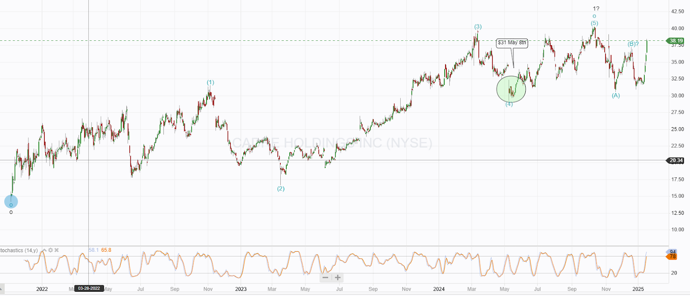

# Trade Alert: Adding to Cadre Holdings

*Increasing the size of this position*

I have decided to increase my position in Cadre Holdings (CDRE). The original position was taken in May 2024 at $31 per share. At that time, Cadre was part of my nonlethal sector, along with Byrna. That sector continues to perform well.

Cadre is an acquisitive holdings company targeting mission critical verticals and is building out a nuclear energy division moving it into another of my favoured market sectors.

Despite the fallout from a recent cyber attack, probably a ransomware attack, several key factors have positioned the company well for continued growth and success.

**Expansion in Margins**

One of the most impressive aspects of Cadre Holdings' recent performance has been the expansion of its margins. In the past year, the company's margins have increased from 41% to 45%. This is a significant improvement and demonstrates the company's ability to generate profits from its operations.

**Revenue Growth from Existing Verticals**

Cadre Holdings has also experienced strong revenue growth from its existing verticals. In the past year, the company's revenue has increased by 17%. This growth is even more impressive considering that it was achieved in a challenging economic environment.

**Expansion of the Nuclear Division**

Perhaps the most significant development for Cadre Holdings in recent months has been the expansion of its nuclear division. The company recently acquired several nuclear companies from Carrs Group. This acquisition gives Cadre Holdings a leading position in the nuclear industry.

Cadre management have said they are looking at more than 100 tuck in acquisitions for this new nuclear division. I like the strategy, nuclear energy is extremely mission critical, safety concerns run ahead of everything and buying established players Cadre is building a business with a significant moat leading to continued high margins. The nuclear industry looks set for growth in the coming years and I am keen to get more exposure.

# Technicals

I had been expecting Cadre to continue tracking lower until the next earnings call, which would have explained the cyber attack in greater detail and allowed us to see the damage. However, the market reacted positively to the January 15th news of the expansion of the nuclear division, and the pullback from the wave 1 high is likely over, meaning a strong upward movement can be expected.

**Conclusion**

Cadre Holdings is a well-positioned company with a strong track record of growth and profitability. The company's recent expansion of its nuclear division is a major catalyst for growth. I believe that Cadre Holdings is an excellent investment and I am adding to my position in the company.

I will add a mid-market order to my IBKR account today. The order will be for 4 shares (a half-size order) on the demonstration account, and I will report the price I get in the comments section.

---

*Source: [Strategic Wave Trading](https://stephentobin.substack.com/p/trade-alert-adding-to-cadre-holdings)*
