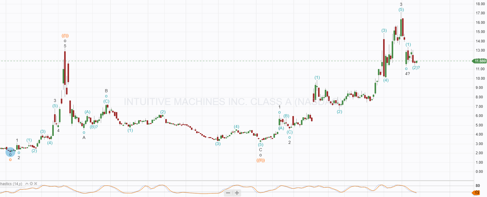
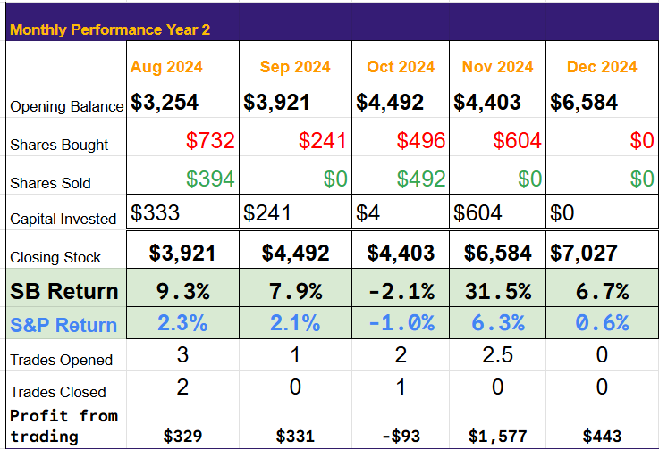
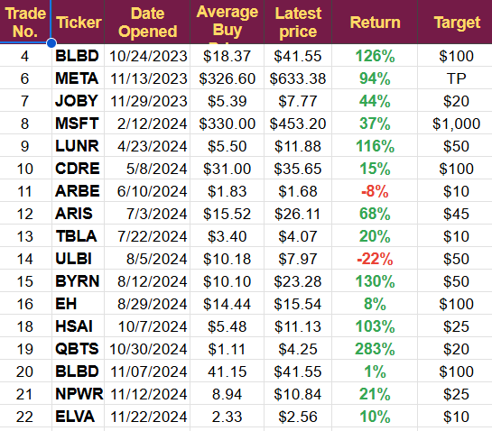

# Trade Alert: Adding to LUNR

*Recent Pullback Offers Entry Point*

I recently published an article on SeekingAlpha saying I was preparing to buy any dip in the price of Intuitive Machines. Having reached a high above $17 on November 29th, it has now pulled back, reaching a low of $11.44. That is a 33% drop.

The technical chart looks promising, with price oversold on both the 4-hour and daily charts and wave forecasts, suggesting a bottom may be in.

Technicals are always tricky and offer little certainty, but this may be the last chance to buy this year. If the launch in Q1 2025 goes as expected, this could be an excellent trade. If the launch fails, we will likely lose money.

I have entered a buy order on IBKR at midprice and will take a half-size position in the demonstration account.

Other News

Arbe has confirmed an interview with their CEO for next week, which may enable me to get an article written before the end of the year.

QBTS is pulling back; the bottom may be near and will continue to hold.

HSAI is also pulling back, and I hope for an opportunity to add to that position.

META has reached its target but looks quite strong, so I will continue to hold for now.

The Portfolio continues to perform well, showing an increase of 6.7% in December before I have added to LUNR.

The complete list of open trades is

[Subscribe now](https://stephentobin.substack.com/subscribe?)

---

*Source: [Strategic Wave Trading](https://stephentobin.substack.com/p/trade-alert-adding-to-lunr)*
