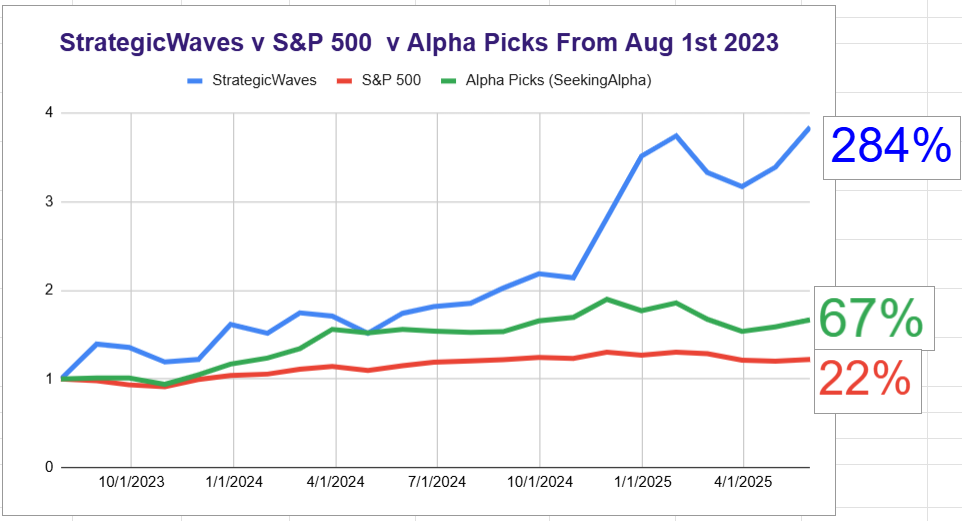
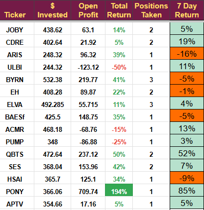
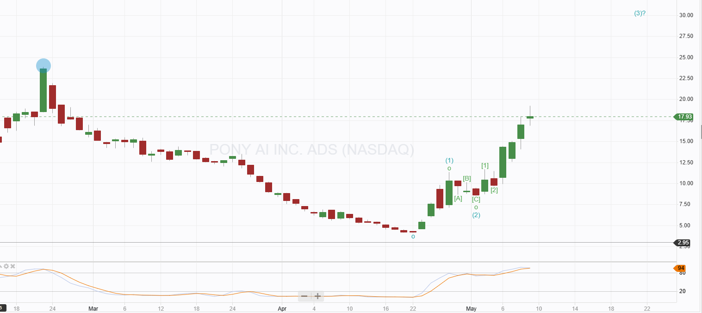
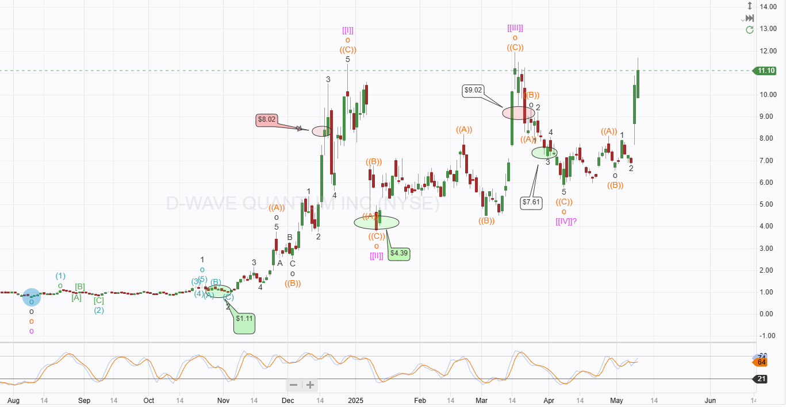
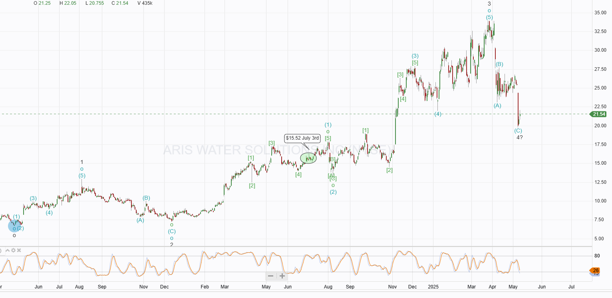

# Trade Alert and Week Review

*Earnings driving decisions*

## Week ending 11/05/2025

The Portfolio returned +8.6%, against the US market's return of +1.2%. Five of our fifteen holdings recorded double-digit percentage gains, and one recorded a double-digit loss. The portfolio finished the week at an all-time high. We bought new stock during the week, and it showed a small profit.

# Trade Updates and Alerts

Two investments may require action in the coming days, and I will add to one position on Monday. I still expect to make a new nuclear trade next week. The CEO of the target company accepted my invitation for an interview, and I will clarify some crucial points with him before making a final decision.

If you want to receive the new nuclear trade write-up or read the trade updates below, please become a paid subscriber.

## Individual Trade Performance

**Positions Needing Action**

PONY and QBTS have jumped higher, Robotaxis and Quantum are on trend at the moment, and as a result, prices are being driven by hype as much as fundamentals.

**PONY:** I have a $30 target for Pony, but this sudden jump shown on the chart below has me wondering if it is better to take profits and buy again later. The price is now overbought and has accelerated from its low. I will email an alert if I decide to exit, but I would prefer to hold if we can.

**QBTS:** We have a fair value of $24 for D-Wave. Shares moved higher following earnings. The report did not contain anything new and indeed was not all good, but it did stir the market into action; it could just be investors waiting to see if D-Wave delivered on its promises, which it did. The report caused all the quantum stocks to move higher; they are still locked together. This will eventually change as they are on different commercialization paths with different technologies. IONQ also reported last week and announced the sale of a machine, guiding to revenue of $85 million but increased losses. RGTI will announce on Monday; another good print could lift all the quantum stocks; a poor one might provide the time to exit.

**ARIS: TRADE ALERT**

Aris dropped following earnings, the low oil price caused a significant reduction in profits ($7 million), which was expected. However, the main business of produced water and water services increased by 7%, an unexpected jump continuing into Q2. CAPEX was reduced by 44%, and liquidity remains strong. Management said they had not seen any slowdown so far but were concerned about the effects of Tariffs going forward. PUMP and ACDC, the two peer companies I track, also expressed this sentiment. It remains my base case that the economy will recover in the second half of the year and the Trump administration will roll back its tariff policy.

The guidance of a $0.42 margin per barrel of water was lower than the $0.44 this quarter. The McNeil ranch purchase is going very well, with permits for water disposal being granted. We should hear about the first solar installation later in the year.

Aris is now in the permitting phase of its plan to replenish reservoirs using desalinated produced and industrial water, and continues to work on using the water for non-food agriculture. The first iodine extraction site is moving forward (due online early 2026). The investment thesis remains intact, and I will take the opportunity provided by the pullback to add to this position when markets open on Monday.

I will issue a midmarket order for six shares, taking the total investment to around 3.5% of equity.

**ULBI:** The Electrochem acquisition is almost fully integrated and provided positive EBITDA in Q1. ULBI has been suffering from tariffs. 15% of their product comes from China, which will be difficult to change in the short to medium term. They work in medical and military markets, so they must re-approve any changes and that would likely cost more than the tariffs.

Battery revenue was up 16% yearly, driven by a 53% increase in defense and a 12% fall in medical.

Communications dropped 36%, but the division is much smaller than the battery one ($4 million v $46 million). GP was up 11% year over year, but margins fell slightly.

Costs rose significantly, partly due to Electrochem but primarily due to new product development costs and an expanded sales team.

I will continue to hold. It does not meet my criteria to add, we don't have an uptrend, but if the opportunity arises, I will take it.

**Nuclear Trade:** This research is taking a long time to complete. My meeting with the CEO should be the final part. If it pans out the way I expect, we should be able to buy in the first half of the week. I will send a trade alert with the full details.

## Conclusion

It was a busy week, and next week will likely be no different. I will not send a weekly review every week, only when information warrants it.

I have interviews booked with the CEO of D-Wave and the nuclear target company. I will share the information gathered in the coming days.

The CEOs agree to be interviewed to get exposure to retail investors; the more exposure I can give them, the more likely they are to continue to give me some of their time.

---

*Source: [Strategic Wave Trading](https://stephentobin.substack.com/p/trade-alert-and-week-review)*
