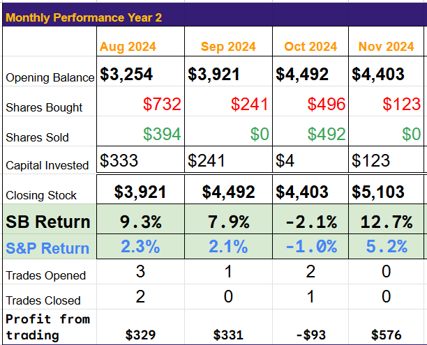
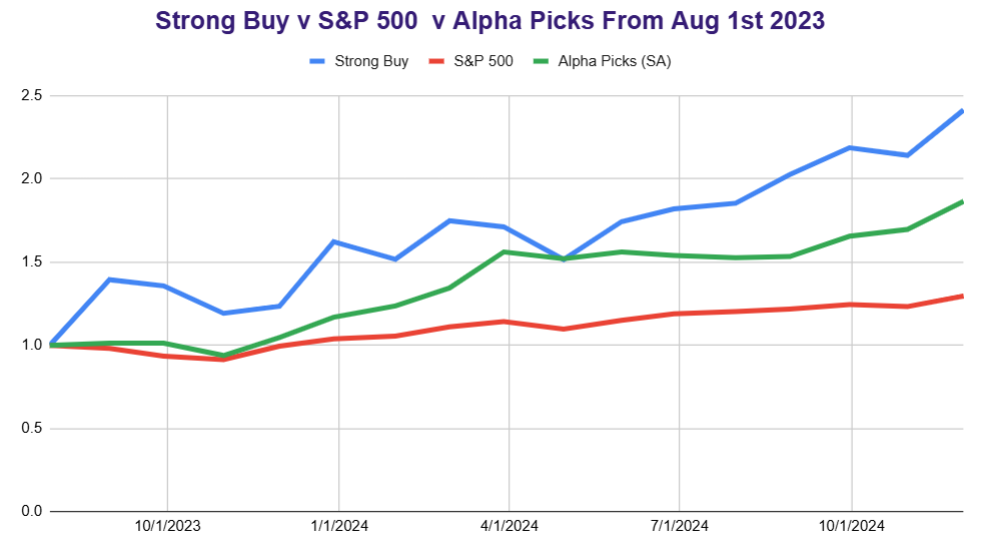

# Trade Alert: Buying NPWR again

*Portfolio up over 12% in September*

We exited NPWR in August when the price was turning lower, and I had growing concerns about the path of US regulatory enforcement on emissions and the potential demand for electricity emissions.

The world changes quickly in small-cap stock trading, and the rationale for investing in NPWR is overwhelming.

I still own NPWR in my never-sell family fund, but I will add it to the Strong Buy Portfolio today.

I will be submitting an updated article to SA this week.

Demand

The demand for electricity, mainly from data centers, is growing almost exponentially. Many people are looking for new nuclear power to fill that void. I do not see how new nuclear power will live up to the hype. Most new nuclear companies are overselling themselves and will not be able to deliver a working power station within the timeline they suggest. I am also concerned about the difficulty companies will face locating nuclear power stations and the problems of becoming licensed nuclear operators.

NetPower is in negotiations to co-locate with data center operators. Getting licensed to run a natural gas-powered power plant is a different ball game than running a nuclear one.

Initially, we were expecting the first site to be OP1. Still, NPWR strongly hints that other sites will arrive shortly after or even before the first one, with negotiations now advanced in several areas.

Progress

NPWR continues to meet timelines and spend cash carefully. They have installed the new test rigs at the demonstration site and released funds to order the long-lead items for the first commercial site. 2027/8 is the likely date of the first electricity generation, which will likely be five years before the new nuclear plant starts operations.

Risks

It's a SPAC. We have seen many of them drop to $1 before beginning the upward price curve (if they are successful). That was a key reason for the exit in August; the price was falling, and I do not like 90% losses on investments. It could still happen, so I think it is a very risky investment but the timing could be perfect: a slew of positive testing results and contract signings next year and into 2026 could propel the stock higher for the start of electricity generation in 2027

Technology

The base technology is patent protected. They burn natural gas to make CO2, which they use to drive a turbo expander, creating electricity. The CO2 is used multiple times before being piped to storage. It is a closed-loop system, so CO2 does not escape, giving the plant almost zero emissions.

This year, they have added a proprietary oxygen storage facility that operates like a battery for the plane. This facility allows them to provide peak energy for the grid and power co-located data centers.

The Portfolio

We are having a bumper month in the demonstration portfolio. We were not well positioned for a Trump win, but fortunately, we chose carefully and are up 12% this month.

(Remember, the demonstration portfolio is funded by $250 each month, and I never withdraw from it current value is Cash $873, Stocks $5,103. Over 16 months we have invested $4,000)

We continue to outperform the S and P and Alpha Picks from Seeking Alpha.

Trade Review

LUNR is up 100%, so I will review it this month; ARIS is also approaching target, so it is under review. ULBI had a bad quarter. We may exit after a full review. We have 6 stocks looking very positive on the prospect list. Unfortunately, XMTR and AMPX were deferred from last month's list, and we may have missed out, but I will update if any are suitable for a buy.

[Subscribe now](https://stephentobin.substack.com/subscribe?)

---

*Source: [Strategic Wave Trading](https://stephentobin.substack.com/p/trade-alert-buying-npwr-again)*
