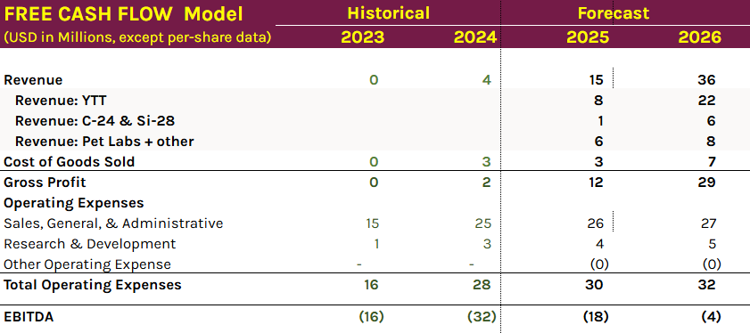
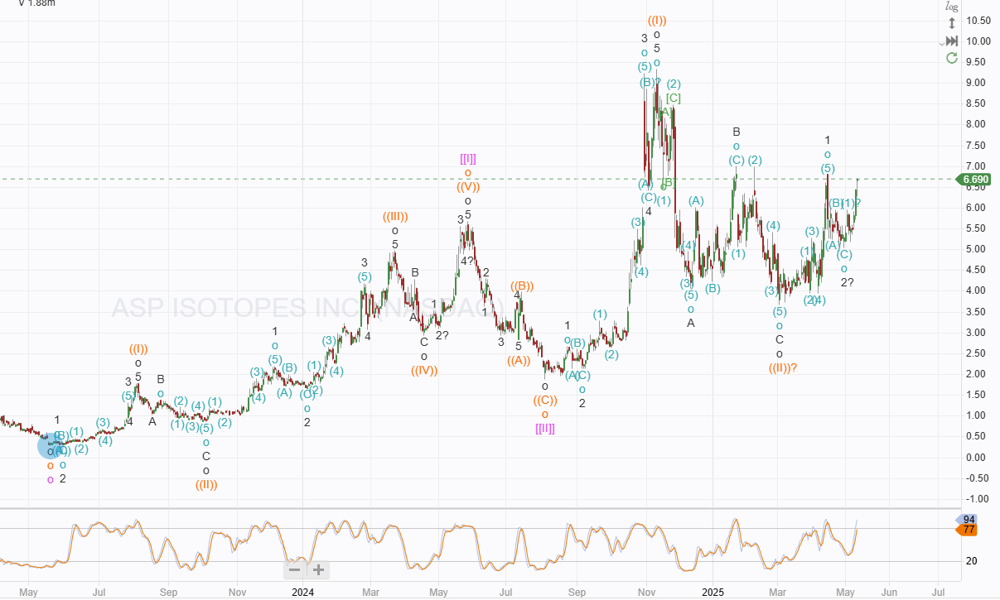

# Trade Alert: Buying Nuclear

*A Key Emerging Technology*

This will be the first Nuclear trade of 2025. We made 104% from Centrus in 2024, and I have been looking to gain additional exposure to this industry ever since. It is an industry primed for growth and open to disruption, but finding companies that are likely to make the most of this is difficult. The industry is heavily regulated, extremely capital-intensive, and dominated by state-funded and long-established businesses. Barriers to entry are large and expensive to overcome.

The chosen company has fully developed technology, orders in place, achieved commercial activities, and is likely to reach a measure of profitability next year. However, it is another high-risk play, a very small underfunded fish in a sea of sharks.

(Paid only below this point)

# Buying ASP Isotopes (ASPI)

This South African-based isotope enrichment company has developed a real and sustainable competitive advantage in the enrichment of isotopes needed in the medical and industrial fields. Its technology might work on uranium, the South African government has agreed to fund an initial test plant, and Terra Power, the Bill Bates-funded new nuclear SMR startup, has decided to help fund the build of the site, hoping to take HALEU fuel from 2029 onwards. HALEU production from uranium enrichment would be the cherry on the cake. It is not the reason for my investment.

## Short Report

As with many of my investments, the company was hit by a short report earlier this year, [a particularly salacious piece from Fuzzy Panda](https://fuzzypandaresearch.com/aspi-honig-stetson-paid-stock-promotion/). It is the usual mixture of some truth, some speculation, a lot of irrelevant conjecture, and errors. The report delayed my investment by a couple of weeks. It took that long for me to check all of their claims. I have a friend in South Africa who ensured ASPI has an operational site and contacted the CEO of ASPI to speak with him directly.

The short report makes the following points.

**SEC-sanctioned Investors:** True, the SEC sanctioned pre-IPO investors for securities violations. They are not managers or directors, and the CEO said he would have taken money from the devil himself to get his company going.

**ASPI is not NCA Approved:** True, they do not intend to operate in the US, so they have not applied for grants or approvals in that country. They have no offices or operations in the US, just some remote salespeople.

**Old Technology:** Part true, they have adapted an old technology by applying a new classification of lasers and beam shaping technology to their proprietary ASP technology to enrich their target isotopes.

**CEO has bad history:** Not true, he has one successful and one failed business behind him. The successful one was in cancer biotechnology and was bought out. Cancer oncology is a key market for ASPI products.

**ASPI does not have facilities:** Not true, the site Fuzzy Panda checked was the office of ASPI’s commercial services and legal team. As Fuzzy Panda said, they were the only company at the address. ASPI has no US operations,

## ASPI Business Model.

[In my previous post](https://stephentobin.substack.com/p/trade-alert-adding-to-aris?r=nh85d), I explained enrichment and how it separates isotopes. Uranium is not the only thing that needs enriching, and perhaps not the most profitable.

### Ytterbium-176

ASPI has an order for 1kg per year of Ytterbium-176 at $20,000 per gram. Rosatom has been the dominant force in Ytterbium-176 production.

-   Ytterbium-176 is a stable isotope of the element ytterbium. Stable isotopes are non-radioactive forms of an element.
    
-   Ytterbium-176 is the precursor material used to produce the therapeutic radioisotope lutetium-177 found in Pluvicto.
    
-   Ytterbium-176 is bombarded with neutrons in a nuclear reactor. This process, transforms the stable ytterbium-176 into the radioactive lutetium-177, which is then processed and incorporated into the Pluvicto drug.
    
-   Pluvicto is a radiopharmaceutical medication used to treat prostate-specific membrane antigen (PSMA)-positive metastatic prostate cancer in adults.
    
-   The FDA in the United States recently expanded its approval for Pluvicto to include earlier stages of treatment for PSMA-positive mCRPC.
    

Commercial enrichment of Ytterbium-176 has begun. The ASPI QE (Quantum Enrichment) process requires the Ytterbium to go through several times as it is increased to 99% concentration. The enrichment plant is in South Africa and is fully approved. It took almost 3 years to construct and bring online, and the first shipment of Yt-176 is expected in Q2 2025.

Every isotope requires different lasers to provide the right amount of energy to excite a specific isotope, allowing it to be enriched (something Fuzzy Panda was confused about when they provided the mathematics showing how the Ytterbium laser could not provide the energy needed for uranium). ASPI’s QE is an updated version of the older ALVIS laser technology.

### Carbon-14

Again Russia has been the only producer of C-14, an isotope used in pharmaceuticals and agrochemicals. Carbon-14 is enriched using the ASP technology, not the QE technology used for Ytterbium; it is a radioactive isotope with a 5,700-year half-life.

ASPI has a multi-year deal with a Canadian company with a minimum value of $2.5 million per year. The customer supplies carbon dioxide feedstock (two shipments have arrived). ASPI enriches the C-14 to more than 85% before shipping it back to Canada. Feedstock received so far is above the run rate required to meet the $2.5 million minimum, and the first shipment will leave for Canada this quarter. The same customer has signed an MOU with ASPI to enrich Deuterium and Tritium; commercial details have not been released.

### Silicon–28

Enriched Silicon-28 is used in the semiconductor industry, where Silicon-29 isotopes reduce performance. ASPI has two purchase orders for enriched Silicon-28, one from a US semiconductor manufacturer and one from a European industrial supplier.

The Silicon-28 plant had commissioning problems with its cryogenic pumps, which have now been resolved. It is currently enriching at a commercial scale.

## Future Isotopes

ASPI is in the planning and design stages for three more Isotope enrichment plants: Nickel-64 (used in PET scans, radioimmunotherapy, and copper-64 production), Gadolinium-160 (used in spectroscopy), and Lithium-6 (used in nuclear fusion and thermonuclear weapons).

## Competitive Advantages

The South African government is a big supporter, deeply involved, and grants operating licenses after conducting its regulatory checks. South Africa moves through the process far quicker than other countries, not requiring public enquiries or meetings.

ASPI technology is based on older, proven techniques. The South African Enrichment program initially developed the Aerodynamic Separation Process (ASP) in the 1980s. Scientists from that program set up the company Klydon and spent two decades working on it. ASPI bought Klydon to get the tech, and the founder of Klydon became the CTO of ASPI.

ASPI continues to develop the ASP technology, which provides a substantial competitive advantage and a moat around the business. The technology is relatively inexpensive; additional plants cost around $3 million and do not need to go through the regulatory process, as the technology is approved in South Africa but nowhere else.

ASPI is developing its QE technology. This laser enrichment technology is currently enriching Ytterbium. It is based on the older AVLIS method but uses new-specification lasers and enhanced beam-forming technology.

Lab-scale tests have been promising for using this technology on Uranium, outperforming the older AVLIS and current centrifuge technology. However, the path to enriching uranium will be challenging. HALEU fuel is in demand, but any facility would require financing beyond what ASPI can reasonably expect to generate.

The South African Nuclear Agency is called NESCA. ASPI signed an MOU with NESCA in late 2024, committing both sides to collaborate on the R&D for future production of advanced nuclear fuels, specifically HALEU. The MOU envisions constructing a HALEU facility at Pelindaba, South Africa's nuclear research center and home to South Africa's largest nuclear reactor. The South African government has said the relationship is crucial to allow the country to re-establish its nuclear fuel generating capability. ASPI will not own the site, and its financial implications are unclear.

Terra Power, a Bill Gates-funded company, has signed a term sheet with ASPI to pay for some of the development of the Uranium enrichment facility (the first invoice has been issued, and $200k has been recognized as revenue) in return for preferential customer status if and when the facility begins to produce HALEU. A target date of 2029 has been set for Terra Power to receive supplies of HALEU.

## Target Price

As is often the case when I first buy a company, I do not have enough information to build a full three-statement model and predict the next 10 years of operations with any degree of certainty. I have started to build the model using the revenue we have confirmed orders for, and assumed the cost base remains in line with 2024.

ASPI ended 2024 with $62 million in cash on the balance sheet and $35 million of debt. They have positive shareholder equity and sufficient cash to reach profitable operations, which I predict will arrive in the second half of 2026. Of course, this date is highly uncertain and depends on ASPI achieving the production of its Isotopes on schedule.

ASPI plans to build multiple enrichment facilities in South Africa and Europe for new isotopes. If these plans are realized, we should expect future dilution.

The long-term chart suggests a target above $25. It was below $5 when I started investigating, but it is now above $6. The overbought reading is not ideal but the chart is very bullish.

## Conclusion

Another high-risk investment in emerging technology.

I will place a mid-price order on the IBKR demonstration account for 60 shares, approximately 3.5 % of equity. The account currently has $3,057 in cash, $8,123 in shares, for a total of $11,180

---

*Source: [Strategic Wave Trading](https://stephentobin.substack.com/p/trade-alert-buying-nuclear)*
