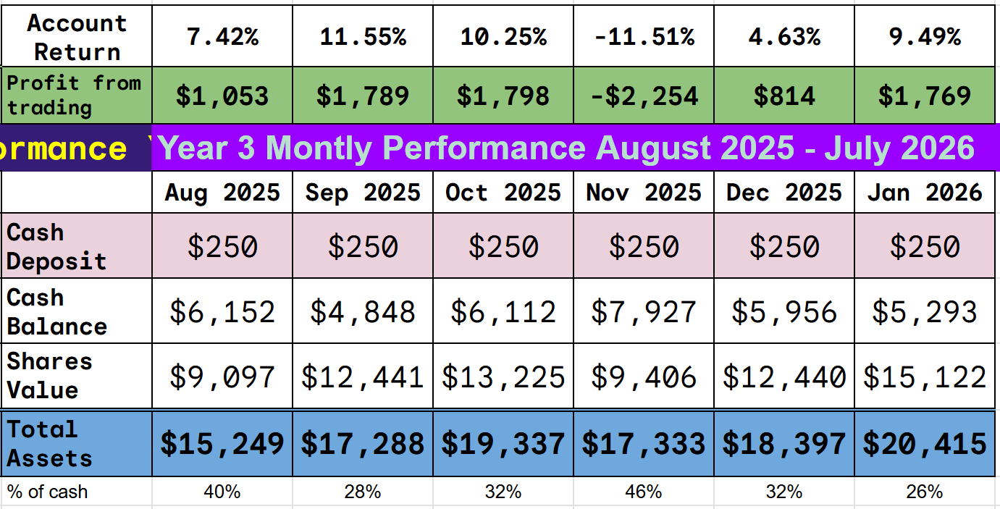
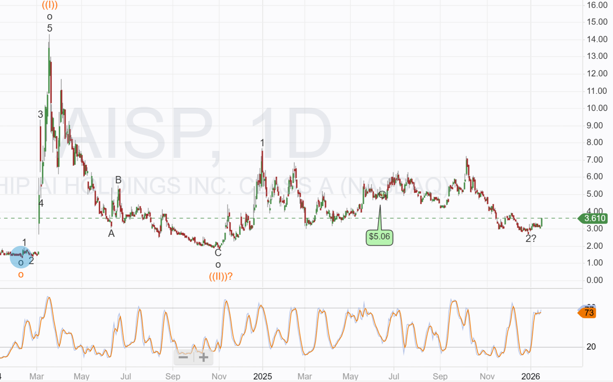

# Trade Alert: Increasing AI Security Exposure

*Border Security be a key sector for 2026*

Border security has been a targeted sector for more than a year, we have had some great success from our counter-drone investments, but not from our AI security investments. I think 2026 will be the year this changes, and expect meaningful growth from our AI security investments.

We have had a number of trades that suddenly shot higher after we opened them, and we all like that immediate return. ABAT in September was a great example, 315% in 29 days! Luck plays a big part in those sudden gains. We have to choose the right company with the right technology, but the price move is driven purely by hype, and we were just lucky to get in before the hype arrived.

Those hype gains are great, but they are not a target of the strategy and should not be expected to happen regularly. We did have another one last month, with one of our counter-drone stocks moving more than 100% higher in 35 days, but for the majority of the portfolio, the time horizon is 2 years.

The strategy is designed to identify small companies with technology that will provide meaningful share price appreciation over the next two years, not the next two weeks.

Today, I will add to one of our holdings that has excellent technology but has been drifting throughout most of 2025, remaining under the radar and not picked up by the market hype machine.

Recent developments imply 2026 may be the inflection point for this company, and I want to increase my exposure.

As the portfolio grows, so does the size of my investments, allowing me to increase some holdings. The portfolio was at $9,635 at the end of January 2025 and today it is at $20,417. In 2025, I had $1,961 in cash on the account. Today, I have $5,293 giving me the money needed to increase positions with high potential.

**Disclaimer:** I'm not a financial advisor and don't offer investment advice. This newsletter covers my **high-risk trading in small-cap emerging stocks**; past performance doesn't guarantee future returns. Make independent investment decisions based on your own research and risk tolerance; you are solely responsible for outcomes.

## Trade Alert #95: Adding to Airship AI Holdings (AISP)

**Key Takeaway:** I will add to this existing position today. AISP was Trade #54 taken in June 2025. I initially bought $405 of the stock (that was a full-size position at the time). Today, I will add $300 a half-size position.

The current account position is

**Key Points**

The trade has not gone well so far and is currently underwater by 29%. Yesterday saw a 15% jump in the stock price. The technical chart I am following is

The existing entry point is shown in green; the chart suggests a target of $13, slightly lower than previously but still a big increase from today.

[You can read the original Trade Alert here.](https://stephentobin.substack.com/p/trade-alert-buying-robot-security?utm_source=publication-search) The technology and business model have not changed since the alert, and the thesis remains the same.

AISP sells a full-stack edge product that takes video as input and interrogates it to deliver an actionable database. For border security agents, it can distinguish between animals and people near a crossing, determine whether people are attempting to climb a wall, and search for specific license plates and answer questions such as “show me all red cars crossing within two miles of this point”. The device can take video from existing cameras, drones, or newly installed devices, and it works at the edge, meaning on-site. It does not need an internet connection or the cloud to operate.

The product was making real progress with the US government before the shutdown and reassessment of priorities. With these issues now resolved, I think AISP is set for a breakout year.

After two consecutive quarters of subpar sales due to a slowdown in federal approvals and a government shutdown, orders and RFPs have begun to return. (Management discussion) The current administration’s focus on security has led to an expanded budget for the **Department of Homeland Security (DHS)** and **Customs and Border Protection (CBP)**, with over **$70 billion** allocated for the next four years. This includes **$6.2 billion** for border security technology, for which Airship is an approved vendor.

**Backlog and Pipeline:** Airship has been awarded **16** individual contracts from agencies within the **Department of Justice (DOJ)** and **DHS**. This has contributed to an **$11M backlog**, which is largely deliverable in **4Q25** and **1Q26**. The company’s validated pipeline has expanded to a record **$166M**, with conversion expected over the next **18-24 months**.

The company’s AI-edge video solutions are also finding applications in the commercial sector for safety, security, and shrinkage. Historical customers include **FedEx** and **Home Depot**. A nascent opportunity is also emerging in the robotics market, with materialization expected in **2027**.

Management has been big buyers of late

**December 29, 2025:** President Paul Allen purchased **100,000 shares** of common stock at an average price of **$2.74**.

**December 15, 2025:** CEO Victor Huang purchased **20,000 Public Warrants** (AISPW) at prices ranging from **$0.922** to **$0.923**.

**Financial Outlook and Valuation**

**Estimates:** I have updated my short-term revenue and profit forecasts. I expect significant revenue growth and break-even in 2026, which I think will drive this stock forward.

**Balance Sheet:** As year-end 2025 approaches, Airship should have over $10M in cash on its balance sheet. A small capital raise is to be expected sometime in H1 2026 to fund the growth in revenue

The model remains indicative, meaning we lack sufficient detail to calculate all line items in the accounts once the company is profitable and operating at scale. However, the model presents a DCF valuation (Discount rate 10%, terminal value Gordon Graham) of $12 per share.

I expect to produce a full model later in 2026 and refine a more accurate price target.

**Identified Risks**

**Market Adoption:** The widespread adoption of edge AI for video and other data streams remains in its early stages.  
**Competition:** Airship competes against larger, more entrenched companies.  
**Customer Concentration:** In 2023, three customers accounted for 67% of sales, with the top customer accounting for 34%. A high level of concentration around government agencies is expected to continue.  
**Capital Requirements:** The company may require additional growth capital for its expanding top line, though it is believed to have reasonable access to capital markets.

---

*Source: [Strategic Wave Trading](https://stephentobin.substack.com/p/trade-alert-increasing-ai-security)*
