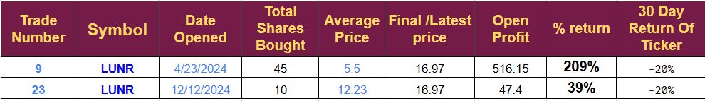
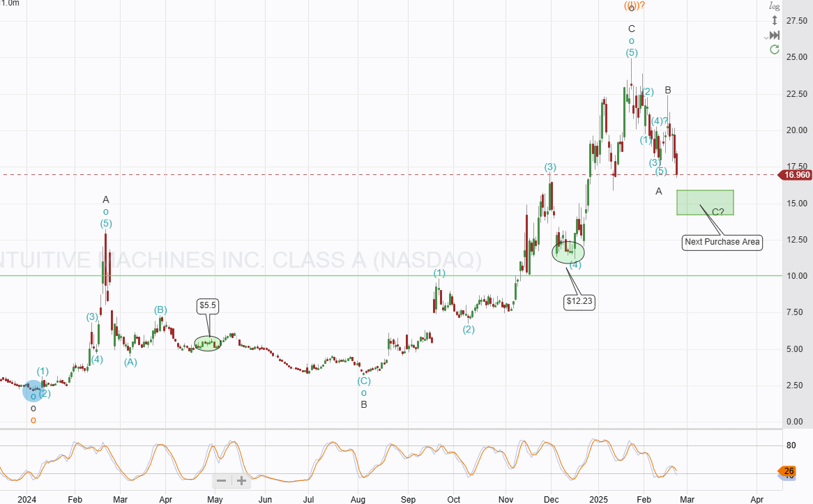
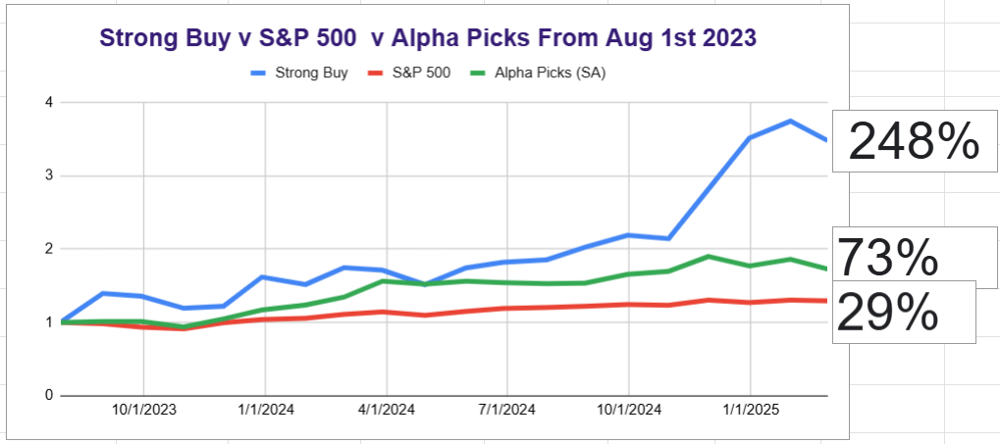

# Trade Alert: Intuitive Machines Ready For Lift-Off

*Considering adding but it is high risk, Order submitted.*

Intuitive Machines (LUNR) has been pulling back lately. It is close to meeting our criteria for adding to the position for a second time. Since we last added it, it has made a new high and pulled back in a typical three-wave move.

The table below shows the two open trades and their performance to date.

LUNR is currently our largest holding; the pattern we are following is shown on the chart below and suggests that $15 would be an excellent time to buy again.

There is significant risk. The second Lunar launch, IM-2, is currently standing on the launch pad, aiming at a multiple-day launch window opening on Feb 26th (Tomorrow). The launcher carries multiple high-value, high-visibility cargo items for NASA, Motorolla, and LUNR. The previous successful launch caused the share price to jump 500%. When the lander fell on its side, the share price fell, going $2 - $13 - $5.

If the next launch succeeds, the price can double; if it fails, it will likely fall 75%.

It is about as high-risk as things get. We are not often faced with a binary outcome like this. The press coverage will be extraordinary if the launcher makes it to the moon and deploys its moon hopper, lunar rover, and cellular telephone network.

If it explodes over the Ocean, the press coverage will be terrible.

I have set a buy order at $15 for 11 shares on the demonstration account.

# Other Notes

Several people have contacted me regarding SES. I will write a company take after earnings. We are down 20%, but no current negative news specific to SES exists. ULBI is also in the close watch area. I am waiting for earnings before making a decision. Indeed, all of our battery companies are currently suffering, and I will likely cull at least one just to reduce exposure to that segment.

The graph above shows that LUNR fell 50% from our initial purchase before moving higher, so the drop in SES is not unusual. As long as we stick to our strict money management rules, an individual position cannot harm the portfolio's overall performance.

The Portfolio is down 7% at the time of writing. This is our worst month since March 2024, when we lost 11.2%. The worst month since inception was September 2023, when we lost 15.2%. It is essential to keep these losses in perspective and not panic; even with this month’s drop, the portfolio continues to perform exceptionally well, I see no reason to change tactics or direction and will continue following the plan to generate above-average returns by investing in emerging technology.

The performance against the two chosen benchmarks is shown below. You can see Alpha Picks has been struggling for a few months and the S and P is showing a marginal decline.

Thanks for reading. I am currently working on a Quantum stock idea, but the likelihood of it being an immediate trade is dropping as I get into the details. Hopefully, the current pullback in the market will present more opportunities.

---

*Source: [Strategic Wave Trading](https://stephentobin.substack.com/p/trade-alert-intuitive-machines-ready)*
