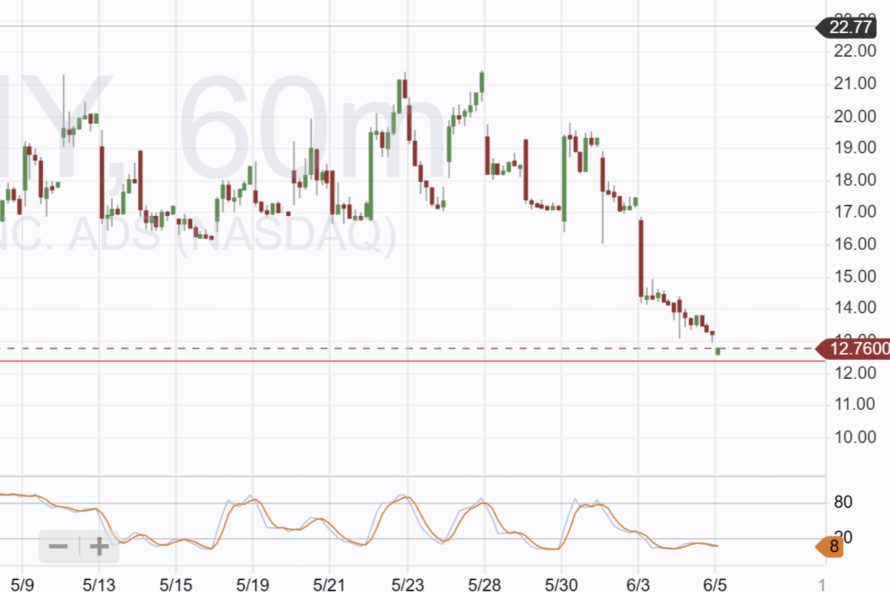

# Trade Alert: Pony Stop Loss in Place

*Stock continues to fall*

A stop loss has been added to Pony at $12.35. I will buy again in the future, but it will be a 100% return.

It will be a disappointing end to this trade, as it was over $20 a couple of days ago. I expect the stop loss to be hit today as the current price is $12.75, and it did drop below $12.35 pre-market.

Image below shows the stop in place and price hvering above it.

---

*Source: [Strategic Wave Trading](https://stephentobin.substack.com/p/trade-alert-pony-stop-loss-in-place)*
