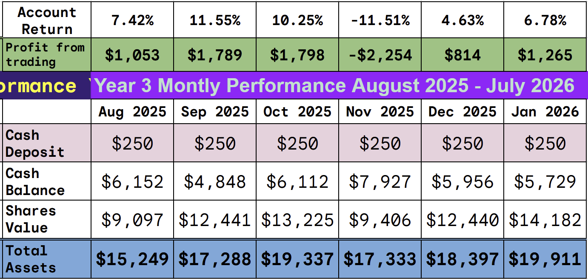
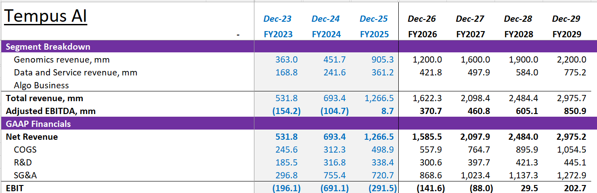
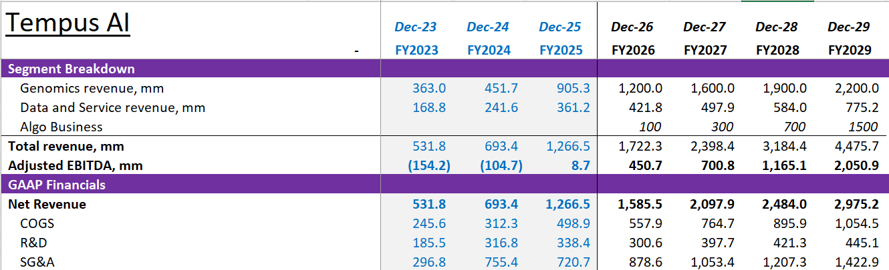
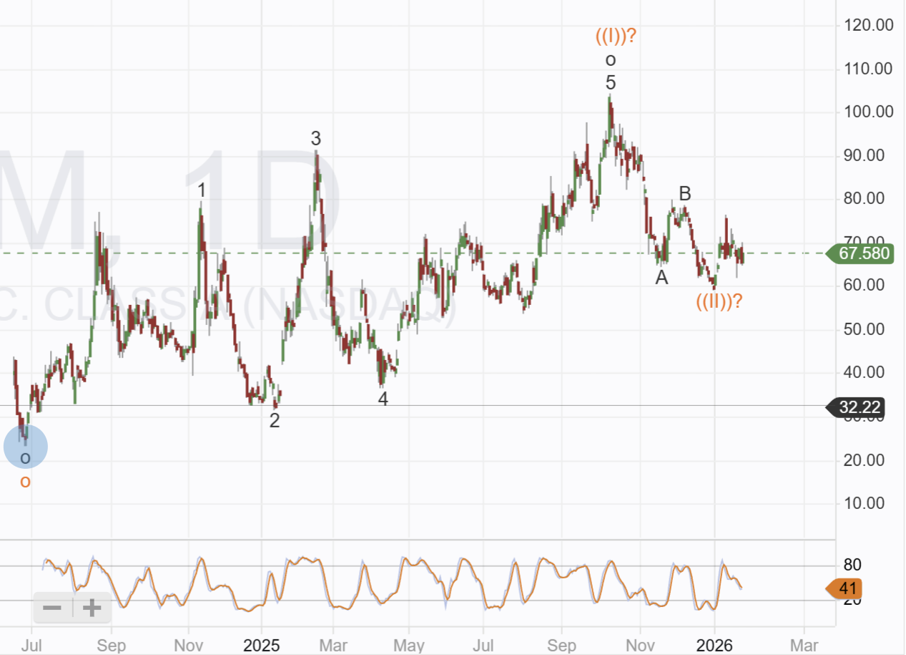

# Trade Alert: Rounding Out the AI sector 

*AI Diagnostics: A Strategic Deep Dive into a Trillion-Dollar Market*

This will be that final trade of January and the last in AI, next month the focus will turn to robots, I am a firm believer that Humanoid robots will become a big business in 2026 and have been performing an industry wide review looking for the smaller caps companies with significant exposure to an industry that looks like it might be dominated by the big tech companies.

In AI, data is key; the more data you have, the better the models you train and the greater your chances of monetizing them.

In business, cash flow is key; you need the scale to drive revenue and the operating efficiency to make a profit.

The company I am investing in today has both of these things. Industry-leading scale and a clinical database so large that it presents a sustainable competitive advantage and puts enormous barriers to entry around the business.

The company is in its hyper-growth stage and is still undervalued by the markets; it grew by 80% last year and reached positive EBITDA for the first time.

The company is larger than my typical target investments, but after a thorough review of the AI sector, I decided it was the clear leader with the highest chance of significant share price appreciation over the next 12 months. I will take a full-size position when the markets open today.

I will also close one trade today, booking a near 40% profit on a trade I made almost 2 years ago that has never quite played out as well as expected. We now have better places to put that money, but am grateful for the profit.

We have made outstanding profits in the past, more than 600% in two and a half years, but there are no guarantees. Please remember the disclaimer and the high-risk nature of my investing.

**Disclaimer:** I'm not a financial advisor and don't offer investment advice. This newsletter is a diary of my high-risk trading in small-cap emerging stocks; past performance doesn't guarantee future returns. Make independent investment decisions based on your own research and risk tolerance; you are solely responsible for outcomes.

**Paid below:** Please do not share. A couple of recent impersonators have turned out to be subscribers. Whatever your motivation, republishing this work will result in your subscription being cancelled without any refund.

## Trade Alert: Closing Cadre Holdings (CDRE)

It is now 600 days since I first bought Cadre, and it is not making the kind of progress I expected. I will exit today, but keep it on the watch list. The Nuclear division remains of interest, but it will need to see a significant ramp-up in the number of operating nuclear power stations to drive its revenue. Despite all the news and talk, it would appear that actually building a nuclear plant is taking longer than the market expects.

## Trade Alert #97: Buying Tempus AI (NASDAQ:TEM)

**Key Points:** I will take a full position in TEM of $600 approximately 3% of equity, when markets open today. I have been searching for an AI medical play for more than a year and believe this is the right one.

## The Investment Thesis

AI will be transformational in many industries. I have always believed that disease diagnosis and precision medicine will be one of the most positive aspects of this new technology. I have been following multiple targets, invested in several without success, but in recent weeks, one has passed the Commercial Validation hurdle and I am buying as a result.

## Key Takeaways

-   **Strong Financial Momentum**: Tempus AI delivered exceptional 2025 results with ~$1.27 billion revenue (83% YoY growth) and projects $1.59 billion for 2026 (25% growth), while achieving positive Adjusted EBITDA for the first time in Q3 2025
    
-   **Massive Multimodal Data Asset**: The company operates one of the world’s largest healthcare datasets with over 400 petabytes of data, 45+ million patient records, 8+ million imaging records, and 4+ million sequenced samples - creating a significant competitive moat
    
-   **Commercial Deployment:** Tempus Next is live in ~150 hospital,s screening 60,000+ patients monthly, this is the moat and the data collection device.
    
-   **Commercial Validation**: The FDA-cleared algorithms like ECG-AF have secured CMS reimbursement approval - demonstrating real-world clinical adoption beyond pilot programs
    
-   **Blue-Chip Pharma Partnerships**: Secured over $1.1 billion in Total Contract Value with major partners including AstraZeneca ($200M+ agreements), GSK ($180M minimum commitment), and 19 of the top 20 pharmaceutical companies for data licensing and AI model development
    
-   **Strategic Vertical Expansion**: While oncology remains the core pillar “at scale,” Tempus achieved major cardiology breakthroughs in 2025 with multiple FDA clearances and is expanding into neurology/psychiatry and kidney disease markets
    
-   **Digital Pathology Integration**: The January 2026 launch of Paige Predict, following the $81M Paige acquisition, enables AI-powered biomarker prediction from standard tissue slides, addressing critical bottlenecks when genomic sequencing fails due to insufficient tissue
    
-   **Target**: I am setting an initial target of $177 versus the current $67 trading level, the target is dependent on Algo success but without it we are still looking at a 25% increase this year.
    

Can AI diagnostics become a medical reality? Will an AI engine be able to look at a scan and diagnose problems, suggest next steps, and treatment plans better than a human doctor?

If it can, then the potential revenue is almost endless.

To make this a reality, you need three things: first, huge amounts of data to train models; second, a way to deploy the models to patients; and third, to be paid each time they are used.

Potential revenue is off the charts, an AI model that can read a cardiogram and predict problems doctors cannot see is of incredible value, and Tempus has exactly that.

Tempus is in two markets with near limitless potential: oncology and heart disease, worldwide the largest causes of premature death.

They call their models Algos, and today medical companies are paying over $100 per use of the cardiography Algo that reads ecg output. It is a proof point and suggests Tempus stands at an inflection point when it moves from a successful diagnostic lab to a SaaS AI software business perhaps worth ten times what it is today.

## The Business

Tempus is a flywheel; its diagnostic lab has amassed data on 45 million patients, more than 4 million samples have been sequenced, and almost half a million files have genomic, molecular, imaging, and clinical data. 8 million imaging records make this the deepest and richest medical data set in the world.

The data set continues to grow, the more patients they sequence, the more data they generate, and most importantly, they collect all the data! Not just the genomic sequence, the Tempus AI system is connected to more than two-thirds of all medical providers in the US. 7,000 oncologists regularly order tests from Tempus and write notes on the system linking the data with scans, ECGs, and any other tests performed, including clinical notes. They know who the patient is, what drugs they are taking and how they are responding. They know the molecular composition and have sequenced the genomics for diagnosis.

Over the last ten years, this data set has grown to over 400 petabytes. Putting that into context is difficult, but Facebook has around 300 petabytes of data, Waymo has 20 petabytes, and the average brain has 2 Petabytes. Safe to say it is colossal.

To manage and interrogate the data, Tempus has acquired a datacenter with more than 1,000 H200 AI chips and is building a second center with similar compute power. All of the data is de-identified so that medical research companies can pay for access to it.

The Tempus platform matches the patient data with other key datasets like scans and other health care issues such as hereditary concerns. It is the only platform doing this at scale and its scale is unprecedented

Tempus operates through two segments: **Genomics (Diagnostics)** and **Data & Applications**.

-   **Genomics (Diagnostics):** This segment serves as the primary data generator for the ecosystem. Tempus provides a comprehensive suite of Next-Generation Sequencing (NGS) tests, primarily for oncology (e.g., xT, xF, xR), while expanding into hereditary testing, cardiology, and other disease areas. By offering these diagnostic services to providers, Tempus aggregates de-identified clinical and molecular data at scale. Tempus runs the tests and bills the insurance company who pay Tempus.
    
-   **Data & Applications:** This segment monetizes the aggregated data through licensing and software solutions. The “Insights” business licenses the company’s library of multimodal data to biopharmaceutical companies for drug discovery and development. Additionally, the “AI Applications” portfolio includes algorithmic diagnostics (”Algos”) and clinical decision support tools (e.g., Tempus Next, Tempus One) that leverage this data to improve patient care pathways.
    

## Diagnostics

This is a genomics business and a genetic business. Tempus offers both liquid and solid tumour profiling. Tempus acquired Ambry to add hereditary risk analysis. Ambry operates at scale and is the largest in the field. When acquired, they provide germline testing to identify those who might be at heightened risk due to hereditary conditions.

The Genomics business feeds the data segment, and it does it whilst making a profit. As testing grows, the database grows, fueling better models and hence better Algos. In 2025, they ran over 800,000 tests and are growing at 28% YoY.

The testing market is highly competitive, and the diagnostics sector grew 110% to $955 million in revenue. The US market has large, established players like Caris Life Sciences and Guardant Health. Tempus maintains a competitive advantage by being the only one-stop shop, but competition will always compress margins. Still tempus are guiding to long term +20% growth in this sector.

It is all about the data. Tempus is connected to the hospitals ordering the tests, which brings in the data, and the data makes the tests smarter, a flywheel in action.

Tempus has the scale included in its staffing. It employs more than 700 software engineers, 400 PhDs, 100 MDs. This has led to world leading research and the publishing of seminal papers across their field of expertise, each leading to a change in medical practice.

This flywheel effect is a significant and sustainable competitive advantage, most competitors fall into one silo or another and none have the amount of data Tempus do and in AI data is everything.

## Tempus and Artificial Intelligence

Monetizing the vast data bank they have built is done in two parts: selling access to the data and using the data to develop the Algos. Selling the data will have a similar growth profile as the diagnostic business; it is already at scale and a proven entity.

## The Data Business

The data business revenue passed $300 million in 2025. It is mainly sold to Biopharma who use it for trial design. 19 of the 20 largest pharma companies buy data from Tempus, and Tempus has over $2 billion in licensing agreements in place. The data business is high-margin recurring revenue, and it grew 68% in Q4 2025.

User retention is over 120%, that means every user increases their spend with Tempus by 20% each year, it is another proof point of the data they hold. Companies want more access as they realize the depth of what is available and how they can use it for their internal AI and drug discovery platforms.

There is limited, if any, competition in the data sector.

## The Algo Business

My grandfather was a small businessman, an entrepreneur, and part of the British Special Forces in WWII. He was run over by a German tank in North Africa, remaining silent so as not to give his position away. He was respected and somewhat feared in our local community. I have a vivid memory of him trying to convince my Father to invest in Microsoft at the IPO rather than a computer manufacturer. To this day, I remember him banging on the table and shouting, “It's all about the operating system, it’s the F\*\*ing dogs bollocks”. The investment they made remains the largest and most profitable in our family fund.

I think he would say the same thing about Tempus its all about the Algos. The Algo business could see near-exponential growth in the coming years. A game changer for the industry and a big revenue generator.

Algos are the AI agents trained on the dataset. At the moment, the division has minimal revenue because Tempus is not being reimbursed for the majority of its Algos even though some are operating at scale. Tempus has numerous Algos in operation that provide information to physicians, but until they are FDA-approved, they cannot generate revenue.

In the recent investor presentation, Tempus provided one case study.

They have a series of algos that read a 12-lead electrocardiogram, predicting undiagnosed atrial fibrillation and undiagnosed ejection fraction.

One of the Algos was recently approved for reimbursement and receives $128 per algorithm run. The CEO guided this being available to millions of patients in the short term.

3% of patients who have an ECG are told all is ok, only to have a heart attack within 12 months due to problems not diagnosed at the time. Northwestern Medicine is the first provider to roll this out at scale.

This one Algo will be worth hundreds of millions of dollars a year, and Tempus expects to have thousands of algorithms in the near future.

AstraZeneca and Pathos have signed agreements with Tempus to develop oncology foundational models, agreeing to pay $200 and $350 million, respectively, for delivery in 2026 before moving to a subscription model.

### **Strategic Goal: Enabling Precision Medicine at Scale**

Tempus aims to transform the fragmented healthcare system by connecting genomic data with clinical records to inform personalized treatment decisions. The company’s strategic vision extends beyond oncology into cardiology and digital pathology, its recent acquisition of **Paige** added approximately 7 million digitized pathology slides to its dataset.

The company’s “Intelligent Operating System” makes use of this by:

1.  **Structuring Data:** Ingesting unstructured healthcare data (clinical notes, pathology slides) and structuring it for analysis.
    
2.  **Delivering Insights:** Using AI to identify care gaps (e.g., undiagnosed cardiac conditions) and matching patients to clinical trials via the TIME trial network.
    
3.  **Closing the Loop:** Providing real-time, AI-driven clinical decision support to physicians through tools like the AI co-pilot “David,” recently integrated into Northwestern Medicine’s EHR platform.
    

The Operating system will identify gaps in health care, suggest tests that should be performed, and offer potential diagnoses, as well as the most up-to-date treatment options.

That's a flywheel: the OS uses the data it has to suggest tests, uses the tests to generate more data, provides treatment plans based on the tests, and records the results of the treatment to inform future decisions.

**Preliminary Full Year and Fourth Quarter 2025 Results**

Tempus released preliminary, unaudited financial results this month, it showed solid growth across its business

-   **Full Year 2025 Revenue:** The company estimates total revenue of approximately **$1.27 billion** , representing a year-over-year increase of roughly **83%** . Organic growth, excluding the impact of the Ambry Genetics acquisition, was estimated at approximately **30%**.
    
-   **Fourth Quarter 2025 Revenue:** Preliminary revenue for the fourth quarter is estimated at **$367 million**, an **83%** increase compared to the same period in the prior year.
    

**Segment Performance:**

The diagnostic sector is currently driving revenue and profitability, but its real value lies in the data it generates, and Tempus is only just beginning to monetize it.

-   **Diagnostics:** This segment generated approximately **$955 million** in full-year revenue, growing **111%** year-over-year. This performance was driven by a **26%** increase in Oncology volumes and a **29%** increase in Hereditary volumes. In the fourth quarter specifically, Diagnostics revenue reached roughly **$266 million** , with Oncology volume growth accelerating to **29%**.  
    
-   **Data and Applications:** Full-year revenue for this segment is estimated at **$316 million** , a **31%** year-over-year increase. The Insights (data licensing) business was a key driver, growing **38%** for the full year. In Q4, Data and Applications revenue reached approximately **$100 million** , with Insights growing **68%** year-over-year (excluding the impact of the AstraZeneca warrant in Q4 2024).
    

### **Record Contract Value and Operational Metrics**

Crucially, Tempus achieved a strong net revenue retention rate of **126%** in 2025, indicating that current customers are substantially increasing their spend with the company.

A key indicator of future revenue and growth potential is the company’s backlogs. Tempus reported a record Total Contract Value (TCV) exceeding **$1.1 billion** as of December 31, 2025, signing data agreements with over **70 customers**, including major pharmaceutical players such as AstraZeneca, GlaxoSmithKline, Bristol Myers Squibb, Pfizer, and Novartis.

## Price Targets

I prefer to develop mathematical models of these businesses to work out a fair value. In this case, the problem is the Algos. I think they will grow exponentially in the coming years, but it is impossible to predict the start date or the take-up rate.

We are at the very beginning of the cycle, so any forecast would contain an unacceptable amount of error.

The Algo business could be worth $10 million, or $10 billion a year by 2030. It could start this year or might not crank up until 2028.

Taking a conservative approach, assuming the Algo business doesn’t work, and that the business continues to grow its data business and testing business in line with management predictions, gives the following.

The EBITDA multiple seems to be around 20 for companies in this industry, which implies a 2029 value of $16 billion when discounted back. Today’s market cap is $12 billion, so we have a minimum upside of 25%.

If the Algo business does go into hyper growth, as I am predicting, then the model suggest a much higher valuation.

The fair value using a full DCF jumps to $177, little point in trying to use a multiple as there are no peer companies to compare with.

The technical chart suggests a share price of $300 ( 400% by 2029). It is an automatic EW charting package, and its main use is to ensure I am not buying near a top. I am assuming the end of December marked the low and that a new move higher has begun. It also suggests that If the stock drops below $57 I will have to rethink the thesis.

---

*Source: [Strategic Wave Trading](https://stephentobin.substack.com/p/trade-alert-rounding-out-the-ai-sector)*
