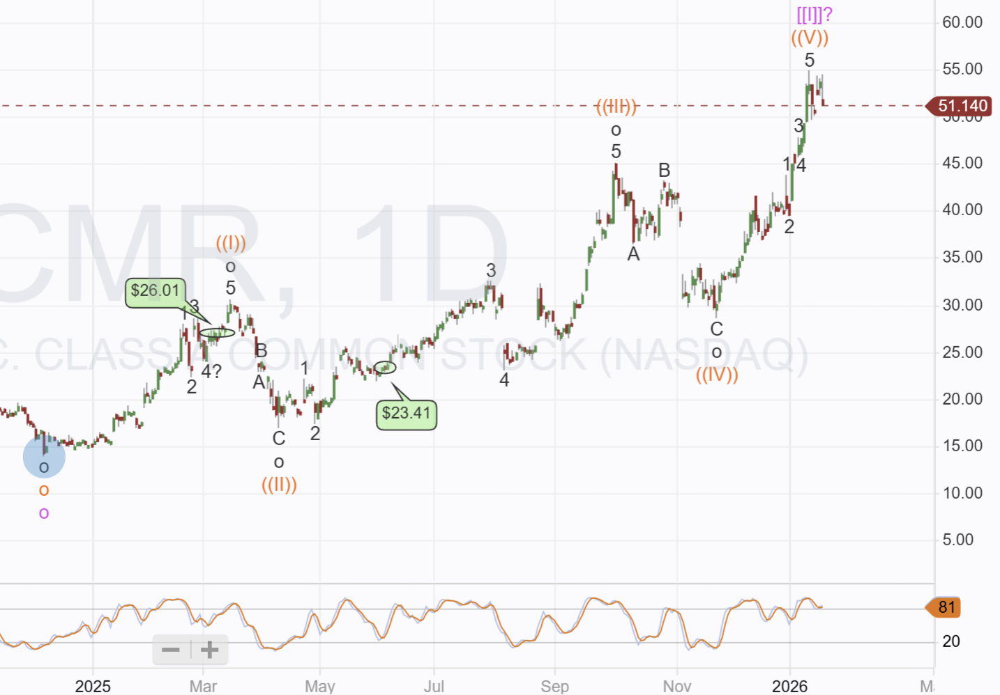
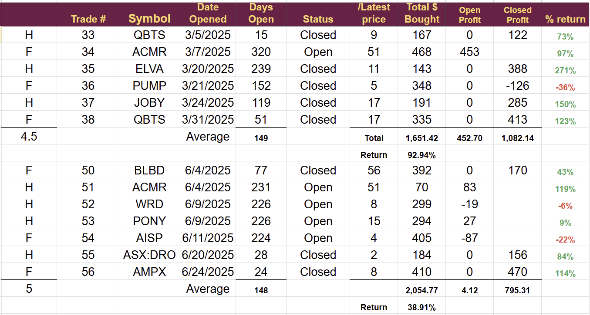

# Trade Alert: Taking Profits

*Target close with earnings on Tap.*

It is important to book profits, and my review of last year emphasized the importance of closing near a top. One of our holdings appears to be near a top, and is close to the target.

I think it is time to book those profits. Of course, you never know for sure until you have hindsight if you are near the top, but the trade is up 119% in 231 days, meaning it will be an excellent return regardless of what happens from here.

It will be the first trade closed in 2026. The account has grown by 8.5% so far this year, with our holdings returning 12%.

During today's session, I will close the two positions I have in ACMR. The stock is very close to the target set when I opened the trade, and risks are elevated ahead of earnings due next week. Of course, the earnings could go either way, and I may be closing early.

Unless we see a move higher in the market, I will exit with a mid-price order. Pre-market, the price is at $51.68. I would consider anything above $51 a good result. I will follow the market and allow the trade to run a little if it is going higher, but I will exit today and report my exit price when I do.

The original thesis for this trade was the likely growth in Chinese domestic chip production and the demand for ACMR’s machines. The company builds machines for cleaning and packing silicon chips during the production cycle.

The thesis would seem to remain intact, but ACMR management has shifted some of its focus and appears to be concentrating more on developing a US manufacturing operation and bringing it up to scale.

I think the US operation has a good chance of success. At a trade show late last year, I listened to an Intel engineer who had been involved with testing machines supplied by ACMR. He said they were at least as good, if not better than, the machines they were currently using, but said orders would be constrained by export and import restrictions on technology.

If I were a longer-term investor, I might consider holding to see how this plays out, but with the trade close to the $55 target, the chart (shown below) suggesting overbought territory, and the heightened risk with earnings and geopolitical tensions, I have decided to book profits.

The charts are automatically generated and show my entry points in Green. One thing that came out of my review of 2025 is the importance of booking profits at times like this, and even more so, the importance of buying any dip in price that may follow. Should ACMR see a price drop, I will consider re-buying.

The diagram below shows the two ACMR trades and the other trades taken in the same month.

March 2025 was a very good month. 3 full trades and 3 half-size trades delivering 93% return and 5 out of six in the money. Average days open was 149, in line with the long-term average.

June 2025 was not quite as solid, with 3 full trades and 4 half-size trades. After 148 days, 4 remain open (including ACMR). Average return is 39%, which is 1% below the 180-day target, but with trades still open, that could well change.

---

*Source: [Strategic Wave Trading](https://stephentobin.substack.com/p/trade-alert-taking-profits)*
