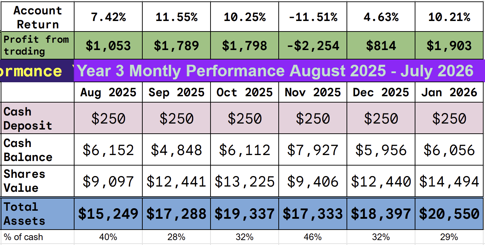
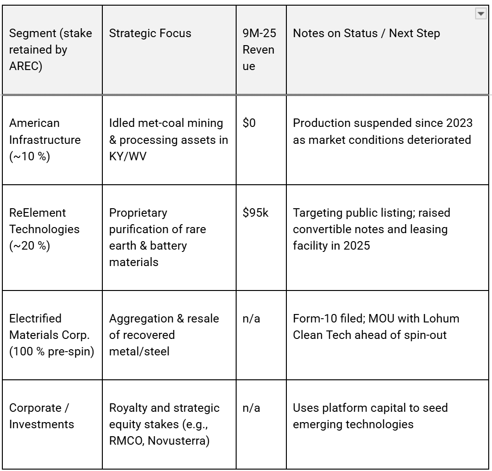
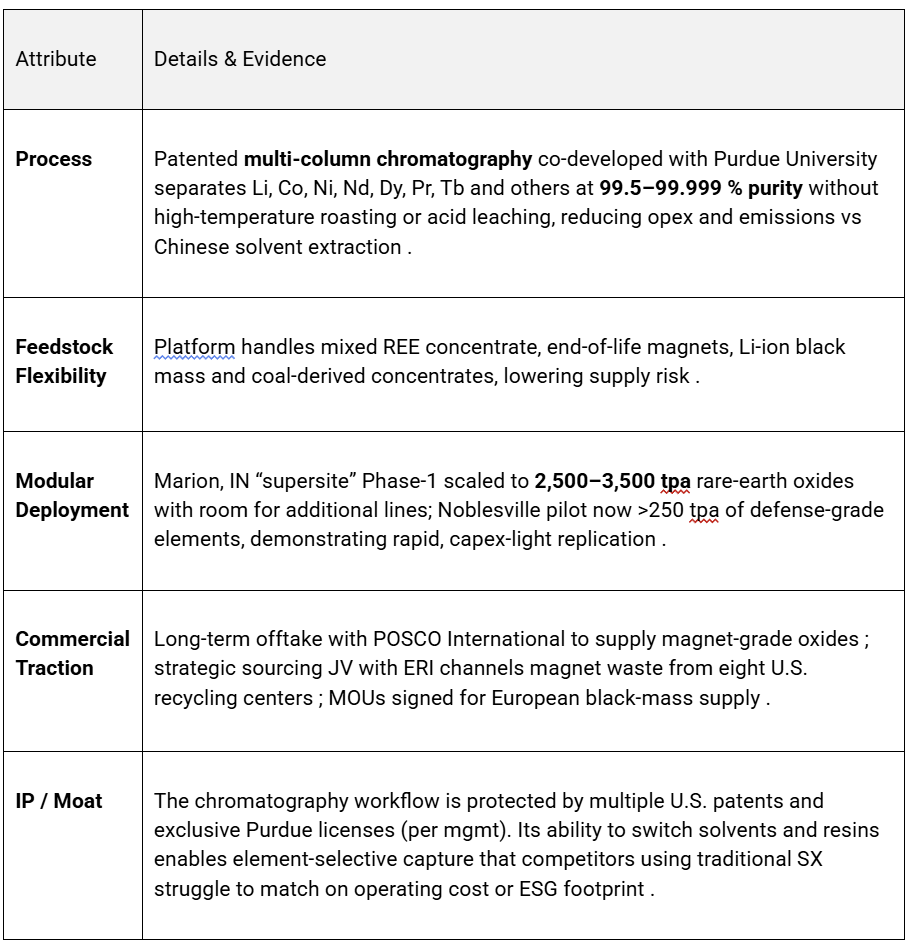
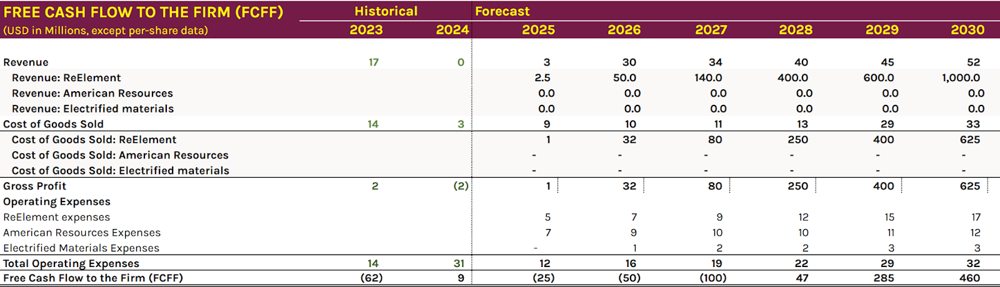
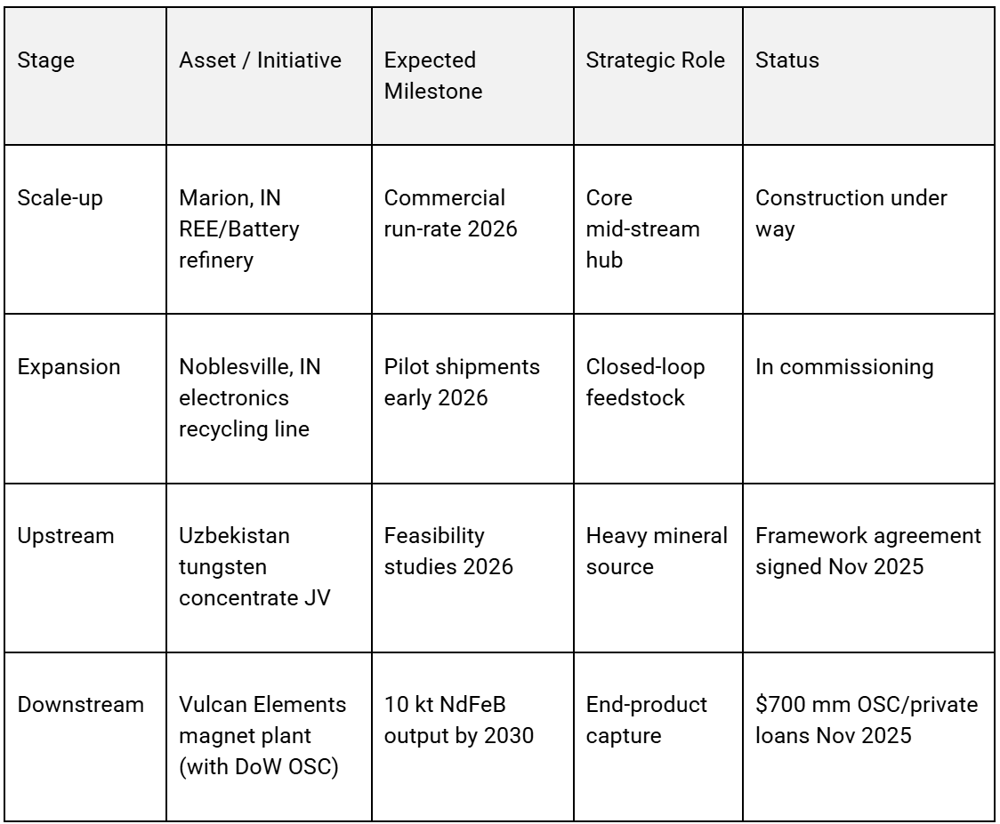

# Trade Alert: There are no rare earths just rare earth refining facilities.

*REE- an in demand commoditiy where China holds all the cards *

In today’s modern, never-ending tress points, few terms are as misunderstood as “Rare Earth Elements” (REEs). To the casual observer, the name suggests a desperate global search for microscopic deposits hidden in the furthest corners of the globe. But geologically speaking, this is a myth.

The truth is far more industrial: **There are no rare earth metals; there are only rare refining facilities.**

Contrary to their name, most rare earth elements are remarkably common. Cerium, for instance, is the 25th most abundant element in the Earth’s crust—appearing more frequently than copper. Even the “rare” heavy elements like Dysprosium or Terbium are far more abundant than precious metals like gold or platinum.

The “rare” in their name is a historical relic from the 18th century, referring to the difficulty of isolating them from the minerals in which they reside. These elements are “social” by nature; they are almost never found in concentrated veins like gold. Instead, they are spread thinly across the crust, mixed together in complex chemical bonds that are notoriously difficult to break.

### **The Great Refining Chokepoint**

If the materials are everywhere, why does one nation—China—control over 90% of the market for refined rare earths? The answer is not that they have all the dirt; it is that they have all the **kitchens**.

Traditional refining is a brutal, multi-stage chemical marathon. To separate Neodymium from Praseodymium, the industry has historically relied on **solvent extraction**: a process involving hundreds of “mixer-settler” tanks, thousands of gallons of toxic acids, and a massive environmental footprint. Because Western nations spent decades outsourcing this “dirty” middle step to avoid environmental and capital costs, the specialized infrastructure to perform these separations effectively vanished from the West.

Today, a mine in California or Australia can pull ore out of the ground, but without a refining facility, that ore is just expensive rocks. Until recently, nearly all “Western” ore had to be shipped back to China for the actual refining.

### **The Shift to “Technology-First” Refining**

The crisis of 2026 (we need these REEs for defence, just about any electric engine, guidance system, sensing system, and computer) is not a mining crisis; it is a processing bottleneck.

Several companies are developing new technologies that mean refining is moving from massive, chemical-intensive plants to modular, high-precision facilities. Today I will take a position in a second emerging technology refiner, a different technology with high potential and to help matters along a US based technology company with DoD backing, proven technical capabilities and large feedstock acquired.

### **The Future of Resource Sovereignty**

The geopolitical “arms race” for critical minerals is finally focusing on the correct target. Building a mine takes a decade; building a modular refining unit takes months. To achieve true resource independence, the focus must shift from finding more “rare” dirt to building more “rare” facilities.

When the refining capacity is decentralized and clean, the “rarity” of these metals disappears entirely. We are finally realizing that the power doesn’t lie in who owns the mountain—it lies in who owns the recipe.

**Disclaimer:** I'm not a financial advisor and don't offer investment advice. **This newsletter is a diary of my high-risk trading in small-cap emerging stocks**; past performance doesn't guarantee future returns. Make independent investment decisions based on your own research and risk tolerance; you are solely responsible for outcomes.

We are having a big January, but that does not guarantee we will have a great 2026

## Trade Alert # 96: Buying American Resources (AREC)

Key Takeaway: I will buy a half-size position in AREC, $300, approximately 1.5% of equity. Risks abound, but now is a good time to begin building a position.

AREC operates as a holding company. It began as a mining company, buying distressed mining assets in Kentucky, and has licensed technology to refine the output from those mines, delivering high-grade rare-earth metals. The technology has proven its ability across multiple feedstocks, enabling the separation of almost all REEs from them.

AREC has DoD backing, has finally secured the finances to build the commercial-scale facility, and has multiple long-term agreements in place. The company is not out of the woods, as we don’t yet know the final cost of production.

The announcements that led to the recent price jumps were, firstly, a $200 million finance facility made available by Transition Equity Partners. A key important step suggesting AREC will be capable of funding its immediate growth and secondly the press release on January 20th that the company had successfully produced 99.9% purity samarium a metal critical for high performance metals used in jet engines and guided missiles.

The production of samarium, following the earlier release of protocols for it, was the commercial validation I had been waiting for. It means I am a bit late but with much reduced risk.

**AREC Is a Holding Company**

The structure of AREC is important; the key technology is held in two subsidiaries, ReElement (where AREC owns 19% of the shares) and the wholly owned Electrified Materials. AREC intends to float both of these subsidiaries in the next year or two. The list of operating subsidiaries is

The company was a coal miner; revenue collapsed in 2024 when coal mining operations were idled. The balance sheet is a mess, with negative shareholder equity of almost $100 million and debt exceeding $200 million. They have a history of covenant breaches, leaving razor-thin liquidity.

It was these financing issues that kept me out late last year. I was concerned they would not be able to raise the necessary funds, but the recent investment by a globally respected equity firm changes that perspective. Prior to the recent investment, I calculated they had less than a month’s cash runway.

Individual insiders own 11% of the company and the general public 60%, the rest is with Wall Street. One Wall Street firm was selling heavily until December, when positive news began to break, and has since resumed buying shares.

## The Technology

ReElement has proprietary Chromatographic Separation technology developed at Purdue University. The technology is adapted from the pharmaceutical industry and capable of producing a wide variety of REEs, with feedstock agnosticism.

The technology competes with the dominant solvent-based technologies and is said to be 100 times more efficient and generate 80% less waste. It also competes with other emerging technologies, such as the FJH technology at Metalium, which we have already invested in. China is the dominant force, with large-scale solvent extraction facilities.

ReElements technology can refine mined ores as well as coal waste streams and byproducts. The technology can produce heavy REE metals like Dysprosium and Terbium, crucial defence metals with no current Western-based refining facilities

## Revenue Forecasts

AREC is pursuing a late 2026 listing for ReElement. The founder and CEO of AREC is stepping down as CEO to become Executive Chairman to focus on ReElement, with a current director stepping up to CEO of AREC. ReElement is the company’s REE refining arm, and I think that is where much of the value lies.

Electrified materials also has a new CEO; they are currently in the review stage of filing an S1 to take this subsidiary public. Electrified Materials is the company's metals recycling arm and uses density-based mechanical separation to produce clean, mixed REE powder, which is sent to ReElement for refining.

AREC is also a shareholder in Royalty Management Corporation, also known as American Carbon or Metallic Carbon. This company is outsourcing restart operations to third parties for AREC-owned mining facilities, providing AREC with an upside royalty stream for minimal capex. Ongoing mining site reclamation yields REE-bearing coal refuse, which is fed into the ReElement pipeline.

AREC continues to explore opportunities to invest in adjacent companies and is working hard to acquire mines that will deliver feedstock to its ReElement operations. Management is currently investigating mining operations in Southeast Asia to add to its current assets in Kentucky and West Virginia.

They have a deal to build sites in South Korea, in fact in the recent earnings call the CEO said they currently have more deasl and requests than they can count.

.

Currently, American mining experts concentrate on China for refining, and ReElement hopes to change that by developing large-scale facilities in the US. ReElement will build a large-scale commercial refining site and also offer local small-scale sites to junior miners, allowing them to end their “export to China” operations.

The $200 million from TEP and the US DoD office for strategic capital is funding the development of a 10,000-ton-per-annum facility in Indiana, which will complement the existing small-scale facility in that state.

The existing facility is fully operational, producing rare earth oxides 7 days a week for commercial validation

ReElement has a wholly owned subsidiary, “Kentucky Lithium,” using its technology to recycle existing coal deposits into usable lithium carbonate for lithium batteries.

## The Business Model

American Resources is executing a **pivot from idled metallurgical coal assets toward an integrated, domestic critical‐mineral supply chain** anchored by its 20%-owned ReElement Technologies platform. (In February 2025, AREC completed a spin-off distribution, giving one share of ReElement to shareholders for every three shares of AREC they held)

Management frames the near-term roadmap around four mutually reinforcing pillars

1.  **Management Priorities**
    
    **Commercialize ReElement’s modular refining technology** and bring the flagship Marion, IN facility to full production beginning 1H 2026, scaling toward 40,000 sq ft of capacity for mixed rare-earth and battery metals separation.
    
    **Secure low-cost, diversified feedstock** via recycling, mine concentrates and government stockpiles; a $5 mm revolving credit line with Old National Bank finances ongoing procurement of end-of-life material and ores.
    
    **Lock-in downstream demand** through multi-year offtake agreements—e.g., POSCO International for >3,000 t of separated Dy, Y, Tb and NdPr through 2030.  
    
2.  **Demonstrate product qualification** beyond light REEs; commercial protocols for 99.9% samarium and samarium–cobalt magnet inputs were validated January 2026.
    
    [
    
    
    
    
    
    ](https://substackcdn.com/image/fetch/$s_!lleo!,f_auto,q_auto:good,fl_progressive:steep/https%3A%2F%2Fsubstack-post-media.s3.amazonaws.com%2Fpublic%2Fimages%2F39ac029b-90a8-4709-9b6e-db7d417f070e_1124x927.png)
    
3.  Technology Commercialisation
    
    ReElement’s solvent-free chromatography process claims **lower capex, faster deployment and 99.9%+ purity** across multiple elements, enabling rapid replication at satellite sites and co-location with mining operations.
    
4.  Capital Allocation & M&A Rationale
    
    **Capex-light build-out funded by public–private programs:** $150 mm EXIM Bank LOI (June 2025) targets the “nation’s largest critical-mineral refinery”; OSC loans provide $80 mm direct to ReElement plus $620 mm to partner Vulcan.
    
    **Selective equity issuance and converts** supplied $145.7 mm financing cash-in during FY 2024–25 to bridge development burn.
    
    **Strategic alliances over outright acquisitions:** recent deals (SAGINT blockchain traceability, Transition Equity $200 mm facility) are structured to enhance ecosystem reach without balance-sheet strain, consistent with management’s “asset-light, tech-heavy” thesis.
    

Overall, the company’s growth path hinges on **de-risking first-plant execution, securing long-term offtakes, and leveraging federal industrial policy capital** to achieve full vertical integration from recycled scrap to magnet manufacturing within this decade.

## **Governance red-flags**

Repeated **material weaknesses in internal controls** tied to limited accounting staff and untimely reconciliations (self-identified Q3-24). **Financial restatements** and an $11 m litigation accrual for 2023, plus the auditor's dismissal in Nov-25, underscore reporting risk. Nasdaq notices for bid-price (Jul-25) and delayed annual meeting (Jan-26) indicate compliance lapses, though management has remedied or outlined plans in each case.

## Conclusion

Another super risky high-tech stock, I had been waiting for recent announcements, but apparently so had the market, and the stock shot up 25% in one day. The financing and production announcements de-risk the investment, but the price move adds the likelihood of a pullback.

The mathematical model suggests a fair value greater than $88, and the technical chart suggests $11 by June this year. Simply Wall street forecasts $66 and Wall Street $6.75 within 12 months. Such a divergence is unique and perhaps reflects a unique company with a unique technology and risk profile.

Given the high risk of a pullback, I will only take a half-size position. The chance of extraordinary gains is also high, so I will add to my position if we do see a pullback.

---

*Source: [Strategic Wave Trading](https://stephentobin.substack.com/p/trade-alert-there-are-no-rare-earths)*
