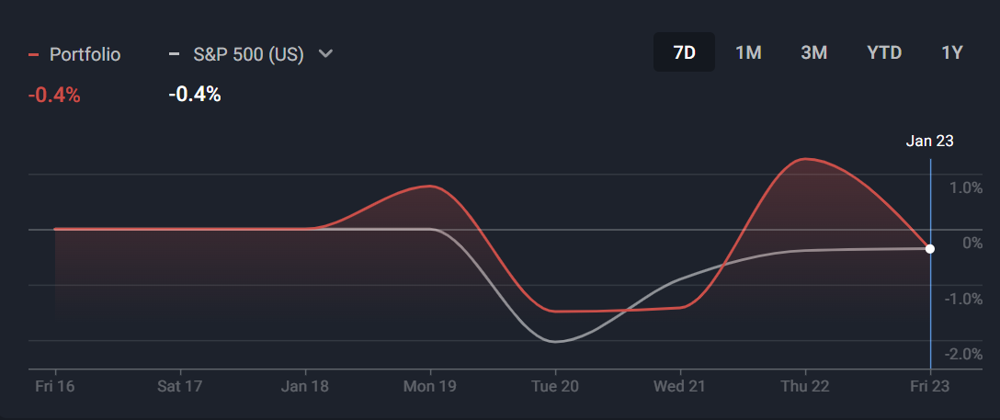
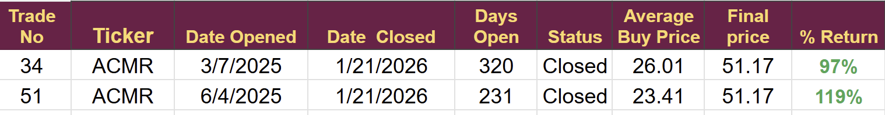
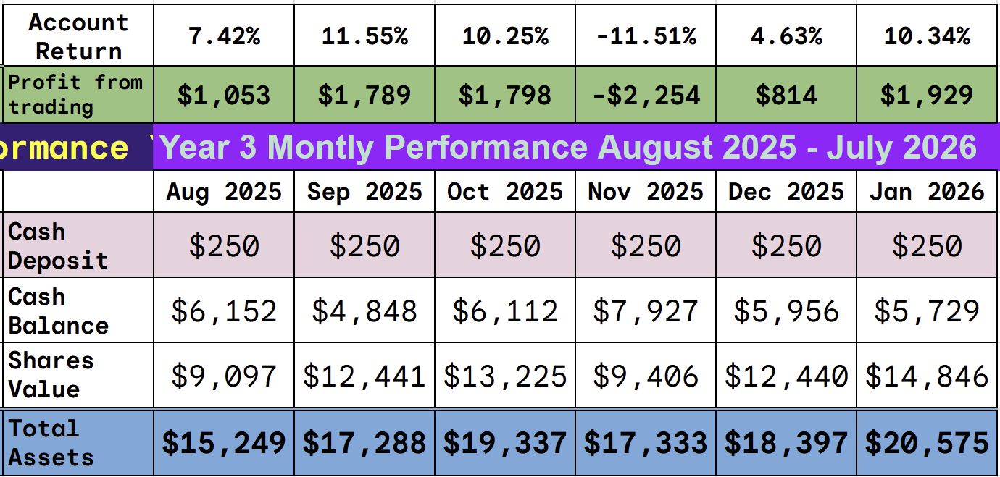
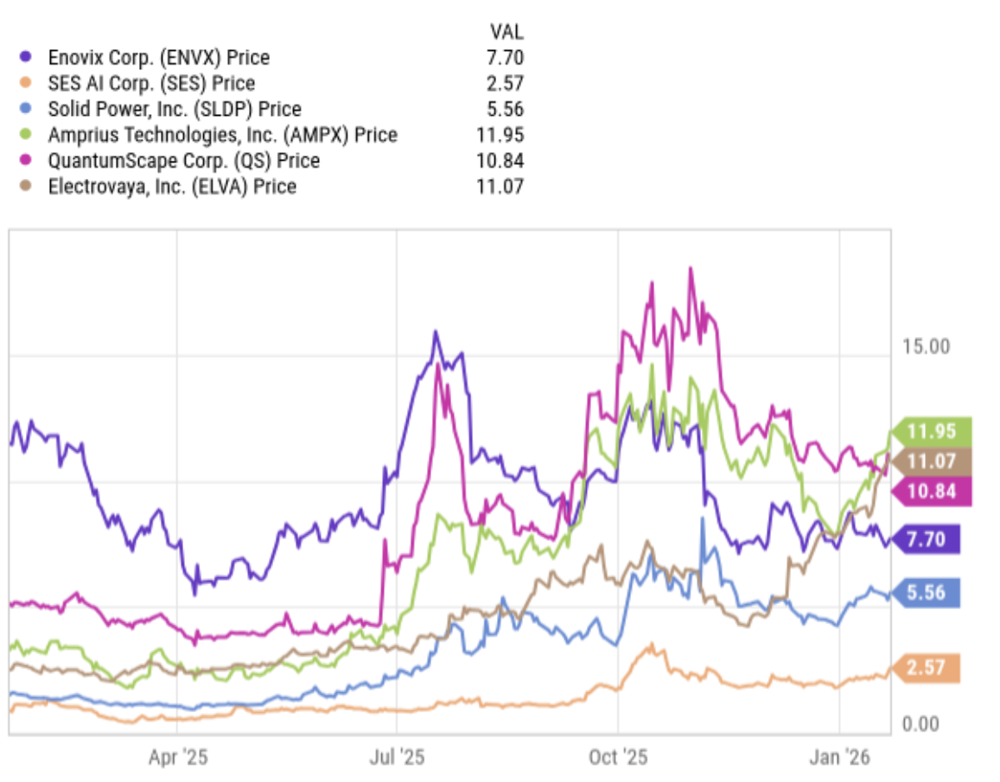
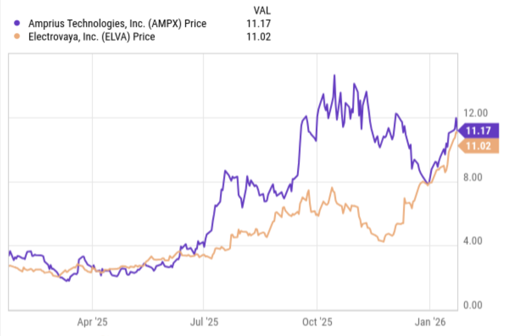
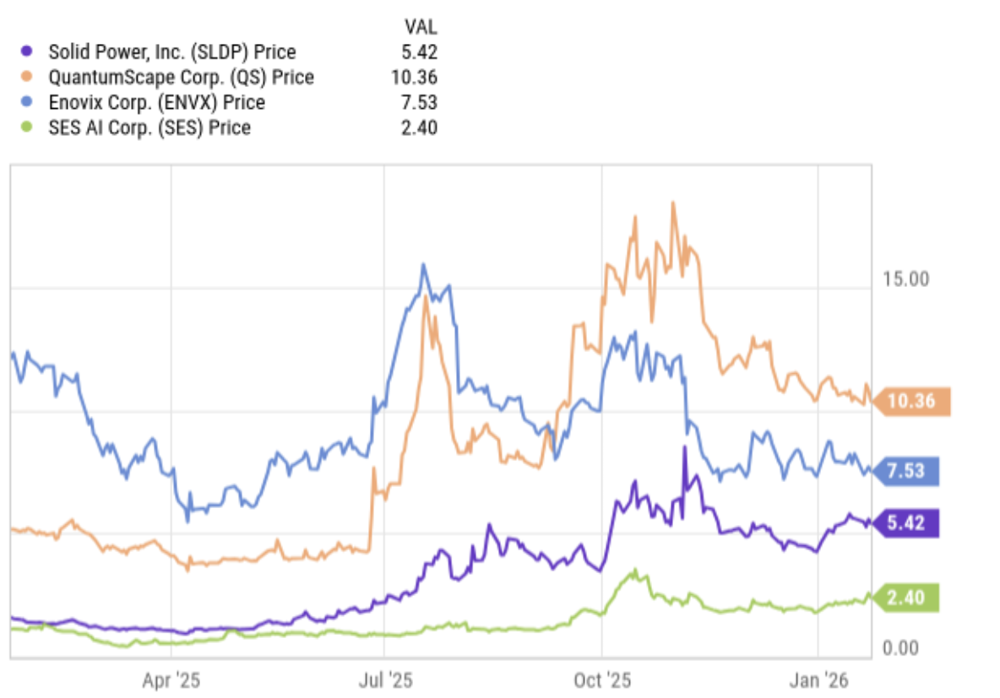
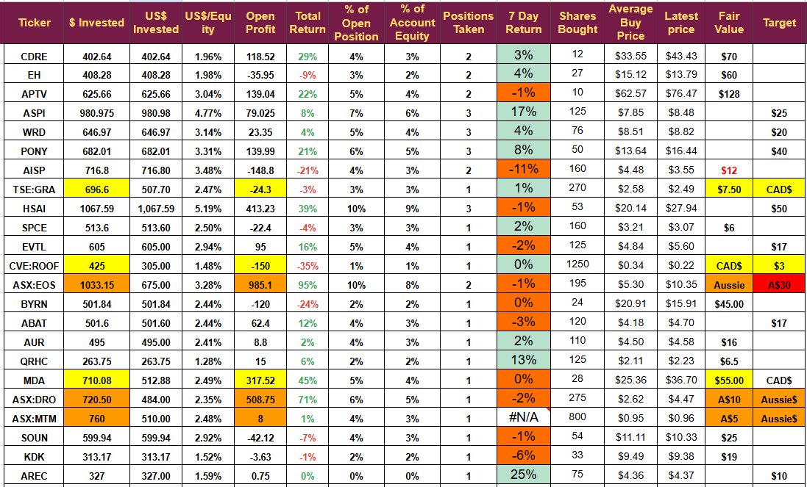

# Week 3 of 2026: Commercial Validation leads to Alpha

*Cash Flow Generation is the Alpha we seek*

This week I want to look at commercial validation, a key part of my strategy, but first, the portfolio performance.

The portfolio closed a fraction of a percent lower this week, matching the S&P 500's performance exactly.

Volatility continued, with the portfolio reacting to geopolitical concerns alongside the rest of the market.

## Trading

I closed one position this week, booking a nice profit, and opened one new position, which is in the money by a fraction of a percentage point.

The position closed was ACM Research, and we exited both trades in the company.

Although management reduced guidance for the current year in earnings released the day after the closure, they increased guidance for next year, so the company will be added back to the watch list.

## The Portfolio

The portfolio as a whole remains above target as it approaches the halfway stage of the five-year project to trade $250 a month into $100K.

Average monthly return is 5.5% against a target of 5.2% needed to hit the $100K in Aug 2028 and $500K by Feb 2031.

These results are excellent and continue a trend we have seen for several years, but they don’t guarantee future success. They do point towards volatility, so if you are following the plan, please keep position size in check and tread carefully as I do.

I am only risking $250 a month, a figure I can easily afford to lose, and with a realistic prospect of $500K before I reach statutory retirement age, it is well worth the risk for me.

If you are considering following, please read some of the other weekly updates, which cover the entire strategy and what you can expect. You might start with the [New Subscriber edition](https://stephentobin.substack.com/p/weekly-update-new-subscriber-addition?utm_source=publication-search).

## Emerging Technology Investing

The trading plan is designed to take advantage of new technology with disruptive potential that offers exponential growth.

The technologies fall into two types:-

The first is an entirely new product that no one has built before. eVTOL or flying taxis are examples of this type. We have nothing to compare them to, and they will bring an entirely new industry that could disrupt intra-city travel enormously.

The second type is technology that aims to replace an existing product by providing incremental improvements; examples include new battery technologies such as solid-state batteries, silicon anodes, ceramic separators, and new electrolytes. All of these technologies aim to improve the performance of existing lithium batteries.

This second type accounts for over 75% of my investments, and one of the key rules I have for this section is “commercial validation” . I will not buy unless the company’s technology is commercially validated.

I define commercial validation as someone buying the products to use them, not to test them or develop them. In batteries, it means an equipment manufacturer is buying the technology, putting it in a product, and selling that product to the end user.

The commercial validation rule increases my probability of choosing winners; it doesn’t guarantee it, but we are just trying to put the odds in our favor. We can’t ever make the odds 100%

## A Case Study

This week I have been analysing the battery companies I follow. I have 24 companies in my battery sector, but I am considering six for investment in the coming weeks.

The price performance of the six over the last 12 months is shown here.

The chart shows a clear correlation among all the companies (meaning their prices follow a similar pattern, with the peaks and troughs roughly aligned).

If I separate them according to commercial validation, things become much clearer.

Electrovaya and Amprius both have commercial validation. Electrovaya has reported growing sales of its batteries in the materials handling and robot markets, whilst Amprius has reported growing sales of its silicon-anode batteries in the drone market. These companies' batteries are not being tested; they are being used in products sold to the enduser.

Isolating the two companies with commercial validation, we can see a clear trend, and that trend is upward. (I invested in both of these companies last year doubling my money but perhaops not making as much as I should have)

Booth companies have seen their share price increase from below $3 to over $11. That’s over 300%, and it shows in the steep move higher in the graph.

The remaining companies have all reported business improvements, driven by new investments and expanded joint developments. SLDP has reported growth in revenue, but so far those sales are going for testing, as yet its products are not being sold to end users which means it is not commercially validated.

This is the same chart for the non-commercially validated.

The trend is much flatter and more volatile, but some companies have still done well. QS and SLDP are both up 100%, ENVX has dropped, and SES is little changed.

I believe that once these companies achieve commercial validation, their share prices will appreciate as ELVA and AMPX have this year. I will use my rules to try to catch that commercial validation growth phase.

The “commercial Validation” rule ensures I only buy companies like AMPX and ELVA and manage to avoid the ENVXs of the world.

I must stress that I think ENVX has excellent technology and will more than likely be a big success, rewarding long-term investors handsomely, but last year was not the time for me to buy.

The commercial validation rule is more about getting the timing right; these emerging technologies can be in testing and approval for many years before they become commercially validated. During the testing phase the stock can just drift or fall as the company is forced to raise money to keep operations going whilst they go through various approval processes.

It doesn’t matter how good the tech is, but it will not generate cash until it is commercially validated, and cash flow is the true driver of alpha. I base my fair value for shares on cash flow and see it as the crucial valuation figure.

Of course, the rule, like all of them, is not perfect. I missed out on SLDP's rise as well as the growth in QS, but it did ensure my money was in the companies that increased the most.

I did buy SES when they announced their first orders but the revenue did not grow in the way I had hoped. I am no longer convinced the tech is commercially validated, and I doubt the announced battery orders were actually delivered. If they were management, would be increasing guidance around the organic battery business, not using acquisitions to fill what appears to be a shortfall in revenue versus guidance. (I did book a profit of 47% on SES, but that is well below the profit of the first two)

I hope to complete the sector review next week and make an investment early in February, using my rules to buy a company with a high probability of substantial growth in 2026. It might not have the best tech or the brightest long-term future, but I hope it will have a high probability of a substantial return over the next 12 months, and that is what I am searching for.

## Sector Focus

January could have been described as AI month, with one more trade to come next week, I will have invested in AI three times.

I have designated February as Robot Month. I want significant exposure in this area by the end of February.

**Disclaimer:** I’m not a financial advisor and don’t offer investment advice. **This newsletter is a diary of my high-risk trading in small-cap emerging stocks;** past performance doesn’t guarantee future returns. Make independent investment decisions based on your own research and risk tolerance; you are solely responsible for outcomes.

## The Portfolio

A very small change this week, the geopolitical concerns regarding Greenland seemed to drop after President Trump’s speech at Davos. However, the rift between Europe/the UK and the US is growing larger. Europe will sign a free trade deal with India in the coming days, as it concludes a deal that has been under negotiation for years. The block is seeking new trading partners as the US is increasingly seen asless trustworthy.

Mr Trump’s criticism of the UK military contribution in Afghanistan has sent shock waves through the political right. In the UK, the political right is traditionally friendly towards: the US, the military, and republican party, suggesting the UK stayed away from the frontline is seen as deeply offensive, especially from someone who avoided military service. Families like mine with active military personnel have taken this a personal insult, with 457 dead and more than 2,000 seriously injured the UK establishment is shocked by the president’s statement.

The old order is cracking, and it looks increasingly likely to break. In a trading sense, it opens new possibilities; companies like DroneShield and Electro Optic may have received a competitive advantage for countries seeking a non-US-aligned defence capability.

## Weekly Digest: January 18-24, 2026

## Cadre Holdings (CDRE)

**Press Release - January 20,** Cadre Holdings declared a quarterly cash dividend of **$0.10 per share**, representing an annualized dividend of **$0.40 per share**. This reflects an increase of **2 cents**, or approximately **5%**, over the previous annualized dividend of **$0.38 per share**.

Vertical Aerospace (EVTL)

**Press Release - January 21, 2026**Vertical Aerospace launched its **U.S. tour in New York City**, bringing its **Valo** commercial electric aircraft to the U.S. for the first time. The company outlined plans for **electric air travel routes in and out of Manhattan** with partners **Bristow Group** and **Skyports Infrastructure**.

## DroneShield (ASX:DRO)

**Press Release - January 21,** DroneShield released **Q1 2026 software updates** for its counter-drone systems, notably across **DroneSentry-C2**, **DroneSentry-C2 Enterprise**, and **RfPatrol-Plugin**, alongside firmware updates for detection and disruption devices. The updates are designed to **simplify operations**, **reduce cognitive load**, and help operators make faster, more confident decisions when managing drone threats across military, public safety, and critical infrastructure environments. Key improvements include **expanded multi-sensor support** and enhancements to **SensorFusion** for improved detection accuracy and tracking reliability.

## Byrna Technologies (BYRN)

**Press Release - January 22,** Byrna Technologies announced it will report **fiscal fourth quarter and full year 2025** financial results on **Thursday, February 5, 2026 at 9:00 a.m. ET**.

## Aurora Innovation (AUR)

**Press Release - January 21,** Aurora Innovation announced it will release **fourth quarter 2025 results** after market close on **February 11, 2026** and host a business review conference call that day at **5:00 p.m. Eastern time**.

## SoundHound AI (SOUN)

**Press Release - January 21,** SoundHound AI partnered with leading technology advisory firm **Bridgepointe Technologies** to expand enterprise AI adoption. Bridgepointe’s network of expert tech advisors, trusted by **over 12,000 companies**, will accelerate adoption and implementation of SoundHound’s **Amelia 7 AI agent platform** and **Autonomics solution**. The collaboration aims to drive broader adoption of SoundHound technologies for clients looking to streamline operations and enhance customer experiences.

## Metallium (ASX:MTM)

**Press Release - January 21,** Metallium completed a **A$75 million strategic capital raise** led by U.S.-based investors with dedicated mandates focused on **critical minerals**, **recycling technologies**, and **U.S. domestic processing capacity**. The funding is timed to support U.S. commissioning and commercial scale-up of the company’s first commercial facility, **Gator Point Technology Campus in Texas**, and support the company’s **ADR trading on OTCQX** in advance of a planned **NASDAQ listing** later this year.

## American Resources (AREC)

**Press Release - January 23, ReElement Technologies Corporation**, a portfolio company of American Resources Corporation, commenced **initial 2026 shipments** of end-of-life lithium ion batteries, advancing the U.S. circular critical minerals supply chain. ReElement is a leading provider of high-performance refining capacity for rare earth and critical battery elements, utilizing its multi-mineral, multi-feedstock platform technology.

---

*Source: [Strategic Wave Trading](https://stephentobin.substack.com/p/week-3-of-2026-commercial-validation)*
