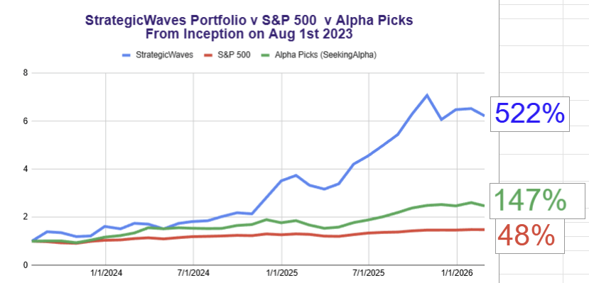
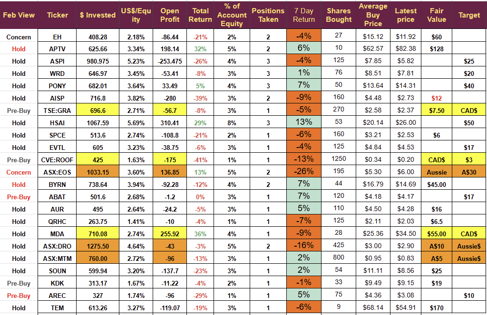

# Weekly: History Pointing Higher 

*Stocks recovering, data leading to more insights*

As with all other sectors of the market, the portfolio saw significant volatility last week. In the end, we finished the first week of February down $640, or 3.3%. A significant recovery at the end of the week kept us away from a very poor result.

The chart below shows the performance in Percentage terms v the two bench marks I measure my performance against.

It is interesting that performance correlates with the Seeking Alpha Quant strategy, with peaks and troughs aligned, but trading small companies adds significant risk, delivers much greater volatility, and ultimately higher total returns.

The chart also shows the early 2025 pullback and how it took 4 months to recover. The mid-2024 and mid-2023 periods showed similar patterns. Hopefully, we will see something similar this time. All previous pullbacks have been followed by significant value creation.

Friday saw a dramatic recovery and importantly the two companies we own delivering an earnings beat saw substantial share price appreciation on Thursday and Friday, it is a good sign when shares react positively to positive news.

Looking at the wider indices, things generally seem quite constructive. For those who follow Dow theory, it is noticeable that the DOW closed above 50,000 for the first time and, more importantly, the DOW transports have roared into life in recent weeks following a long period of lagging behind the main indices. The recovery of the transport industry has generally signalled a growth phase ahead.

The S&P 500 remains underwater and the NASDAQ is showing larger losses, a lot of news has focussed on the Bitcoin route and a crypto winter appears to have arrived without any clear explanation behind it.

## Trading

We opened one trade this week, and it gained 24% almost immediately.

We did not close any trades- that is a slight change of plan. In the past, I had pursued a policy of moving to cash during a sell-off, but that strategy did not serve us well during the November sell-off, so I have changed it.

In November, the portfolio dropped 11%, and I exited 8 positions to conserve cash; it returned 6% over the following two months. If I had not exited trades in November, the drawdown would have been almost 15%, but the return in the following two months would have been dramatic: over 20% in December and 10% in January. All in all, holding shares through the drawdown would have increased the dollar holding by 12%.

This is the opposite result to the Feb Mar 2025 pullback, where exiting trades was more profitable than holding.

I have decided the difference comes down to the reasons behind the pullback, the early 2025 drawdown was due to the tariff announcements, that was a real economic event with actual impact so exiting companies affected reduced losses. The recent pullback is a reflection of market gyrations not backed up by any significant changes to the economic landscape, hence holding good companies pays off.

## Plan Adjustment

In addition to the change discussed above, I am making a small change to my position sizing. I have two position sizes 3% of equity or 1.5%

We are entering the second half of the project, targeting a move from $20K to $100K whilst only depositing an additional $7,500 over the remaining 30 months.

It has different problems than the first stage, as we moved from $250 to $20K.

The project is unique, and as we generate data, I can forecast the future with greater accuracy. I discussed the concept of a Validated Thesis last week.

Every time I buy one of these small companies, I am betting on the technology the company has and its commercial progress. Regular investors in emerging companies are well aware that it does not always go to plan; many technologies face delays in market acceptance, small companies developing these technologies run into funding issues, and cannot always scale their technologies as they hoped.

It is one of the many things that leads to enhanced volatility for the portfolio but ultimately outsized returns and now with 99 trades actioned over 30 months I have the data to make changes to the plan to better optimize returns for the remainder of the project.

Of course, this is based on the assumption that the second half of the project will see similar conditions and returns to the first half. There is no guarantee in this, but it would be stupid to assume the future will be dramatically different from the past.

We know the strategy works as it has delivered 550% so far, and all I am going to do is optimize it for the second half.

I have been adjusting my position size based on the company's size, but I will change it to reflect thesis validation. In other words, companies where we know the Thesis is correct will have full-size trades, and those where we do not will have half-size, and I will increase the size as validation arrives.

This change helps address the pressing issue of cash flow and means smaller amounts of money will be invested in companies that take longer to make the expected progress.

It is unlikely to change the volatility of the portfolio, but will increase the returns as it reduces the money invested in ideas that do not play out, but increases the money in those that do.

## Next Week

I am expecting a busy week with investments in Quantum, batteries and recycling stocks. I fully intend to take advantage of low prices and am not yet accepting a bear market is either here or of high probability.

**Disclosure:** I'm not a financial advisor and don't offer investment advice. **This newsletter is a diary of my personal high-risk trading in small-cap emerging stocks**; past performance doesn't guarantee future returns. Make independent investment decisions based on your own research and risk tolerance; you are solely responsible for outcomes.

The Portfolio

(orange Aussie Dollars, Yellow Cad Dollars, Red text in feb view represents a change of view)

BYRN was at -42% on Tuesday but recovered dramatically with the positive earnings report and the reduction in average buy price following the additional trade.

EOS was hit by a short-seller report, and a 26% drop triggered a trading halt. I will wait for the EOS rebuttal, but at the moment, I view this as an opportunity to add, the only negative in the report was about the Korea agreement (ignoring the nonsense about management which always accompanies these reports); that agreement had not been finalized, and in the Q4 update, the EOS CEO said that finalization of the deal had been pushed back to March 2026 because of “problems faced by the customer”. Finalization of the agreement requires an A$18 million pre-payment. If the Koreans don't have the money, there is no deal. It looks like management may have been one step ahead of Grizzly

Grizzly acknowledged that all other reported orders had been checked and verified.

Companies Releasing Earnings

**Aptiv PLC (APTV)**

-   **Earnings Summary**: Aptiv reported record fourth-quarter revenue of $5.2 billion, a 3% increase adjusted for currency and commodities. Adjusted operating income was $607 million, and earnings per share (EPS) reached $1.86. The company issued 2026 guidance, forecasting revenue of $21.12–$21.82 billion and adjusted EBITDA of $3.385–$3.585 billion. A key focus remains the spin-off of the Electrical Distribution Systems (EDS) business as “Versigent,” expected to be effective April 1.
    
-   **Press Releases**:
    
    -   Announcement of a Gen 6 ADAS system award for a leading commercial vehicle OEM in India.
        

**Byrna Technologies (BYRN)**

-   **Earnings Summary**: Byrna reported record fiscal fourth-quarter revenue of $35.2 million and full-year revenue of $118.1 million, a 38% year-over-year increase. The company achieved profitability on both a GAAP and non-GAAP EBITDA basis for Q4. Gross margin for the full year was 61%, slightly down due to startup costs for the new ammunition facility in Fort Wayne, Indiana. CEO Bryan Ganz announced a search for his successor is underway.
    

**American Battery Technology (ABAT)**

-   **Earnings Summary**: Full summary of this earnings release next week with potential trade being examined.
    

### Company Updates: Press Releases & Research

**WeRide (WRD)**

-   **Press Releases**:
    
    -   WeRide and Uber announced a strategic partnership to deploy 1,200 robotaxis across the Middle East, specifically in Abu Dhabi, Dubai, and Riyadh.
        

**Vertical Aerospace (EVTL)**

-   **Press Releases**:
    
    -   Vertical Aerospace Advances Japan Commercialisation with Marubeni Via Electric Air Taxi Routes.
        
    -   Vertical Aerospace Signs New Customer JetSetGo to Accelerate Electric and Hybrid-Electric Aviation in India (MoU for 50 Valo aircraft).
        
    -   Vertical Aerospace Selects Evolito as Electric Propulsion Unit Partner for Valo.
        
    -   Vertical Aerospace Wins Proof-Of-Concept Grant To Advance Emergency Medical Services Capabilities For Singapore.
        

**Hesai Group (HSAI)**

-   **Press Releases**:
    
    -   Hesai and Grab Announce Strategic Partnership to Accelerate Lidar Deployment Across Southeast Asia.
        

**Northstar Clean Technologies (ROOF)**

-   **Press Releases**:
    
    -   Shares for Bonuses issued (referencing a Jan 28 release).

---

*Source: [Strategic Wave Trading](https://stephentobin.substack.com/p/weekly-history-pointing-higher)*
