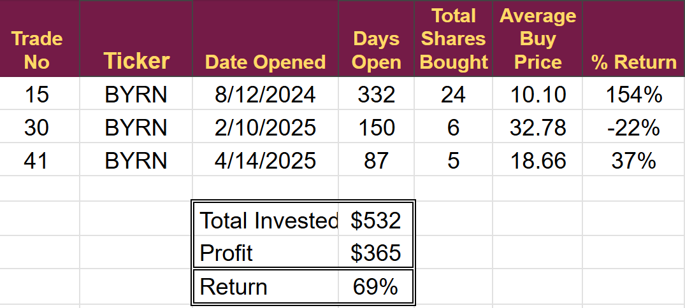
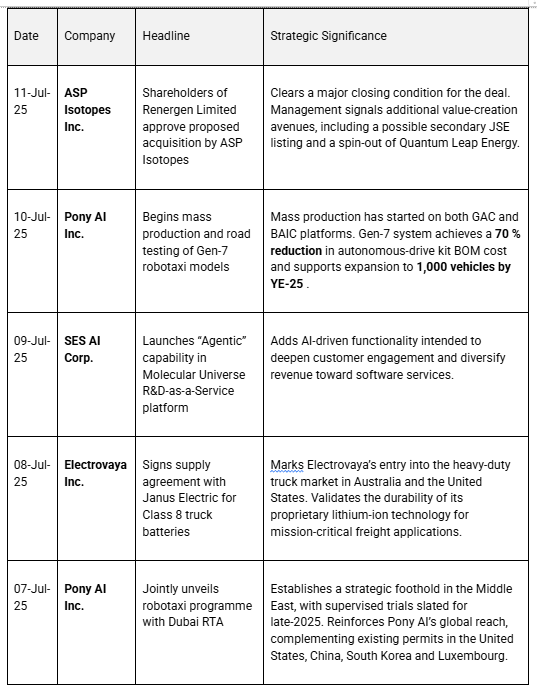
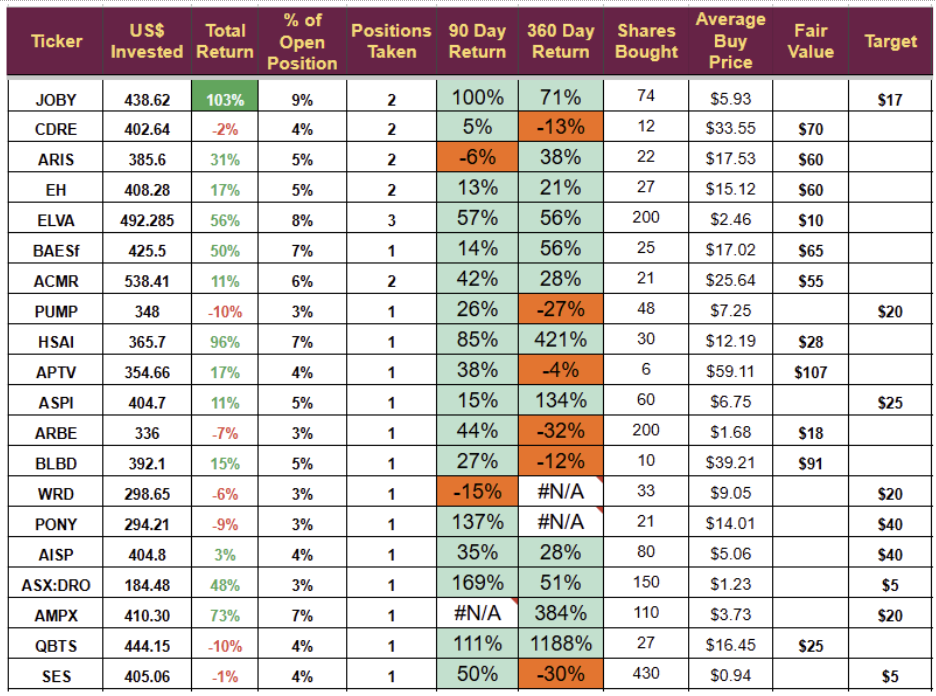
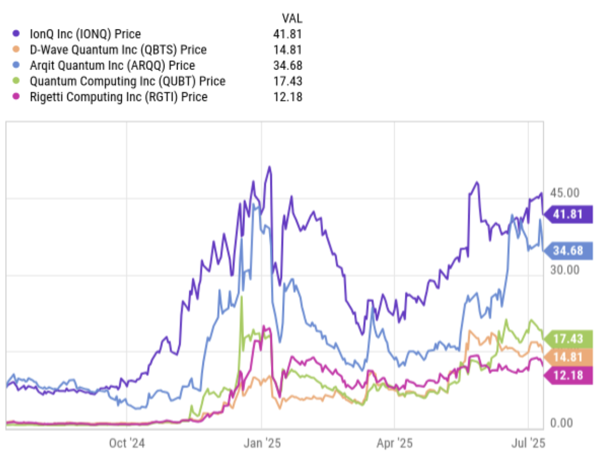
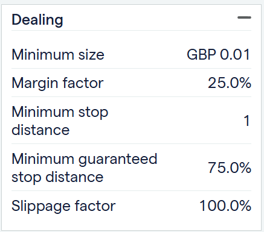
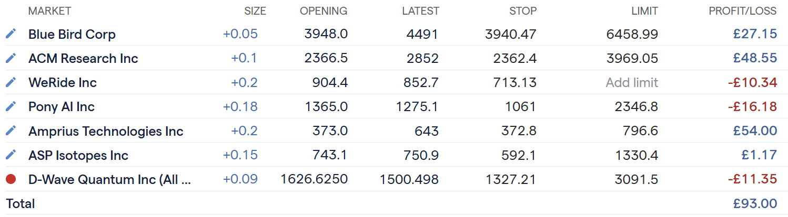

# Weekly Review

*New materials Next*

It was a very busy week. I published the full [review of the EV van market](https://stephentobin.substack.com/p/ev-vans-sector-deep-dive?r=nh85d), concluding that there was [no suitable entry point](https://stephentobin.substack.com/p/ev-vans-no-trades?r=nh85d). I also completed the review of the LiDAR industry, deciding not to change our current holdings; they still offer the best potential.

[I interviewed the CEO of SES.AI](https://substack.com/@stephentobin/note/c-134287855) (SES), a company I have invested in several times over the last few years. The interview revealed crucial information that all potential investors need to know. The interview is well worth listening to.

The portfolio as a whole continues to perform well, outperforming the US markets by quite a margin this week.

The US Stock Trading account was up 4.5% whereas the US markets were down 0.1%

[Subscribe now](https://stephentobin.substack.com/subscribe?)

## Closed Profit

I closed out my positions in Bryna Technologies after they released earnings. Probably should have done it earlier this month. I had highlighted issues with retail sales and the news from the CEO did not help alleviate fears. Ultimately, we achieved a reasonable return.

We made one new investment during the week, which is currently 1% underwater.

## Next week

As an emerging technology investor, I have three aims and one goal: to make money. The aims help me achieve this goal.

1.  Identify emerging technologies.
    
2.  Analyse the market.
    
3.  Choose the right companies to invest in
    

Next week, I will be opening positions in a new, emerging technology, Graphene. There are two sides to it, one is a new technology, and there are plenty of those, but the key is emerging: a new technology about to go commercial.

To help subscribers, I have prepared a primer on Graphene, which will help people to make informed decisions about the players and companies I have chosen.

I will send the Primer on Monday, followed by a market analysis and a trade alert over the course of the week.

I will be writing an article on SES for publication on the Seeking Alpha platform. It is exposure on that platform that companies want when they offer to give up their time for interviews with me. My following on Seeking Alpha has grown to over 8,000. As it continues to expand, I will gain increased access to company executives, making it an essential part of my plan going forward.

Paid below this line

## **Weekly News Digest**

Five material press releases during the week, spanning M&A progress, product commercialisation, platform enhancement, and a new supply agreement. All announcements align with our core investment theses and introduce incremental catalysts for re-rating by Wall Street analysts, which should drive price appreciation.

## **Key Takeaways**

1.  **Execution Momentum at Pony AI** – Parallel achievements in Gen-7 mass production and the Dubai partnership strengthen visibility on both volume ramp-up and international expansion.
    
2.  **M&A Pathway for ASP Isotopes** – Shareholder endorsement reduces transaction risk and surfaces additional corporate actions (JSE listing, Quantum Leap Energy spin-out) that could unlock value post-close.
    
3.  **Software Upside at SES AI** – The new Agentic module supports a higher-margin, recurring revenue component, partially insulating the firm from hardware commercialisation timelines.
    
4.  **End-Market Diversification for Electrovaya** – Penetration into Class 8 trucking broadens the company’s addressable market beyond material-handling equipment and warehouses.
    

## The Portfolios

I have added quarterly and annual price performance to the spreadsheet for this update at the request of subscribers. In the future, I will include these longer-term metrics in the monthly update and maintain the shorter format for weekly updates. (WRD and PONY do not have 12 months’ worth of figures, AMPX is not working for an unknown reason for the last quarter)

### Other News

I am not happy about the price action on quantum stocks. I worry that last week $1 billion capital raise by IONQ might mark the top of irrational exuberance for the quantum market. In retrospect, you can always pick the moment things started to go down, but it is much harder at the time.

The amount of money these companies have raised over the last few months is staggering and may leave very little money for further investment. I remain of the belief that IONQ has no realistic route to a working machine or commercialization. Eventually, the market will realize this, and the stock will begin to fall.

I am still very positive about QBTS and its long-term future, but as always, I do not want to be a bag holder and will exit if the sector starts a sustained move lower. I would like to hold for the next earnings call, which should be positive, but that is likely 5 weeks away, and in quantum investing, that is like a decade for most stocks.

The chart shows how the stocks have moved in the past. The run-up in IONQ and ARQQ is too fast again, similar to the run to January. Importantly, they did not make new highs. The QBTS move has been more muted, with a mere 1,200% increase (these stocks are crazy), but it did make a new high, the only stock to do so.

The new high implies a bullish trend is in place; the lack of one suggests an ongoing correction.

IONQ could easily fall below $20, and it will likely drag all the other quantum stocks lower.

### The Leveraged account

I was unable to purchase SES on this account, which was a disappointment. The whole point of this is to gather information, so I suppose not being able to buy it is at least some information.

I have narrowed down the position size issue for the time being. I have decided to target a total position size that is double my monthly investment until I make some profit.

I invest £250 each month, so I want to buy £500 worth of stocks with that money. Margin accounts work in a very different way to normal stock accounts; the key difference is that I don't actually buy any stocks.

Here is an example using ASP Isotopes. The image is from the platform

The 25% margin factor is key. If I want to buy £500 of stock, the broker will lend me £500 and purchase the stock. However, they will own it, not me. The broker will charge me for arranging the deal and apply a daily interest rate on the loan of £500. It is an excellent rate because they own the stock as collateral.

The broker will require a margin of 25%, so they will take 25% of £500 = £125 out of my balance and put it in a separate account to cover any losses they might incur when they sell the stock. If the loss on the trade approaches £125, they will want additional margin to cover any extra loss (called a margin call).

When I decide to close the trade, the broker will sell the stock, return my margin, and give me any profit made on the trade. (or return my margin - any loss)

By targeting a total position size of £500, it will leave me with £125 to cover any margin call. If I cannot cover it, they will simply close the trade and take the margin to cover their losses. The broker's profit comes from the interest rate and the fee for arranging the deal.

I expect to make four trades a month, so I will use £125 divided by 4 as the margin for each trade.

Current holdings are

I currently have £491.20 of funds (that's the £500 deposited minus charges and interest)

£284.96 of the funds has been taken for margin, leaving £299.24 available for new trades and margin calls.

£93 of profit means I am up 16.8%, which is pretty good so far.

---

*Source: [Strategic Wave Trading](https://stephentobin.substack.com/p/weekly-review-c1b)*
