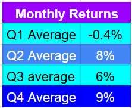
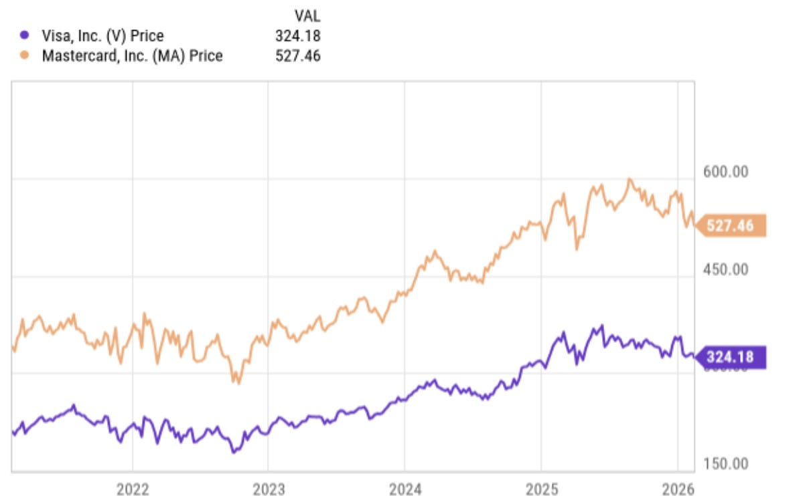
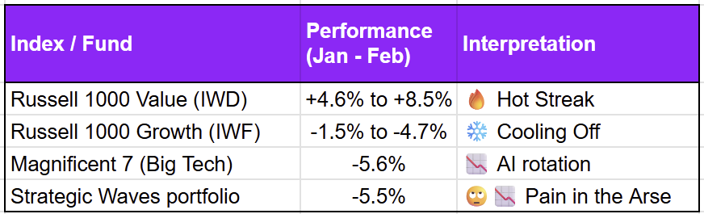
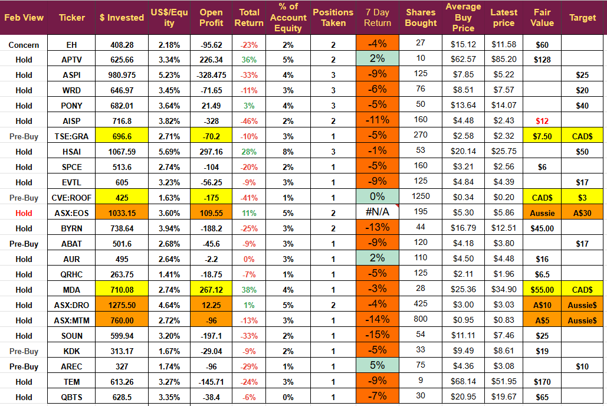
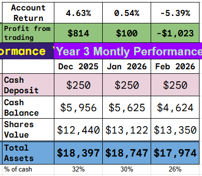
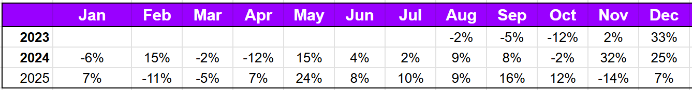
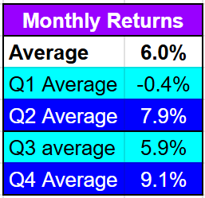

# Weekly Review: Correlation and Causation

*Sector Rotation Ending?*

Several subscribers have raised the issue of correlation lately, noting a link between the portfolio's performance and Bitcoin's in recent months. When I was teaching undergraduate Mathematics, the concepts of Correlation, Causation, and Third Variables were among the most misunderstood; only large numbers caused more trouble. In this update, I want to look at correlation and explain my view on the concept.

## Firstly Performance

We bought one stock last week; it's currently underwater by 5%.

The portfolio has continued to pullback, it is now showing a loss of 5.3% in February after an almost flat January a worry in some respects, but not really of concern, as you know the project is now more than halfway through it has delivered a total return of 500% but in Q1 the average monthly return has been negative. (Figures up to end Dec 2025)

I have no explanation for this seasonality, but it exists and appears to persist into 2026. A return of 4.6% in March would leave the portfolio at an average of -0.4% in Q1, exactly as it has been in the past. The Q1 average return in 2025 was -3% and the full year return was over 88%.

## Correlation

Correlation is a measure of the relationship between two variables; however, it does not imply causality. The actual correlation between our portfolio and Bitcoin is very small, the only similarity is a high in October followed by a drop in November, the portfolio gained in December and January when Bitcoin fell.

Visa (V) and Mastercard (MA) are two stocks that show high correlation. Over the last five years the correlation has been 97% (a correlation coefficient of 0.97)

[

- ](https://substackcdn.com/image/fetch/$s_!aV8W!,f_auto,q_auto:good,fl_progressive:steep/https%3A%2F%2Fsubstack-post-media.s3.amazonaws.com%2Fpublic%2Fimages%2F904dabdf-72b1-4941-b1dd-295906677500_1193x742.png)
You can see the correlation just by looking at the chart; the two stocks are moving together with near-identical peaks and troughs. It is a real correlation with causation; they have a near duopoly on payment processing, and they take a fee every time someone pays with a card, so their incomes rise and fall with the number of payments made.

Other correlations are not so causal; these are some of the ones I used to use to prove my point when teaching.

## The Washington Redskins decide who will be President

From 1936 to 2000, there was a perfect 100% correlation between the result of the final Redskins game of the season before a presidential election and the winner of that election. For 17 consecutive elections, if the Redskins won their final game then the incumbent party won the presidential race and if the Redskins lost then the incumbent lost. 

I used to tell my students that this was the actual reason the Redskins had to change their name, but then again, I also told them that the great French Mathematician Pierre de Fermat was murdered and turned into Pate on the night of a planned card game against the great English mathematician Issac Newton. Undergraduates are very smart, but they will believe almost anything.

There are many sports correlations like this. A notable correlation exists between the price of oil and the win rate of the English Cricket team. A similar correlation has been reported between the Indian cricket team at major tournaments and the price of oil.  With the world cup currently underway (in India) there is a lot of speculation in the UK about which players should make up England’s bowling attack when really if England and India want to make the final they should be thinking about bombing the major oil producers and driving the price of oil higher hence lifting England’s win rate and India’s performance in major tournaments. (when I said something similar in a lecture, one undergrad put his hand up and asked, “Can they actually do that?” scary isn’t it)

Bitcoin has a history of spurious correlations. For two years (2017 to 2019), the price of Bitcoin had a correlation greater than 90% with the price of Mexican Hass Avocados. Obviously, the correlation was nonsense, but a crypto project called the Avocado DAO was launched to profit from it.

Bitcoin continues to see weird correlations, the most famous is the McRib theory which postulates that when McDonalds brings back the McRib the price of Bitcoin surges and when they withdraw it the price falls, the theory has proved correct in 6 of the last seven years. You might be interested to know that the McRib has recently left McDonalds menu leading to the current pullback in Bitcoin.

## Correlation Is Not Causation

The point is that a correlation does not amount to a link even if the correlation runs with 100% accuracy for an extended period it is often just a statistical anomaly, a causal link must be found before any weight can be added to the idea.

## Changes to Bitcoin Correlations

Bitcoin is a magnet for weird correlations but in recent months the correlations have gone from understandable and predictable to ones with built on speculation.

Gold and Bitcoin have held a weak positive correlation since the asset first arrived. They are both alternative assets and seen as a potential store of value, since October that link has decoupled completely. 

Since decoupling from Gold BTC has behaved like a leveraged version of the NASDAQ with a fairly high correlation coefficient over that time period. Historically BTC has been well correlated with the M2 money supply but the analysts at Bitwise have reported this relationship has also decoupled over the last six months, when M2 is high people have more money so they tend to invest it and hence BTC sees buying, or at least it did.

Bitcoin has moved from being correlated with gold to being correlated with the NASDAQ. Gold and the NASDAQ have always had a mild negative correlation meaning as one goes up the other tends to go down.

## The Third Variable

Often two assets appear correlated it is due to a correlation with a third hidden variable. In the case of the Strategic Waves portfolio and the recent (very weak) correlation with BitCoin the third variable is the NASDAQ. There is a long-standing correlation between the NASDAQ and the Strategic Waves portfolio (of medium strength), and as Bitcoin has decoupled from its traditional “safe haven” correlations, it has started to correlate with risk assets and hence the Strategic Waves Portfolio.

There is a potential causal link between the NASDAQ and Bitcoin. The NASDAQ 100 contains MicroStrategy, Tesla and MercadoLibre all three of whom hold Bitcoin in their treasury. On the NADAQ board over 40 companies have significant Bitcoin holdings, inevitably a change in BTC price will change the market cap of these companies and have an effect on the index as a whole.

There is no causal link between Bitcoin and the StrategicWaves portfolio, we do not currently hold any companies with exposure to Bitcoin. There will likely be some correlation if Bitcoin continues to move with the Nasdaq because there is a causal link between the Strategic Waves Portfolio and the NASDAQ.

The Strategic Waves portfolio is made up primarily of small tech stocks, its reason for being is to invest in emerging technology hence the vast majority of holdings are young, small tech companies that will inevitably move with their larger cousins traded on the NASDAQ

Sector Rotation

The link between the NASDAQ and BTC, as well as the link between the NASDAQ and our portfolio, seems clear, but what is causing the NASDAQ to fall? 

Is it just Bitcoin pulling one section lower? I don’t believe so. The NASDAQ-100 index is heavily weighted towards the magnificent 7 (Apple, Microsoft, Alphabet, Amazon, Nvidia, Meta, and Tesla) and, apart from Tesla, they have very limited exposure to Bitcoin.

The Magnificent 7 account for 40% of the entire Nasdaq index’s value, and hence, their moves dictate the moves of the index.

We need an explanation for the NASDAQ's fall and the DOW's rise to make any decisions about the way forward.

I believe the current moves are a short-term sector rotation.

A classic “risk off” scenario is playing out, risk off means people move their investments from companies that offer dollars tomorrow to those offering dollars today.

The magnificent 7 have announced huge CAPEX plans, it probably means more debt and definitely means more risk. High CAPEX means less money for dividends today with the promise of even more money in the future when the CAPEX investment pays off. The magnificent seven moves from money today to money tomorrow, increases its risk profile, and forces asset managers to reassess their holdings.

This change has likely driven a rebalancing of portfolios with money coming out of the NASDAQ, now seen as dollars tomorrow with increased risk, and into the DOW which has always been seen as dollars today with low risk.

All companies in the Strategic Waves Portfolio are emerging technology companies; by definition, they are almost always pre-profit, sometimes pre-revenue, and always in their initial commercialization wave. As such, they offer the promise of dollars tomorrow, or perhaps next year, and in the case of most of the portfolio, in the next decade.

This rotation has good cause, the feds “higher for longer” stance on interest rates makes bonds with a guaranteed return more attractive. It will raise borrowing costs and our small companies will likely need to borrow heavily, reducing the dollars tomorrow.

Companies on the DOW offer current profits and dividends today whereas emerging technology stocks are “future Dreams” and that dream can be put a risk by higher borrowing costs, geo political risks, tariff measures and trade frictions.

What we are seeing is a natural rebalancing as large investors move money from more speculative investments to safer bets hence tying in some of the big gains they have seen over the last couple of years.

## Plans

The big question is what do we do. If you think this rotation is going to continue for some time it would be sensible to follow the rotation. Reduce holdings in small caps emerging stocks (those in my portfolio) and put the money into the DOW or Gold or Bonds.

I think the rotation will be short-lived; last week's cooling of inflation rates led to a buying-the-dip on the NASDAQ and a significant recovery in our portfolio. Inflation affects interest rates and may call into question the higher-for-longer view.

In addition to that, many portfolios will now be rebalanced following the changes made.

If you think that the rotation will continue and can time this right you may be able to preserve capital better by following the rotation, exit tech stocks and buy the DOW or gold. You might see an increase in your cash and be able to buy back into the small caps later, and if the move continues, you could get back in at lower prices. People skilled at timing the market would be wise to do this.

It is necessary to stick with your own opinions, and I do not believe people are generally good at timing markets, nor do I believe any combination of technical analysis can help in this regard.

I know I am good at picking small caps stocks that deliver returns, that is why the portfolio is showing an annualized return of 111% and a total return of over 500% inside 3 years.

I believe the stocks I hold are good, and the Q1 pullback is in line with previous years, which have led to large returns for the remainder of the year. I am going to keep watching, exit stocks if the thesis fails and hold if the thesis holds.

Because I have been so careful with my investments and position size this decision is easy, I have only invested $250 a month, the portfolio might be worth nearly $20K now but my investment has been small, my positions are small and because of that I do not lose sleep over a pullback which seems to be in line with what we have experienced in the past and has in the past preceded some excellent returns.

**Disclaimer: **I'm not a financial advisor and don't offer investment advice. **This newsletter is a diary of my high-risk trading in small-cap emerging stocks**; past performance doesn't guarantee future returns. Make independent investment decisions based on your own research and risk tolerance; you are solely responsible for outcomes.

## The Portfolio

A bounce yesterday was nice, but we are still underwater. The battery stocks I want to buy have pulled back, so we may get a good entry point next week. I do not intend to stop buying in the near term but will remain vigilant to market conditions. I would have bought on Friday, but as you know, I don’t like buying before a long weekend.

## Cash Position

## Monthly Returns

I did mention the average monthly returns in Q1, so I thought I would show all months together.

It leads to the following averages, remember the target is an average of 5.2% as that is what is needed to get to $100K in five years

I know drawdowns are difficult, but the longer-term performance is clear, and the monthly return figures show this one is not unusual.

## Weekly Digest: February 8-14, 2026

### Aptiv (APTV)

**Company Document: 8-K Filing (Feb 11, 2026)**

Aptiv announced that its subsidiary, Aptiv Swiss Holdings Limited, intends to redeem the entire $266 million aggregate principal amount of its 4.350% Senior Notes due 2029.

- 
The redemption is scheduled for February 25, 2026, and will include a make-whole premium plus accrued interest.

### NanoXplore (GRA)

- 
**Company Document: Q2 2026 Earnings Press Release (Feb 10, 2026)**

NanoXplore reported total revenues of $27.6 million for the three months ended December 31, 2025, a 17% decrease compared to $33.1 million in the same period last year.

- 
The company achieved an adjusted gross margin on revenues from customers of 21.5%, up slightly from 21.3% the previous year.

- 
Total liquidity stood at $40.1 million, including cash and cash equivalents of $30.1 million.

- 
**Company Document: Q2 2026 Earnings Call Transcript (Feb 11, 2026)**

CEO Rocco Marinaccio reported a rebound in operating performance with sequential improvements in revenue, gross margin, and adjusted EBITDA.

- 
Management highlighted strategic progress in drilling fluids, noting that while the contract with Chevron Phillips Chemicals became effective Oct 1, 2025, commercial launch occurred mid-November.

- 
The company is actively field testing its NanoSlide product with two major Asian oil and gas producers and has shipped product to a leading oilfield service company.

### Hesai Group (HSAI)

- 
**Company Document: Press Release (Feb 04, 2026)**

Hesai announced a strategic partnership with Grab, appointing Grab as its exclusive distributor in Southeast Asia.

- 
The partnership aims to leverage Grab’s distribution networks to scale regional access to lidar sensors for ADAS and robotics applications.

### Vertical Aerospace (EVTL)

- 
**Company Document: Press Release (Feb 04, 2026)**

Vertical announced a major acceleration of its commercial roadmap in Japan through a partnership with Marubeni Corporation.

- 
The partners are developing plans for piloted eVTOL demonstration flights in the Osaka Bay area, targeting 2026.

- 
**Company Document: Press Release (Feb 04, 2026)**

The company was selected as a winner of the “Dimension X Cohort 7 Challenge” and awarded a Proof-of-concept grant by Singapore’s HTX for public safety applications.

- 
**Company Document: 6-K Filing (Feb 05, 2026)**

Vertical entered a long-term agreement with Evolito Ltd. to design and supply Electric Propulsion Units (EPUs) for the Valo aircraft.

### Aurora Innovation (AUR)

- 
**Company Document: Q4 & Full Year 2025 Earnings Press Release (Feb 11, 2026)**

**Financials:** Aurora reported Q4 2025 revenue of $1 million and full-year revenue of $3 million. The company recognized its first commercial revenue following its launch in Q2 2025.

- 
**Guidance:** Management provided Fiscal Year 2026 revenue guidance of $14 million to $16 million, representing a 400% year-over-year increase at the midpoint. Revenue is expected to be back-end loaded, with Q4 2026 projected to contribute over half of the full-year total.

- 
**Liquidity:** The company ended the year with approximately $1.5 billion in liquidity and expects this to be sufficient to reach positive free cash flow in 2028.

- 
**Operational Milestones:** Aurora surpassed 250,000 commercial driverless miles with zero attributed collisions. The company aims to exit 2026 with more than 200 driverless trucks in operation.

- 
**Company Document: Press Release – Network Expansion (Feb 11, 2026)**

Aurora announced it is tripling its driverless network to 10 routes.

- 
The latest software release enables operations in inclement weather (rain, fog, heavy wind) and opens a new 1,000-mile driverless lane between Fort Worth and Phoenix.

- 
This expansion allows the Aurora Driver to begin operating across the U.S. Sun Belt and serving customer endpoints directly.

- 
**Company Document: Q4 2025 Earnings Call Transcript (Feb 11, 2026)**

CEO Chris Urmson highlighted that the new “Sun Belt” capabilities allow the company to restructure the economics of the logistics industry.

- 
CFO David Maday noted that the company is targeting breakeven gross margin on a run-rate basis exiting 2026, driven by a 50%+ reduction in hardware costs for the second-generation commercial kit.

### Kodiak AI (KDK)

- 
**Company Document: Press Release (Feb 11, 2026)**

**Contract Award:** Kodiak announced it was awarded a contract by the U.S. Marine Corps to develop autonomous military ground vehicles.

- 
**Scope:** The company will integrate the “Kodiak Driver” system into the Marine Corps’ Remotely Operated Ground Unit for Expeditionary Fires (ROGUE-Fires) carrier.

- 
**Strategic Impact:** This collaboration aims to demonstrate the dual-use capability of Kodiak’s technology for distributed maritime operations and expeditionary force projection, particularly in the Indo-Pacific region.

- 
**Company Document: Press Release (Feb 10, 2026)**

Kodiak announced it will release its fourth quarter and full-year 2025 results on March 10, 2026.

### Metallium (ASX:MTM)

- 
**Company Document: Press Release (Feb 12, 2026)**

**Asset Transaction:** Metallium’s partner, New Frontier Minerals, announced a binding option to acquire 90% of the Pomme Rare Earths Elements Project in Quebec from Metallium.

- 
**Strategic Rationale:** The deal allows New Frontier to advance the carbonatite-hosted REE system while Metallium remains integrated as the processing and technology partner.

### DroneShield (ASX:DRO)

- 
**Company Document: Press Release (Feb 10, 2026)**

**Executive Appointment:** DroneShield appointed Michael Archbold as Chief Operating Officer.

- 
**Role:** Archbold is tasked with scaling global operations and supply chains to meet rising demand from defense and critical infrastructure customers.

### 

- 
**Northstar Clean Technologies (ROOF):**

**Press Release (Feb 11, 2026):** Announced a change of its Filing and Regional Office from Vancouver to Calgary.

---

*Source: [Strategic Wave Trading](https://stephentobin.substack.com/p/weekly-review-correlation-and-causation)*
