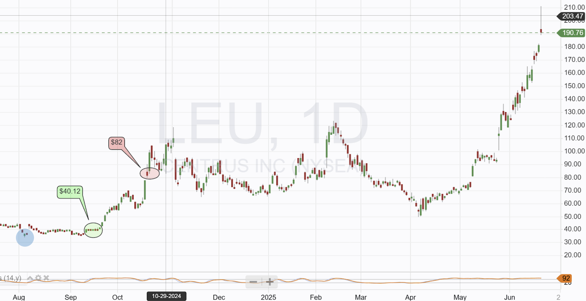
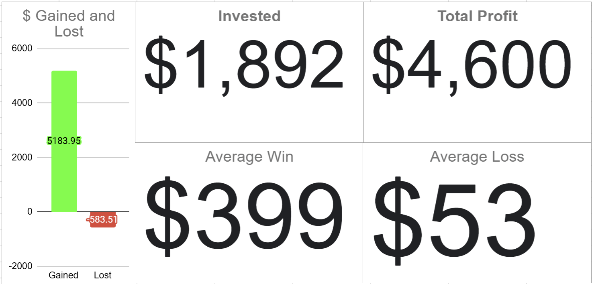
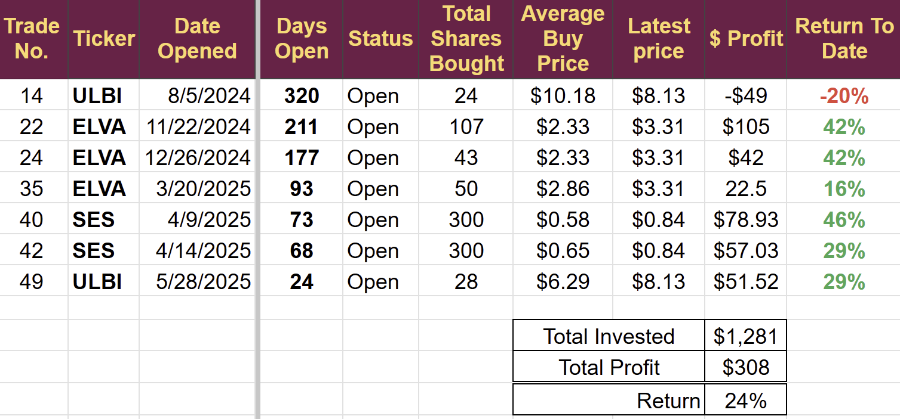
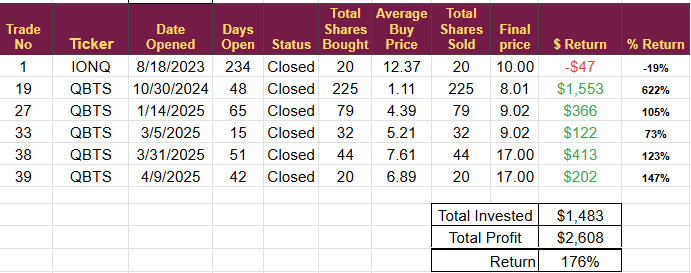
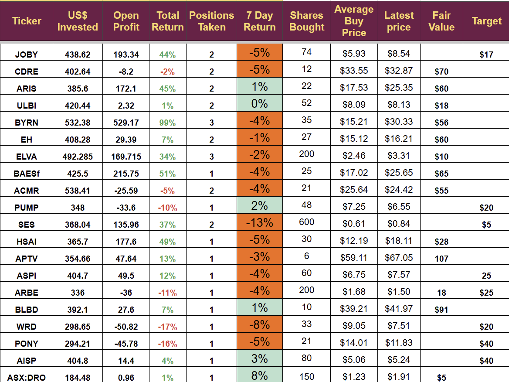

# Weekly Review: Portfolio Adjustment

*Two Sectors under review*

This week, we opened one trade, which is showing a slight profit. Once again, the portfolio dropped on Friday and ended the week lower, with my holdings showing a loss of 1.5%, while the US markets rose 0.2%.

The portfolio is now almost 23 months old and showing a return of 317%.

## The Middle East

This situation appears to be worsening. The US bombed Iran overnight in a serious escalation of the conflict, likely the markets will see a pullback next week. I covered the history of market pullbacks around geopolitical events in last week's update.

The impact on people's lives is far greater than the effect on the markets.

Following last week's purchase, we now have five stocks that are likely to benefit from increased security concerns, and two stocks that are likely to rise with the oil price.

## Active Management

I am an active manager, and a key component of the outsized returns that I have had in the last few years is being able to recycle cash. This allows me to compound returns over time, but it is not to everyone's liking.

A good example, illustrating both the benefits and drawbacks of my method, is Trade 16 from September 2024, when we purchased Centrus Energy (LEU) at $40.14 and closed the trade 30 days later for a 104% profit at $82 per share.

I had been following the stock for 10 months, and the entry came just before an important but clearly signalled news announcement.

I closed the trade as it approached the target, noting that the price was moving too quickly, making a pullback likely.

It was a good result, but buy-and-hold investors would refer to the chart below to show how their strategy would have delivered far better results on this ticker.

Buy-and-hold investors would still be in this trade and sitting on a 350% profit.

However, buy-and-hold investors do not get to recycle their cash or benefit from the compounding that can result from active management.

Having sold LEU on October 17th I used the money to buy QBTS on October 30th a trade that delivered over 600% in profit. That profits from the QBTS trade allowed me to increase the position size on all trades after that date, and the cash has been reused several times since then, compounding the returns with each successful trade.

Of course, this only works if you have a high success rate; otherwise, you would have less money to invest each time. The graphic below shows the amount of cash generated by all closed positions since the account's inception, all of which is reinvested in new positions.

I invest $250 a month in this account. As a result, in August 2023, when I started, I could afford only one trade a month and a position size of $250. By November, I had generated enough profit to initiate two trades per month. I am now making an average of four trades a month, with a position size of $400. The buy-and-hold investor would still be buying one trade a month for $250.

With each profitable closure, I reassess the position size and the number of trades I can take. It is the cash balance that allows for the increase. Currently, the cash balance is $2,575 more than ten months' worth of deposits, and this is after opening six trades this month. The one trade closed this month added $744 to the cash pile (of those six new trades, four are showing a profit)

## Portfolio Adjustments

Cash recycling is a key part of my plan, and it makes me look at every trade and sector, reviewing if my money is still in the right place.

I invest in emerging technology, with most of my investments in early-stage companies, and I rely on my analysis to select companies with the highest probability of success. But things change, technical progress is made, and new deals are signed. The environment in which I invest is constantly evolving, and I must adjust my investments accordingly.

One sector that has been abuzz with new announcements over the last couple of months is the lithium battery space, and I need to revisit it.

The technology is developing rapidly, and some companies I previously discounted have announced interesting developments and begun to gain commercial momentum.

I currently hold positions in three battery stocks, all of which appeared to be the best bet when I invested, but things change.

I will review each of the stocks I hold in this sector to determine if they still represent the best use of capital, or if I need to pivot out of the current stocks and into others to maximize my returns.

Here is a list of all open battery trades.

Companies of particular interest in this sector that we do not currently hold are SLDP, AMPX, MVST, NEO, and ASPN. I will be reviewing this sector in detail over the next week.

I will update with a trade alert once I make a decision. You must decide what sort of trader you are. Do you want to hold or sell and bank profits? Whatever you choose, remember to keep your position size small and avoid risking a significant amount of money on any individual stock.

### Quantum Investing

I am also revisiting Quantum Computing. We have generated a significant amount of money in this sector, but we currently do not have any exposure. The stocks have all pulled back, so now may be a good time to invest; however, if you think the lithium battery market is moving quickly, then quantum technology is moving at light speed. It is also full of hype and irrational exuberance. Some of the technologies being explored are a dead end. Still, companies pursuing them have raised so much money that they have become acquisitive, trying to buy the answer to the shortcomings of their chosen technology.

Quantum trades closed

I hope to identify the next quantum investment within the next couple of weeks and make adjustments to the battery holdings.

(For those not aware, I have graduate and postgraduate qualifications in mathematics and spent more than two decades teaching advanced mathematics at college level before becoming a full-time investor, so I am well qualified to comment on quantum computing. My whole career goes Undergraduate-MBA-Bank of America-Business Founder-Mathematics-Investor)

**Disclaimer:** I am not a financial advisor and do not provide investment advice. This newsletter details my personal high-risk trading in small-cap emerging stocks. Past performance doesn't guarantee future returns. Make independent investment decisions based on your own research and risk tolerance; you are solely responsible for outcomes.

Paid below this line

## Full List of Holdings

Companies with News This Week

## **SES (SES AI Corp)**

-   **Regulatory/Web News (June 16):** The mayor of Daejeon, South Korea, visited SES AI's U.S. headquarters to discuss potential investment in domestic lithium metal battery production and strategic collaborations in UAM (Urban Air Mobility) and future mobility sectors
    
-   **Partnerships:** SES AI is in discussions with Hyundai and GM, as well as South Korean partner Revest, to explore relocating operations to Daejeon
    

## **ASPI (ASP Isotopes Inc)**

-   **Regulatory/Web News (June 17):** ASP Isotopes is restructuring its Luxembourg-based holding companies, closing its 30-year-old holding "Asp" and streamlining corporate control
    
-   **Leadership Change (June 18):** Dr. Ryno Pretorius was appointed CEO of Quantum Leap Energy (QLE), a subsidiary focused on advanced nuclear fuels like HALEU and Lithium-6. He previously served as a consultant and will lead QLE’s upcoming spin-off expected in late 2025
    

## **EHang Holdings Ltd**

-   **News (June 21):** EHang partnered with Changchun Jingyue High-Tech Zone to deploy **41 EH216-S pilotless eVTOLs** for low-altitude tourism, emergency response, and traffic management in extreme cold regions. This supports Changchun’s goal to lead low-altitude economic development in Jilin Province
    
-   **Strategic Expansion (June 20):** EHang signed an MoU with Argentina’s national aerospace manufacturer FAdeA to advance eVTOL certification and manufacturing in Latin America
    
-   **Test Flights (June 14):** EHang collaborated with Abu Dhabi Investment Office (ADIO) and Multi Level Group (MLG) to conduct a public passenger eVTOL test flight, marking a step toward commercializing autonomous urban mobility in the UAE
    

## Non-US Stocks

Some people were unable to buy DroneShield last week. I am not currently reviewing any stocks that are not traded on US exchanges, but I will conduct a survey of subscribers next month to determine the best way to handle this type of stock.

It was not a problem I saw coming, assuming that if I could buy the stock with my US broker, everybody else would be able to. Assuming is always a bad practice.

### Conclusion

Geopolitics will probably dominate the investing landscape early next week. My portfolio of smaller stocks would usually perform poorly in such environments, but with CDRE, BYRN, BAESf, AISP, and DRO all involved with selling security-related products, we should be insulated from any broader sell-off. ARIS and PUMP should benefit from any increase in the oil price.

---

*Source: [Strategic Wave Trading](https://stephentobin.substack.com/p/weekly-review-portfolio-adjustment)*
