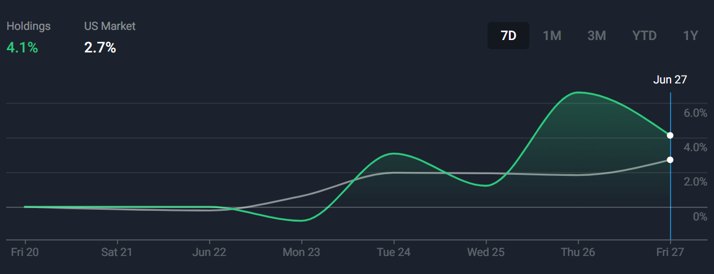
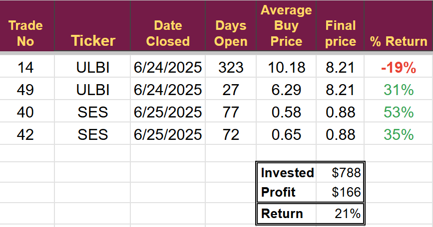
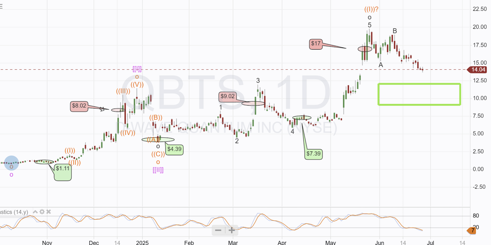
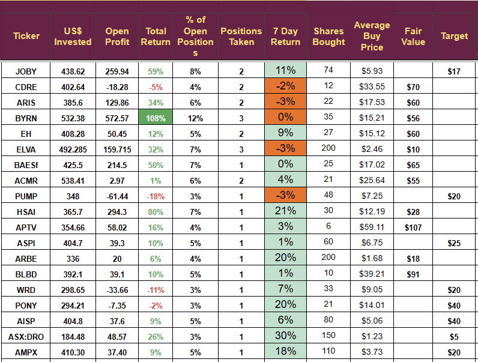
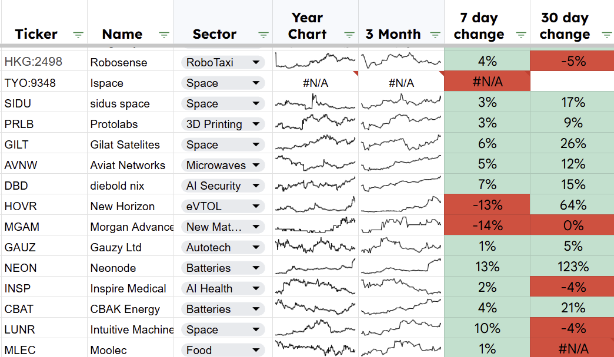

# Weekly Review: Quantum Next

*A good positive week*

Another “Friday Down” day, the third in a row, saw the portfolio end the week **up 4.1%** against the US markets' performance of 2.7%; the effect of the Friday down can be seen on the chart. It was no doubt related to the renewal of trade issues between the US and Canada. Our 19-stock portfolio, packed with small-cap emerging companies, will always be more volatile than the main markets but continues to outperform.

A profitable week, but we are still a little behind target for the month. June is showing an increase of 3.3% so far. I target an average of 5.2% as that is what I need to turn the **$250 monthly investment** demo account into **$100,000 in 5 years.**

The average for 2025 is 4.2%; however, the **average since inception (Aug 1st, 2023) is 7.5%** so we remain well above target on the project.

I highlighted in last week's update that I was re-evaluating my Battery holdings, and after doing so, I exited two battery stocks and bought into a new one.

The new investment is progressing well, showing a **9% gain** so far.

Results of the closed trades are

Open trades showed mixed performance last week. While five were in the red, with the worst being down 3%, six stocks soared with **double-digit percentage gains**.

The standout performer was the drone stock we acquired on June 20th, which **skyrocketed by 30%** this week. I regret not taking a full-sized position, but I will seize the opportunity to add more. I know several subscribers invested in thousands of shares and will have reaped substantial rewards. Congratulations to them—I'm thrilled this success will likely cover their subscription costs for the next decade!

We have four stocks exposed to the Chinese EV market, and they have been very volatile this week. **They were all in profit,** but it was a wild ride.

The Chinese EV market took a hit when BYD announced a slowdown in production, reportedly canceling night shifts and cutting production at a third of their factories. BYD has also launched a discounting scheme to reduce some of its high stock levels.

Xiaomi launched its new YU7 on June 26th, following the success of its SU7. The new car has seen overwhelming demand (200,000 orders in the first 3 minutes apparently), and the car is sold out through to early 2027.

New models were also announced from Leapmotor, Geely, and Cherry- a noticeable move towards PHEVs in these new models, perhaps to help with the infrastructure problems in rural China.

China now has 200% overcapacity for its EV battery production needs, which continues to fuel price cutting and the need for development.

Chinese EV registrations continue to rise, and our holdings should be unaffected by the BYD slowdown.

## Drone Research

Our first Drone investment is going very well. I am still working on a second, but following a meeting with the CFO of the target company, I will wait for the inevitable capital raise. They just don't have the money to fund their plans, I am more likely to give them a going concern notice than a buy alert at the moment, despite good products, growing momentum, and an excellent technical entry point.

I continue to investigate RCAT, DPRO, ONDS, PRZO and MOB. I intend to select the best option from this list to make my next Drone investment, and I will likely invest next month. The market is growing rapidly, and shares are appreciating; however, much of the business will inevitably be captured by the large incumbent players. I see little chance for companies developing small drones to compete with large manufacturers.

A number of the companies base their entire competitive advantage on not being Chinese. I would much rather they focus on producing the best product.

## Quantum

D-Wave is approaching the buying area I highlighted when we sold a few weeks ago for a large profit. The industry is moving quickly, and the number of new scientific papers being produced, as well as the size of funding rounds for private companies, is astonishing. The chart below shows all trades and the buying area. **We have made a small fortune** out of this stock so far (green is buy, red is sell)

Innovations in error correction from IBM and Microsoft have prompted me to reevaluate the rationale behind investing in QBTS. The Microsoft work is significant as it offers a way forward in error correction for IONQ.

I have always maintained that IONQ did not have the technology to scale or correct errors; although they always denied this was the case, they have made two acquisitions that appear targeted at addressing the scaling issues, and the MSFT paper published last week offers them the potential of achieving near the required error rates.

Do IONQ now have a way forward? I'm not sure, but they have a lot of money, which might enable them to buy their way out of their dead-end approach.

This week, I will provide a comprehensive review of QBTS and address the following key questions.

-   What can the D-Wave do that other machines can’t
    
-   Does it have a real and sustainable advantage
    
-   In what areas, if any, does it provide a true quantum advantage
    
-   Do we have any evidence the annealer works in a commercial setting
    
-   Can we be sure the quantum part of the machine is doing the work
    
-   If so why is the commercial take-up so low
    
-   Is there a realistic possibility of future hardware sales
    
-   Was the quantum advantage proof a one-off or can it be replicated
    
-   Recent error correction work from IBM and MSFT suggests error-corrected Quantum Gate computers are getting closer. Can D-Wave compete?
    

If everything looks good, I will send the report to subscribers and issue a buy alert when I think the time is right.

The final part of this report will look at the open trades and is reserved for paying subscribers.

Disclaimer

I am not a financial advisor and do not provide investment advice. This newsletter details my personal high-risk trading in small-cap emerging stocks. Past performance doesn't guarantee future returns. Make independent investment decisions based on your own research and risk tolerance; you are solely responsible for outcomes.

**Full list of Holdings**

**Portfolio Companies in the news this week**

**DroneShield, on** June 25th, announced a $62 million order from a European Military customer. The order is their largest ever and delivery is expected in Q3. In the same press releases, they announced plans to build a European manufacturing site to support its 55 active pipeline initiatives and potential $1.1bn in orders. The size of the order (more than the revenue in 2024) caused Bell Potter research to increase its price target from AUD$1.50 to AUD$2.60

**Ehang, on** June 25th, announced the first human-carrying flights in Indonesia. At the Paris air show they signed an MOU with ANRA to integrate the 216 into European Airspace.

**Hesai:** The new compact ATX LiDAR received ISO 26262 safety certificate, following the three previous Hesai LiDARs paving the way for international adoption.

**PONY:** was added to the Nasdaq Golden Dragon index on June 25th, the first autonomous driving company to be included. Travis Kalanick announced intentions to buy the US arm of PONY. The founder and former CEO of UBER is said to have backing for the deal from UBER. We should remember that Kalanick was ousted from **UBER after a series of scandals**, so we need to wait for some real confirmation before considering the potential here.

## Final Words

In the next week, I hope to identify the next Quantum stock to invest in, but as with the Nuclear stock I identified, we may have to wait for a suitable entry point. There is little point in buying near a high. There are now six stocks on the “eyes on” list awaiting a suitable entry point with due diligence completed.

The Prospect list remains robust and, despite the number of investments in recent months, the stocks under active consideration that have not been moved to the eyes on list are listed below. I hope to work through these in July. Often, when I research these companies, it is a competitor that becomes the target.

---

*Source: [Strategic Wave Trading](https://stephentobin.substack.com/p/weekly-review-quantum-next)*
