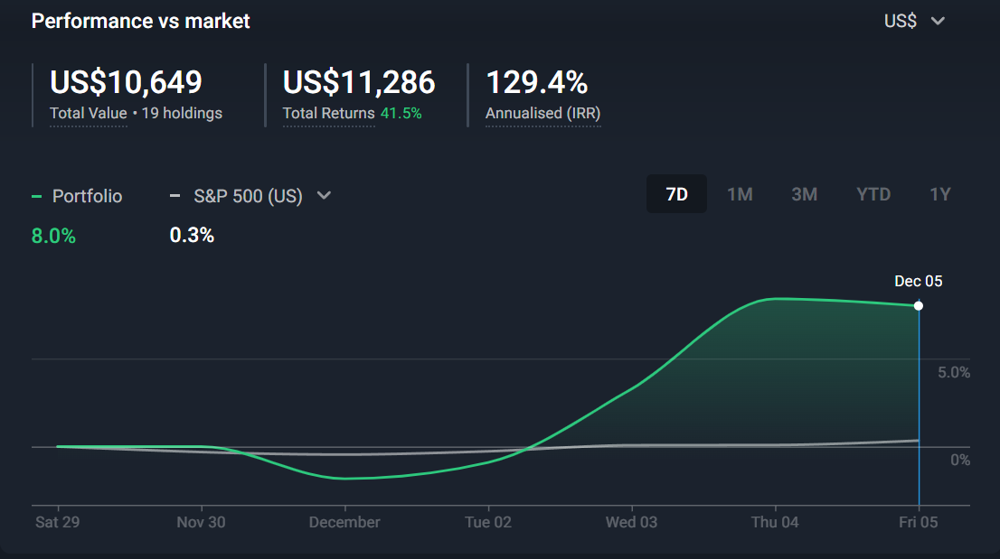
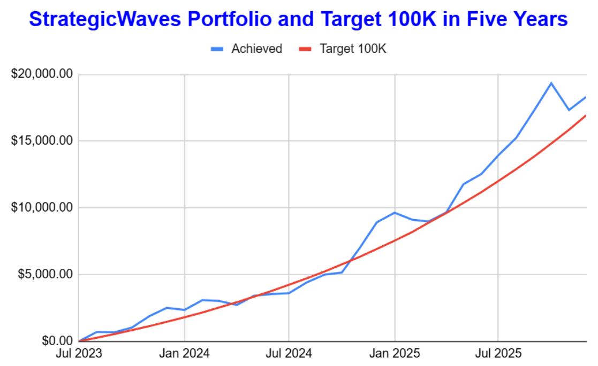
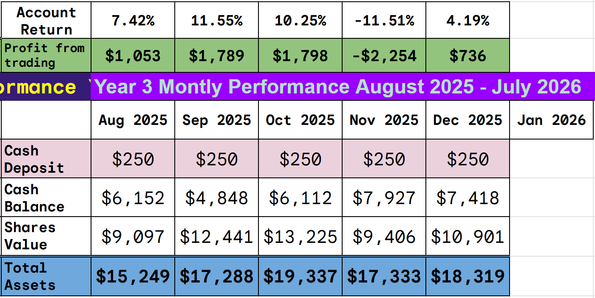
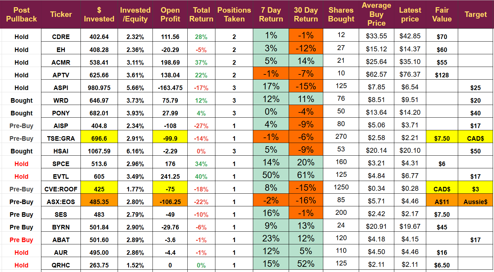
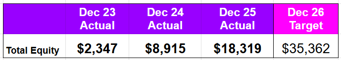

# Weekly Review: Strong Growth across the Portfolio

*December looking good so far*

A second profitable week in a row. The portfolio closed at $18,319, up from $17,333 last week. Sixteen of our nineteen stocks closed higher, the best was up 50% and the worst was down 2%. Eight stocks showed double-digit percentage gains.

I did not close any trades last week, but opened two new ones; they are both little changed so far, but have been open for only 2 and 1 days, respectively.

The Portfolio remains below its all-time high recorded in October, but above the target line that aims for $100,000 in five years.

To achieve the $100,000 target in 5 years, we need to grow at 5.2% per month. December is at 4.19% so still a little way to go. January will mark the halfway point in the project.

## Overloaded With Prospects

In November, all risk assets suffered a significant pullback, and many are now trading at discounts. I am working hard to identify the best prospects and buy them before they return to a price approaching normal. It is a time-consuming process, so I am unlikely to get through all of the prospects, but I do expect a very busy month of trading before the markets close for the holidays.

Early next week (target Tuesday), I expect to buy a Space stock, and later in the week I hope to add to our growing list of microcap investments.

**Disclaimer:** I’m not a financial advisor and don’t offer investment advice. **This newsletter is a diary of my high-risk trading in small-cap emerging stocks**; past performance doesn’t guarantee future returns. Make independent investment decisions based on your own research and risk tolerance; you are solely responsible for outcomes.

## Weekly Market Digest: Multi-Sector Company Updates (December 1-6, 2025)

## Key Takeaways

-   **EHang** achieved a significant milestone by completing Europe’s first multi point-to-point urban emergency-response flights of the EH216-S pilotless eVTOL in Zaragoza, demonstrating commercial viability of autonomous air mobility in emergency services.
    
-   **WeRide** attracted institutional interest as ARK Invest acquired 858,295 ADSs over three trading days and Bank of America initiated coverage at Buy, while reporting Q3 2025 revenue of US$24.0m (+144% YoY) with Robotaxi revenue reaching US$5.0m (+761% YoY) .
    
-   **ACM Research** is expanding beyond China with progress toward a new Oregon demo/production facility targeted to begin tool production late next year, while management addressed December 2024 U.S. Entity List designation and supply-chain adjustments enabling continued execution .
    
-   **Northstar Clean Technologies** positioned itself for growth by filing a final short form base shelf prospectus enabling issuance of up to $30,000,000 in various securities over 25 months , providing flexible capital access for commercialization initiatives.
    
-   **NanoXplore** announced significant expansion plans including a new leased facility (~200,000 sq ft) in Greater Montreal and capacity additions across St‑Clotilde, QC and Statesville, NC with 2025–2026 timelines , plus $40M+ incremental booked graphene‑enhanced composites business beginning in Q2 FY2026 .
    
-   **Hesai Group** strengthened its market position by surpassing 2 million cumulative lidar deliveries in 2025 and securing design wins from 24 OEMs covering 120+ models with deliveries 2026–2030 .
    
-   **Vertical Aerospace** showed insider confidence as directors/leadership increased shareholdings by ~50% in November with majority shareholder Mudrick Capital adding 350,000 shares, ahead of the December 10 unveiling of the new full-size certification aircraft.
    
-   **APTV** attended multiple investor talks, management highlighted the planned separation with the “New Aptiv” targeting 7% growth and elimination of $70 million in costs. A new aerospace ethernet cable was launched offering lower weight and replacing legacy protocols.
    

## The Portfolio

(yellow highlight $CAD, orange $AUD, Hold=No plans to change position, Bought= have added recently, Pre Buy= hoping to add soon)

## Micro Cap

I consider companies with a market cap under $50 million to be microcaps. We currently have two in the portfolio, ROOF and QRHC. These stocks are inherently risky, but they offer immense long-term potential. It is essential to limit exposure with these companies. You can see from the table that I have only invested 1.5% of the account in each microcap. I will scale these positions over the next couple of years, assuming the companies do well, and would like to exit 2026 with a full position in each.

I consider a full-size position to be 3% and try to open new positions at this figure. I use 5% as a maximum and look to add to companies when it seems appropriate to do so to reach this value.

As the account grows, the size of positions changes, allowing for additional trades. The growth rate is shown below. (2023 was only 5 months trading as the account opened on Aug 1st 2023)

It means by the end of 2026 a full position should be 3% of $35,362 which is $1,060 and the maximum 5% would be $1,768. The trading plan assumes I will keep increasing the sizes of those positions that I decide to hold and use the cash generated by trades I decide to close to do so. The need for cash means I cannot hold all of these positions for the long term despite knowing many of them are long term prospects. I set two years as the investment horizon and expect that to be the maximum amount of time I will hold any position for.

At the moment, the average hold time is 155 days, and the average return is 64%. Total number of closed trades is 57.

155 days and 64% is above target as it allows for an additional compounding of cash each year (i.e I can take two trades with the same money in a year as they only last half a year)

---

*Source: [Strategic Wave Trading](https://stephentobin.substack.com/p/weekly-review-strong-growth-across)*
