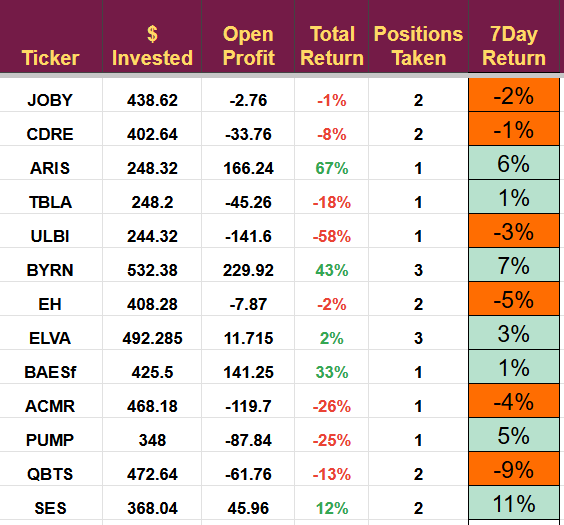
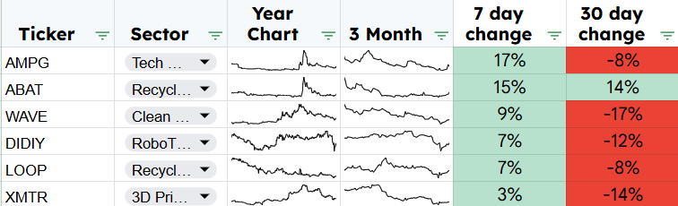
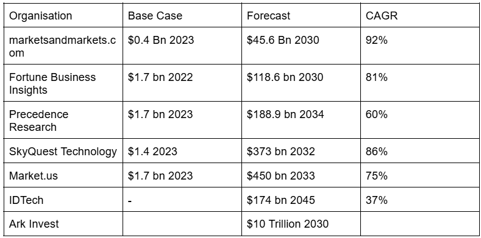
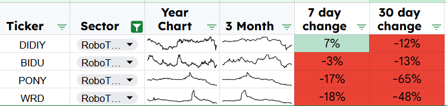
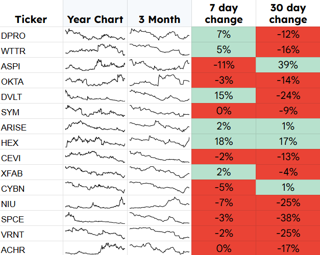
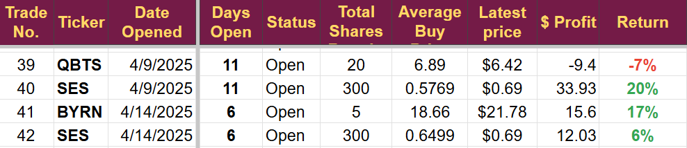
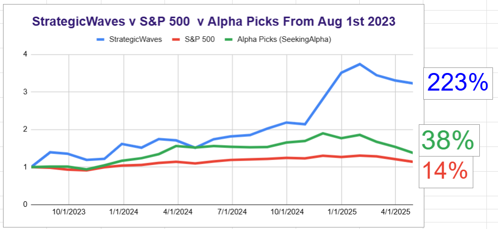

# Weekly Review

*Companies of Interest for Next Week*

# Overview

The portfolio returned 3.6% this week, outperforming the S&P 500, which fell by 1.1%; that is a significant outperformance. However, the individual holdings were very mixed.

[Subscribe now](https://stephentobin.substack.com/subscribe?)

## Notable Price Movements

SES was the only stock moving by more than 10% over the week. With no specific company news, the rise could be attributed to the anticipation of earnings due next week.

QBTS continues to swing with the quantum computing industry and fell 9% on no company-specific news.

ULBI and TBLA continue to perform poorly; I will likely take a loss on both and close them next week. Both had poor earnings reports, but for very different reasons. I will make a final decision after re-reading the SEC filings.

## Forward Looking

This will be the first time I have introduced the companies I’m looking at in detail, as well as starting to cover the emerging technology I consider to have the most significant potential. Emerging technology is the base strategy; I look for technology that will disrupt existing industries and offer the highest growth potential. I then analyze the players in the market and choose the ones I think have the best chance of becoming a large, profitable company. Finally, I have to decide when to buy; many of these technologies take a long time to reach the market, and I don't want my money tied up for years before it generates any returns.

## The eyes on list

These are the companies already identified as high-potential operators in an emerging technology field. Several companies I'm watching performed well this week, suggesting a positive shift in sentiment or progress in commercial activities. I will look at them in detail over the next few days to see if an investment is warranted.

XMTR and WAVE are previous winning investments. ABAT has been a big loser so far, but remains an emerging technology with great potential.

DIDIY is the only robotaxi company to show any progress; the other robotaxi companies have shown significant losses this week, along with most other Chinese stocks. The US administration appears to be trying to isolate China and has mentioned the possibility of forcing Chinese companies to delist, which will add selling pressure but will not alter the intrinsic value of these companies. I published my first article on robotaxis (WeRide) last week and will publish a second one on PONY this week.

The forecasts for the growth in the robotaxi industry are extraordinary; all forecasters predict the sector will grow at breakneck speed over the coming years, and we must grab a big slice of this action.

It adds up to a potential $34 trillion in equity gains, a true millionaire-maker industry. I have to make sure we buy the right companies at the right time.

Apart from DIDY, the other companies are not performing well at the moment. Of course, we like low stock prices, but I am unlikely to buy when prices are falling this quickly. I will be looking for companies that have a business plan to maximize profits from this new industry.

The companies are all Chinese; the potential for making a profit looks much better in China in the short term. The big Chinese cities are enormous in comparison to those in the US and have transparent regulatory frameworks that companies can use to obtain authorization. China's population density offers high taxi utilization rates, which will lead to increased profitability. The government is pushing hard to become a leader in this space. China's tier 1 cities have the charging infrastructure in place, and auto OEMs are already prepared for the mass production of electric cars.

I am looking for companies with good technology, broad geographical reach, strong auto OEM partnerships, the cash to make it happen, and, most importantly, a sales funnel to sell robotaxi rides.

## Other Prospective Investments

The prospect list is quite long at the moment; these are companies that have either never been reviewed or haven't been reviewed in some time. It's an organic list that constantly changes. They could become an investment, be added to the eyes on list, or be rescheduled for review sometime in the future. Some will just be removed from the tracking database.

## The Portfolio

The cash balance has reduced to 42% of the portfolio this month after this month’s investments.

I will continue to invest $250 per month and expect to deploy the cash in hand over the coming few months. It remains my base case forecast that H2 2025 will see a return to growth as the shocks caused by the tariff announcements subside.

The portfolio's performance since inception has remained solid and continues to outperform my two benchmarks significantly.

Thanks to all those who have pledged support to help me improve this newsletter; those pledges will be collected on May 1st. I will invest the money in new technology to speed up my workflow, allowing me to review companies more quickly and make better decisions. We should all make more money as a result.

---

*Source: [Strategic Wave Trading](https://stephentobin.substack.com/p/weekly-review)*
