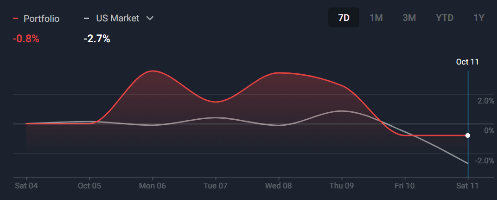
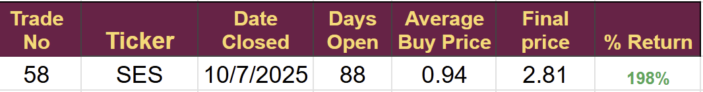
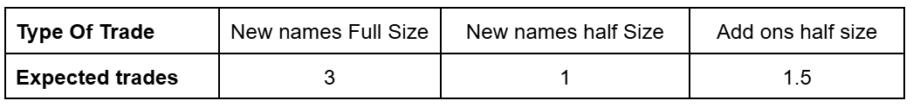
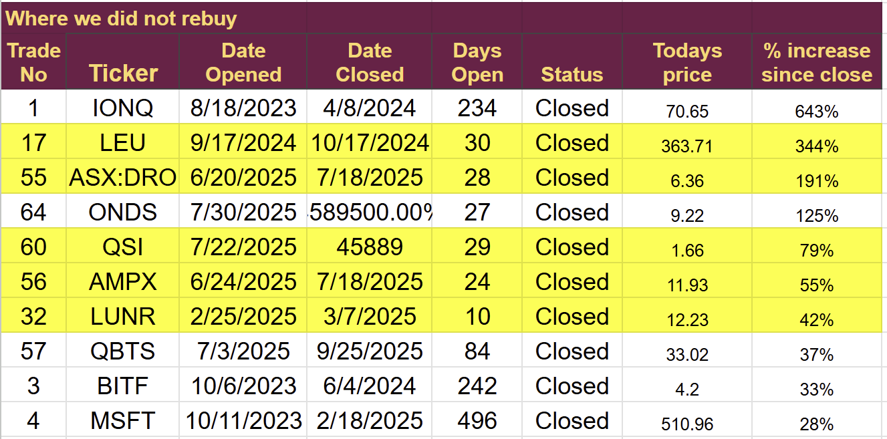
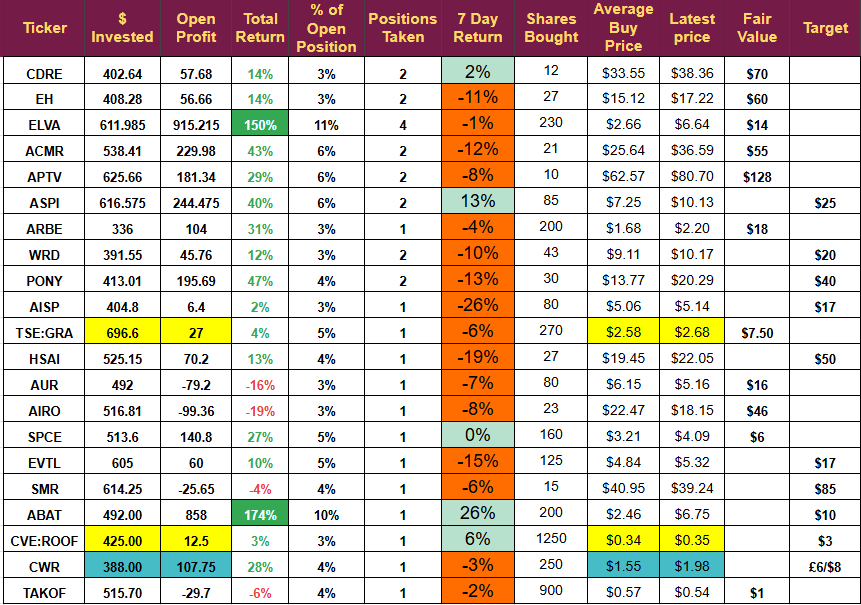
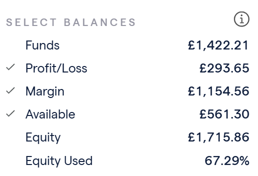
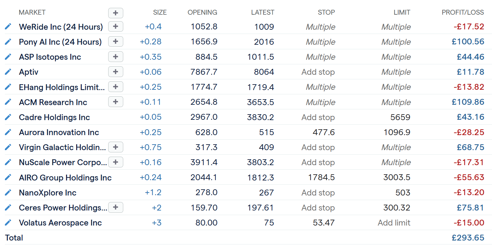

# Weekly Update: A big drop on Friday

*Taking Stock and Planning*

It was a wild week, with more Trump-generated volatility leading to a big sell-off on Friday. Early Friday, it looked like we were heading for a record month with the portfolios at all-time highs, but the markets closed sharply lower, and only 5 of our 21 stocks finished the week with a profit.

It was the first loss-making week for some time, but we did outperform the markets again.

The S&P futures are currently pointing sharply lower. I don’t like to panic or rush to close trades, but I feel there is a high probability that we will be closing some positions next week without a significant change in market sentiment.

Our China-focused stocks had a torrid time; Hesai was the worst hit, closing down 19% on the week, but the other China stocks showed double-digit drops. I expect the China stocks we own to recover. They do not export to the US, so they will not suffer from increased tariffs. Additionally, they do not depend on US software, so they will not be affected by the proposed software export restrictions.

**Our best performing stock ABAT climbed 26%** benefiting from concerns around the US supply of rare earth materials, and is now up 174% in 25 days.

The one trade closed last week was a big winner. I would love to see SES pull back so we can buy back in at a later date. I think the stock has a long way to go before it hits full value, but as is often the case, I booked profits when the rise seemed unsustainable.

We opened one trade, which suffered with the general market ending the week down 6%. The other trade opened in October is showing a 28% profit.

With many stocks down, there are multiple opportunities to increase position size and re-buy stocks we have previously exited. Thanks to previous trades, we have a large cash balance and will be able to take advantage in the coming days if the reversal proves to be short-lived, as most of them are.

## Marginal Gains

A phrase coined by the GB Cycling team, “Marginal Gains,” highlights the importance of minor improvements in what you do; lots of marginal gains add up to a significant improvement in performance.

A key element of the marginal gains idea is focusing on each small component of your plan to see if you can improve it.

The target of this newsletter is to turn $250 a month into $100,000 in five years.

The plan consists of two parts: choosing the right companies and trading their shares to maximize returns.

The methods for choosing the companies took many years to perfect. I spent one year working out the trading plan before enacting it in August 2023.

After more than 2 years, I have plenty of data to look at and search for marginal gains, and one area stands out. Many stocks are going up in value after I exit them. I need to find a way to maximise my return from those stocks.

Last week I looked at performance v a buy and hold strategy but decided that did not offer any improvement. Here, I will analyze an improved re-entry strategy.

### Position Size and Number of Trades

This is a limiting factor on all potential strategies. I must have enough cash to buy trades with the right position size.

I have looked at the last 12 months of trading to calculate the average number of investments I make each month. We are removing a couple of unusual months to get a better feel for the average.

I need enough capital to take the equivalent of 4.25 full trades.= every month

## Current Situation

Position size is $500, so we need $2,125 a month. I deposit $250 so I must raise $1,875 from closing trades. The average amount of cash generated in each of the last 8 months is $1,901, so it's about right.

### Looking to the future

The September 2026 target is $29,659 against a Sept 2025 target of $13,837. I will have invested another $3,000, so I need to make $12,822 from trading. That is a profit of 93%

I have analyzed the results from August 2024 (start of year 2) to August 2025, and the average return on invested money per month is 89%, so I need to increase this a little. The return is both volatile and incomplete; the worst month was -2%, but many of the trades remain open, adding risk to the percentages. (I removed one huge return from the average; we may not see another 600% return in a few weeks)

I have run back tests and found two methods that would have led to the required increase.

1.  Close at 200%
    
    1.  Setting a hard target of 200% on all trades would have achieved the required increase, delivering a 121% per month ROI. Still, it would have resulted in the account running a negative balance at some stages, making it unadoptable.
        
2.  Better Re-Opening
    
    1.  I reviewed the closed trades and went back through the charts and earnings reports to see if I missed any opportunities.
        

### Missed Opportunities

This table lists the 10 tickers that have increased the most after I exited them. Those highlighted in yellow are missed opportunities. At some point after I closed them, they satisfied all the criteria for a trade, both fundamental and technical, but I failed to see the opportunity. I did make good profits on trades re-entered after closing. QBTS, HSAI, BLBD, SES, and ARBE have all made substantial gains in a second trade. Indeed, re-entered trades have a 100% hit rate.

Re-opening these missed trades at the correct time, when they met the criteria, would have delivered the required improvement in performance. It would have increased the average monthly return on investments to 95%. A marginal gain that could make all the difference, it is only 5 extra trades in 12 months, lifting the annual percentage return by 6% but that is the difference between below and above target.

Probably worth pointing out that ONDS never gave a technical opportunity to re-enter, and IONQ never had the fundamentals. IONQ never had the technology to develop a working quantum computer, I said this in an article on Seeking Alpha and they were the first company to threaten me as a result of my article. I knew I was right then and IONQ has tried to get around this basic problem by going on a huge acquisition spree to buy the technology it needs to make it relevant in the quantum field.

## Change to the Plan

To ensure I don’t miss these opportunities in the future, I have changed my workflow a little. Previously, when a trade closed, the ticker remained on my sector spreadsheet and was treated like all other stocks I did not have a position in.

I have changed this so that when I close a trade, it goes onto a “Closed Trades Watchlist” on my charting package. I have set an alarm to notify me when the technical criteria for an entry are met. This alarm will trigger me to look at the fundamental situation and decide if I should re-buy or not.

This marginal gain should make a small but significant difference to my performance from now on.

Interestingly, the first alarm went off yesterday, and on Monday, I will be analysing a company we have previously invested in.

**Disclaimer:** I’m not a financial advisor and don’t offer investment advice. This newsletter **covers my high-risk trading in small-cap emerging stocks**; past performance doesn’t guarantee future returns. Make independent investment decisions based on your own research and risk tolerance; you are solely responsible for outcomes.

(paid below)

## Weekly Digest: (4 Oct 2025 – 11 Oct 2025)

## CDRE (Cadre Holdings)

-   **8 Oct 2025** - The Investors' Day brought a treasure trove of new information, which will be part of a write-up early next week. I might be able to add to this trade, but I will be adding Cadre to my long-term family fund.
    

## ELVA (Electrovaya Inc.)

-   **6 Oct 25 – Preliminary FY-2025 revenue update:** Management estimates Q4 revenue above **US $20 million** (+72 % y/y) and full-year revenue around **US $64 million** (+43 % y/y). Final audited results are expected in December 2025, with growth driven mainly by material-handling battery systems and modules for a Japanese construction-vehicle OEM.
    

## APTV (Aptiv PLC)

-   **4 Oct 25 – CFRA research note:** The broker highlighted continued adjusted EPS momentum (projected **US $7.55** for 2025 and **US $8.25** for 2026) supported by secular trends in vehicle electrification and share-repurchase activity. CFRA also pointed to tariff exposure and production-rate volatility as key risks.
    

## ASPI (ASP Isotopes Inc.)

-   **10 Oct 25 – Investor access event announcement:** The company will host an institutional-investor event in South Africa from 11–13 Nov 2025. This will be a big deal and may lead to a sustained price move.
    

## PONY (Pony.ai)

-   10 Oct 25 - Jefferies instigated coverage with a Buy rating, describing the company as a “Robotaxi winner”.
    

## AISP (Airship AI Holdings Inc.)

-   **9 Oct 25 – Warrant exercise:** Airship AI entered a definitive agreement for immediate exercise of **2,162,162** existing warrants at **US $4.50** per share, providing gross proceeds of approximately **US $9.7 million**; closing was expected on 10 Oct 25, subject to customary conditions.
    
-   **6 Oct 25 – Federal contract awards:** The company announced **US $11.0 million** of firm-fixed-price awards from U.S. federal law enforcement agencies during September 2025.
    

## NANOXPLORE (NanoXplore Inc.)

-   **6 Oct 25 – Canadian government contribution:** NanoXplore will receive up to **C$2.75 million** in funding to accelerate commercialisation of graphene-enhanced products across transportation and industrial markets.
    

## HSAI (Hesai Group)

-   **7 Oct 25 – Industry snapshot reference:** A sector report quoted Hesai’s CEO emphasising lidar as the “eye” of intelligent vehicles and robots, aligning with the group’s long-term vision for autonomous mobility.
    

## SMR (NuScale Power Corp.)

-   **7 Oct 25 – Earnings call notice:** NuScale scheduled its Q3-2025 earnings conference call, noting its certified 77 MWe small-modular-reactor technology and diversified application set (electricity, data-centres, hydrogen, heat).
    

## ABAT (American Battery Technology Co.)

-   **10 Oct 25 – Technical chart commentary:** A broker research chart showed ABAT’s share price breaking above a long-standing base with relative-strength metrics at multi-month highs, supported by rising volume trends.
    

## Ceres Power Holdings (CWR)

-   Goldman Sachs cut its rating to Neutral, citing above-average valuation.
    

# The Portfolios

## US Stock Trading Portfolio

Early on Friday, the account was at an all-time high, but it fell back sharply during the day.

### Immediate Notes

It is important never to panic or act in haste. It was a sharp pullback, but it may be short-lived, and things could easily be back to normal before the middle of next week. Futures are pointing lower, and there has been general concern about a pullback in U.S.-dollar-based assets.

Many of the larger stock moves we hold reflected the general drop, along with some fundamental reasons that amplified the fall.

AISP and AIRO both have significant defence businesses that will have lost some impetus with the Israeli ceasefire. Likely, it will have no long-term impact; defence spending in Europe and the US is unlikely to drop as a result of the ceasefire.

EH, ACMR, WRD, PONY, and HSAI are all heavily dependent on Chinese operations. They were caught in a knee-jerk reaction, but the fundamentals are unchanged.

ELVA and CDRE held up well following the release of important investor information from both companies. I will be looking to add to CADRE if I get a chance and feel ELVA will make a new high. I am still waiting for $9.60, the original target followed by $14 but am more keenly aware of the importance of closing at +200% when the opportunity arises. I will be writing a piece on ELVA at the request of Yahoo Finance.

ABAT booked the trend and jumped on the news; if the general market recovers, ABAT might fall back. I may well take profits and look to buy again if it starts to drop.

The following are approaching areas I would like to buy additional shares: AISP, NanoXplore, Hesai.

### The UK Margin Account

This experimental account took a real beating yesterday, from being at an all time high on Friday morning of $2,155 it dropped to £1,715 by the end of the day meaning a loss of £388 for the week and pushing the account underwater for the month.

I will have to look into this more closely. I generally do not panic sell, but it might have been better to do so on the margin account. Some trades are approaching stop loss lines and could well close on Monday.

It is this kind of day that helps me develop robust trading plans. Unlike the US stock account, the available funds for this account also collapsed, and I am not sure I have the funds to take advantage of the pullback.

---

*Source: [Strategic Wave Trading](https://stephentobin.substack.com/p/weekly-update-a-big-drop-on-friday)*
