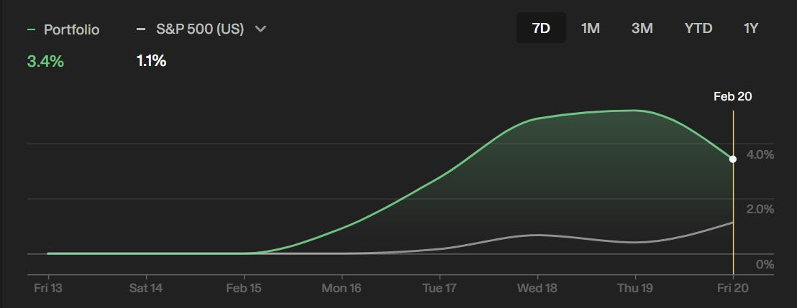
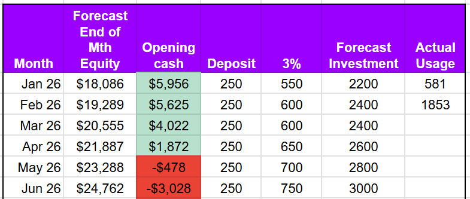
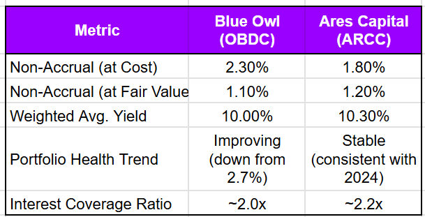
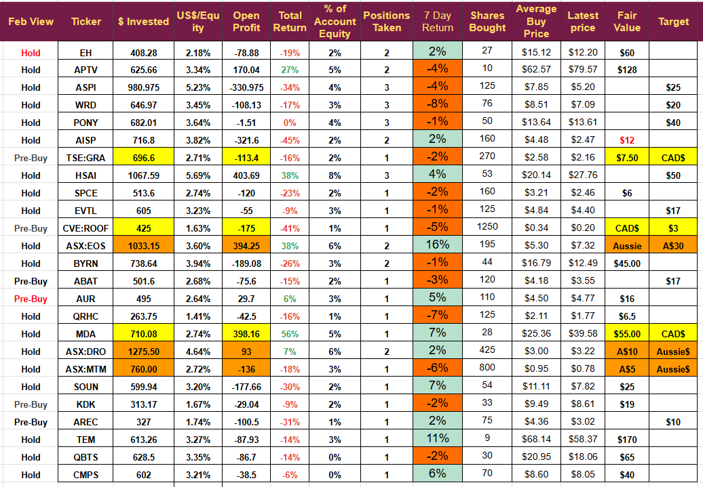
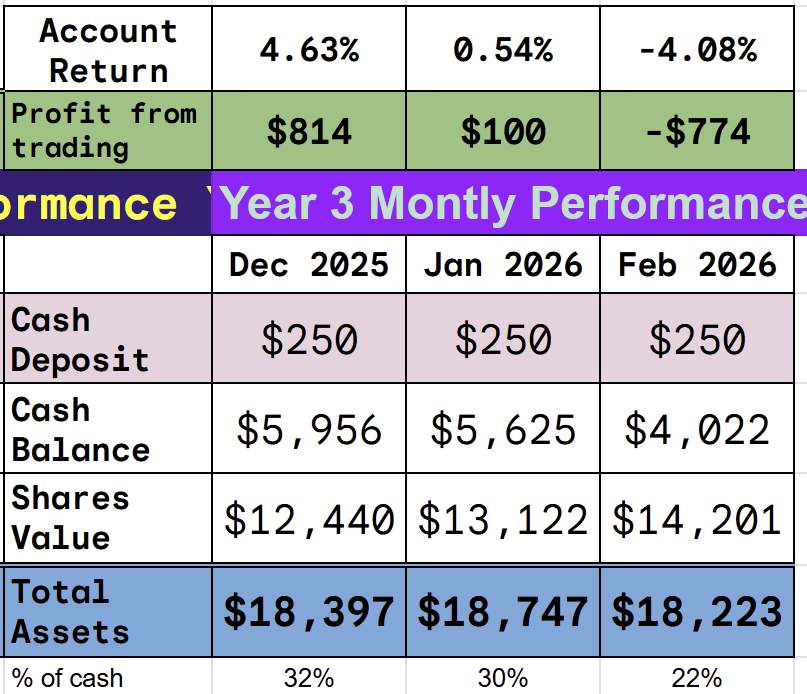

# Weekly Update: A Credit Crisis in the making?

*Blue Owl and the Supreme Court Ensure Volatility*

Apart from the volatility-inducing Supreme Court decision, market sentiment took another hit this week when Blue Owl Capital (OWL) announced it was limiting withdrawals from one of its flagship retail-focused funds. The debate over the liquidity of the private credit market and the accounting maneuvers behind some AI infrastructure financing has shaken many investors and prompted comparisons with the credit crunch.

I am going to look at the Blue Owl issue in this week’s edition, but firs,t the portfolio performance

## Trading Performance

Volatility continued; what looked to be an excellent week was pulled back by the Supreme Court tariff decision.

[

- ](https://substackcdn.com/image/fetch/$s_!wz2k!,f_auto,q_auto:good,fl_progressive:steep/https%3A%2F%2Fsubstack-post-media.s3.amazonaws.com%2Fpublic%2Fimages%2Fd6dc5381-e051-4d91-854b-ca2b88dc712f_1108x429.png)

This administration’s trade policy seems to be lurching from unpredictable to chaotic. If they had alternative ways to implement tariffs, they should have chosen the legal one; either their legal advice was terrible, or the people making the decisions did not listen to it.

Volatility is showing up in the portfolio. The best performer jumped 25% in the week,  and the worst was down 10%. It is unusual to see such a divergence, but it is in line with the findings of a recent WSJ article noting the extreme divergence within sectors, leaving the S&P 500 little changed.

We made one purchase this week and had no sales. The single investment has fallen a little; the lack of selling does not represent a cash flow concern at the moment. We currently have sufficient capital to cover all expected trades until mid-April without closing any positions.

(actual usage is money invested in shares- money received from selling shares)

One additional trade is already planned for next week, it is a new name: a microcap with a 20-bagger target.

## The Owl Discussion

So what happened? On Feb 19th, Blue Owl announced it would restrict quarterly redemptions from Blue Owl Capital Corp II (OBDC II). This is a fund designed for retail investors, and as a result, panic ensued.

The catalyst for this announcement was a surge in redemptions during 2025, which rose 20% to $150 million. OWL moved to protect the fund from a fire sale of assets to meet redemptions and put the fund into liquidation mode, meaning it will return money to investors each quarter through distributions equal to loan repayments and asset sales.

OWL sold $1.4 billion of the fund’s assets to preserve liquidity and ensure continued operations without risking investors.

## Understanding OWL

OWL manages $300 billion in capital and has the following structure

Blue Owl Capital Corp (NYSE:OBDC) is a business development company traded on the NYSE. You can buy and sell shares like a stock, providing daily liquidity, but its price moves with sentiment like all stocks.

- 
Blue Owl Technology Income Corp (OTIC) is a non-traded fund focused on software and technology lending

- 
OBDC II (the fund in the news) was meant to be a perpetual, non-traded business development company. It is not on an exchange, so its price is based on its Net Asset Value [NAV] of the loans on its books. To get out, you usually have to wait for the company to offer to repurchase shares [usually called a tender].

## The Business Model

Owl is an alternative asset manager that aims to provide permanent capital to customers. They act as a bank for middle-market companies (revenues from $50 mil to $1 bil). They also provide very large loans that traditional banks cannot service under regulatory constraints.

They make money by charging a service fee (1% of assets) and a performance fee (a cut of profits above a predetermined level).

90% of OWL’s earnings come from Permanent Capital, money that is locked in for many years. This money provides a steady stream of income, and because it is locked in, they cannot cope with large redemptions.

## SaaS lending

OWL has focused its smaller lending on SaaS companies and its larger lending on AI infrastructure, both of which have been receiving negative press of late.

The Non-Accrual rate gives us an idea of the quality of company OWL is lending to. I have compared Ares Capital (ARCC), the gold standard in this industry.

[

- ](https://substackcdn.com/image/fetch/$s_!h3z0!,f_auto,q_auto:good,fl_progressive:steep/https%3A%2F%2Fsubstack-post-media.s3.amazonaws.com%2Fpublic%2Fimages%2Fb4d778bc-a4e9-411e-b9e3-b1f0a573ed17_609x311.png)
The table tells us that 2.30% of OWL loans are in default at cost but that management have been writing these loans down quickly as they only represent 1.10% of the fund’s current value. The interest coverage ratio indicates that OWL customers have twice the EBITDA required to repay their loans.

OWL has a concentration risk with 23% of its fund in Software, and an AI bubble correction could reduce its NAV. In Q4 2025, the NAV dropped from $ 14.89 to $ 14.81; it is quite a small amount, but it does tell us that some large customers are struggling. The portfolio as a whole, however, is very healthy.

## The “No Problem Here” Signal

The current share price of OWL values its loans at 82% of its assets, management clearly think this is a misprice. They have recently started a $300 million share repurchase scheme, and senior managers have been big buyers, with the CEO and CFO making multi-million dollar purchases at the market, with multiple other directors buying smaller amounts. They clearly think their stock is worth close to 100% and that is confirmed when the recent $1.4 billion asset sale was sold to North American pension funds at 98% of NAV.

## AI Infrastructure

The big tech companies have announced huge AI capex and OWL want to finance it with their “iron clad” agreements. They want to fund the build out and then own all the assets after they are built with guaranteed income regardless of outcome.

The contentious META deal is an example of the iron clad. The deal is causing concerns in the market as its structure has allowed META to put huge liabilities off its balance sheet perhaps making its debts look less than they actually are. 

If you believe META is good for the money, then this deal is truly iron-clad for OWL. OWL is negotiating similar deals with MSFT, AMZN, and GOOG, so it is worth understanding how it works.

In late 2025 OWL and Meta formed a joint venture [JV] to build the Hyperion data center in Louisiana. The size of the data center is mind boggling but this is the structure of the deal

META owns 20% of the JV and OWL 80%- this is how META can put it off balance sheet if they owned 25% it would have to go on balance sheet.

- 
OWL will provide $30 billion to build the facility

- 
META will pay rent to the JV which OWL will then distribute to its investors as high yield income.

The “Iron Clad” part of the deal. META have contracted to fund any overspend on the development and to pay the agreed rent to OWL for 30 years regardless of whether it is occupied or the level of usage.

The deal is a synthetic REIT, Oracle has a similar deal with Brookfields describing it as infrastructure as a service. The concern is that these huge debts are being hidden behind JVs and they could create a shadow AI debt bubble.

The worry for OWL investors is if they have too many multi billion dollar AI infrastructure deals then their risk becomes concentrated.

On the flip side of that is the customers. Will META, AMZN, MSFT and GOOG be unable to pay these debts? I think there is almost no chance of that happening. The deal looks great for OWL and its investors.

Two Final Points

- 
The debacle shows that people investing in private credit companies are getting high yields 9.5% but that money is tied up for the longer term and you should not invest if you want to withdraw that money. OWL would not have had to halt the changes if investors had just left the money where it was.

- 
The double whammy: on the one hand, OWL is being hit because the SaaS customers it has invested in are considered at risk of disruption from AI; on the other hand, it is being hit because it is investing in AI infrastructure that may not work out. The two things are mutually exclusive, if AI disrupts the SaaS industry then OWL AI infrastructure bets pay off. They can’t both fail.

If shares in NYSE:OWL drop much more, I will be buying, not in the Strategic Waves portfolio but in my long-term family fund. If I could invest in the funds, I would. 9.5% return backed up by iron-clad contracts with META, GOOG, and AMZN for 30 years. I like the sound of that business

**Disclaimer**: I’m not a financial advisor and don’t offer investment advice. **This newsletter is a diary of my high-risk trading in small-cap emerging stocks**; past performance doesn’t guarantee future returns. Make independent investment decisions based on your own research and risk tolerance; you are solely responsible for outcomes.

## The Portfolio

A mixed Week but my confidence in the portfolio increased when TEM jumped following the release of its first Algo. That was the thesis for the investment and the first one led to an immediate 11% jump. The thesis playing out is the key to this type of investing; sentiment drives the portfolio when no major news is released, but we need to see significant movement when milestones are met.

[

- ](https://substackcdn.com/image/fetch/$s_!jVEo!,f_auto,q_auto:good,fl_progressive:steep/https%3A%2F%2Fsubstack-post-media.s3.amazonaws.com%2Fpublic%2Fimages%2F17bdf934-a18a-498e-bf7e-b6350d5972a0_1036x719.png)
Next week I will be buying another psychedelic drug company, whilst doing the due diligence on Compass a second company caught my eye and I have now completed the work on it. I hope to get the alert out mid-week.

## The Account

We made a small profit during the week, but the account remains relatively flat for the last quarter, as I explained last week, Q1 has historically been the worst quarter of the year.

## Weekly Digest

**Airship AI (AISP)**

**Q4 2025 Financials:** Airship AI reported Q4 2025 net revenues of $6.5 million, a 102% increase compared to the prior year. Gross profit reached $3.3 million with a gross margin of 51.2%, up from the previous year.

- 
**Operational Highlights:** The company ended the year with a backlog of $3.3 million and a validated pipeline of approximately $173 million. Significant recent awards include a $1.9 million contract from the Department of Homeland Security (DHS) for National Special Security Events and a $2.8 million refresh award from a commercial customer.

- 
**Outlook:** Management is focused on capitalizing on funding from the “One Big Beautiful Bill Act” (OBBB) in 2026 and aims to achieve cash flow positive operations before the end of the year.

**ASP Isotopes (ASPI)**

- 
**Strategic Expansion:** The company announced that its subsidiary, Quantum Leap Energy (QLE), will establish its global headquarters in Austin, Texas. QLE plans to build a significant operational presence in the state to support its nuclear fuel cycle technologies.

- 
**Advisory Board:** ASPI formed a Strategic Advisory Board for QLE, appointing industry leaders Mary Lou Dunzik-Gougar and Kevin Kramer to guide its expansion in the nuclear fuel sector.

**Aurora Innovation (AUR)**

- 
**Investor Events:** Aurora announced its management will present at upcoming conferences in March 2026, including the Raymond James Annual Institutional Investors Conference and the Morgan Stanley Technology, Media and Telecom Conference.

- 
**Operational Progress:** J.P. Morgan Research noted that Aurora has tripled its driverless route network to 10 lanes, including a 1,000-mile corridor between Fort Worth and Phoenix. The firm highlighted that Aurora’s commercial truck capacity is fully committed through Q3 2026.

**Compass Pathways (CMPS)**

- 
**Clinical Success:** The company announced positive results from its Phase 3 COMP006 trial for treatment-resistant depression. Two doses of COMP360 (25 mg) demonstrated a statistically significant reduction in symptom severity compared to the 1 mg dose.

- 
**Capital Raise:** Following the data release, Compass Pathways priced a public offering of $150 million in American Depositary Shares (ADS) at $8.00 per share.

**D-Wave (QBTS)**

- 
**Strategic Partnership:** D-Wave joined the Southeastern Quantum Collaborative (SQC) as an inaugural member to help accelerate quantum innovation and workforce development in the Southeastern U.S.

- 
**Earnings Announcement:** The company confirmed it will release Q4 and fiscal year 2025 results on February 26, 2026.

**EHang (EH)**

- 
**Public Performance:** EHang announced that 16 of its EH216-S pilotless aircraft performed a formation flight at the 2026 Spring Festival Gala in Hefei, alongside a record-breaking drone light show featuring over 22,000 drones.

**Kodiak AI (KDK)**

- 
**Leadership Appointment:** Kodiak appointed Chet Gryczan as Vice President and Managing Director of Defense to lead its expansion into the defense sector. Gryczan previously led Detroit Defense.

- 
**Analyst Coverage:** Northland Securities issued a “Company Update” on Kodiak, maintaining an Outperform rating with a price target of $17.00, citing its growing opportunities in both industrial and defense autonomy.

**MDA Space (MDA)**

- 
**New Subsidiary:** MDA Space officially launched “49North,” a subsidiary dedicated to Canadian defence missions. Joe Armstrong was appointed as President to lead the new entity, which will focus on multi-domain C4ISR capabilities.

**Northstar Clean Technologies (ROOF)**

- 
**Financial Update:** The company announced an extension of the maturity date for its convertible debentures from February 2026 to February 2027.

**Pony AI (PONY)**

- 
**Production Milestone:** FRPT Research reported that Pony.ai and Toyota produced their first mass-manufactured bZ4X robotaxi, with plans to produce over 1,000 units in 2026.

- 
**Index Inclusion:** Pony.ai was added to the MSCI China Index, effective at the close of markets on February 27, 2026.

**TempusAI  (TEM)**

- 
**Product release:** Shares jumped after Tempus announced the release of its first Oncology Algo. An AI-driven module to detect a cancer-related cell characteristic. The algorithm can identify patients who need platinum-based chemotherapy.

**Vertical Aerospace (EVTL)**

- 
**Public Display:** The company announced it would display its Valo electric aircraft in Miami on February 24-25, coinciding with the iConnections event.

**Virgin Galactic (SPCE)**

- 
**Earnings Date:** Virgin Galactic announced it will report Q4 and full-year 2025 financial results on March 30, 2026.

**WeRide (WRD)**

- 
**Commercial Deployment:** J.P. Morgan Research highlighted that WeRide and Uber launched their first commercial robotaxi service in downtown Abu Dhabi, expanding their partnership with plans for 1,200 robotaxis across the region.

---

*Source: [Strategic Wave Trading](https://stephentobin.substack.com/p/weekly-update-a-credit-crisis-in)*
