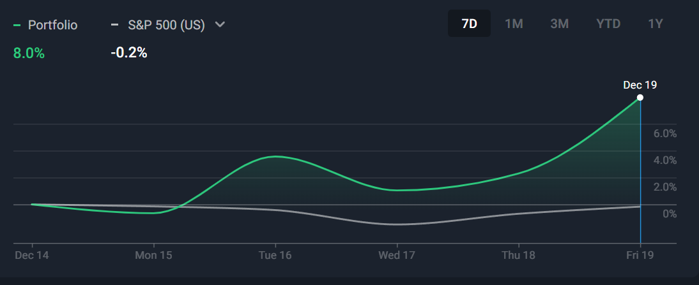
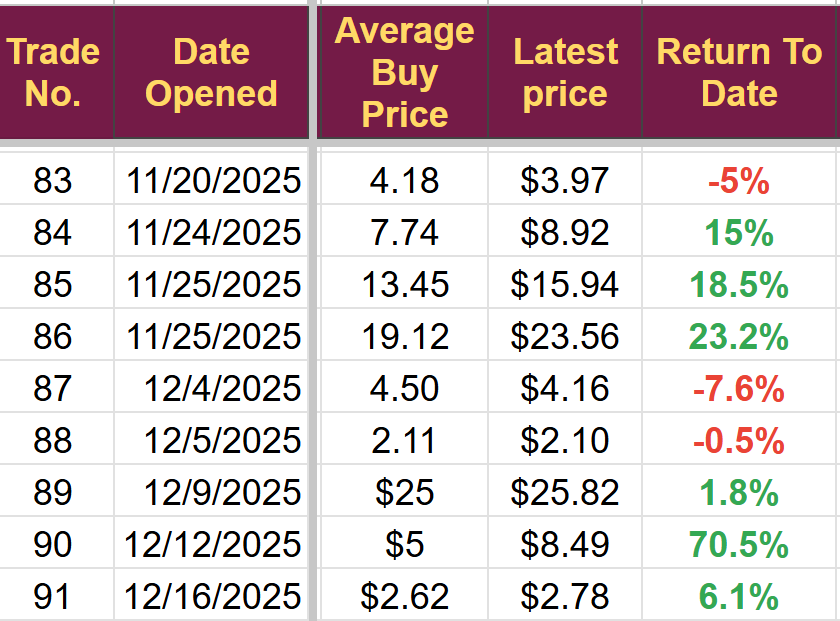
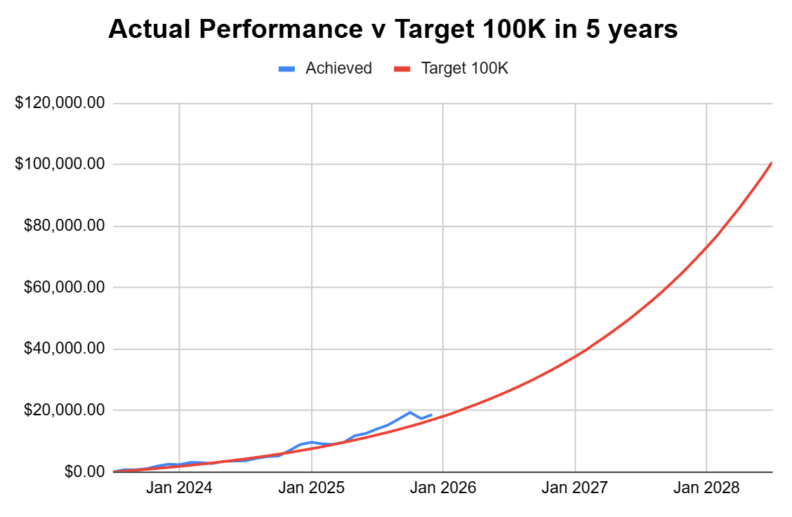
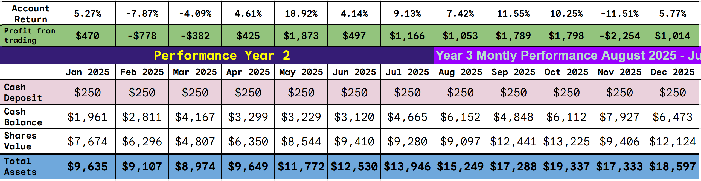
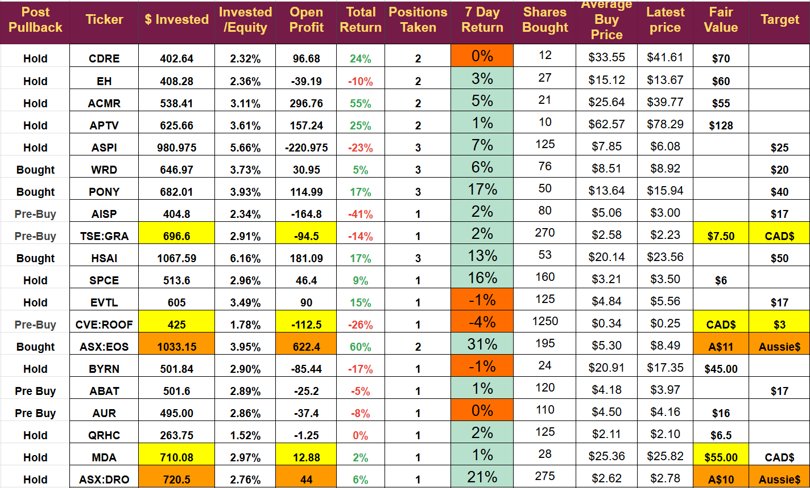

# Weekly Update: A good week to end 2025

*Solid profits across the portfolio*

A short report as I am travelling this weekend.

The portfolio showed broad gains, with 5 holdings up double digits and only three losses, the worst at 4%.

We opened one new trade, currently up 6% but did not close any.

Trades opened of late have been doing very well

The portfolio continues towards its long-term target of $100K by Aug 2028

I do not expect any trading next week, but I will kick off the year by increasing several holdings to my maximum of 5% of the portfolio. The portfolio currently has a reasonable cash balance, and I will use some of it to increase our holdings in the sector I expect to make the most progress in 2026. I will be rotating out of some stocks likely to show slower progress.

Disclaimer: I am not a financial advisor. This newsletter is a diary of my trading as I work toward $100K. It is a high-risk plan, and we have seen significant volatility. The plan may not work, so you should do your own due diligence.

I am currently on the ferry back to the UK, so this is the minimum update.

We made good progress last week and have a strong portfolio heading into 2026, but there is much to do, and many sectors still need development.

No weekly digest this week but this is the current portfolio situation

---

*Source: [Strategic Wave Trading](https://stephentobin.substack.com/p/weekly-update-a-good-week-to-end)*
