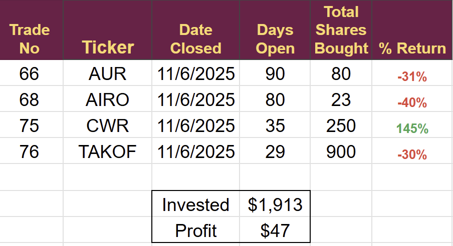
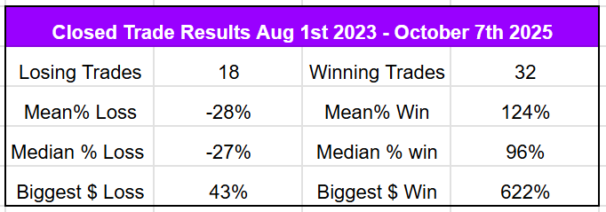
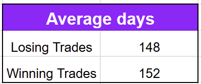
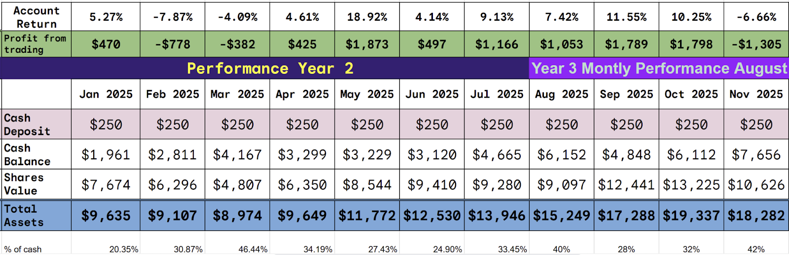
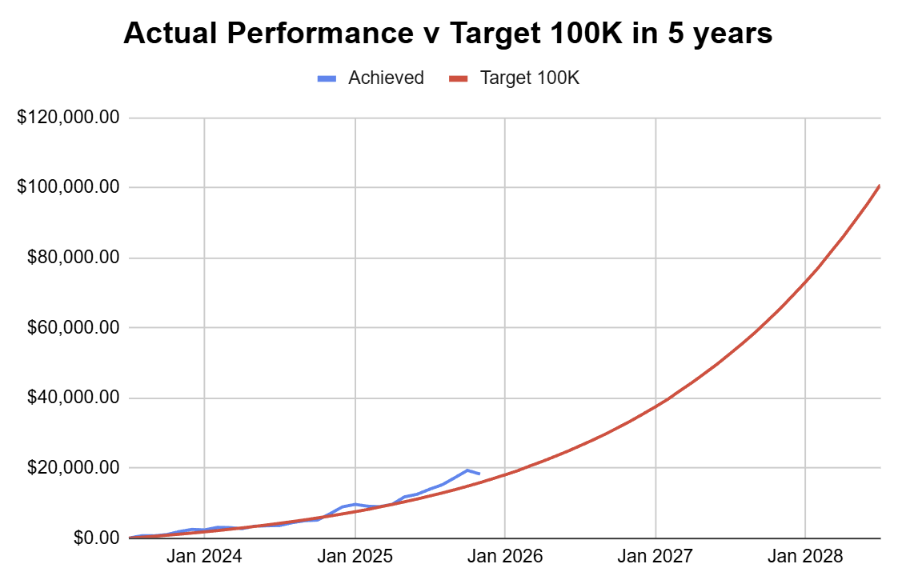
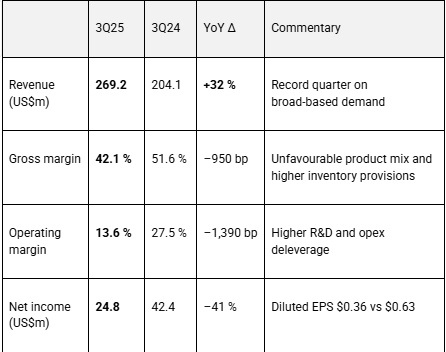
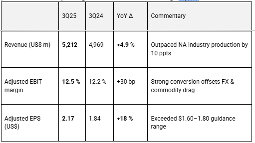
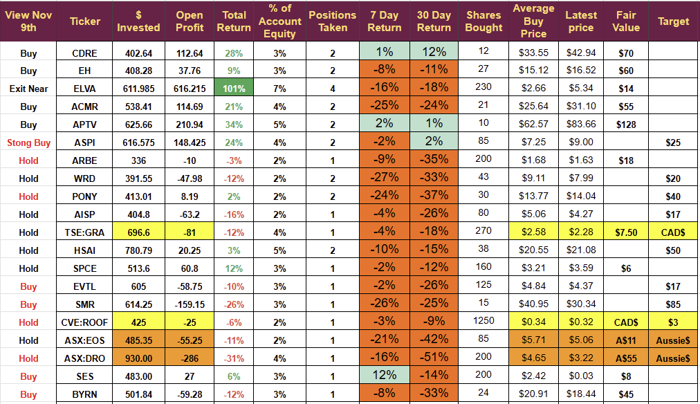

# Weekly Update: Manging short term volatility for long term gains

*What are our expectations and what does that mean?*

Small-cap stocks took a beating last week, and my portfolio dropped 6.7%, losing $1,305, which is almost 73% of the gains we made in October.

It turned out to be an active week with 4 trades closed and 2 opened, resulting in a record cash balance on the account.

### Closed Trades

The closing rule “think at 30% close at 40%” can be seen in the trades closed this week.

All of my strategies have been developed by analysing past performance and ensuring that my “Mathematical Expectation” enables me to meet my targets. I discuss this concept below.

I opened two trades last week, both on Monday. One is up 6% the other down 12%.

I closed three trades for a loss last week, which is much more than average. Since inception in Aug 2023, I had closed 15 losing trades, so last week represented an almost 20% increase.

It begs the question: are we still on target? Are things still going well or not?

## Mathematical Models

I use mathematical models throughout my work. I use them to calculate a fair value for companies and to keep track of my trading activity.

Expectation is a term from probability theory defined as “the central tendency of a random variable.” If you repeat an experiment a large number of times, the expectation will be the average result you get.

I model every investment as an experiment, and the return I get is my random variable.

The only way to calculate your expectation is to trade your strategy on a live account, importantly, not a backtest. Once you have traded long enough to get a statistically significant number of results (generally more than 30) then you can calculate your expectation for future trades. As time goes by, you keep re-checking the results and looking for improvements to increase the expectation.

It was the constant analysis of my historical results that led to the rules I currently trade by. I recently added a [“close at 200% profit” to the rules following this research](https://stephentobin.substack.com/p/weekly-update-a-big-drop-on-friday).

My experiment is trading in emerging technology stocks so the rules would not apply to anything else. Trading Forex, Options or Crypto would require a different set of rules.

I have been trading this newsletter account for 29 months and have now closed 50 trades, that is a statistically significant sample and can be used to calculate my future expectation.

Here are the key statistics needed.

Mathematicians are always concerned about which metric to choose for the average: the mean or the median? In this case, I will average the two and use 110% for a win and 27.5% for a loss.

**Key Insights**

1.  I am right 64% of the time
    

This is a very important figure, many people assume, because of the large profits I have made, that I am right every time, but that just is not correct. I trade in pre-commercial small caps, and they come with risks. All investors know we can’t be right all the time, but our emotions get the better of us, and we become overconfident, risking more capital than we should.

The profits depend on the difference between the size of my losses and the size of my wins, and I manipulate this difference through my trading rules, which dictate when to close both winners and losers.

2.  The central tendency of my random variable (the average return I get is) calculated as follows 0.64x1.1 - 0.36x0.275=.62 or 62%
    

My expectation is to win 64% of the trades I take and have an average return of 62% per trade.

Many subscribers to this newsletter first encountered my work on Seeking Alpha and will have seen that I was the top-ranked analyst, with an average return of over 200%. I am now ranked third with an average of 71%, which is closer to the long term expectation, nothing changed with my trading results. Seeking Alpha limits the number of trades that are part of the ranking by fixing the time period at 12 months. If they allowed an unlimited time period, they would have the same figures as I do.

The next crucial factor is how long it takes to get those returns.

About 150 days so six months is a reasonable figure to use. This is important, as it means that over 12 months, we could expect to reinvest the money and receive the returns.

My expected annual rate of return would be (1.62\*1.62 = 2.624) or 162% on every dollar invested.

The 162% represents the annual return on invested funds, not the total account return; it excludes the cash balance, which does not earn any interest.

To achieve the goal I set for the account, which is to turn $250 a month into $100,000 in five years, I need to achieve a compound return of 5.2% per month, equivalent to 84% per year on the complete balance, including cash.

I can use the 84% figure, the expected return of 62% on each trade, and the 6-month trade length to calculate the amount of cash I can hold on the account and still hit the target by solving the equation (1-c)x1.62x1.62 =1.84 (where c is the % of the account held in cash)

The answer is 30% or less of the account must be in cash to meet my $100k target with the expectations explained above.

Here are the monthly account figures for 2025 YTD

Following last week’s activity, the cash balance stands at 42%, and my average cash holding for 2025 is 33%. The cash balance is a symptom of the volatile year we have had. You can see the % of cash jumping in the February, March, and November pullbacks.

## Conclusion

The expectation of the account remains in line with those I had before starting the newsletter in 2023. The trading rules continue to deliver the performance I need to achieve my targets. Despite a drawdown this week, we remain above target for the longer-term goal.

To achieve this goal, we must maintain an average return of 62% and an average trade life of approximately six months with a cash balance slightly less than 30%.

In other words, I need to keep doing what I have been doing, rinse and repeat, until 2028.

I aim to reduce the cash balance to under 30% in the coming weeks and will make the first investment on Monday to support this goal.

**Disclaimer:** I’m not a financial advisor and don’t offer investment advice. This newsletter covers my high-risk trading in small-cap emerging stocks; past performance doesn’t guarantee future returns. Make independent investment decisions based on your own research and risk tolerance; you are solely responsible for outcomes.

Paid Below

# **Weekly Earnings Digest – Week Ending 8 November 2025**

The first week of November produced third-quarter earnings from three companies in the portfolio— **Cadre Holdings (CDRE), ACM Research (ACMR) and Aptiv (APTV)** . While operating backdrops varied, each management team maintained full-year guidance, signalling confidence in second-half execution despite mixed margin trajectories.

## **Cadre Holdings (CDRE) – 3Q25 Results**

The company’s earnings call highlighted robust demand. Cadre continues with its acquisition strategy and intends to grow its nuclear division in 2026. I think Cadre represents an excellent long-term holding and now own it in my long-term family fund as well as my short-term living fund and the newsletter account.

-   **Backlog:** Organic backlog rose **$20 m sequentially** , reversing earlier award delays and providing better visibility for 4Q deliveries.
    
-   **Mix & Pricing:** Strong Explosive Ordnance Disposal (EOD) volumes and favourable nuclear-segment mix supported pricing and gross-margin stability.
    

### **Outlook and guidance**

-   **FY25 sales** reaffirmed at **$624–630 m** , with **adjusted EBITDA $112–116 m** (≈18.2 % margin).
    
-   Management reiterated that revenue and earnings will be **2H-weighted** , driven by armour and EOD shipment timing; tariff headwinds are expected to be mitigated through pricing and operational actions.
    

### **Post-result broker perspectives**

-   Jefferies expects guidance to remain unchanged and believes **net leverage of ~1.8×** leaves room for continued M&A activity.
    
-   Roth Capital views the recently announced TYR Tactical acquisition as **immediately margin-accretive** , prompting a higher valuation multiple in its framework.
    

## **ACM Research (ACMR) – 3Q25 Results**

ACMR took a hit to its share price following results, the loss was explained by market commentators as being due to a fall in margins; however, that explanation makes little sense, as the change in margins was to be expected, as they were running above the long-term average. Likely, it was more about profit-taking.

### **Management guidance**

-   FY25 revenue range **narrowed to $875–925 m** (mid-point +15 % YoY), unchanged gross-margin target **42–48 %** , and lower effective tax-rate outlook **7–8 %** (prior 8–9 %).
    

### **Broker perspectives**

-   J.P. Morgan expects a **favourable share-price reaction** to the revenue beat but flags weakening contract liabilities at ACMR-Shanghai as a watch-point.
    

## **Aptiv (​APTV) – 3Q25 Results**

Aptiv is growing into a dominant force as it increases its revenue while its customers reduce the number of cars they produce. It implies that they are selling more content to each car. With each new model that ships with Aptiv technology on board, their products become more sticky, making it difficult for customers to change suppliers.

### **Management guidance and strategic updates**

-   **FY25 revenue midpoint raised** to **≈$20.3 bn** , implying ~2 % growth; global production assumption remains flat YoY.
    
-   **4Q25 guidance** : revenue $4.905–5.205 bn and **11.8 %** adjusted EBIT margin, reflecting potential customer downtime and timing of commercial settlements.
    
-   Progress toward **separation of the Electrical Distribution Systems (EDS) unit** will be detailed at the forthcoming Investor Day.
    

### **Broker perspectives**

-   J.P. Morgan modestly **raised out-year EPS estimates** after the “solid 3Q beat” but notes management’s conservative 4Q margin outlook.
    
-   TD Cowen projects **2025 free cash flow of ~$1.3 bn** and maintains Aptiv as its top supplier pick ahead of the Investor Day.
    

## SES AI (SES)

SES had already flagged the results so there were no surprises. Everything seems positive but we will need to see the results of the C- sample JDs soon. I think SES is going to be a success regardless but a negative C-Sample outcome will cause a drop in share price. My strategy will be to sell and then buy back at a lower price point.

-   Reported **Q3 2025 revenue of $7.1 million**, a **$3.6 million increase** over Q2 2025, with a **51% gross margin** driven by strong service performance.
    
-   Updated **full-year 2025 revenue guidance to $20–25 million** and recorded a **GAAP net loss of $20.9 million** (improved from $22.7 million in Q2).
    
-   Completed the **acquisition of UZ Energy** to expand its reach into energy storage systems (ESS) and launched a **joint venture with Hisun New Materials** to commercialize electrolyte materials discovered by Molecular Universe.
    

## **Other Notable News During the Week**

## ASP Isotopes (ASPI)

-   Announced that its subsidiary, **Quantum Leap Energy LLC (QLE)**, commenced a **private placement of convertible notes** with an **initial closing of $64.3 million** in aggregate principal amount, led by American Ventures LLC.
    
-   Highlighted growing demand for isotopes like **Silicon-28** (quantum computing) and **Molybdenum-100** (healthcare applications), emphasizing its Aerodynamic Separation Process (ASP) technology for low/high atomic mass enrichment.
    

## The Portfolio

The portfolio recovered some ground on Friday, with ASPI and SES showing double-figure percentage gains on the day.

Changes to the view are highlighted in red text, yellow for Canadian dollars, and orange for Aussie dollars.

The next trade alert will arrive on Monday. I would have bought on Friday, but could not get the trade alert out in time. As long as no surprises arrive over the weekend, I will buy at market open. (Many people will already have guessed who it is)

Later in the week, I will be sending a review of the Psychedelic drug industry, and hopefully a trade alert. I last covered this sector in July 2023 but a lot has happened since, the great unblinding issue has been solved presenting real opportunities for some companies. Likely, this will be an active sector for us in 2026.

### The Margin Account

The Experimental Margin account is now in its six-month review, and I will not be trading it for the next few weeks. It lost over £300 last week in the pullback. I hope to confirm the set of rules that will deliver an average return of 11% per annum. If I can demonstrate a positive expectation that achieves this return, I will restart the account in January with a larger monthly deposit. £1,000 a month would deliver £150,000 in 2 years and £500,000 in 3 but without a set of rules and solid expectation I will not proceed.

---

*Source: [Strategic Wave Trading](https://stephentobin.substack.com/p/weekly-update-manging-short-term)*
