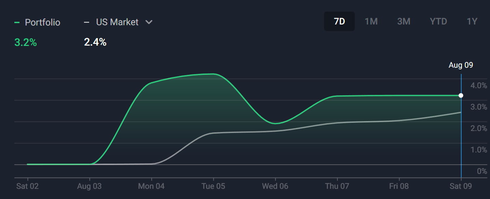
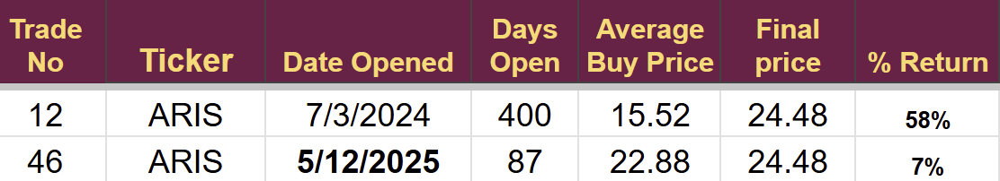
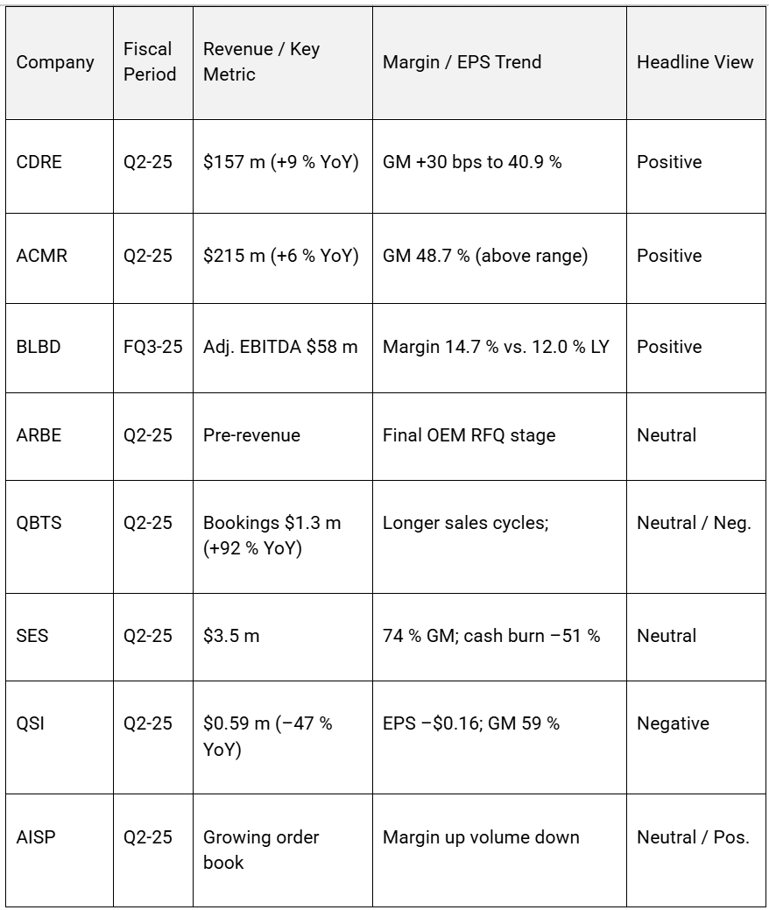
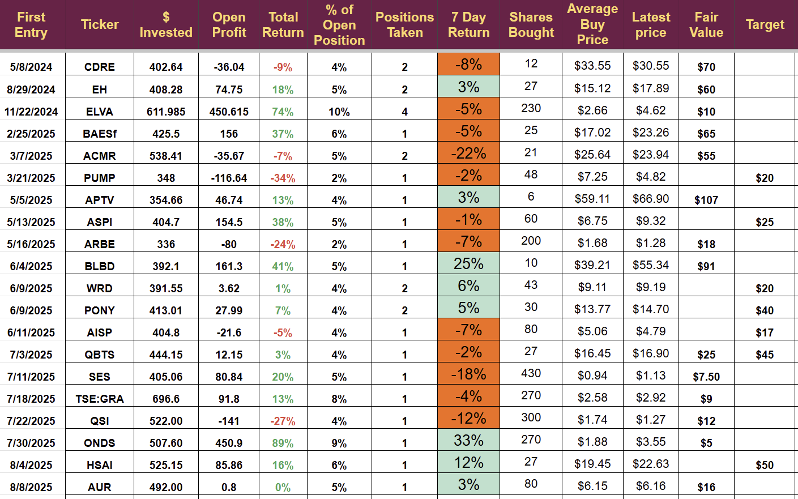
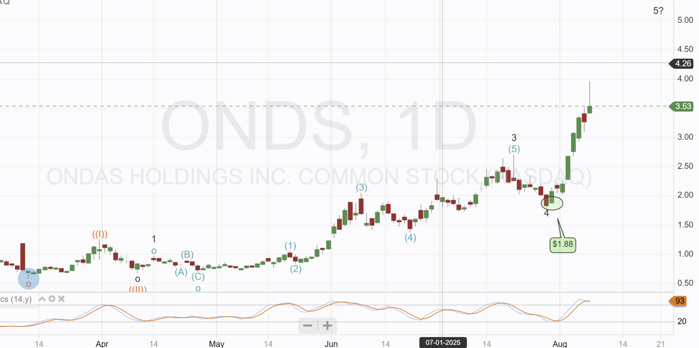
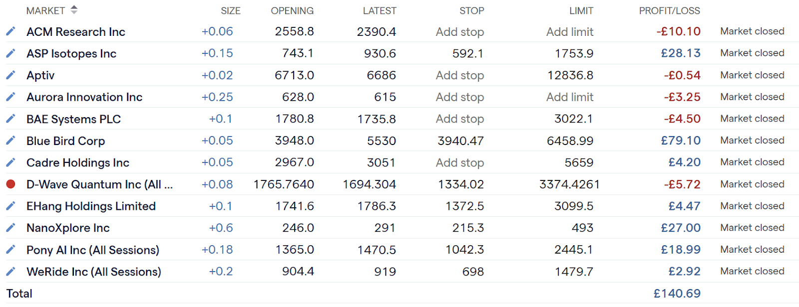
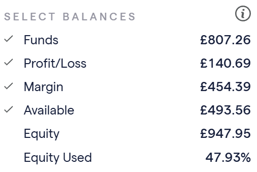

# Weekly Update: Profits booked Trades Identified

*Looking to use unexpected gains next week*

The Emerging Technology Investment plan has now entered its third year.

We remain on target for the five-year goal of $100k from a $250 investment each month. You can view the [performance in year 2 in last weeks post.](https://stephentobin.substack.com/p/monthly-review-july-2025-two-years?r=nh85d)

## Trading Performance Aug 4 - Aug 8

It was a volatile week with multiple double-figure percentage moves. Three positions fell more than 10% and three were up more than 10%. We hold 20 positions in total, and this extreme volatility followed each company's earnings release.

The account gained 3.2% in the week, compared to the US markets’ gain of 2.4%. In the last 12 months, we have beaten the S&P ten times and have an **annualized return of 129%.**

**We closed one position** during the week. I didn't really have much choice, as [Aris Water Solutions (ARIS) announced they were being taken over](https://stephentobin.substack.com/p/trade-alert-aris-decision?r=nh85d). I always sell in this situation so that I can recycle my capital, a key part of the trading plan.

It was good to book the profit, but I am disappointed with the return. I expected far more from this investment.

I hope to recycle the cash by adding to some existing positions next week after completing the DD.

We opened one [new position in an autonomous driving stock](https://stephentobin.substack.com/p/trade-alert-65-autonomous-vehicles?r=nh85d) before markets closed on Friday, and it is currently showing very little change.

[Subscribe now](https://stephentobin.substack.com/subscribe?)

## Trading Strategy

Several subscribers have asked for a more detailed explanation of my trading rules and valuation methods. I think it would be a great idea to share all of these rules with Subscribers so they can apply them independently.

## Investing in Emerging Technology

I follow a five-stage investing strategy, the five stages are designed to identify small-cap companies owning emerging technology with outsized upside potential.

Five stages but only one goal: Profitable trading

### The Stages

**First:** Find an emerging technology with potential (harder than it sounds)

**Second:** Perform a strategic review of companies in the identified emerging technology.

**Third:** A deep dive into the companies that look promising from step 2

**Fourth:** Work out a valuation of the companies that remain after step 3

**Five:** Decide when to buy and when to sell any companies that survive step 4

**Steps 1 and 2** are the most time-consuming and the most research-intensive, but it is where I make decisions about entire sectors and technology.

**Step 3** is pretty standard; it is just reading all the earnings calls and going through every line of the annual reports, as well as checking management backgrounds and cross-checking what they have said. I try to get creative in step 3 and approach people to interview, it doesn't always work, but it’s great when it does.

**Step 4** is technically the most challenging and often the deal breaker. Building a three-stage mathematical model requires strong spreadsheet skills and good accounting knowledge. Still, without it, I would have no idea of the company's cash needs, if it can reach profitability, or its likely future value.

**Step 5** is both the easiest and the one I get most questions about. Unfortunately, it is the least important as it does not help in deciding what to buy, just when to buy, when to sell, and when to add. All useless information if you don't know what stock to apply that knowledge to.

Next week I will start to build a short course on how I do all of these things, it will likely be a mixture of video tutorials and written posts.

## Outlook for next week

### Trading

I expect to add to some positions next week, increasing my position size and taking advantage of post-earnings pullbacks in companies that suffered short-term setbacks that did not dent the strategic case. This will be recycling the cash from the ARIS share sale discussed earlier.

Both the Nuclear Stock and the Space Stock I have been tracking continue to pull back and are approaching prices I would be interested in taking. These stocks have already passed stage 4, but their current price fails step 5.

## Research

The psychedelic drug industry has become of interest again, [following Gartner's terminology](https://www.gartner.com/en/research/methodologies/gartner-hype-cycle), it may be emerging from the trough of disillusionment and towards commercial reality.

I have written five articles on this area covering ATAI, CMPS, MNMD, and CYBN. The last article was published in May 2024, noting that it was not the right time to invest. This will be Step 2 of the five steps discussed above. I regularly have to repeat Step 2 as the technology moves towards commercialization.

I will be conducting and publishing a full review of the sector and players next week. If any companies look interesting, I will take them forward and perform a deeper analysis.

Two medical companies are progressing towards a trade, one has passed the deep dive, and I am working on the valuation; the other is awaiting a deep dive.

Paid below this line

# **Weekly News Digest: 4 – 8 August 2025**

Earnings dominated the first whole week of August for our coverage universe. **Cadre Holdings, ACM Research and Blue Bird** delivered clear beats, while **Quantum-Si** missed sharply. Most non-reporting names issued constructive operational or broker updates. A concise earnings scorecard is provided below.

I want to remind everyone that the Telegram Channel is for trade alerts only. **Please use the Substack chat facility to discuss ideas**. I will not be monitoring the Telegram channel and will only answer questions put on Substack. It is also annoying other subscribers who want to use the Telegram service as intended.

Here is the link to the [Telegram channel](https://t.me/+Bc6MXkXeZqdjMzRk), but it only gives an alert when I send an alert, not the details, which have to be accessed through Substack or via email.

## **Earnings Highlights**

### **Cadre Holdings (CDRE)**

-   Q2 revenue **$157 m, +9 % YoY** ; gross margin expanded 30 bps to 40.9 % as pricing actions held and FX proved favourable
    
-   FY-25 outlook now implies **10.5 % top-line** and **8.7 % EBITDA** growth at mid-points
    
-   Headline view: **Positive** – sales beat, margin expansion and higher guidance.
    

### **ACM Research (ACMR)**

-   Q2 revenue **$215 m, +6 % YoY** ; shipments rebounded 25 % QoQ to **$206 m**
    
-   Gross margin **48.7 %** exceeded the 42–48 % long-term model
    
-   Headline view: **Positive** – volume momentum and margin outperformance.
    

### **Blue Bird (BLBD)**

-   Fiscal Q3 adjusted EBITDA **$58 m** , representing a **14.7 % margin** , more than $10 m above the prior-year quarter
    
-   Management raised FY-25 guidance and announced a **$100 m share buy-back**
    
-   Headline view: **Positive** – record profitability and capital return.
    

### **Arbe Robotics (ARBE)**

-   Initial orders in non automotive announced
    
-   Auto OEM guidance unchanged
    
-   Revenue remains nascent.
    
-   Headline view: **Neutral** – strategic milestones but limited sales.
    

### **D-Wave Quantum (QBTS)**

-   Q2 bookings **$1.3 m, +92 % YoY** ; larger enterprise deals lengthening sales cycles
    
-   Technical progress and improved balance sheet
    
-   Headline view: **Neutral / Slightly Negative** – pipeline growth offset by execution risk.
    

### **SES AI (SES)**

-   Q2 revenue **$3.5 m** at 74 % gross margin; operating cash burn down 51 % YoY
    
-   FY-25 revenue guide of **$15–25 m** reaffirmed.
    
-   Acquisition announced and consequent entry to battery storage.
    
-   Headline view: **Neutral** – early-stage but disciplined.
    

### **Quantum-Si (QSI)**

-   Q2 sales **$0.59 m, –47 % YoY** , missing consensus; net loss **$28.8 m**
    
-   Reduced orders from US academic institutions, announced loan and lease options.
    
-   International and high margin consumables growth.
    
-   New product road map highlighted out to 2028
    
-   Headline view: **Negative** – poor machine sales.
    

### **Airship AI (AISP)**

-   Q2 release detailed plans to fund sales expansion and new Outpost AI products through internal cash and warrant proceeds
    
-   Revenue down 66% YoY from Q2 2024 margins improved.
    
-   Guiding to 30% YoY revenue increase in FY 2025
    
-   Growing order book and pipeline in new verticals and government
    
-   Headline view: **Neutral**/**Positive** strategy outlined, guidance increased.
    

## **Key Corporate & Broker Updates (non-reporting names)**

-   **Aptiv (APTV)** – Oppenheimer reiterated an “Outperform” stance, arguing end-market diversity underpins the investment case
    
-   **Ondas (ONDS)** – completed government-led counter-drone pilots in Europe and Asia, supporting future homeland-security deployments
    
-   **BAE Systems (BAE)** – repurchased 117,078 shares on 5 Aug under its £1.5 bn buy-back, at a VWAP of 1,839.7
    
-   **Electrovaya (ELVA)** – HC Wainwright noted the launch of advanced lithium-ion batteries for airport ground-support equipment, with first delivery slated for Aug-25
    
-   **ASP Isotopes (ASPI)** – applied for a dual listing on the Johannesburg Stock Exchange to tap new investor pools
    
-   **Aurora Innovation (AUR)** – TD Cowen lowered its price target after Q2 to $7.40 from $9 after reducing FCF forecasts to 2029 by $300m.
    
-   **Pony AI (PONY)** – UBS initiation with a buy and $20 price target (+40%)
    
-   **WeRide (WRD)** – Beijing Night-time testing license allowing operations between 10pm and 7 am. UBS initiated coverage with a buy rating and $8.69 price target (88% upside)
    

## Earnings Scorecard (4 – 8 August 2025)

## **Outlook**

Despite macro uncertainty, this week’s prints illustrate that specialty industrial and electrification suppliers can still expand margins when pricing power and product innovation align. Near-term catalysts include: OEM award announcements at **Arbe**, commercial traction metrics at **D-Wave** and **Quantum-Si**, and incremental defence budget visibility for **BAE Systems**. I will maintain a vigilant stance ahead of the late-summer reporting lull.

## **Potential additions**

I am looking at the following stocks to add next week when I complete the DD

**ACMR, AISP** and **APTV**

Other stocks have pulled back, but do not meet my criteria for adding

## The Portfolios

The US Stock trading Account showed some wild swings as companies released earnings reports, more earnings are due next week so this trend might continue.

**Note: ONDS**

Ondas is showing the kind of price action that often makes me exit. I don’t like vertical price rises as significant pullbacks frequently follow them. The technical chart below shows the stochastics oversold, which would agree with an exit; however, the wave chart remains positive, suggesting we may hit the $5 target sooner rather than later. I will hold for the time being and try to add if we see a pullback.

## UK Leverage account

The margin account dropped 2.3% during the week. I took the opportunity to add several positions as stocks held in the Stock trading account fell. I added AUR, CDRE, and EH. I also reopened QBTS after realizing a mistake, the trade hit a stop loss incorrectly positioned for zero gain.

I am not sure it is wise to increase the portfolio as I have done; it should reduce risk and mean the margin account will be closer aligned with the stock account, but there are too many stocks I could not buy, and those have been driving the gains in the stock account of late.

Profits always boil down to the same point: if the stock picking is good, the profits will be fine.

I will keep looking at results and making decisions, and as I keep saying, I don't need the finalized rules for another three years.

Current Holdings

Account Balances

Total investment is £750

---

*Source: [Strategic Wave Trading](https://stephentobin.substack.com/p/weekly-update-profits-booked-trades)*
