# Weekly Update: Q4, in the past our best up next

*A quiet week with big potential ahead*

The last full week of Q3 is behind us, and Q4 will begin on Wednesday. This project is now in its third year, and we have some historical data to work with. Q4 has been our most successful quarter, returning an average of 8% per month and racking up substantial gains; however, October has so far been our worst-performing month, showing consecutive negative returns. (Figures below are return on equity, ignoring cash in the account)

[

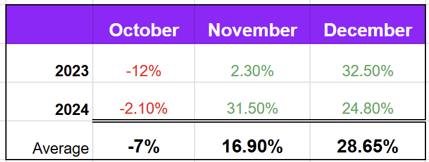

](https://substackcdn.com/image/fetch/$s_!UCWe!,f_auto,q_auto:good,fl_progressive:steep/https%3A%2F%2Fsubstack-post-media.s3.amazonaws.com%2Fpublic%2Fimages%2Fcf59fc88-fb6c-4b34-8d71-bf25dca86999_721x272.png)

So far, December is our most successful month, followed by May, the only other month to record double-digit gains twice.

## Week Highlights

It was a volatile week; by Wednesday, the portfolio had risen by over 5% before falling back to finish the week almost unchanged. The markets generally followed a similar path, ending the week in slightly negative territory. Of course, after last week’s 14% rise, we could not expect another big profit week.

We closed one trade last week, the first in September

[

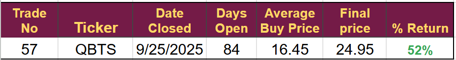

](https://substackcdn.com/image/fetch/$s_!xCF7!,f_auto,q_auto:good,fl_progressive:steep/https%3A%2F%2Fsubstack-post-media.s3.amazonaws.com%2Fpublic%2Fimages%2F3c143d2c-1b67-4101-a072-a7b3002b3db1_928x123.png)

Another good result in QBTS, the stock has moved higher since, so we probably did not get the maximum out of it. Timing these exits is inherently difficult; I base my decision on the Fair Value I calculated before taking the trade. In the QBTS case, I had a fair value of $25, so when it crossed $25 and appeared to be falling back, I took my profits.

The other stock I was considering closing was ELVA, which hit an all-time high and has fallen back sharply. In hindsight, it might have been better to close ELVA and not QBTS. However, ELVA has not hit my fair value calculation, originally $9.60, and so for the time being, I will hold.

The result in QBTS has further solidified its position as our best-performing asset with six consecutive winning trades and a total ROI of 171.7%

[

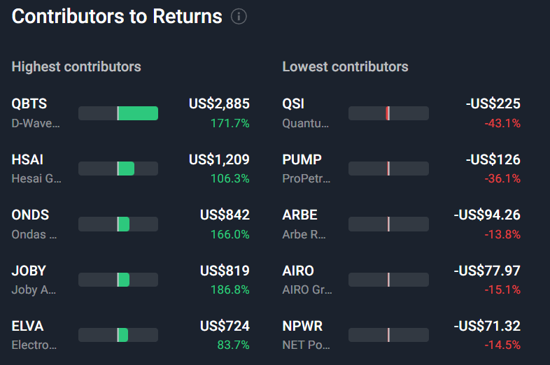

](https://substackcdn.com/image/fetch/$s_!YDYo!,f_auto,q_auto:good,fl_progressive:steep/https%3A%2F%2Fsubstack-post-media.s3.amazonaws.com%2Fpublic%2Fimages%2F383ff2e1-3ebe-458f-bddb-2977a43305f6_786x522.png)

## Trades opened

We opened our fifth trade for September last week. I think all of these trades have a long way to go, and I will be looking to add to them in the coming months. The two recycling trades look particularly attractive, and it is good to have opened some trades in that sector. We didn’t have any exposure and had been tracking for several years.

[

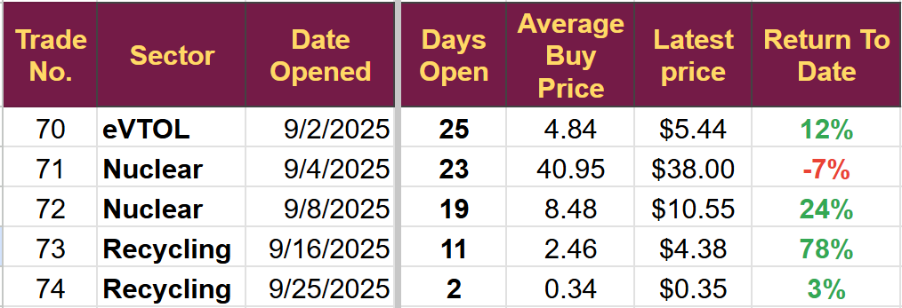

](https://substackcdn.com/image/fetch/$s_!K3Oy!,f_auto,q_auto:good,fl_progressive:steep/https%3A%2F%2Fsubstack-post-media.s3.amazonaws.com%2Fpublic%2Fimages%2Fbff9fb48-0fbc-47e3-b323-f9dc1d473caf_1014x347.png)

## Medium Term Targets

The portfolio remains above target, returning an average (including cash) of 5.8% per month, year-to-date, against the target figure of 5.2%.

In dollar terms, we are running three months ahead of target, having returned 534% since inception in mid-2023.

I will continue investing $250 each month, aiming to reach the medium-term goal of $100,000 by August 2028.

[

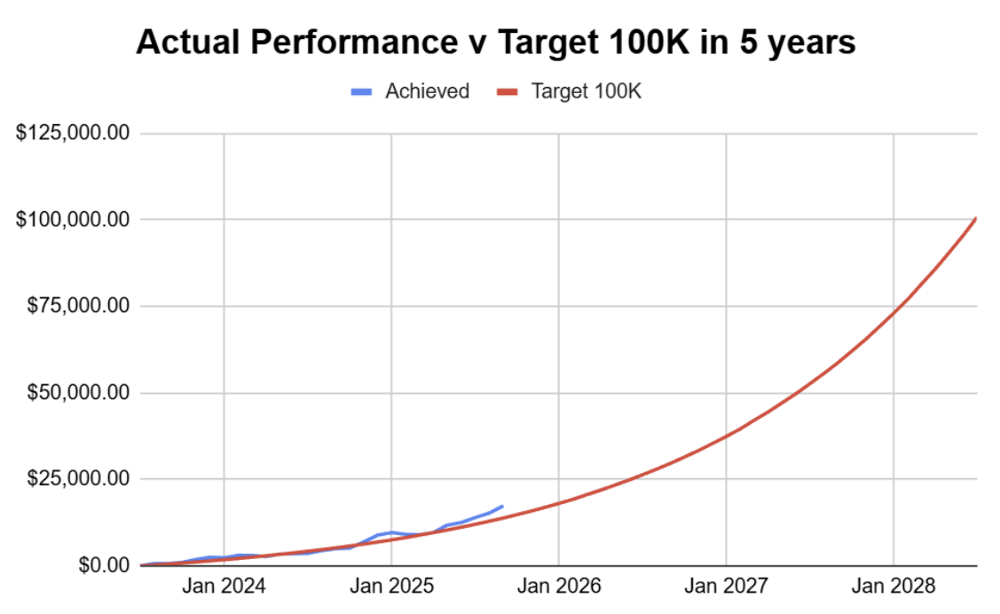

](https://substackcdn.com/image/fetch/$s_!EfA6!,f_auto,q_auto:good,fl_progressive:steep/https%3A%2F%2Fsubstack-post-media.s3.amazonaws.com%2Fpublic%2Fimages%2Fbb66af70-f3ab-4f48-a08d-5535226b3b71_1127x692.png)

## Trade Prospects

Two of our current positions appear to be good candidates for an increase in position size, and I hope to execute those trades in the coming days.

We have two additional Space Stocks on the immediate list, one of which is likely to be our final trade for September or the first in October. I have a meeting with a senior executive of a company they collaborate with booked for Tuesday, and have already spoken to management.

I discussed the drone sector a couple of weeks ago, and I have narrowed the list down to one company, which should be a trade in October.

We remain light on electricity generation, and I am currently reviewing the possibilities of data centers being built in the Permian Basin and analyzing the infrastructure providers that will benefit from such a move.

The Permian basin would seem an ideal place; it has ample excess energy, especially natural gas, and already has a significant water extraction and recycling pipeline network in place. It seems unlikely that there would be any problems obtaining permits to site large data centers in the area.

We have invested in this thesis before with mixed results, as subscribers know timing is often an essential part of emerging technology investing, and I think we were probably in this too soon.

[

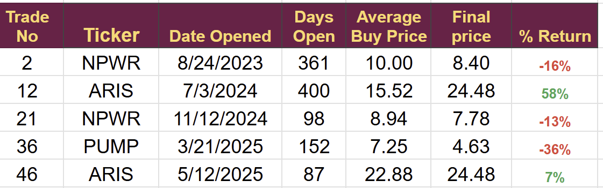

](https://substackcdn.com/image/fetch/$s_!gHSt!,f_auto,q_auto:good,fl_progressive:steep/https%3A%2F%2Fsubstack-post-media.s3.amazonaws.com%2Fpublic%2Fimages%2F68dd4c98-2bfe-4b18-877d-de5d9350b923_1121x351.png)

I think the idea remains a good one, I will be looking at companies that stand to benefit, including ones we have invested in before, but focusing on others that we have not.

(ARIS is no longer on the list following its takeover announcement)

**Disclaimer:** I’m not a financial advisor and don’t offer investment advice. This newsletter covers **my high-risk trading** in small-cap emerging stocks; past performance doesn’t guarantee future returns. Make independent investment decisions based on your own research and risk tolerance; you are solely responsible for outcomes.

(Paid Below)

## Telegram

The Telegram chat group has proved problematic, with subscribers getting a notification every time somebody joins. As a result, thanks to Pepper's advice, I will be moving to a Telegram Channel. It will eliminate unnecessary notifications that people receive.

The Link to join the channel is: [Strategic Waves Trade Alerts](https://t.me/+wOdBcrDsXYoyNjVk)

The only message I send will be “Trade Alert Sent.” Subscribers will still need to access the content through email or the Substack platform.

I will use the Channel and the old group next week but will delete the group after that.

## Weekly Digest: September 21–27, 2025

**CDRE (Cadre Holdings Inc)**

-   Announced an **Investor Day** on **October 8, 2025**, at the New York Stock Exchange to detail “Nuclear Momentum” and demand trends for mission-critical safety equipment. The company will discuss **Small Modular Reactor (SMR) opportunities**, fuel fabrication developments, and geographic expansion. Management will outline the company’s **5-year vision**, strategic execution, and long-term industry tailwinds, followed by a Q&A session.
    

**EH (Ehang)**

-   **A report in a Saudi newspaper** stated that EH and the Saudi Kingdom had signed an agreement to provide air taxi services involving 22 airports across the country. Passenger flights are slated to begin in November. Oddly, EH did not put out a press release.
    

**ACMR (ACM Research)**

-   Selected to **join the S&P SmallCap 600** effective September 26, 2025, replacing WK Kellogg Co. (KLG) following its acquisition by The Ferrero Group.
    

**WeRide (WRD)**

-   Included in the **Nasdaq Golden Dragon China Index (HXC)** on September 23.
    
-   It partnered with **Grab** on September 22, 2025, to launch **Ai.R** , Grab’s first consumer-facing autonomous vehicle service in **Singapore** .
    

**PONY**

-   **Press release** on 22nd confirmed Singapore operation in partnership with ComfortDelGro.
    
-   Received Taxi permit for Dubai on Sept 26th
    

**AIRO**

-   **Officially joined Russell 3000 Index** on Monday
    

**SMR (Nuscale Power Corp)**

-   **Press release:** an agreement to acquire equipment previously manufactured for the proposed UTAH site; the UTAH contract was terminated 2 years ago.
    
-   **Key Stakeholder Fluor** sold 4.1 million shares, raising $200 million.
    

**ABAT (American Battery Technology)**

-   **Stock Fell** after an ATM was announced for $50 million
    
-   **Q4 earnings call on Sep 22:** Revenue FY of $4.3 v $0.3 previous. Plant throughput up 70% in the last quarter. All other metrics are in line with the piece I published earlier this month.
    

## The Portfolios

Very little change overall but individual stocks continue to show volatility. The portfolio fell from $17,425 to $17,368 (0.3%) last week.

[

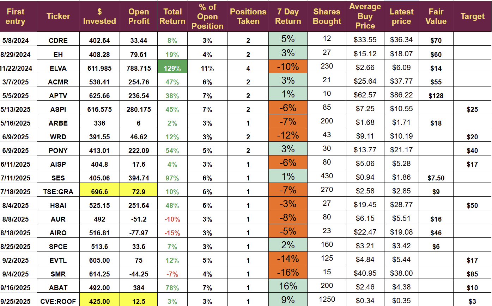

](https://substackcdn.com/image/fetch/$s_!XxvU!,f_auto,q_auto:good,fl_progressive:steep/https%3A%2F%2Fsubstack-post-media.s3.amazonaws.com%2Fpublic%2Fimages%2Fb66a26e7-8dbe-4893-97e7-b254a4b26102_1395x870.png)

(highlighted yellow in CAD$)

The disconnect between **PONY and WRD** is notable; we did buy assuming their historical correlation would resume, but it appears not to be doing so. When the next opportunity to buy arises, I will adjust the weighting.

**ABAT** has moved higher following the release of its earnings. Fortunately, we had correctly predicted what would be said, and the market moved higher. I will look to buy any pullback in the coming month. However, at the moment, I expect the $10 target to be reached in Q1, so we may not get the chance to buy if it continues to rise.

Our position in **ARBE** is small, but I have no reason to buy at this point.

Q3 results so far

[

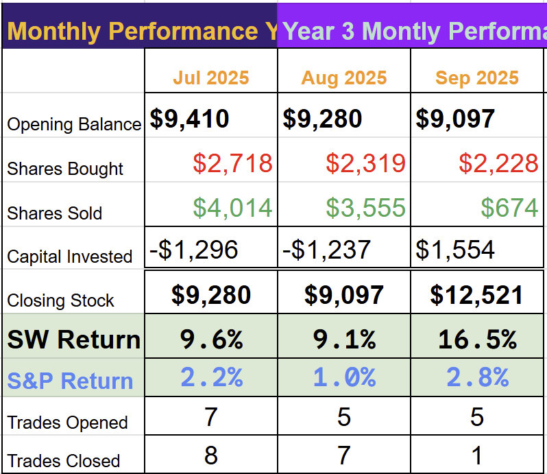

](https://substackcdn.com/image/fetch/$s_!ytRh!,f_auto,q_auto:good,fl_progressive:steep/https%3A%2F%2Fsubstack-post-media.s3.amazonaws.com%2Fpublic%2Fimages%2F7723e07a-ddcd-4c1f-a2bc-1df0db94a603_798x691.png)

[

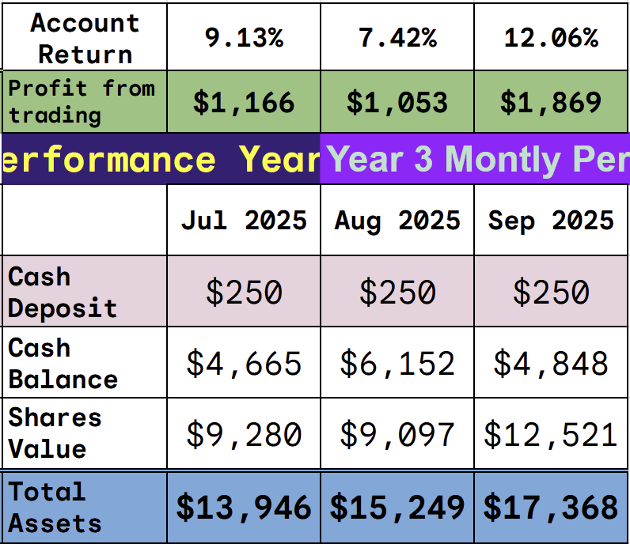

](https://substackcdn.com/image/fetch/$s_!37xy!,f_auto,q_auto:good,fl_progressive:steep/https%3A%2F%2Fsubstack-post-media.s3.amazonaws.com%2Fpublic%2Fimages%2F0a436e43-b8d4-4364-a76d-301161673ede_796x688.png)

### The Experimental Margin account

The swings are much greater when trading under margin, and I was unable to buy ROOF.

The account fell from £1,699 to $1,564 a drop of 8% but remains above target.

**Screen shots**

Key Balances

[

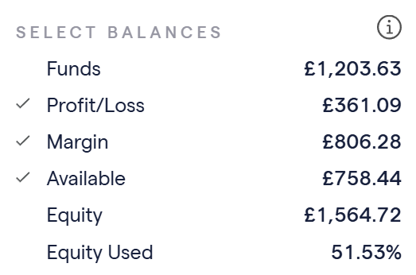

](https://substackcdn.com/image/fetch/$s_!L2jZ!,f_auto,q_auto:good,fl_progressive:steep/https%3A%2F%2Fsubstack-post-media.s3.amazonaws.com%2Fpublic%2Fimages%2Fefb9c661-6505-442e-b068-4dd9714b6334_523x346.png)

Open Positions

[

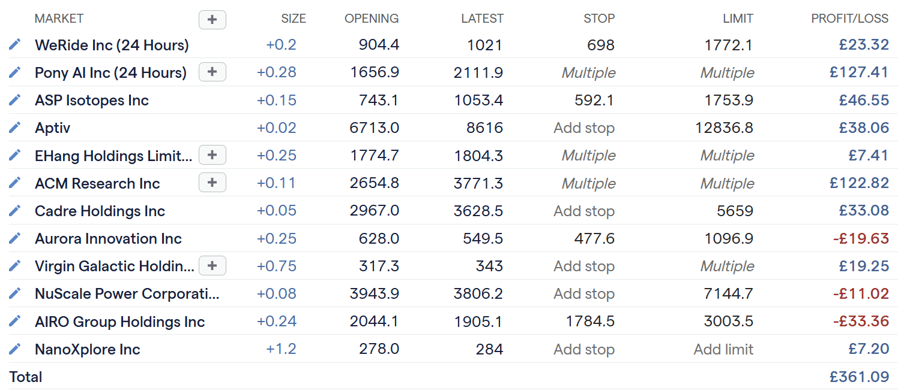

](https://substackcdn.com/image/fetch/$s_!q5K8!,f_auto,q_auto:good,fl_progressive:steep/https%3A%2F%2Fsubstack-post-media.s3.amazonaws.com%2Fpublic%2Fimages%2F39aafdbc-0c55-436a-99a6-6ae93c5c9a67_1496x653.png)

---

*Source: [Strategic Wave Trading](https://stephentobin.substack.com/p/weekly-update-q4-in-the-past-our)*
